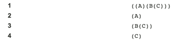

[Capturing Group](http://docs.oracle.com/javase/tutorial/essential/regex/groups.html)

Regular expressions are a way to describe a set of strings based on common characteristics shared by each string in the set. They can be used to search, edit, or manipulate text and data.


`java.util.regex`
  + `Pattern` object is a compiled representation of a regular expression. The Pattern class provides no public constructors. To create a pattern, you must first invoke one of its public static `compile` methods, which will then return a `Pattern` object.
  + A `Matcher` object is the engine that interprets the pattern and performs match operations against an input string. Like the Pattern class, Matcher defines no public constructors. You obtain a `Matcher` object by invoking the `matcher` method on a `Pattern` object.


`Pattern`: A compiled representation of a regular expression.


```java
Pattern p = Pattern.compile("a*b");
Matcher m = p.matcher("aaaaab");
boolean b = m.matches();

// or..

boolean b = Pattern.matches("a*b", "aaaaab");
```


_Backslashes, escapes, and quoting_

The backslash character ('\') serves to introduce escaped constructs, as defined in the table above, as well as to quote characters that otherwise would be interpreted as unescaped constructs. Thus the expression `\\` matches a single backslash and `\{` matches a left brace.

Ex. The string literal `\(hello\)`"is illegal and leads to a compile-time error; in order to match the string `(hello)` the string literal `\\(hello\\)` must be used.


_Groups and capturing_

Capturing groups are numbered by counting their opening parentheses from left to right. In the expression `((A)(B(C)))`, for example, there are four such groups:


