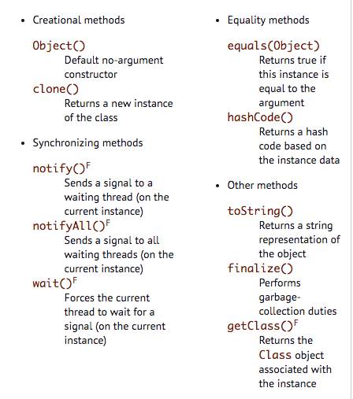
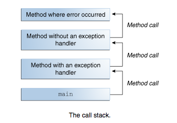
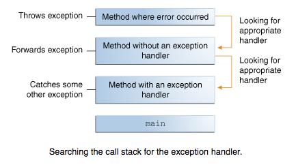

__Serializable__

Serializability of a class is enabled by the class implementing the java.io.Serializable interface. Classes that do not implement this interface will not have any of their state serialized or deserialized. All subtypes of a serializable class are themselves serializable. The serialization interface has no methods or fields and serves only to identify the semantics of being serializable.


__Object Equality__

  

`.equal()` in `java.lang.Object` compares logic equality defiend by class.

_memory addresses_, which means that all objects are different from each other. (Only references to the same object return `true`). `.equal()` in `java.lang.Integer` compares value of the `Integer`, so two different `Integer` both representing the same number return true.  

```java
public boolean equals(Object)
```

properties
+ Reflexive
  + an object always equal to itself `a.equals(a)`
  + If the argument is `this`; if so, return `true` (reflexive)
+ Symmetric
  + If two objects are equal, then they should be equal in both directions; i.e., if `a.equals(b)`, then `b.equals(a)`
  + If the argument is of a different type; if so, return false (symmetry)
+ Transitive
  + If an object is equal to two others, then they must both be equal; i.e., if `a.equals(b)` and `b.equals(c)`, then `a.equals(c)`
  + Non-static and non-transient fields are equal, or both null in the case
  + note static fields are not compared
+ Non-null
  + An object can never be equal to `null`; i.e., `a.equals(null)` is always false
  + If the argument is `null`; if so, return `false` (non-null)

```java
public class Point {
  private static double version = 1.0;
  private transient double distance;
  private int x, y;
  public boolean equals(Object other) {
    if (other == this) return true;     // evaluate memory addresses
    if (other == null) return false;    
    if (getClass() != other.getClass()) return false;  // more correct than instanceof
    Point point = (Point)other;
    return (x == point.x && y == point.y);    // comparing primitive type value directly
  }
}
```

Ensure following when comparing reference types
+ If the reference is `null` in `this`, then it must be `null` in the `other`
+ If the reference is non-null in `this`, then it must be `equals()` in the `other`


```java
public class Person {
  private String name;
  private Date birth;
  public boolean equals(Object other) {
    if (other == this) return true;
    if (other == null) return false;
    if (getClass() != other.getClass()) return false;
    Person person = (Person)other;
    return (
      (name == person.name ||      // capture if both references are null
        (name != null && name.equals(person.name))) &&
      (birth == person.birth ||
        (birth != null && birth.equals(person.birth)))
    );
  }
}
```


`==` compares value of two object __references__ to see whether they refer to the same instance. returns true only if the two objects in comparison points to the same memory location.


__Exception__

An exception is an event, which occurs during the _execution_ of a program, that disrupts the normal flow of the program's instructions.


When an error occurs within a method, the method creates an object and hands it off to the runtime system. The object, called an __exception object__, contains information about the error, including its type and the state of the program when the error occurred. Creating an exception object and handing it to the runtime system is called __throwing an exception__.


After a method throws an exception, the runtime system attempts to find something to handle it. The set of possible "somethings" to handle the exception is the _ordered list of methods that had been called to get to the method where the error occurred_. The list of methods is known as the __call stack__ (see the next figure). The runtime system searches the call stack for a method that contains a block of code that can handle the exception. This block of code is called an __exception handler__.




The search begins with the method in which the error occurred and proceeds through the call stack in the _reverse_ order in which the methods were called.  When an appropriate handler is found, the runtime system passes the exception to the handler. An exception handler is considered appropriate if the type of the exception object thrown matches the type that can be handled by the handler. The exception handler chosen is said to __catch the exception__.



 >  If the runtime system exhaustively searches all the methods on the call stack without finding an appropriate exception handler, as shown in the next figure, the runtime system (and, consequently, the program) __terminates__.


__Catch or Declare__

__Catch or Specify Requirement__
The code that might throw certain exception must be enclosed by either
1. a `try` statement that catches the exception. The `try` must provide a handler for the exception
2. a method that specifies that it can throw the exception by stating the `throw` clause that lists the exceptions.

Code that fails to honor the Catch or Specify Requirement will not compile.


__Three kind of exceptions__
1. __checked exceptions__
  + _ONLY ONE_ subject to _Catch or Specify Requirement_  
  + all exceptions are checked exceptions, except for those indicated by `Error`, `RuntimeException`, and their subclasses.
  +  These are exceptional conditions that a well-written application should anticipate and recover from.   
  + ex.  `java.io.FileNotFoundException` occurs when user supplies a nonexistent file to `java.io.FileReader`. We can improve the program by catching the exception and notify user of the mistake and prompt for input again.

2. __Error__
  + These are exceptional conditions that are external to the application, and that the application usually cannot anticipate or recover from.  
  + usually might chose to catch the error and notify user of such problem __OR__ print a stack trace and exit.  
  + ex. `java.io.IOError` occurs when the file cannot be read due to hardware or system malfunction.  

3. __RuntimeException__
  +  These are exceptional conditions that are internal to the application, and that the application usually cannot anticipate or recover from.  
  + These usually indicate programming bugs, such as logic errors or improper use of an API.
  + consider the application described previously that passes a file name to the constructor for FileReader. If a logic error causes a null to be passed to the constructor, the constructor will throw `NullPointerException`  
  + The application can catch this exception, but it probably makes more sense to __eliminate the bug__ that caused the exception to occur.


__Catching and Handling Exceptions__

This section describes how to use the three exception handler components — the `try`, `catch`, and `finally` blocks — to write an exception handler.


```java
// Note: This class will not compile yet.
import java.io.*;
import java.util.List;
import java.util.ArrayList;

public class ListOfNumbers {

    private List<Integer> list;
    private static final int SIZE = 10;

    public ListOfNumbers () {
        list = new ArrayList<Integer>(SIZE);
        for (int i = 0; i < SIZE; i++) {
            list.add(new Integer(i));
        }
    }

    public void writeList() {
	// The FileWriter constructor throws IOException, which must be caught.
        PrintWriter out = new PrintWriter(new FileWriter("OutFile.txt"));

        for (int i = 0; i < SIZE; i++) {
            // The get(int) method throws IndexOutOfBoundsException, which must be caught.
            out.println("Value at: " + i + " = " + list.get(i));
        }
        out.close();
    }
}

```

If you try to compile the `ListOfNumbers` class, the compiler prints an error message about the exception thrown by the `FileWriter` constructor. However, it does not display an error message about the exception thrown by `get`. The reason is that the exception thrown by the constructor, `IOException`, is a checked exception. You have to specify catch/specify for a checked exception; without them, program fails to compile. Additionally, the one thrown by the `get` method, `IndexOutOfBoundsException`, is an unchecked exception. And therefore does not adhere to catch/specify rule.


To construct an exception handler for the `writeList` method from the `ListOfNumbers` class, enclose the exception-throwing statements of the `writeList` method within a `try` block. There is more than one way to do this.  
+ put each line of code that might throw an exception within its own try block and provide separate exception handlers for each.  
+ Or, you can put all the `writeList` code within a single try block and associate _multiple handlers_ with it. The following listing uses one try block for the entire method because the code in question is very short.


```java

public void writeList() {
    PrintWriter out = null;
    try {
        System.out.println("Entered try statement");
        out = new PrintWriter(new FileWriter("OutFile.txt"));
        for (int i = 0; i < SIZE; i++) {
            out.println("Value at: " + i + " = " + list.get(i));
        }
    } catch (IndexOutOfBoundsException e) {
        System.err.println("IndexOutOfBoundsException: " + e.getMessage());
    } catch (IOException e) {
        System.err.println("Caught IOException: " + e.getMessage());
    } finally {
        if (out != null) {
            System.out.println("Closing PrintWriter");
            out.close();
        } else {
            System.out.println("PrintWriter not open");
        };
    };

```


__ Try / Catch / Finally block __


```java

try {

} catch (ExceptionType name) {

} catch (ExceptionType name) {

};

```

Each __catch__ block is an exception handler that handles the type of exception indicated by its argument. The argument type, `ExceptionType`, declares the type of exception that the handler can handle and must be the name of a class that inherits from the `Throwable` class. The handler can refer to the exception with name.  

The catch block contains code that is _executed_ if and when the exception handler is invoked. The runtime system invokes the exception handler when the handler is the first one in the call stack whose ExceptionType matches the type of the exception thrown.  

The __Finally__ always executes when the __try block exits__. This ensures that the finally block is executed even if an unexpected exception occurs. But finally is useful for more than just exception handling — it allows the programmer to avoid having cleanup code accidentally bypassed by a return, continue, or break. Putting cleanup code in a finally block is always a good practice, even when no exceptions are anticipated.


Put it together

```java
public void writeList() {
    PrintWriter out = null;

    try {
        System.out.println("Entering" + " try statement");

        out = new PrintWriter(new FileWriter("OutFile.txt"));
        for (int i = 0; i < SIZE; i++) {
            out.println("Value at: " + i + " = " + list.get(i));
        }
    } catch (IndexOutOfBoundsException e) {
      // runtime exception
        System.err.println("Caught IndexOutOfBoundsException: "
                           +  e.getMessage());

    } catch (IOException e) {
      // checked exception
        System.err.println("Caught IOException: " +  e.getMessage());

    } finally {
        if (out != null) {
            System.out.println("Closing PrintWriter");
            out.close();
        }
        else {
            System.out.println("PrintWriter not open");
        }
    }
}
```


__Specify exceptions thrown by a method__

it may be better to let a method further up the call stack handle the exception. If the `writeList` method doesn't `catch` the checked exceptions that can occur within it, the writeList method must specify that it can `throw` these exceptions.  


```java
public void writeList() throws IOException { // IndexOutOfBoundsException is unchecked and do not need to be thrown.
```

The throws clause comprises the throws keyword followed by a comma-separated list of all the exceptions thrown by that method.


__Throwing__

__The Throw Statement__

All methods use the `throw` statement to throw an exception. The throw statement requires a single argument: a throwable object.

`throw someThrowableObject;`

```java
public Object pop() {
    Object obj;

    if (size == 0) {
        throw new EmptyStackException();
    }

    obj = objectAt(size - 1);
    setObjectAt(size - 1, null);
    size--;
    return obj;
}
```


 __The Throwable Class__

   

 One Exception subclass, RuntimeException, is reserved for exceptions that indicate incorrect use of an API. An example of a runtime exception is `NullPointerException`, which occurs when a method tries to access a member of an object through a null reference.


__Chained Exceptions__

An application often responds to an exception by throwing another exception. In effect, the first exception causes the second exception.

```java
try {

} catch (IOException e) {
    throw new SampleException("Other IOException", e);
}
```


__Stack Trace__

A stack trace provides information on the execution history of the current thread and lists the names of the classes and methods that were called at the point when the exception occurred. A stack trace is a useful debugging tool that you'll normally take advantage of when an exception has been thrown.

```java
catch (Exception cause) {
    StackTraceElement elements[] = cause.getStackTrace();
    for (int i = 0, n = elements.length; i < n; i++) {       
        System.err.println(elements[i].getFileName()
            + ":" + elements[i].getLineNumber()
            + ">> "
            + elements[i].getMethodName() + "()");
    }
}
```


Simple logging

```java
try {
    Handler handler = new FileHandler("OutFile.log");
    Logger.getLogger("").addHandler(handler);

} catch (IOException e) {
    Logger logger = Logger.getLogger("package.name");
    StackTraceElement elements[] = e.getStackTrace();
    for (int i = 0, n = elements.length; i < n; i++) {
        logger.log(Level.WARNING, elements[i].getMethodName());
    }
}

```
