# Bit manipulation and flags


## Bitwise operation

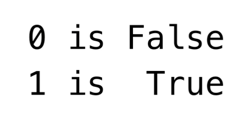

Conditionals
  + bitwise and `&`
    + 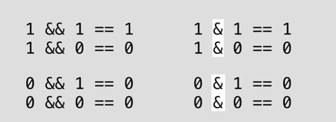
    + e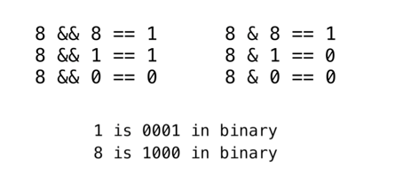
  + bitwise or `|`
    + 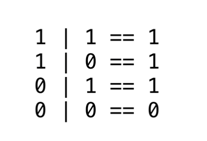
  + bitwise xor `^`: conditional negation
    + 
  + bitwise negation
    + 
    + note complement of `int` 0 is not `int` 1
      + 

Storage
  + binary constant: prefixing with `0b`
  + hex constant: prefixing with `0x`
  + conversion from hex to binary is simple (1 hex = 4 bit)
    + digit in hex is just binary in every 4 binary digits
    + 

example
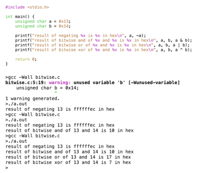

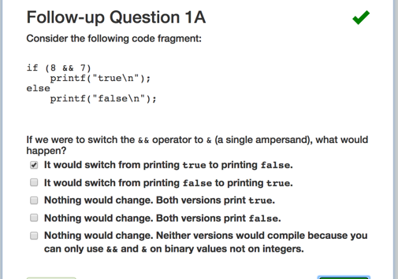
+ Note only 1 evaluates to true
+ `1000 & 0111 = 0000 = 0 != 1` so is false


+ `1000 | 0010 = 1010 = 10`

---


## Shift operator


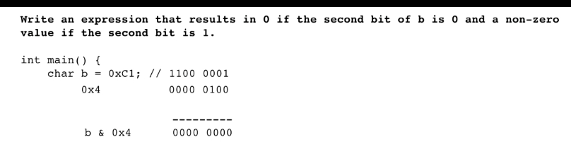

Shift operator
+ application
  + used to create bit set with 1 at certain position
+ shifting
  + left is same as multiplication by 2
  + right is same as division by 2
+ usage
  + `1 << 3` -> `0000 1000`
  + 

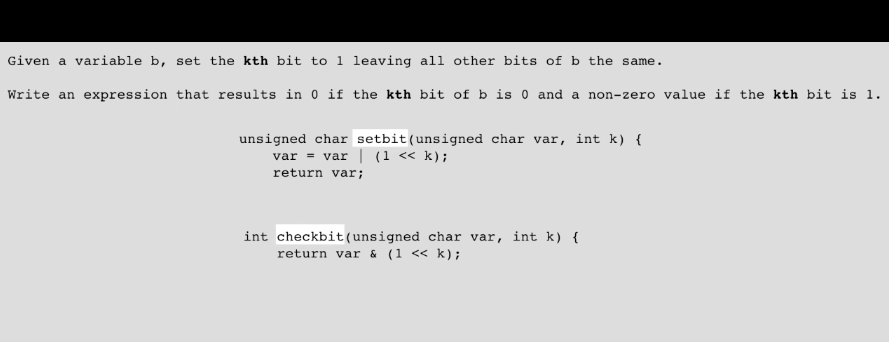


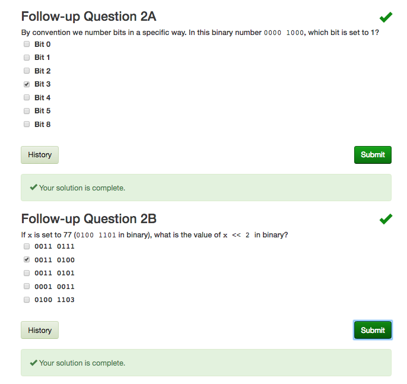

---

## Bit flags


bit flag
+ used by sys call when a single argument is used to transmit data about multiple options
  + the variable is treated as an array of bit, where each bit represents an option, or flag, that can be turned on or off.
+ compact and efficient method for representing data with multiple boolean components
  + use of bit instead of integers saves space
  + use of bitwise operator is clean and fast


file permission
+ consists of
  + permission string
    + file type
      + `-` regular file
      + `d` directory
      + `l` link
    + permission of user, group, other
  + owner
  + group
+ `mode_t`
  + type for the 9 bit permission string
  + defined as `unsigned int`, which is a 32 bit value
    + permission will be stored in 9 lower (right-most) bit
    + 
  + turn permission string into sequence of bits
    + i.e. `8` -> write for user
+ usage of constant to construct permission string
  + `chmod`
    + 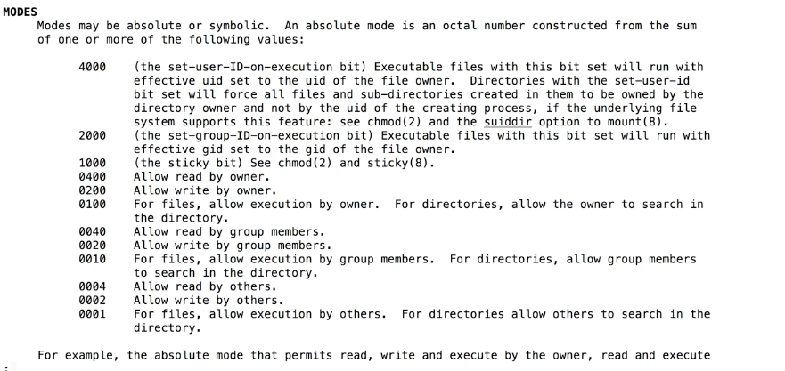
    + constant defined in base 8, because 1 octal digit is 3 binary digits
    + 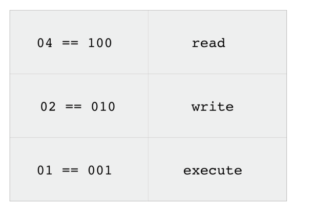
  + _octal_
    + prefixed with `0`
  + each constant can be mapped to a particular permission
    + 
+ how to generate read-only permission for a file
  + 


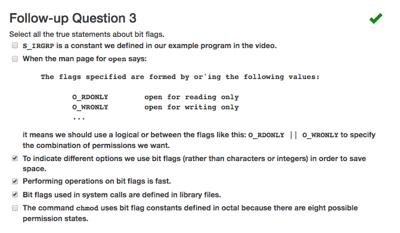
+ there are `2^9 = 8^3` different bit state for permission string
  + permission is 9 bits long in binary and 3 digits long in octal
+ the reason for using octal in `chmod` is because we can represent each group in one digit
  + `04 == 100 = r`, `02 == 010 = w`,  `01 = 001 = x`

---

## bit vectors

set
  + use of flag bits to implement a set, where each bit in a variable denotes the presence or absence of a particular element in the set
  + set operation is fast using bitwise operators

example
+ 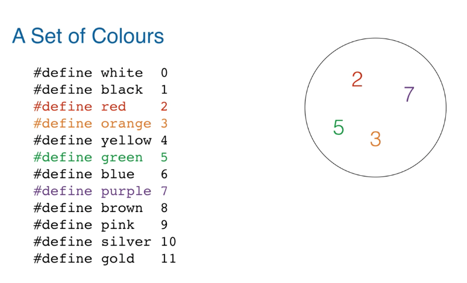
  + represents set as array of bit where
    + element of set are indices into the array
    + value at a given index tells us if the element is in the set
+ operation
  + _add_ an element to the set
    + 
    + `bit_array = bit_array | (1 << 10)`
    + called _bit masking_
      + a carefully constructed value for specific element in the set / not set and then apply the mask to set / unset those values
  + _remove_ an element from set
    + 
    + `bit_array = bit_array & ~(1 << 10)`


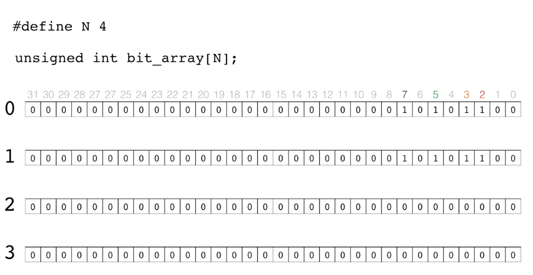
+ consider size of bit array
  + `unsigned short` is 16 bits long
  + `unsigned int` is 32 bits long
  + `unsigned int bit_array[N]` is `N * 32` bits long
+ operation
  + set bit at a specified index
    + 
    + 
    + 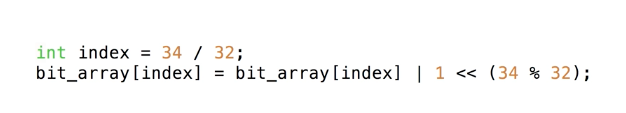


`void *memset(void *b, int c, size_t len)`
+ writes `len` bytes of value `c` to string `b`


example: bitset

+ note in `ifset`
  + returns non-zero value if `value` is in the set, not necessarily returning a fixed integer
  + returns zero if `value` is in not in set


---

# Multiplexing I/O

## Problems with blocking reads

+ `read`, `write` sys call will block  


Scenario 1
+ 
  + call `pipe`
  + call `fork`
  + `parent` read from `child`
  + `read` sys call blocks if child has not write anything to pipe
+ 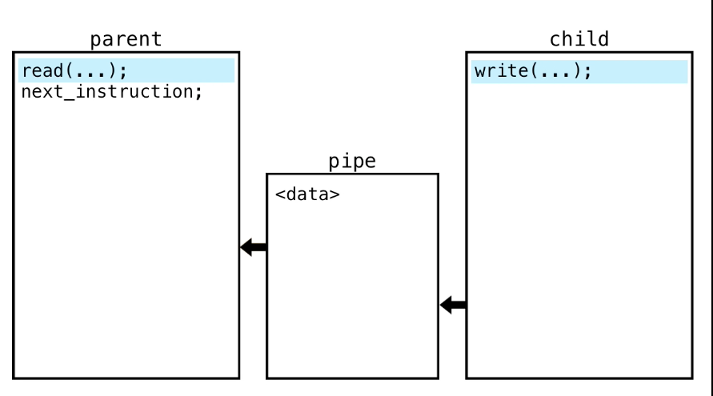
  + child `write` to pipe,
  + parent checks return statement of `read` to see if `read` is successful and starts executing next instruction
+ 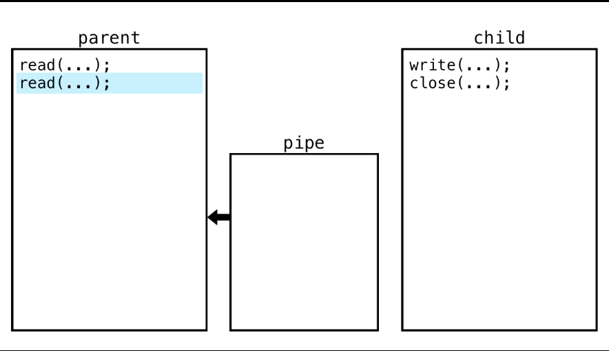
  + parent `read` will block again
  + child `close` its end of pipe
  + parent `read` returns 0, indicating pipe is closed
+ in essence, `read` blocks
  + until there is something to read
  + until other end of pipe closed


Scenario 2

+ 
  + two children share a parent, each children has a pipe to parent
  + parent `read` from either child
+ 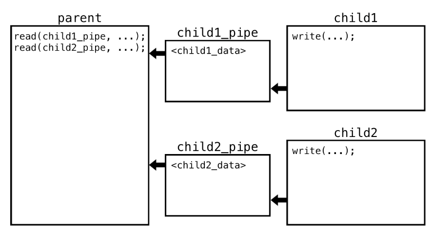
  + if `child1` and `child2` writes to pipe concurrently in a loop
+ 
  + if `child2` writes a log while `child1` writes nothing
  + in this case, parent `read(child1_pipe)` will block
  + it may be the case that `child2_pipe` gets full and `child2` write will become blocked as well  
+ 
  + if try to solve above problem by switching `read`
  + but after 1 `read(chld2_pipe)` is complete, `read(child1_pipe)` is called and blocks  
+ 
  + 1 parent 2 children with one open pipe from each child to parent
+ 
  + always read from `child_1` first and let `child_2` wait
+ 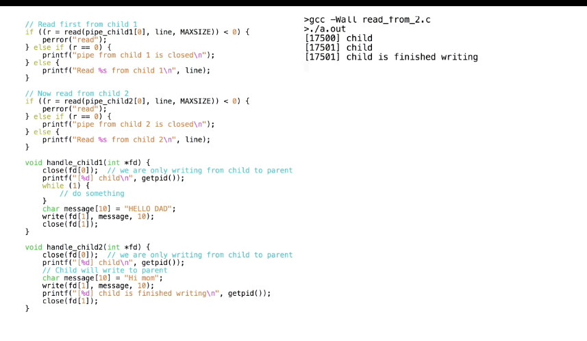
  + `child1` always writes, and never closes the pipe
  + `child2` write once
  + note both children is executing but parent is waiting for `child_1` to write something to pipe, `child_2` has written to `pipe` but parent isnt reading from `child_2`
  + no matter how we ordered the `read` call in parent, cannot guarantee to not be waiting for one child while the other child has data ready to be read.


+ a blocked read call on `fd` for read end of pipe, will _not_ always return when any close call is made on other end of pipe
  + returns only if close call is made on `fd[1]` the write end of pipe


---

## Introducing select

`select`
+ specify a set of file descriptors and then blocks until at least one of them is ready for attention, then select provides with file descriptor that are ready, so we can avoid blocking on the non ready ones


`int select(int nfds, fd_set *readfds, fd_set *writefds, fd_set *errorfds, struct timeval *timeout)`
+ select examines `fd` sets whose address are passed in `readfds`, `writefds`, and `errorfds` to see if some of the descriptors are ready for reading, writing, or having exceptional condition pending, respectively
+ the first `nfds` descriptors are checked in each set, i.e. from 0 to `nfds - 1`
+ `timeout`
  + if non-nil, specifies a maximum interval to wait for the selection to complete
  + if nil, `select` blocks indefinitely is no `fd` is _ready_
+ return
  + replaces given descriptor set with subsets consisting of those descriptors that are ready for the requested operation
  + returns total number of ready descriptors in all sets
  + -1 if error, [errno]
  + 0 if time limit expires


`int select(numfd, read_fds, NULL, NULL, NULL)`
+ param
  + `read_fds` is address of the set of `fd` from which user want to read
  + `numfd`: the first
+ modifies the `fds` set so that when it returns, the set only contains `fd` that are ready for reading
  + may be more than one `fd` is _ready_
  + _ready_: `read` will not be blocked
  + need to reinitialize `fds` since `select` modifies it.
+ `select` blocks until
  + one of the `fd` in `read_fds` has data to be read or
  + until the resources has been closed.
+ `numfd` should be highest file descriptor in set plus one
  + 
+ `timeout` time limit on how long `select` will block before returning, even if no `fd` is ready
  + could be used intermittently, doing some other task in between when `select` blocks  


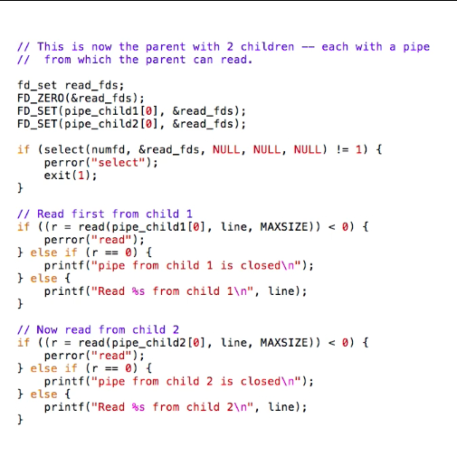
+ `select` before calling `read` on either child
+ `fd_set read_fds;`: declares set
  + `fd_set` is type for _file descriptor set_
  + a bit field stored in an array of `int`
+ use of _macro_ to perform standard set operations
  + `FD_ZERO(&read_fds)`: initializes set to be empty
  + `FD_SET(pipe_child[0], &read_fds);`: add `fd` for read ends of two pipe into set


+ need to use set membership operation to check which `fd` is still in the set
+ `FD_ISSET(fd, &fdset)`: is non-zero if `fd` is member of the set, zero otherwise


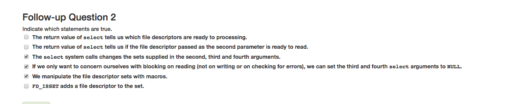


---

# Sockets
+ A network socket is an internal endpoint for sending or receiving data at a single node in a computer network
  + A process first requests that the protocol stack create a socket, and the stack returns a descriptor to the process so it can identify the socket. The process then passes the descriptor back to the protocol stack when it wishes to send or receive data using this socket.
+ _protocol stack_
  + a set of programs (a "stack") that allows processes to communicate over a network using the protocols that the stack implements.
+ _distinguish_
  + socket (internal representation)
  + socket descriptor (abstract identifier),
  + socket address (public address)
    + IP
    + port number
+ _socket pair_
  + Communicating local and remote sockets  
  + Each socket pair is described by a unique 4-tuple consisting of source and destination IP addresses and port numbers.

_TCP_
+ provides reliable, ordered, and error-checked delivery of a stream of octets between applications running on hosts communicating by an IP network.


+ _server_
  + `socket()`: create socket
  + `bind()`: assign name to socket
    + defines interface that the socket is accessible from
    + specifies a port that is not in use
  + `listen()`: establish queue for connections
  + `accept()`: get a connection from queue
+ _client_
  + `socket()`: create a socket
  + `connect()`: initiate a connection
    + to a port that is already in use


`int socket(int domain, int type, int protocol;)`
+ Creates an endpoint for communication and returns a descriptor
+ `family`
  + 
+ `type`
  + `SOCK_STREAM`: two-way connection based byte stream
    + similar to pipes
    + must be fully connected before data is sent.
  + `SOCK_DGRAM`: datagrams (connectionless, unreliable)
  + `SOCK_RAW`: access to internal network protocols and interfaces
+ `protocol`
  + 0
+ returns
  + descriptor referencing the socket
  + `-1` is error occurs


`int bind(int socket, const struct sockaddr *address, socklen_t address_len);`
+ assigns a name, i.e. the address, to an unnamed socket
+ `socket`
  + socket descriptor returned by `socket()` call
+ `sockaddr`
  + use `struct sockaddr_in` instead..
+ returns
  + `0` for success
  + `-1` for error; `errno` set

```c
#include <netinet/in.h>

struct sockaddr_in {
    short            sin_family;   // e.g. PF_INET
    unsigned short   sin_port;     // e.g. htons(3490)
    struct in_addr   sin_addr;     // see struct in_addr, below
    char             sin_zero[8];  // zero this if you want to
};

struct in_addr {
    unsigned long s_addr;  // load with inet_aton()
                           // or set to INADDR_ANY
};

// Usage
struct sockaddr_in myaddr;
int s;

myaddr.sin_family = AF_INET;
myaddr.sin_port = htons(3490);
inet_aton("63.161.169.137", &myaddr.sin_addr.s_addr);

s = socket(PF_INET, SOCK_STREAM, 0);
bind(s, (struct sockaddr*)myaddr, sizeof(myaddr));
```

`sin_addr`
+ IP host address
+ `sockaddr_in.sin_addr.s_addr`: contains host interface address in network byte order
+ set to
  + `INADDR_ANY`
    + when specified during subsequent bind call, the socket will be _bound to all local interfaces_ (one of it being localhost `127.0.0.1`).
    + when listen is called on an unbound socket, socket will automatically be bound to a random free port with the local address set to `INADDR_ANY`
    + then socket accepts connection to all IPs of the machine
  + or using `inet_aton`, `inet_addr`, `inet_makeaddr`


`int listen(int socket, int backlog);`
+ Listen for connection on a socket
  + specify the willingness to accept incoming connections and a queue limit for incoming connections.
  + applies to `SOCK_STREAM` only
+ `socket`
  + socket descriptor
+ `backlog`
  + maximum length for queue of pending connections
+ return
  + `0` for success
  + `-1` for error


`int accept(int socket, struct sockaddr *restrict address, socklen_t *restrict address_len);`
+ accept a connection on socket
  + extracts the first connection request in the queue
  + construct a new socket with same property of `socket`
  + allocate new `fd` for socket
  + _blocks_ the caller until a connection is present
  + returned socket `fd` is used to `write` to and `read` from the incoming connection
+ `socket`
   + a socket created with `socket()` bound to an address with `bind()` and is listening for connections after `listen()`
 + `address`
  + a result parameter that is filled in with address of the connecting entity
+ `address_len`
  + initially contains amount of space pointed to by `address`
  + when returned, will contain the actual length of the address returned
+ return
  + non-negative integer, the descriptor for the accepted socket
  + `-1` for error


`int connect(int socket, const struct sockaddr *address, socklen_t address_len);`
+ initiate a connection on a socket
  + attempts to make a connection to another socket (i.e. server) specified by `address`
  + initiates 3-way handshake
+ `socket`
  + a socket
+ `address`
  + address of the other socket
+ return
  + 0 for success
  + `-1` for error


`int gethostname(char *name, size_t namelen);`
+ returns host name for current processor
  + set if to `name`
+ returns
  + `0` for success
  + `-1` for erro


`int inet_pton(int af, const char * restrict src, void * restrict dst);`
+ converts a presentation format address (that is, printable form as held in a character string) to network format (usually a `struct in_addr`or some other internal binary representation, in network byte order).
  + i.e. convert text to binary (`ddd.ddd.ddd.ddd` address to `struct in_addr`)
  + for `AF_INET` and `AF_INETv6`
+ `dst`
  + destination struct to be filled up with info in `src`
+ return
  + 1 if address is was valid for specified address family  
  + 0 if address is not parseable
  + -1 for sys error


`int setsockopt(int socket, int level, int option_name, const void *option_value, socklen_t option_len)`
+ manipulates the _optione_ associated with a socket
+ `level`
  + To manipulate at socket level use `SOL_SOCKET`
+ `option_value`
  + `SO_REUSEADDR` enables reuse of same port number

`int memset(void *b, int c, size_t len)`
+ writes `len` bytes of value `c` to string `b`
+ returns its first argument


`unit16_t htons(unit16_t hostshort);`
+ converts 16 and 32 bit quantities between network byte order and host byte order.
  + network: big endian


---


# ex 10

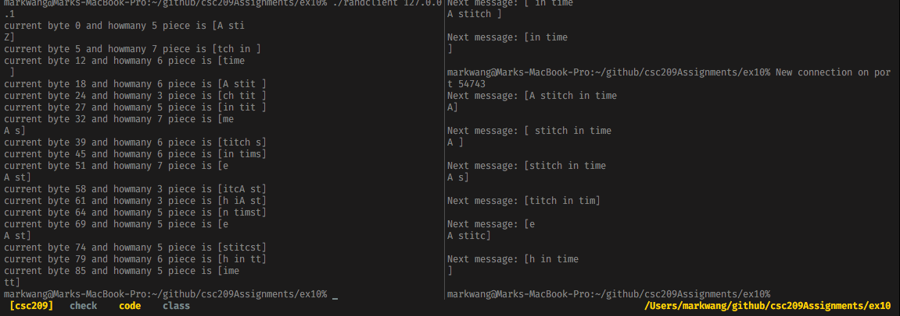
+ `readserver` and `randclient 127.0.0.1` output

Note
+ network newline convention is _CRLF_, a two byte char `\015\012` which is just `\r\n`


+ how buffer read works


# ex 11
