# Shell programming

## Part 1 Intro to bash

[Readings](http://tldp.org/LDP/Bash-Beginners-Guide/html/sect_02_01.html)

`whereis script_name`


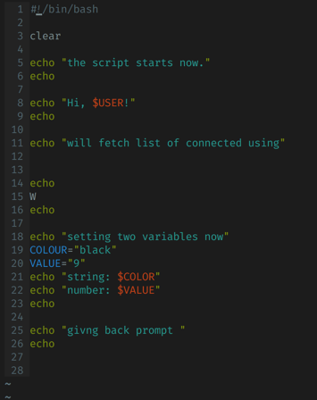
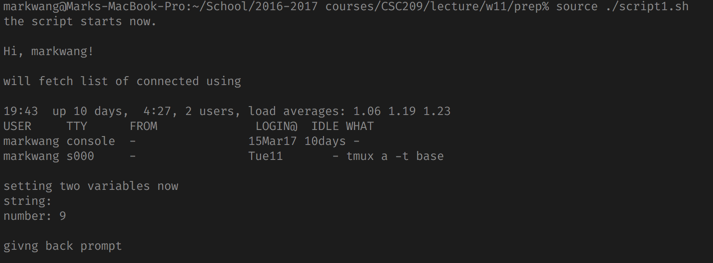
+ _execute script_
  + `bash script_name.sh`
    + starts subshell and execute the script
  + `source script_name.sh`
    + execute script in current shell
+ `#!/bin/bash`: determines the shell to run
+ _debugging_
  + `bash -x`
  + `set -x` --> `set +x` restrict debugging in between
  + `set`
    + `-f`: disable file name generation using globbing (i.e. `touch *`)
    + `-v`: verbose, prints shell input lines

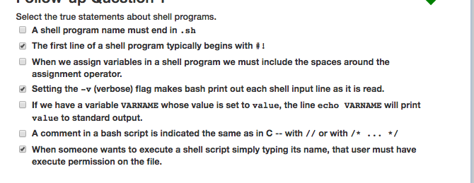
+ seting `VARNAME` to value and echo `VARNAME` will not print `value` to stdout


## Part 2 Bash env

[Readings](http://tldp.org/LDP/Bash-Beginners-Guide/html/sect_03_01.html)


__Shell initialization file__

_sys wide config file_


+ `/etc/profile`: sets `PATH`, `USER`, `MAIL`, `HOSTNAME`, `HISTSIZE`
  + read during interactive shell
  + may point to
    + `/etc/inputrc`: read initialization file
    + `/etc/profile.d`: sys wide behavior of certain programs
  + read by all shells


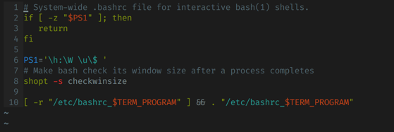
+ `/etc/bashrc`
  + bash - specific config
  + sys-wide definition for shell function ana aliases


_individual config file_

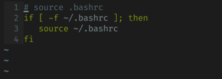
+ `~/.bash_profile`
  + user-specific
  + read on start along with `~/.bashrc`, `~/.bash_login`


+ `~/.bash_login`
  + non-existent on OSX
  + executed only when log in to the system


+ `~/.profile`
  + accessible by other shells  
  + read only in absence of `~/.bash_profile` & `~/.bash_login`


+ `~/.bashrc`
  + sourced upon non-login shell, such as X terminal window.
  + aliases and variables set after sys wide `/etc/bashrc`

+ `~/.bash_logout`
  + instruction of logout procedure


_changing shell config_
+ most shell script executed in private env, variables not inherited by parent process unless exported; ways to mitigate this problem
  + `source configfile` or `.config.file`


__Variables__
+ _scope_
  + _global_
    + available in all shell
    + `env` or `printenv`
  + _private_  
    + available in current shell
    + `set` to check all variables and functions
+ _type_: string, int, constant, array
+ _declaration_
  + putting space around equal sign will cause error
  + Good habit to quote content strings
  + `unset` to remove variable
+ `export VARNAME="value"`
  + variables that are exported are environment variables
  + 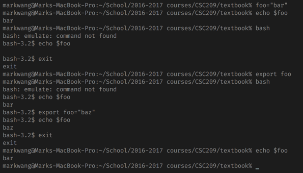
  + variables in current shell is local and is not inherited to its child processes; `export` passes variables to subshells
  + variables `export`-ed in child process does not propagate back to parent
+ _reserved variables_
  + bash assigns default values
    + bourne shell
    + bash
+ _special param_
  + `$*`: expands to positional parameter, starting from one
    + expansion occurs within _double quotes_
  + `$@`: similar to above
  + `$#`: expands to number of positional param in decimal
  + `$?`: exit status of most recently executed foreground pipe
  + `$-`: current flag
  + `$$`: pid of shell
  + `$!`: pid of most recently executed background command
  + `$0`: name of shell / script (i.e. zsecho)
  + `$_`: file name of shell on start; subsequently, expands to last argument to the previous command,
  + 


__Quoting characters__
+ _usage_
  + remove special meaning of characters or words; disable special treatment for special characters (parameter expansion).
+ _escape_
  + un-quoted backslack `\` is escape character in bash, preserves literal value of next char that follows, with exception of newline
    + `\\n` marks continuation of line  
  + 
+ _quotes_
  + single quotes `''` preserve literal value of each character enclosed within quotes
    + i.e. `echo '$data'` outputs `$data`
  + double quotes `""` preserve literal value except for
    + `$`: retain special meaning
    + backticks ` `` `: retain special meaning  
    + backslash `\`: retains meaning, i.e. escape, only when followed by dollar, backtick, double quote, backslash, or newline
      + backslash are removed from input stream when followed by one of these characters
      + backslash before these special chars are left unmodified
    + 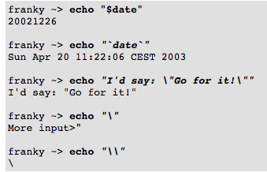


__Shell expansion__
+ _brace expansion_
  + arbitrary strings may be generated with
    + `PREAMBLE` followed by a series of comma-separated strings (no space between comma and strings) between a pair of braces, followed by an optional `POSTSCRIPT`
    + preamble is prefixed to each string contained within the braces, postscript is then appended to each resulting string.
  + 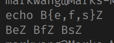
  + highest priority; exactly textual
+ _tilde expansion_
  + `~` followed by an unquoted word until the first unquoted slash, i.e. _tilde-prefix_
  + _tilde prefix_
    + if no quotes, chars are treated as a possible login name;
      + if name is null string, replaced with value of `HOME`
      + if `HOME` unset, home directory of user is substituted insted
    + `~+`
      + value of `PWD` is replaced
    + `~-`
      + value of `OLDPWD` is replaced
    + if contain a number `N`, optionally prefixed with `+` or `-`, then replaced with corresponding element from directory stack, as in output of `dirs`
    + if login name invalid, not expanded
  + if inside quotes, _tilde expansion_ also occurs if immediately followd `:` or `=`
    + `export PATH = "PATH:~/testdir"` expanded to `$HOME/testdir`
+ _shell parameter and variable expansion_
  + `$` introduces parameter expansion, command substitution, arithmetic expansion
  + _convention_
    + param name and symbol may be enclosed in braces `${FOO}`
      + matching end brace `}` is first brace not escaped by `\` or within a quoted string and not within an embedded arithmetic expansion, command substitution, parameter expansion
  + _usage_
    + `${PARAMETER}`: value of `PARAMETER` is substituted
      + brace required `PARAMETER` is positional parameter with more than 1 digits
      + or if `PARAMETER` followed by a character that is not to be interpreted as part of its name
    + `${!PARAMETER}`: _indirect expansion_ use value of variable formed by rest of `PARAMETER` as name of variable; the variable is expanded and that value is used in rest of the substitution, rather than value of `PARAMETER` itself.
      + 
    + `${VAR:=value}`: create named variable if it does not yet exist
      + 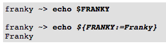
+ _command substitution_
  + allows stdout of a command to replace the command itself
  + _usage_
    + `$(command)` or ` `command` `  
    + 
+ _arithmetic expansion_
  + `$((EXPRESSION))`: evaluate arithmetic expression and substitution of result
  + 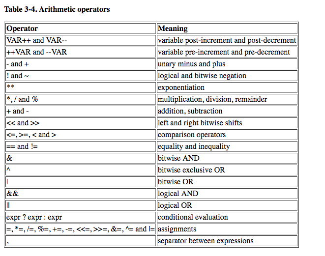
  + note
    + shell variable is allowed as operands; parameter expansion performed before expression is evaluated  
    + constant with leading 0 is octal, `Ox` or `OX` is hex
    + otherwise numbers take form of `"[BASE'#']N"`
      + `BASE`: decimal between 2 and 64
      + `N`: number
  + `$[EXPRESSION]`: calculate result of expression but do no test
+ _process substitution_
+ _word splitting_
+ _filename expansion_
  + `*`, `?`, `[`: patterns, replaced with list of file names matching the pattern


__Aliases__
+ allow a string to be substituted for a word when it is used as the first word of a simple command.
  + first word of command, if unquoted, is checked to see if it has an alias
    + if so, word replaced by text of the alias
  + then first word of replacement text is tested for aliases, but a word that is identical to an alias being expanded is not expanded a second time
+ _usage_
  + `alias`
  + `unalias`
+ note
  + alias not expanded if shell is not interactive
  + not inherited by child processes
+ 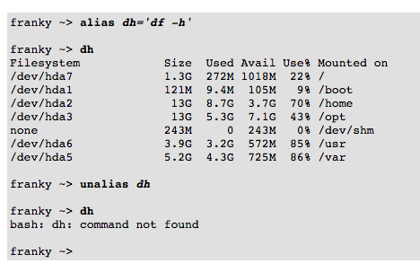


__More bash options__
+ _display_
  + `set -o`: display all shell options
+ _change_
  + `-` for enabling: `+`for disabling
  + 
    + `noclobber`: prevents existing file from being overwritten by redirection operations
  + 
    + `-u`: treat unset variable as error when substituting
  + 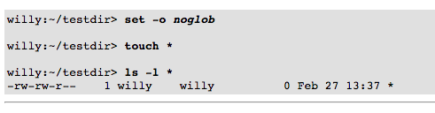
    + `noglob`: prevent special character from expansion


+ `export VARNAME` will create new variable not `export $VARNAME`


+ `$(COLOUR)`: not valid since this is for command substitution


---


## Part 3 Conditionals

[readings](http://tldp.org/LDP/Bash-Beginners-Guide/html/sect_07_01.html)

__If__
+ _usage_
  + `if TEST-COMMAND; then COMMANDS; fi`: `COMMANDS` executed if `TEST-COMMAND` has return status of 0.
  + or _if/then/elif/else_
+ `TEST-COMMAND`:
  + string, numerical comparison
  + any process
  + _primary expressions_ for `TEST-COMMAND`
    + put into square brackets to indicate test of a conditional expression
    + 
  + _combining expressions_   
    + 
+ `COMMANDS`:
  + any valid UNIX command, executable, shell script, shell statement
+ returns
  + return status of last command executed
  + 0 if no condition test true.


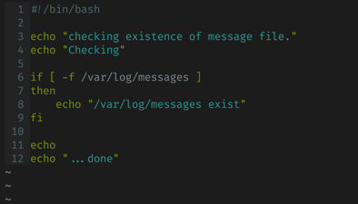
+ checks existence of a file


+ checks env options


+ test exist status


+ test condition could be result of a UNIX command

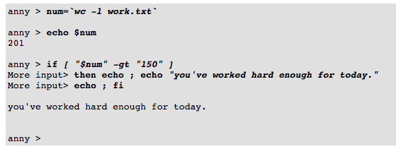
+ numerical comparison

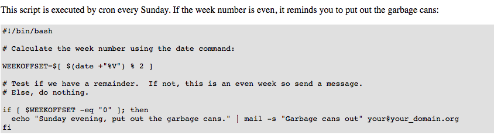

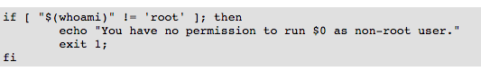
+ string comparison
+ equivalent to
  + `[ "$(whoami)" != 'root' ] && (echo you are using non-previleged account; exit 1)`


+ regular expression


+ `[[]]`: prevents splitting of variable values (i.e. `VAR = var with space`) and prevents pathname expansion (i.e. `"f*"` will not try to expand filename)


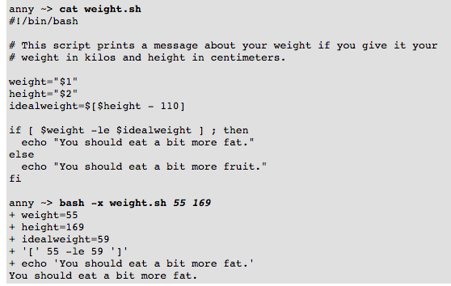
+ use positional parameters


+ test number of arguments for correct usage


```bash
#!/bin/bash
# This script gives information about a file.
FILENAME="$1"
echo "Properties for $FILENAME:"

if [ -f $FILENAME ]; then
  echo "Size is $(ls -lh $FILENAME | awk '{ print $5 }')"
  echo "Type is $(file $FILENAME | cut -d":" -f2 -)"
  echo "Inode number is $(ls -i $FILENAME | cut -d" " -f1 -)"
  echo "$(df -h $FILENAME | grep -v Mounted | awk '{ print "On",$1", \
which is mounted as the",$6,"partition."}')"
else
  echo "File does not exist."
fi
```
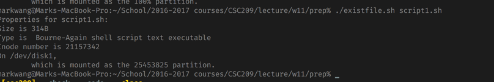


```bash
#!/bin/bash
# This script will test if we're in a leap year or not.

year=`date +%Y`

if [ $[$year % 400] -eq "0" ]; then
  echo "This is a leap year.  February has 29 days."
elif [ $[$year % 4] -eq "0" ]; then
        if [ $[$year % 100] -ne "0" ]; then
          echo "This is a leap year, February has 29 days."
        else
          echo "This is not a leap year.  February has 28 days."
        fi
else
  echo "This is not a leap year.  February has 28 days."
fi
```


_exit_
+ terminate execution of script
+ return status code stored in `$?`


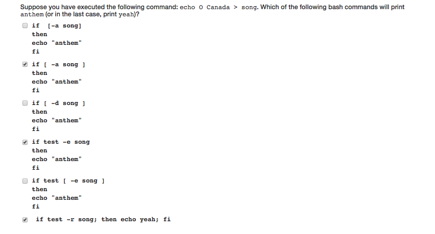
+ `if [-1 song]`: has to be space between test square bracket
+ `test -e song` is equivalent to `[ -e song ]` cannot have both at same time


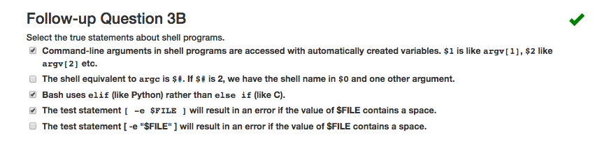
+ `$#`: not equivalent to `argc`, it is instead strictly number of parameter not including calling command
+ good practice to put param / filepath expansion in quotes


---
## Part 4 For loop

[Readings](http://tldp.org/LDP/Bash-Beginners-Guide/html/sect_09_01.html)


__For__
+ `for NAME [ in LIST ]; do COMMANDS; done`
  + if `[in LIST]` is not present, replaced with `in $@` and for loop executes `COMMANDS` once for each positional parameter that is set`
+ `NAME`
  + any variable name
+ `LIST`
  + any list of words, strings, numbers, literal or generated with commands
+ returns
  + exit status of last command executed
  + 0 if no commands are executed if `LIST` did not expand to any items


```bash
for i in `ls /sbin`;
  do file /sbin/$i | grep ASCII;
done
```
+ commands substitution for specifying `LIST` item


```bash
#!/bin/bash
# specific conversion script for my html files to php
LIST="$(ls *.html)"
for i in "$LIST"; do
     NEWNAME=$(ls "$i" | sed -e 's/html/php/')
     cat beginfile > "$NEWNAME"
     cat "$i" | sed -e '1,25d' | tac | sed -e '1,21d'| tac >> "$NEWNAME"
     cat endfile >> "$NEWNAME"
done
```
+ use content of a variable for `LIST`


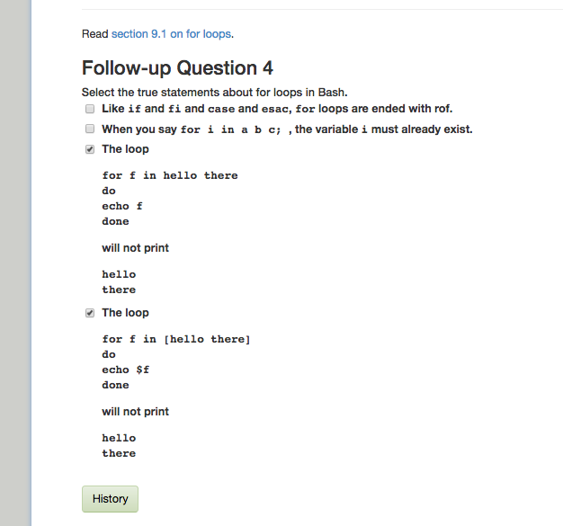
+ there is no `rof` to end for loop
+ use `[]` to create a list
