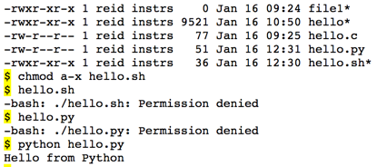
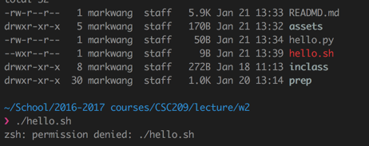

Variable declaration
+ stores name and type in the name tables
  + name may contain letter, number, underscore; does not begin with a number and is case-sensitive
+ stores the address and value (defaults to 0) in stack in memory
+ `int` variable gets truncated when a decimal is assigned to it. `double` has 2 memory addresses.


Style
+ statements on separate liens
+ operations have space between
+ cases
  + snake_case (pothole_case)
    + all lowercase separated by `_`
  + camel_case
    + first letter lowercase
    + no `_`
    + each new word beings with uppercase letter
+ comments
  + `/* ... */`

Characters
+ each character is a number
+ ASCII assigns a number to a character from range from 0~255 (2^8-1)


Input, Output, Compiling
+ output -- `printf()`
  + convention
    + `%d` - integer
    + `%f` - double
      + `%.2f` - double with 2 decimals
    + `%s` - string
+ compiling -- `gcc`
  + `gcc -Wall hello.c` enables most warnings
  + `gcc hello.c` output a file named `a.out` if used without the `-o` switch
  + `ls -F` list files, executables file have an asterisk following their names
  + or we can `ls -l` the executables files are one with `x` for user groups
+ input -- `scanf`
  + `&foo` stands for location / address of `foo` so that it can be changed


Conditional
+ relational operator returns
  + 1 for true
  + 0 for false
  + every other value is true by default.
+ `switch (<cond>){ case foo: break; default: break;}`


Functions
+ Expressions are evaluated before being passed as arguments
+ Declaration vs Definition
  + function declaration
    + consists of
      + return type
      + name
      + list of arguments (no need to write the name of parameters!)
      + does not have any body and they just have their interfaces.
    + usually at the top of C file.
    + called _prototype_ or _signature_
    + missing the prototype will generate a warning and may potentially generate compiler error if the function is called somewhere else with a different signature from what the compiler guessed
  + function definition (similar to variable initialization)
    + the actual logic is implemented within the function
+ scope
  +


Memory Model
+ __name table__
  + stack
    + __stack frame__ a section of memory created for the function, where all of the variable will be stored.   
      + variable associated with function parameter
      + variable declared in the function
    + added and removed in LI-FO order.
    + new functions are pushed to the stack as a new frame
    + functions are popped from the stack and return value is assigned properly, if at all. the stack frame is then removed.
+ __memory map__
  + stack
    + new functions are pushed to the stack; variables within a function resides within the a single instance in the stack
      + every variable name is mapped to an address that stores certain values.
    + contains __local variables__ (exists within _scope_ of the function)
      + Parameter variables are, assigned values passed from the function call when the function is created, only usable within the function, and are deallocated when the function ends.
      + Variables declared within the function body are also local
    + when function `return` call evaluated. the stack frame for the function is popped from the stack. and variable within the function is deallocated.


Passing parameters to a function
+ pass-by-value
  + don't want to change the value of passed parameters.
  + C creates copies of passed in variables, allocate different memory address the the variables, and store them under the function being called in the stack in memory.
  + note if expression is being passed as parameters, the expression is evaluated first before passing into the function

   


Iteration
  + `for(INITIALIZATION, CONDITION, UPDATE)`
  + `while(CONDITION)`
  + `do {LOOP BODY} while( CONTINUE CONDITION)` condition checking after body
  + `break`
    + may be potentially risky


Array
+ declaration
  + `TYPE NAME[number of elements]`
  + i.e. `int foo[5]`
+ initialization
  + `TYPE NAME[number of elements] = {ELEMENTS}`
  + I,E, `int foo[3] = {1,2,3}`
  + here the machine allocate 4byte/int X 3 int in stack. The memory address of elements are contiguous.
    + consequence
      + arrays are fixed in size , cannot add more space after creation
      + address of each element can be calculated from start position and amount of space of each element took up.
        + i.e. `address of A[k] = address of aA[0] + k * size of int = &A + 4`
  + __Array out of bound__ is not checked by C compiler.
    + __Access__
      + may get a default value, which in the case of `int[]` is 0, but
      + It could potentially cause error that are very difficult to find
    + __Overwrite__
      + overwrite other data of importance elsewhere, although may appear to be fine
        + i.e. `A[100]` when `A` is of size 3
      + __segmentation fault__ address accessed is not legal
        + i.e. `A[3000] = 10`
+ iteration
  + pound defined constant
    + `#define FOO bar`


```c

for(int i = 0; i< size; i++)
{
  if(A[i] = i){
    A[i] = count;
  }
}
```


Note
+ string is `""`
+ char is `''`


memory address conversion
+ hexidecimal, smallest unit is 1 byte
+ array are continugous on memory so just add size of element stored in array up to start of array to find address any index....


`int arr[3];`

Assuming integers are stored as 4 bytes and the address of arr is 0x00007ffe395f5450, which of the following statements are true?

+ The address of `arr[4]` is 0x00007ffe395f5460 but it would be unsafe to store a value at this address.
+ The statement `x = arr[100]`; will give an error because arr only has 3 elements. This is __wrong__ because C does not check outofbound error. But may cause segmentation fault..




+ python is not compiled so can run `python foo.py` even if `foo.py` does not have execute permission BUT MUST have read permission
+ files executable by the OS, i.e. bash file and compiled C code must have both read and exeucte permission




+ If a directory does not have read permission, cant `ls` or `cd` or tab completion. But able to read/write/execute files inside the directory if know their path.

+ If a directory does not have execute permission, cant `ls` or `cd` but tab completion is fine. Also able to read/write/execute file inside directory

+ If a directory does not have write permission, cannot create files inside the directory with `touch`
