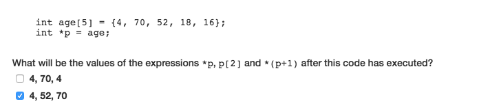
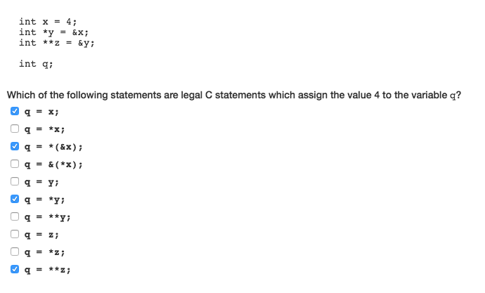
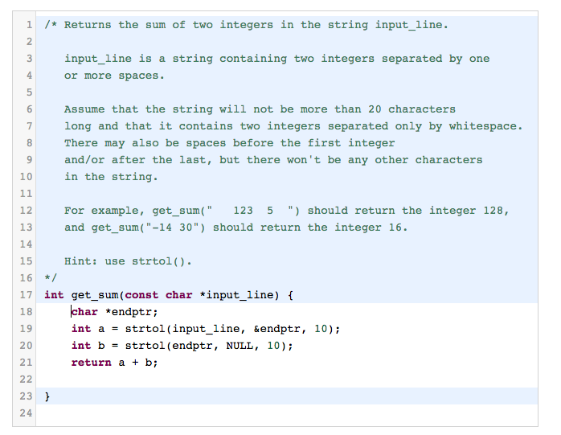
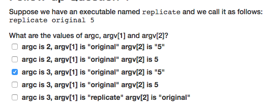

˚

__Pointers__
+ a data type whose value is a memory address
+ declaration
  + indicate type of value stored in the address the pointer points to
  + `int *pointer`
    + `pointer` has type `int star` or `pointer to int`
+ assignment
  + `pointer = &foo`  --> pointer points to foo


_memory model_
+ Name Table stack   
  + `pointer` is of type `int *`
+ Memory stack
  + address takes __8-byte__
  + defaults to a value of `nil`, previously stored junk data
  + upon assignment, the pointer's address has value of address of another integer `foo`


`*pointer`
+ evaluates to the value of memory pointed at by the pointer  
+ Dereferencing a pointer


__Change pointer value__


```c
int i = 7;
int *pt;

pt = &i;
*pt = 9
// * is a dereferencing operator here.
// value 9 is assigned to the location pt points to
```

+ What happened
  + `pt` value does not change
  + the value `pt` points to changes to 9
+ `i` and `pt` are aliases to same location in memory


```c
int *pt = q; // assignment during declaration

// is equivalent to

int *pt;
pt = q       // here q is a memory address assigned to value of pt
// *pt = q is WRONG

// because * in declaration is part of type not a dereference
```


_Convention_

```c
// the following are equivalent
int *pt;    //preferred
int * pt;
int* pt;
int*pt;
```

__pointers tip__

+ note that `*(argv + 1)` is equivalent to `argv[1]`
+ `char **A` is equivalen to `char * A[]`in function parameters


---

_Incrementing char follows ASCII table_


```c
char c = A;
c++;          // now c = B since its down the table
```

_Problems with function passing by value_
+ Note function parameters are local variables in stack frame of corresponding function
  + they are assigned value of the calling argument
  + However, changes to the value of `grade` has no effect on the argument that gave it the initial value
+ Use pointer to change value directly
  + passing in address in argument when calling the function
    + `properly_apply_late_penulty(&grade);`
  + use pointers as parameters of function
    + `void properly_apply_late_penulty(char *grade_pt){}`

```c
void apply_late_penalty(char grade){
  if (grade!='F'){
    grade ++;
  }
}

void apply_late_penalty_with_pointer(char * grade_pt ){
  (* grade)++;
}
```


```c
// swaping element
void swap(int * num1, int * num2){
  int temp = * num1;
  * num1 = * num2;
  * num2 = temp;
}
```


---

`sizeof()`
+ returns sizes of element in byte


__Array__
+ Only pointer to the address where first element is in memory is passed to a function
  + arrays are not pass by value; this is true because array passed in as argument is mutable


```
void foo(int a[])
//equivalent to
void foo(int *a)
```


---

__Pointer Arithmetic__


`x/y` or `x+y`
+ gives integer division/addition  of both are integer type
+ gives floating division/addition  if either is a float


What about mixed operation?


```c
int i = 77;
int *p = &i;
int *s;

s = p + 1 // s is a pointer
          // now s stores address 4 bytes after address of i, where p points to
          // note 4 bytes = 1 integer

```


```c
 // | * * * 77 | 4 bytes as storage
char i = 77      // i is pointing the start of a 4 byte block, where 77 is located 3 byte away from &i
char *p = &i;    // note p points to exactly where 77 is, in this case is 3 byte after &i

char *s;

s = p + 1;        // s is a pointer, holding address 1 byte after address p points to
```

`+`
+ behavior depends on type of pointer, i.e. size of type that the pointer is pointed at.

```c
type k;
type *p = &k;

int n;
p = p + n;      // read as
                // p = p + (sizeof(type) * n)
```


__Array arithmetic__

`address of A[i] = address of A + (i * size of one element of A)`

Hence, we have

`p[k] == *(p + k)`

```c
int A[3] = {1,2,3};
int *p = A;         // A contains address of first element in array

printf("first element in A is %d", * p);    // dereferencing p --> first element in A
printf("next element in A is %d", * (P+1))  // increment address by size of type int = 4 bytes gives next element in array
printf("next element in A using array syntax is %d", * p[2]);

```




__Pointer to pointer__
+ pointer to pointer variable has type `int **pt_ptr = pt`




_Usage_

+ always pass by reference, i.e. use pointer as argument, and pass in address
  + if want to mutate / change underlying value for a void function

`int **Array` as function parameter
+ when we pass an array of pointers to integers to a function


question


---

__Type Conversion__

__Numeric Types__

+ Amount of memory allocateds to numeric types limit precision and range of values represented
+ So during type conversion needs to think about if the type can hold such number  
+ `int foo = double bar` --> `foo` gets a truncated `bar` as integer
+ `double foo = int bar` --> `foo` is still a double padded with zeros after decimlal

`%lu`
+ placeholder for size of data types in `printf`

`sizeof`
+ display memory size of data types  


There is rounding error when converting from `int` to `float`
+ caused by both having 2^32 different bit pattern -- > possible different pattern


+ note `big3 !== big1` because of arithmetics operated on large floats


---

__Casting__
+ does not change memory location, just use alternative representatino while evaluating expressoin

```c
int i = 1;
double d =  double(i);
```


----

__String__
+ an array of char element
  + `char *s = "hello world";`


_string to integer_

`long int strtol(const char *str, char **endptr, int base);`
+ convert string to long integer
+  steps
  + discard whitespace till first non-white space is found
  + takes in characters following the `base` parameter
    + i.e. base 10 would be `base = 10`
  + pointer to first character following integer representation of `str` is stored in object pointed by `endptr   `





---


__Commandline argument__


```c
int main(int argc, char ** argv);
```

+ `argc` -- argument count
+ `argv` -- argument vector
  + an array of character pointers `char *argv[]`
  + they are strings ...




---

Worked example

+ non zero exit code if program terminated abnormally
  + `return 1;`
