__Aliases__


__Typedef__
+ create aliases for types and is evaluated by compiler


type `size_t`
+ type of `malloc` parameter and return type of `sizeof`
+ declared in `stddef.h`
  + `typedef unsigned int size_t;`
+ can change `typedef` to something else such that every piece of code using `size_t` will change accordingly, i.e. `typedef unsigned long size_t;`
+ not creating new composite types like `struct`; instead providing new name for an existing type


+ Easier to read:
  + use `typedef` to create their own, recognizable types
+ Harder to read:
  + don't necessarily know if its `string` or an `int`, or how to use them
  + compiler does not do type check
    + so programmer has to find `typedef` themselves so they know how to use them


_using typedef with struct_
+ convention
  + struct itself is lowercase; typedef is uppercase
+ aliasing `Student` to be type `struct student`
+ alternatively adding `typedef struct student { ... } Student;`
  + defines struct as well as using `typedef` to create alias for it.

```c
struct student {
  char first_name[20];
  char last_name[20];
  int year;
  float gpa;
}
typedef struct student Student;
// Alternatively
typedef struct student {
  char first_name[20];
  char last_name[20];
  int year;
  float gpa;
} Student;
```


__Macros__
+ define keywords that are replaced by specified strings before compilation
+ aliasing something other than type

`#define A B`
+ use pre-processor to replace of occurences of `A` to `B`
+ no `=` or `;`

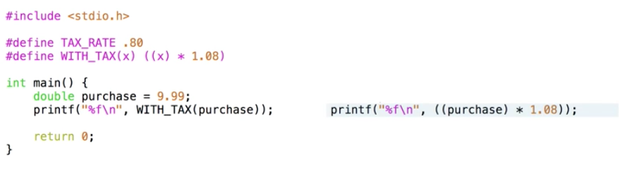

_macro with parameters / function_
+ No space between macro name and opening parenthesis
+ Every instances of parameter `x` as well as the definition has to be wrapped inside a parenthesis
  + `x` may be an expression and therefore should be evaluated fully
  + below an example of such


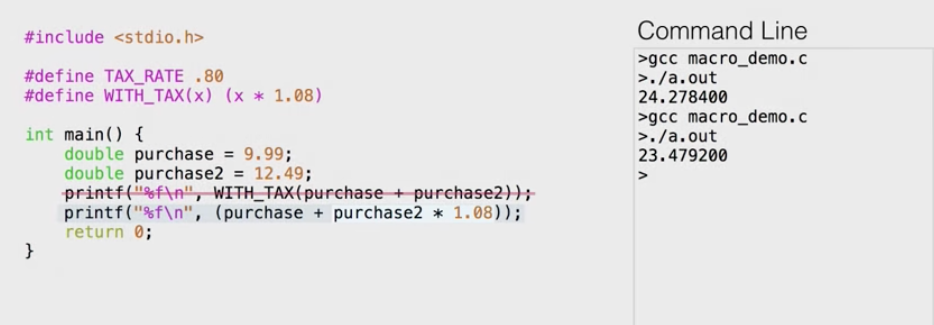


---


__Function Pointers__
+ may treat function as data, passing them into arguments or store function in structs
+ contains the address of function as data, instead of integer or string
+ _function type_
  + is just a combination of return type and parameter type
  + 
  + ex. `void(*func_name)(int *, int)`
  + no need to dereference pointer to call `func_name`
+ also when calling the function with function pointer as parameter
  + we pass in __name of the function__ as a variable without calling it
  + functions are passing by reference (just like arrays)


+ insertion sort runs slower on reversely sorted inputs and performs worse than bubble sort in this case; Although it is normally faster


__Improved version to avoid compilation__


```c
// declare function header from another file
void bubble_sort(int * , int);
void selection_sort(int * , int);
void insertion_sort(int * , int);

// declare function info struct
typedef struct {
  char* name;
  void (* sort_func)(int * , int);
} sort_info;

// declare an array of sort_info structs
sort_info SORTS[] = {
  {.name = "buble", .sort_func = bubble_sort},
  {.name = "selection", .sort_func = selection_sort},
  {.name = "insertion", .sort_func = insertion_sort}
}

```


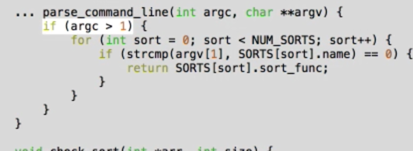
+ handles error where no argument is provided

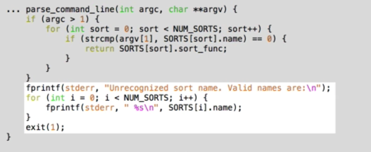
+ handlds both error
  + `argv[1]` not existent -> segmentation fault
  + loops over without finding the sorting function in the struct

_How do we specify function pointer as return type?_

1. function pointer as parameter
  + `void (*sort_func)(int *, int)`
2. function pointer as return type
  + `void (*parse_command_line(int argc, char *argv[])) (int *, int)`
  + the function name is in the middle parenthesis

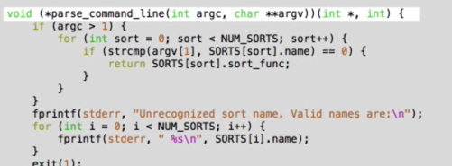

> the function __parse_command_line__ which takes an int pointer and an array of strings which returns a pointer to a function that takes an int pointer and an int and returns a void


_Usage of `typedef` to create an alias for the function pointer type_

```
typedef void (*SortFunc_t)(int * , int)
```

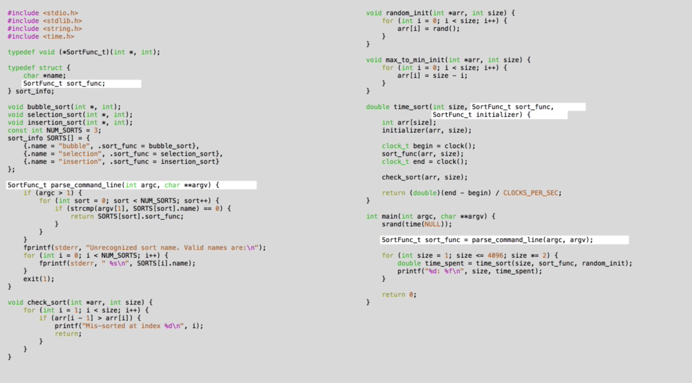


Advantage of function pointer
+ (factory)
  + Creation of general function that takes in functions as parameters
  + the behavior is different based on user inputs (i.e. determined dynamically)
+ The idea of an object
  + `struct` which needs to be handled different based on the value it stores
  + `struct` which stores both the value and the function to handle it


---


__System calls__
+ a function call that request a service from the OS
+ the available list of system calls are different for each OS
  + low-level process management,
  + file management,
  + interprocess communication calls.


+ `void exit(int status);`
+ termination of program
  + clean up data structures representing the program
  + terminate processes

_I/O calls_
1. Low level I/O calls `read` and `write` are system calls.
2. Higher level calls, like `scanf` and `printf`, also use `read` and `write` in their implementations.
  +   + not system calls; it is a library function


__Library calls__
+ a function call that executes several helper functions before calling a system call.
  + i.e. `printf` sends string to `stdout`
    + constructs the output string from the format string and the arguments.
    + calls `write`, which is a system call. `write` causes the program to switch to executing operating system code that will actually take the output string and display it.
    + When control returns to the program that called write, the _return value of `write`_ is used to determine if the call was successful or if an error occured, and control returns back to the `printf` function and the user program.
+ other examples
  +  `printf`, `scanf`, `fopen`, `fgets`


__Comparison__
  + Calling a library function such as `printf` works exactly the same way as calling a function that you wrote.
  + A system call is different because when a system call occurs, control is given to the operating system and the operating system executes code on behalf of the program.


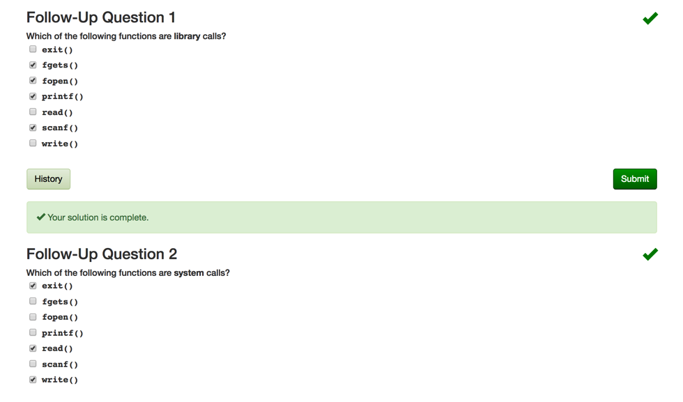


---


__When sys call fails__

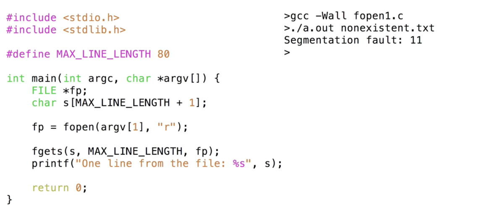

+ have to check `fopen` for error


`FILE *fopen(const char* path, const char* mode);`
+ `fopen` returns NULL if file not exist

`void *malloc(size_t size);`
+ `malloc` returns NULL if not enough space can be allocated
  + `malloc` is a library call that uses system calls to allocate memory

`int stat(const char *path, struct stat *buf)`
+ a system call that finds info about a file pointed  to by path and store the info in `buf` struct
+ returns
  + 0: success
  + -1: encounted error


syscalls
  + Return value is `int` then
    + -1: error
  + Return value is `* ptr` then
    + `NULL`: error

`errno`
+ global variable of type `int` that stores the type of error
+ header file in system defines numeric codes for different types of errors
+ error
  + returns -1 for function
  + sets `errno` to indicate types of errors
    + i.e. `malloc` sets `errno = ENOMEM`

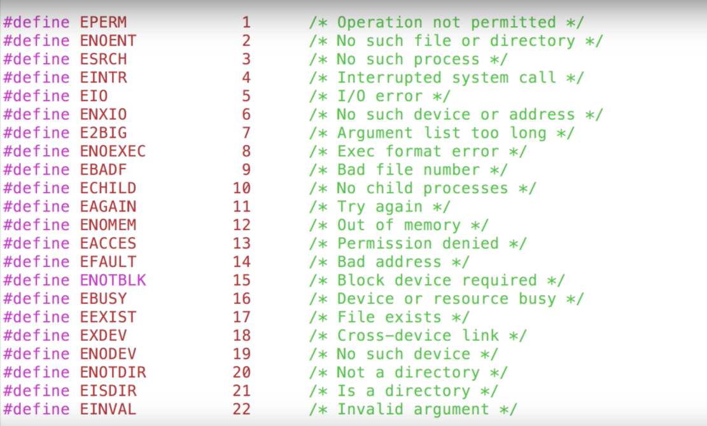


`void perror(const char *s)`
+ prints a message to `stderr` based on current value of `errno`
  + message: `s` + ':' + error message corresponding to current `errno`
+ suitable for syscalls only, use `fprintf` to `stderr` instead


1. use `perror` because `fopen` is syscall and will set `errno` if fails
2. use `fprintf` instead because `fgets` will not set `errno` if fails
  + it simply signals EOF
3. `invalid arguments` for setting `q` an invalid mode to `fopen`

If use `perror` inside of `fgets`


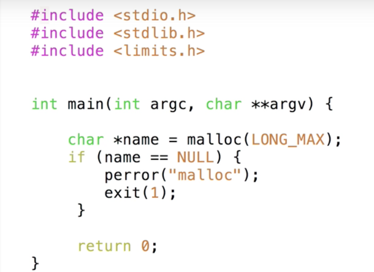
4. Use `perror` for `malloc` gets error
  + cannot allocate memory


5. Use `perror` for `stat`
  + if without error checking, the value is unknown and should not be trusted


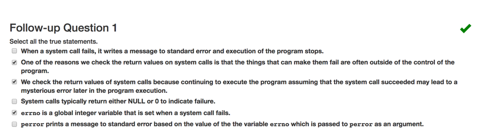


---

__Error checking__

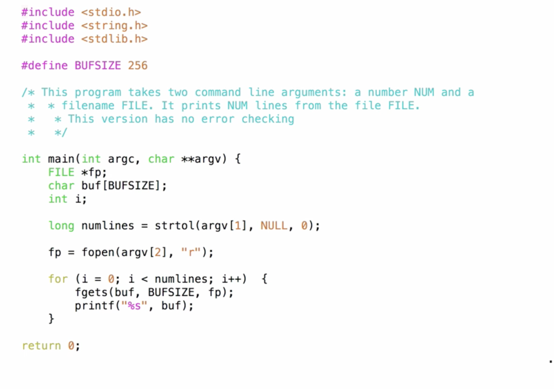

+ prints first n lines of a file
+ check for error


1. Check `argc` to see if program call right number of element
2. Check `fopen` to see if file is opened correctly
  + since `fopen` is syscall, so use `perror`


3. Check `argv` for appropriate input type i.e. positive integer, string
  + check `LINE_NUM` from `argv[1]` is a `int` that does not have anything after it
  + check `argv[1]` is not larger than the `long int` that is supposed to store it.


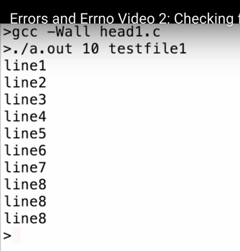
+ last line repeated if were to print line number larger than the file


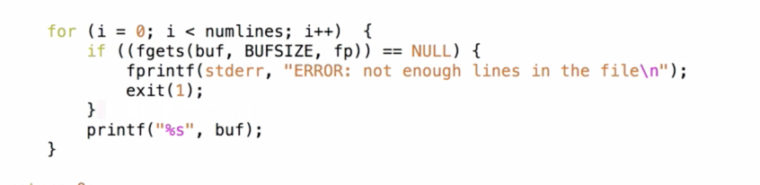
4. Check EOF is reached with `fgets`


5. line width longer than `BUFSIZE`, i.e. size of array storing the line data
  + fix by checking if `fgets` reads a new line character `\n`
  + keeps calling `fgets` until it reads a new line character


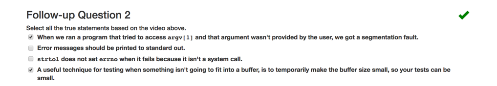

why is c not right?
