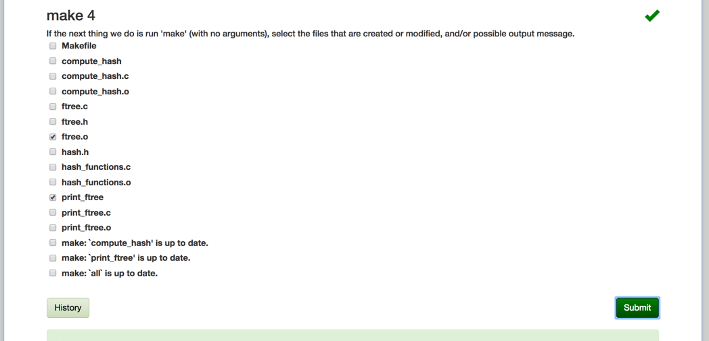
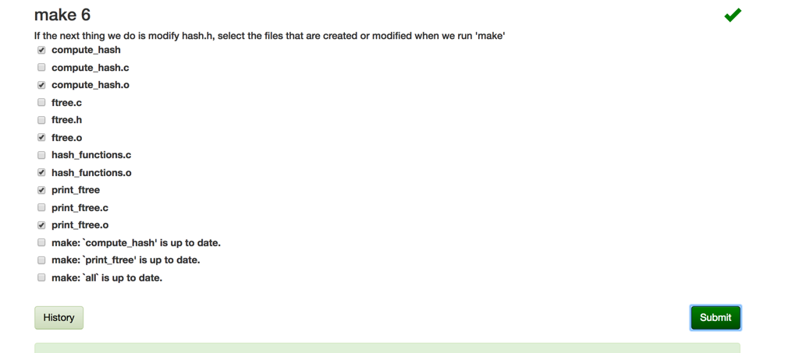
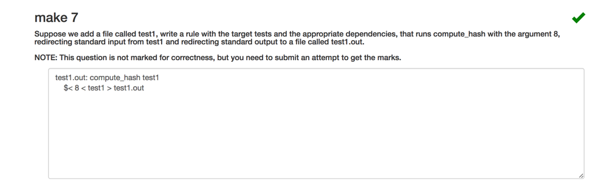

+ note `make: 'compute_hash' is up to date.` is not printed because `compute_hash` file exists

+ note `make`  traverse to each of `print_ftree.o ftree.o hash_functions.o` and see if any `.c` files are newer, if it is `.o` file is recompiled

+ since `hash.h` is dependency of all the `.o` files, they all gets re-compiled if header file is modified

