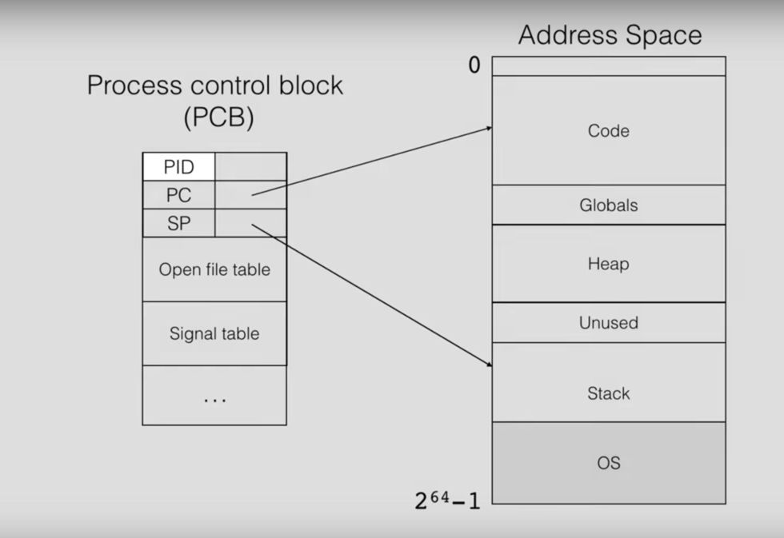
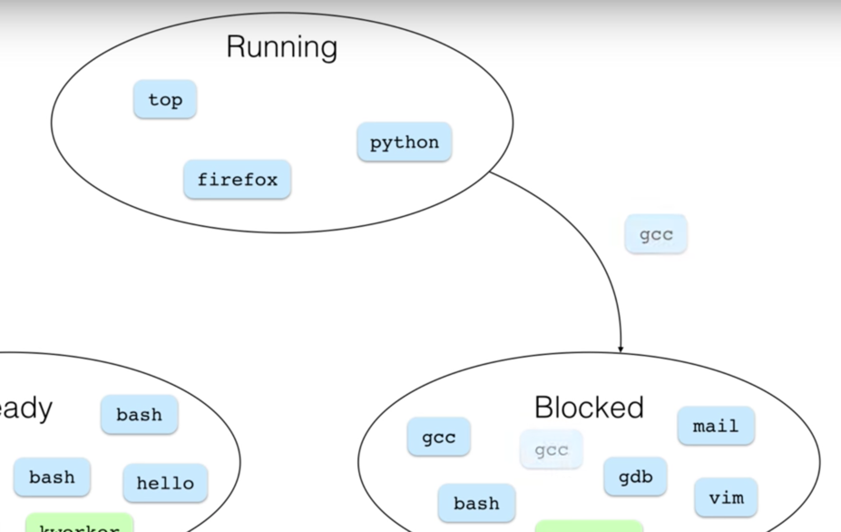
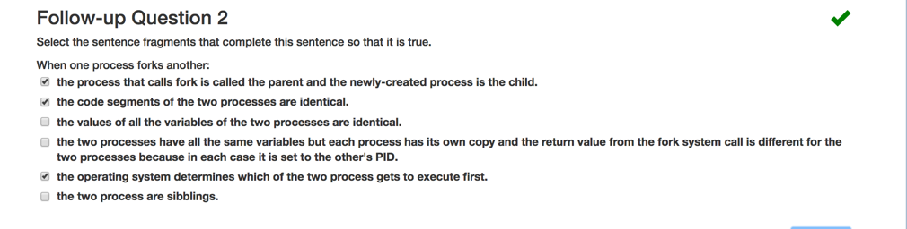
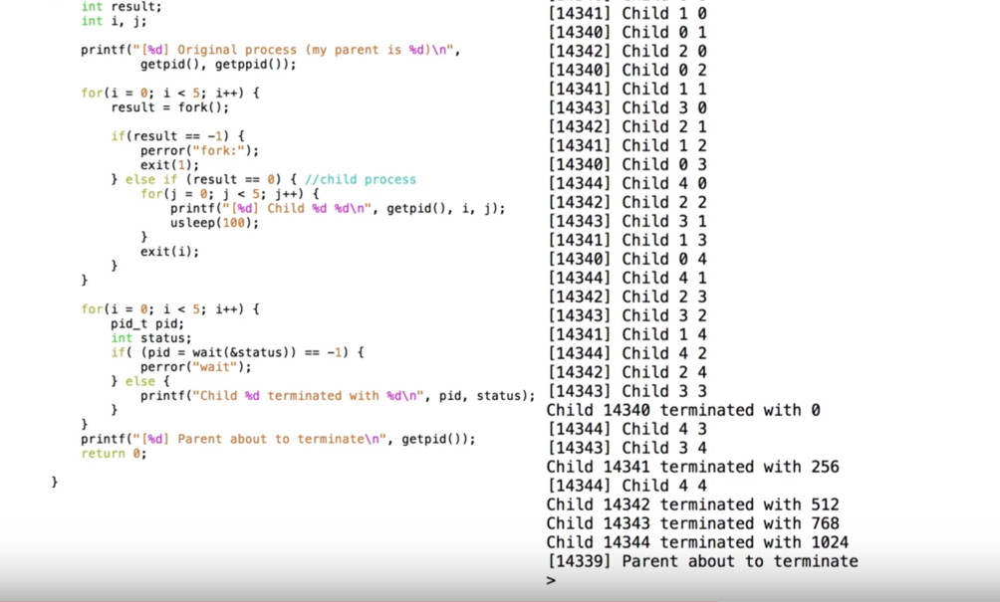
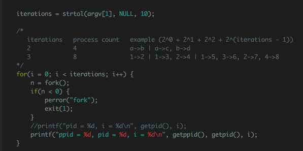
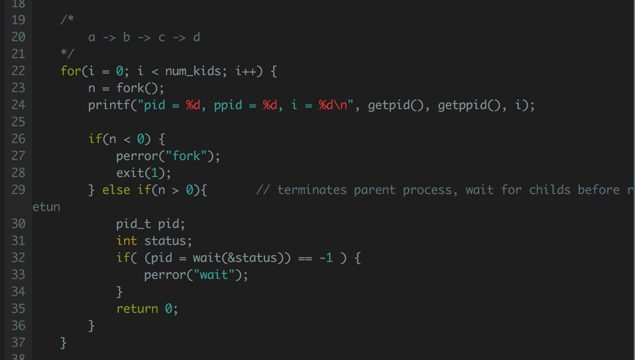
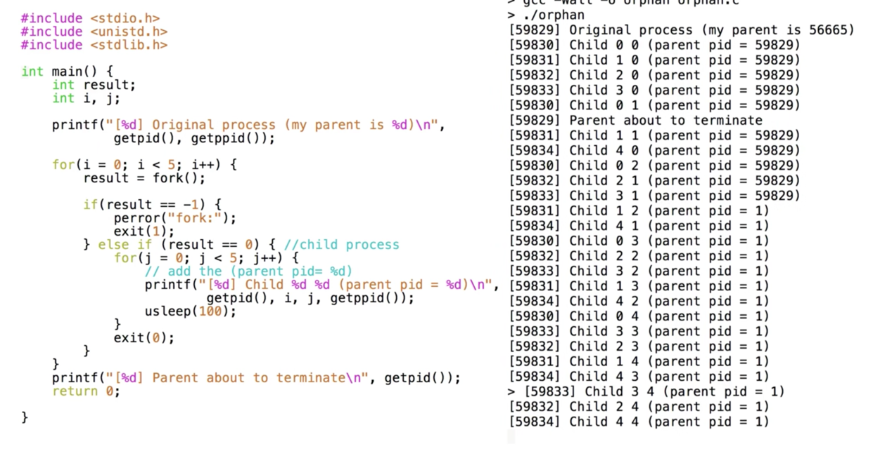
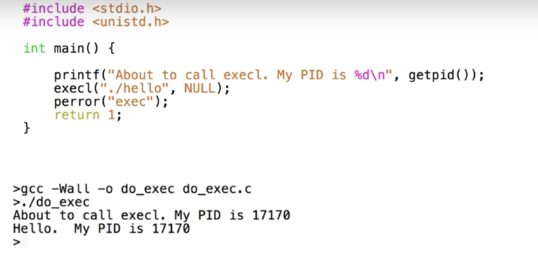
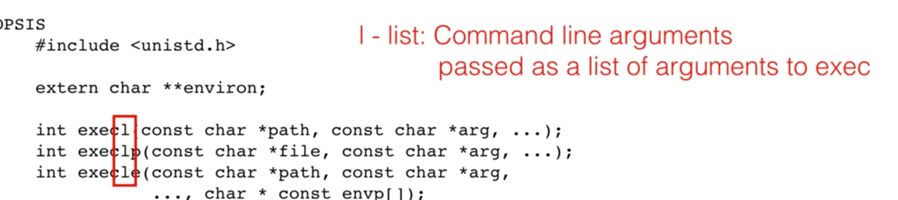
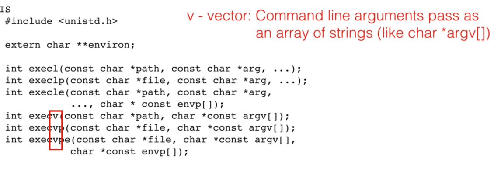

__Process Models__

+ _program_: executable instruction of program
  + source code
  + compile machine code
+ _process_: running instance of a program
  + machine code of program
  + current state info
    + stored in 
    + _stack_
      + what function is executing / holds values for local variables
    + _global variable_ and _heap_
      + holds other variables
    + _OS_
      + keeps track of additional state for process
      + 
        + _Process Control Block_: data structure for process
          + `PID`: process identifier
          + `SP`: stack pointer (points top of stack)
          + `PC`: program counter (identify next instruction to execute)

__`Top`__
+ displays active processes

+ `PID`
+ Command executing

Number of CPU determines how many processes can be executing instruction at same time

Process undergo state changes; OS scheduler decides when processes are in which state
+ running state
+ ready state
+ blocked state
  + waiting for an event to occur, i.e.
    + made read call and waiting for data to arrive
    + called sleep waiting for timer to expire

+ `gcc` move to blocked state because want to access a file
+ once arrived, `gcc` moves to ready state
+ once a processor is available, `gcc` moves to running state

---

__Creating processes__

`fork`
+ creates a new child process by duplicating the calling process
  + two processes does not share memory
  + OS determines which is ran first
+ returns
  + 0 to child process
  + process ID of child process to parent process
+ returns -1 to parent process if child process is not successfully created

+ comparison
  + Same
    + code
    + variable
    + `PC`
      + hence child process starts running after `fork` returns
    + `SP`
  + Different
    + `PID`
    + return value

---

__process relationship and termination__
+ creates 5 processes
+ each child processes go through a loop with `usleep`, which passes control to OS

+ single process in the correct order.
+ different processes are not ran in a predictable way
+ parent process terminates before child processes finished to print
  + it finishes regardless of child processes
  + the shell prompt 
  + note shell waits for current (parent) process to finish and prints a prompt for next command
    + program running from shell is a child of the shell process.
    + uses `wait` sys call to suspend itself until its child terminates

__`pid_t wait(int *stat_loc);`__
+ suspends execution of its calling process until `stat_loc` info available for a terminated child process (i.e. one of the child terminates)
+ returns
  + child PID if child process termiates
  + -1 if wait fails
+ `stat_loc`
  + pointer to termination status
    + lower 8 bit -> termination status
    + next 8 bit -> value returned from `exit`
        + `exit(0)` - successful
        + `exit(1)` (non zero) - failure
          + `stat_loc` is 256 in this case
  + extract useful info
    + with bitwise `|`
    + or with macros
      + 

+ will be in block state until all child processes terminates

 
+ `abort()` child process number 2
  + returns the proper signal 6 for `abort`

`pid_t waitpid(pid_t pid, int *stat_loc, int options);`
  + if `pid = -1` will wait for any child process
  + if `pid > 0` waits for child process with `pid`

+ both `wait` and `waitpid` waits for direct child processes
+ `status` contains both return code from terminating child as well as signals

__W7 exercise__

+ a loop for creating child processes

+ wait for a chain of child processes to terminate

+ wait for a group of child from a single parent to terminate

---

__Zombies and Orphans__

> what happens when child process terminates before `wait` is called

__Zombie__
  + dead process (terminated) that still hangs around waiting for parent to collect its termination status
  + `top`
    + terminated child process has a state of -> `Z` for zombie and `<defunct>`
    + sys cannot delete process control block of terminated process in case the parent calls `wait` later
  + exercised up after termination status is collected

> what happens to child process when its parent terminates naturally?

+ the child process is called an __orphan__ when the parent process terminates first
  + the orphans has `getppid()` return value of 1, the `init` process (the first process OS launches)
    + `orphans` adopted by `init`
    + `init` calls `wait` in a loop to collect termination status of any process that it has adopted
      + after which a process's data structure can be deleted and the zombie disappears

+ process not necessarily removed from process table when it terminates (zombie)

---

__Running different programs__

`int execl(const char *path, const char *arg0, ... /*, (char *)0 */);`
+ _replaces_ currently running process with a new process
  + note `exec` modifies the calling process and does not create new processses.
    + `PID` is same
    + _pipe_ retains original open file descriptors
  + loads executable to into memory where code segment is. and initializes a new stack; `PC` and `SP` are updated to execute the new process
  + the original code is _GONE_ so should never execute return here
    + 
+ will return
  + if error occur, i.e. could not load the program

`exec` family
suffixes
+ __l__ a list of arguments are passed to `exec`
  + 
+ __v__ an array of string are passed to `exec`
  + 
+ __p__ PATH environment variable is used to search executable
  + 
+ __empty__ full path must be provided
  + 
+ __e__ array of env variables
  + 

__Shell__
+ a process that uses `fork` and `exec`
+ steps
  + upon entering command, use `fork` to create child process
  + use `exec` to load different program into the memory of child process
  + calls `wait` and blocks until child process finishes executing
  + when `wait` returns, prints a prompt.

+ note `printf` might execute if `exec` fails
