```c
<directives>
int main(void){
  <statements>
}
```
---

_directives_
+ begins with `#`
+ info in library is to be included to the program before compilation

```
#include <stdio.h>
```

---

_functions_
+ a group of statements grouped together and given a name
+ `main` function is mandatory
  + gets called automatically when program executes  
  + returns a status code to OS when program terminates
    + `return 0;` indicates normal program termination


_statement_
+ a command to be executed


_comments_

```c
/* this is a
 * multiline comment */
// this is a one line comment
```

---


_variable_

+ type
  + int
  + float


_declaration_
+ specify the variable's type and name

```c
int height, width;
float profit;
```

_assignment_
+ a variable can be given a value by means of assignment

```c
height = 8;
length = 12;
profit = 12.12f;

printf("Height: %d\n", height);   // %d stands for digit, works for int only
printf("Profit: %f\n", profit);   // %f works for floats, defaults to 6 digits
printf("Profit: %.2f\n", profit);   // To force %f to display 2 digits after decimal
```


+ prints to 2 decimal float

`scanf`
+ next call to `scanf` will start at where the previous `scanf` left off

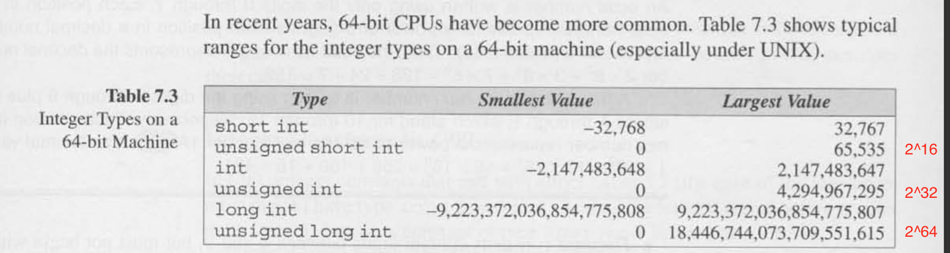
+ int range table


p156 --> formatting conversion specifier for other ints


+ convert to uppercase
+ `toupper(char)` in `#include <ctype.h>`

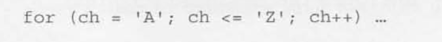

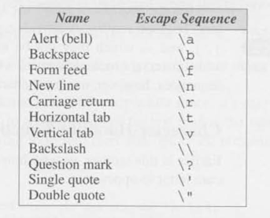
+ escape sequence


---

__Usual arithmetic conversion__
+ convert operands to the narrowest type that will safely accomodate both values
  + narrower = requires fewer bytes to store
  + __Promotion__ convert operand of narrow type to the type of the other operand
    + _integeral promotions_ convert `char` or `short` to `int`
+ `float + int`,
  + `int` always converted to `float`

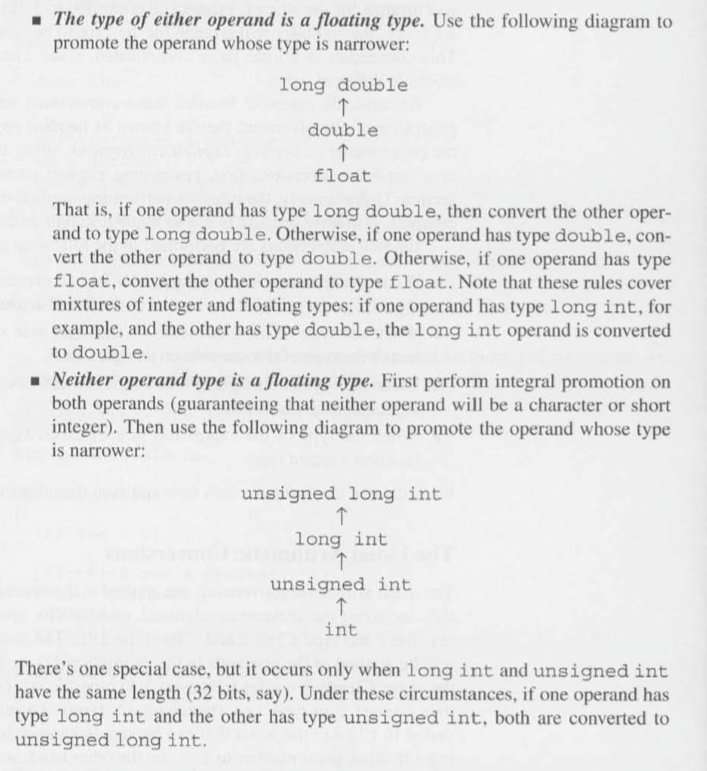

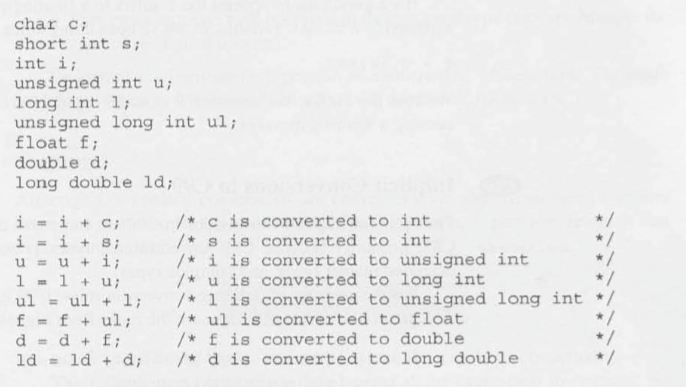

----


__Cast__

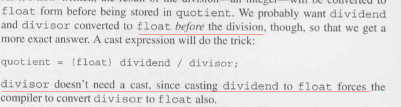


__Type definition__
+ C use `typedef` to create names for type that can vary from one C implementation to another, those that end with `_t`
  + such as `typedef unsigned long int size_t`

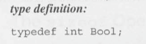


__`sizeof` operator__
+ print with
  + `printf("%lu", (unsigned long) sizeof(int))` for C89
  + `printf("%zu", sizeof(int))` for C99
+ `sizeof(array)` returns size of array only on stack, array passed as parameters are pointers and such size info is lost

---

Aggregate variables
+ array
+ structures


__Array__
+ array initializer
  + `int a[10] = {1,2,3,4,5,6,7,8,9,10};`
  + remaining element in array given value of 0 if initializer shorter than the array
+ designated initializer
  + `int a[15] = {[2] = 29, [9] = 7, [14] = 48};`
  + `int b[] = {[23] = 1};` forces `b` to have length 24


`const`
+ documents program wont change the variable / array
+ helps compiler catch error should the program try to modify them.
+ always keep things _to the left_ constant


__Variable-length array (C99)__
+ able to use expression instead of constant for array initialization
  + `int a[n];` where `n` is determined at runtime


+ as function param

__Compound Literal__


+ anonymous array declaration


---

__Static__
+ global
  + A variable declared as static at the top level of a source file (_outside_ any function definitions) is only visible throughout that file ("file scope", also known as "internal linkage").
  + hence this is a form of encapsulation; by declaring variable static they become accessible only within the current `.c` file
+ local
  + Variables declared as static _inside_ a function are statically allocated, thus keep their memory cell throughout all program execution, while having the same scope of visibility as automatic local variables (auto and register), meaning remain local to the function. Hence whatever values the function puts into its static local variables during one call will still be present when the function is called again.
  + useful for tracking function state without declaring global variable

__Extern__
+ A global variable
+  The usual practice is to collect `extern` declarations of variables and functions in a separate file, historically called a header


+ Regardless of the number of files, a global variable is _only defined once_, however, it _must be declared in any file_ outside of the one containing the definition.


__Understanding definition, declaration and extern__
+ When a variable is `defined`, the compiler allocates memory for that variable and possibly also initializes its contents to some value. When a variable is `declared`, the compiler requires that the variable be defined elsewhere. The declaration informs the compiler that a variable by that name and type exists, but the compiler does not need to allocate memory for it since it is allocated elsewhere.
+ The `extern` keyword means _declare without defining_. In other words, it is a way to explicitly declare a variable, or to force a declaration without a definition (i.e. without allocating memory).
  + It is also possible to explicitly define a variable, i.e. to force a definition. It is done by assigning an initialization value to a variable.
  + If neither the extern keyword nor an initialization value are present, the statement can be either a declaration or a definition. It is up to the compiler to analyse the modules of the program and decide.

+ A variable must be _defined exactly once_ in one of the modules of the program. If there is no definition or more than one, an error is produced, possibly in the linking stage. A variable may be _declared many times_, as long as the declarations are consistent with each other and with the definition (something which header files facilitate greatly). It may be declared in many modules, including the module where it was defined, and even many times in the same module. But it is usually pointless to declare it more than once in a module.

+ The `extern` keyword applied to a _function prototype_ does absolutely nothing (the extern keyword applied to a function definition is, of course, non-sensical). A function prototype is always a declaration and never a definition.


---

#10 Program optimization

__automatic storage duration__
+ portion of program execution during which storage for variable exists
  + i.e. local variable is automatically allocated during function call and freeed when function returns

__Static storage duration__
  + `static foo` has permanent storage location; hence retains value
    + i.e. local variable occupies the same memory location but still has _block scope_

__Scope__
+ scope of a variable is the portion of program text which the variable can be referenced
  + i.e. local variable has _block scope_, available from point of declaration till end of enclosing function body


+ parameter also have automatic storage duration and block scope

__Extern__
+ variables declared outside the body of any function;
  + useful when variable shared by many different functions
+ properties
   + static storage duration
   + file scope
    + visible from point of declaration to end of file


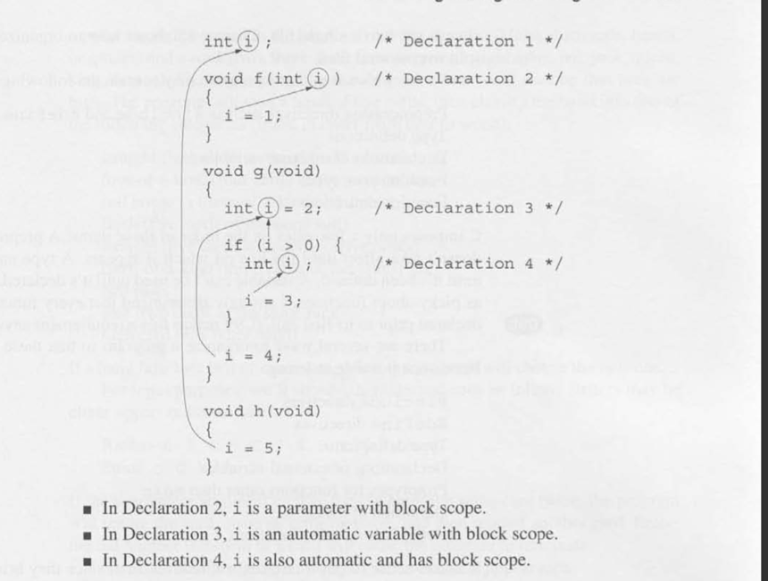
+ scoping rule
  + when declaration inside block names an identifier that is already visible (i.e. file scope, or enclosing block) the new declaration temporarily hides the old one, the identifier regains its original meaning at the end of block


__Organization__


---
#Pointers

__Pointers__
+ pointer is nothing more than an address; a pointer variable is just a variable to store an address.
+ requires
  + points to objects of particular type (`int *p`, `double *q`)
+ operator
  + _address_ `&` -> get pointer
  + _indirection_ `*` -> get content
  + note
    + 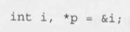
    + 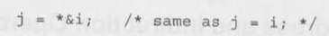
    +  do not use indirection operator to uninitialized pointer
+ as function argument
  + _modification_ `f(&x)`
  + _examine_ `void f(const int *p)`
    + attempt to modify `*p` will trigger compiler error; can modify `p` itself
    + `void f(int * const p)` protects `p` itself instead, however rarely used
+ as return statement
  + never return a pointer to an _automatic_ local variable since pointer will be invalid after `f` returns
    + 
+ _pointer arithmetics_
  + adding/subtracting integer `j` to pointer `p` yields a pointer to the element `j` after/before one `p` points to
    + 
  + subtract one pointer from another yields distance (in array element) between pointers
    + 
  + comparison operator (i.e. `<`, `<=`, etc.) only works for pointer to elements in the same array
  + array processing
    + `for (p = &a[0]; p < &a[N]; p++)`
    + `a[i++] = j` has pointer equivalent
      + 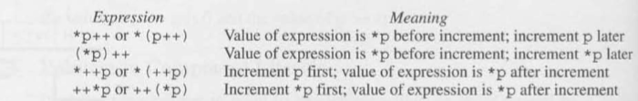
      + `p = &a[0]; while(p < &a[N]){ sum += *p++; }`
    + name of array is a pointer to first element in the array hence
      + `for (p = a; p < a + N; p++){ sum += *p; }`

__Array and pointers__
+ declaration
  + `int a[10]` causes compiler to set aside memory for 10 integer
  + `int *a` causes compiler to allocate space for a pointer variable
+ pass by function parameter
  + ordinary variable --> value copied
  + array --> pointer copied, hence original array modifiable
+ multidimensional array
  + row major so `for (p = &a[0][0]; p <= &a[NUM_ROW - 1][NUM_COLS - 1]; p++)`


---
#Strings

__Strings__
+ string literal
  + a sequence of characters enclosed within double quotes
  + 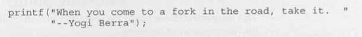 two adjacent string literal are joined into a single string
  + null terminator
    + `\0`, i.e. a byte whose bits are all zero
  + assignment
    + `char *p = "abc";` makes `p` pointers to first char of string
+ string variable
  + an array of characters will null terminator at end
  + 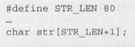
  + declaration
    1. `char data1[8] = "June 14";`
      + note `"June 14"` is not a string literal but instead an abbreviation for array initializer
      + `char data1[8] = {'J', 'u', 'n', ..., '\0'};`
      + compiler will pad string with extra null character
      + `char data2[3] = "abc";` is allowed but not usable since no null terminator is appended at end
    2. `char data4[] = "June 14";`
      + may omit array length
+ comparison
  + `char date[]=  "June 14";` and `char *date = "June 14";`
    + former modifiable; latter `date` points to string literal and cannot be modified
    + note `char *date` the compiler only allocates enough memory for pointer
  + `char s[]` or `char *s` as parameter are identical they all accepet
    + array name
    + pointer
    + string literal


`puts`
+ prints string with `\n`

`gets`
+ reads input character into an array, then stores `\0`
  + does not skip null character
  + stops before `\n`

`scanf`
+ use `%ns` where `n` is an integer indicating max number char to be stored.


__C string library__

Note
+ `char str[10] = "abc";` is allowed but `char str[10]; str = "abc";` is not
  + the former is shorthand for array initializer
  + the latter tries to assign a pointer to an array
+ `str1 == str2` does not produce desired result
  + pointers instead of values are compared here.
  + always return 0 because they have different address


`strcpy(str2, "abcd");`
+ copies up to the first `\0`; undefined behavior if source points to a longer string
+ a safer alternative

```c
strncpy(str1, str2, sizeof(str1) - 1);
str1[sizeof(str1)-1] = '\0';
```


`size_t strlen(const char *s)`
+ returns length of string `s` up to, but not including, the first null terminator `\0`
+ note does not measure length of array itself, but length of string stored in array


`char *strcat(char *s1, const char *s2)`
+ appends content of `s2` to end of `s1` and returns `s1`
+ `strcat` may append past size of `s1` if `s2` points to a longer string. (similar to `strcpy`)
+ a safer alternatvive
  + `strncat(str1, str2, sizeof(str1) - strlen(str1) - 1)`
  + `strncat` always appends the `\0`


`int strcmp(const char *s1, const char *s2)`
+ compare `s1` and `s2` based on lexicographic ordering


_Array of stirngs_
+ `char *planets[] = {"Mercury", "Venus", ...}`


command-line arguments
+ `argc` number of arguments (including name or program itself)
+ `argv` argument vector (array of pointers to arguments)
  + `argv[0]` points to name of program
  + last argument is `NULL` pointer


---

#Preprocessor


+ a piece of software that edits C programs just prior to compilation
+ directives
  + File inclusion `#include`
  + Macro definition `#define`
    + note
      + no `=` or `;`
      + not type checked
      + cannot have pointers to macro
    + parameterized macro `#define identifier(x_1, x_2, ..) replacement-list`
      + put parentheses around each parameter every time
        + `#define TOUPPER(c) ('a' <= (c) && (c) <= 'z' ? (c) - 'a' : (c))`
      + `#` converts a macro argument to a string literal --> stringization
        + `#define PRINT_INT(n) printf(#n "%d\n", n)`
        + --> processed to `printf("i/j" " = %d\n", i/j);`
      + `##` paste two tokens together to a single token
        + `#define MK_ID(n) i##n`
        + --> processed to `int MK_ID(1), MK_ID(2)` -> `int i1, i2;`
    + build-in macro
      + 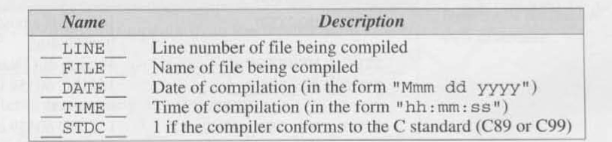
      + `__func__`
        + a string variable htat stores name of currently executing function
        + 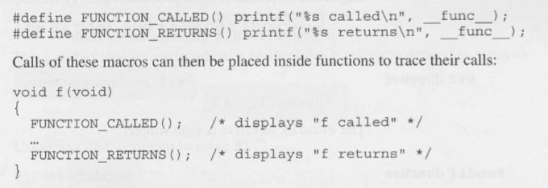
  + conditional comiplation `#if`, `#ifdef`, `#ifndef`, `#elif`, `#else`
    1. `#if constant-expression` and `#endif`
      + evaluates constant expression
        + if 0, lines between if and endif remain in program
        + if 1, remove lines between if and endif
      + 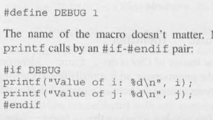
    3. `#defined`
      + produce 1 if identifier is defined, 0 otherwise
      + 
    3.  `#ifdef identifier` and `endif`
      + tests whether an identifier is currently defined as a macro
      + equivalent to `#if defined(identifier)`
    4.  `#ifndef identifier` and `endif`
      + same as `#if !defined(identifier)`
    5. `#if const-expression` and `#elif const-expression` and `#else`
      + 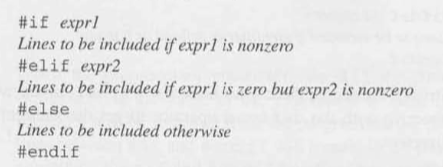
    + usage
      + portability
        + 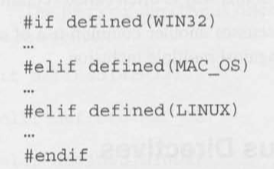
      + compile with different compiler
      + defualt definition for macro
        + 


---

#Writing large programs

_source file_
+ contains definition of variables and functions

_header file_
+ contains includes, macro, type definition, function prototype
  + always include `foo.h` in `foo.c`
+ `#include <filename>` search directory in which header files reside (`usr/include`)
+ `#include "filename"` search current directory then search directory in which system header resides
  + relative path preferred
+ share
  + function
    + put definition in source file and declaration (prototype) in other files that need to call the function (in header files)
  + variable
    + note
      + `int i;` both declares and defines it (definition cause compiler to set space for `i`)
      + `extern int i;` declares without defining it; informs that `i` is defined elsewhere so no need to allocate space for it.
    + put definition of `i` in one file `int i;` and `extern int i;` in other files (usually in header files)
+ Protecting header file
  + multiple inclusion (of type definition) may cause compiler error
  + use `#ifndef` - `#endif` pair for protecting `typedef`
    + 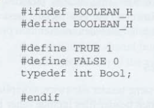


Building multi-file programs
+ compiling
  + each source file must be compiled separately to object file `.o`
  + header file dont need to be compiled, they are automatically compiled whenever a source file includes it is compiled.
+ Linking
  + combines object files along with code for library functions to produce an executable file.
  + resolving external references
+ makefile
  + `target: dependencies \ command`
  + if any dependencies changed since program last build, the `rule` is re-run
+ Defining macro outside program
  + `gcc -DDEBUG=1 foo.c` `-D` flag allows value of macro specified


Note
  + `extern int a[];` and `extern int *a;` are not equivalent
    + although array decays to pointers in expression; in variable declaration, arrays and pointers are distinct types.


---

#Structure

structure
  + Members
    + are stored in memory in the order in which they are declared
    + represents a new scope; names declared in this scope wont conflict with other names in program
      + i.e. structure has a separate _namespace_
  + initialization during declaration
    + simple initializer
      + 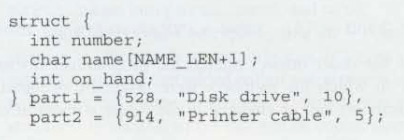
      + Expression in initializer must be constant (same as array initializer)
      + leftover members are given `0` as initial value.
      + order matters
    + designated initializer
      + 
      + `.foo` is the _designator_
      + order does not matter
  + operation
    + `struct.member` dot operator takes precedence
    + `(*struct).member` is equivalent to `struct->member` called _right arrow selection_
      + note `->` gives rise to a normal variable kj
    + `struct1 = struct2` copies every member in `struct2` to `struct1`
      + note array can not be copied this way
  + type
    + structure tag
      + `struct struct_name {...};` and declare with `struct struct_name foo bar;`
    + structure type
      + `typedef struct {...} struct_name;` and declare with `struct_name foo, bar;`
  + compound literal
    + a type name within parentheses, followed by a set of values enclosed by braces
    + `print_part((struct part) {123, "sdf", 1});`
  + nested struct
  + array of structures
    + `struct ailing_code country_code[] = {{"china", 111}, {"India"m 222}}`


---

#Advanced use of Pointers

_dynamic storage allocation_
  + allocate storage during program execution
  + memory allocation function
    + `void *malloc(size_t size);` allocates block of memory but does not initialize it
      + returns `void *` if success and a null pointer if fails
      + 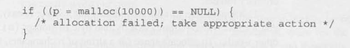
    + `void *calloc(size_t nmemb, size_t size);`
      + allocate space for an array with `nmemb` element each `size` byte long.
      + initializes the array by setting all bits to 0
    + `void *realloc(void *ptr, size_t size);`
      + `ptr` points to a memory block `size` represent new size of the block.
      + if returns `NULL` original data unchanged
      + `realloc(NULL, int size)` behaves like malloc
      + `realloc(ptr, 0)` frees the memory block
  + strings
    + `p = malloc(n+1); strcpy(p, "abc")`
  + arrays
    + `a = calloc(n, sizeof(int));`
  + deallocating storage
    + garbage
      + a block of memory no long accessible to the program
    + memory leak
      + program that leaves garbage behind
    + `void free(void *ptr);` frees up memory block
      + 
    + dangling pointers
      + attempting to access or modify a deallocated memory block via pointer
      + 
  + pointers to pointer
    + used in function parameter whenever we want the function to modify the pointer passed in.
  + pointers to function
    + `void qsort(void *base, size_t nmemb, size_t size, int (*compar)(const void *, const void *));` provides a comparison function
      + 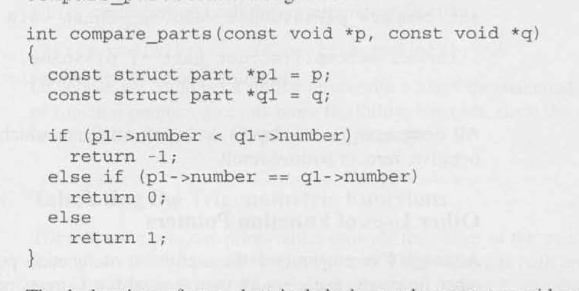


_restricted pointers_
+ `int * restrict p;`
+  for the lifetime of the pointer, only the `pointer` itself or a value directly derived from it (such as `pointer + 1`) will be used to access the object to which it points.
  + limits aliasing
  + access by an independent pointer gives rise to undefined behavior
  + a marker for compiler; `restrict` gives rise to better optimization by compiler. since compiler knows pointers point to different places. hence no need to reload pointers should it be changed by some other pointers prior.
+ programmer needs to ensure restricted pointer points to different location

```c
int *restrict p;
int *restrict p;

p = malloc(sizeof(int));
q = p;
*q = 0    // causes undefined behavior
```

`void *memcpy(void * restrict s1, const void * restrict s2, size_t n);`
+ copies `n` bytes from `s2` to `s1`
  + similar to `strcpy`, which stops at `\0`, while `memcpy` does not
+ use of `restrict` indicates that source and destination shouldnt overlap.

`void *memmove(void *s1, const void *s2, size_t n)`
+ exactly same as `memcpy` except is guaranteed to work even of source and destination overlaps
+ ex. shift array by one bit
  + `memmove(&a[0], &a[1], (ARRAY_SIZE - 1) * sizeof(int))` is valid but not if using `memcpy`

---


#18 declaration

`declaration-specifier declarators;`

+ declaration-specifier
  + _storage classes_
    + `auto`, `static`, `extern`, `register`
  + _type qualifier_
    + `const`, `volatile`, `restrict`
  + _type specifier_
    + `void`, `char`, `short`, `int`, `float`, `double`, `signed`, `unsigned`
    + `struct`,
    + Type name created using `typedef`

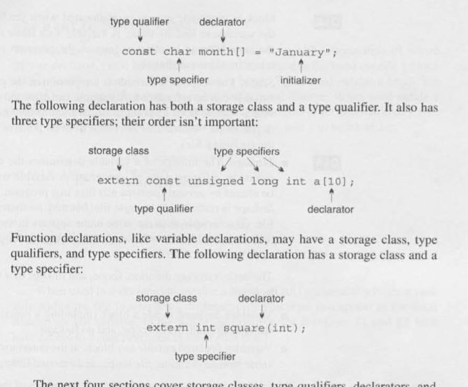


__Components__
  + _storage duration_
    + _automatic storage duration_ & _static storage duration_
  + _scope_
    + portion of program in which a variable can be referenced
      + _block scope_ & _file scope_
  + _linkage_
    + categories
      + _external linkage_  
        + may be shared by different files
      + _internal linkage_
        + restricted to single file, but may be shared by functions in the file
      + _no linkage_
        + belongs to a single function
    + ``

+ rule
  + variable declared _inside_ a block has __automatic storage duration__, __block scope__, and __no linkage__
  + variable declared _outside_ a block has __static storage duration__, __file scope__, and __external linkage__.


__Storage classes__
  + `auto`: automatic storage duration
  + `static`: static storage duration
   + 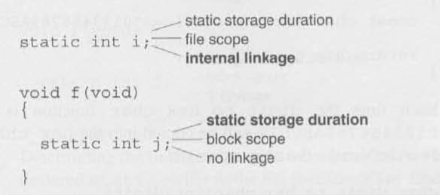
     + used _outside_ a block, variable has _internal linkage_ in addition to `static`: i.e. __information hiding__
     + used _inside_ a block, variable just changed to `static` storage only.
       + initialized only once, shared by all calls to the function
       + `static const char hex_chars[16] = "0123456789ABCDEF";` in function makes it more efficient, dont need to copy array every time function is called
  + `extern`
   + declaration without definition; always `static` storage duration
   + 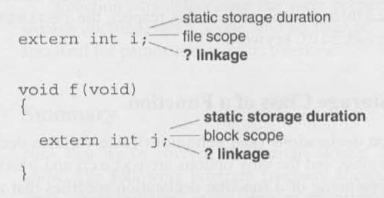
     + usually without _external linkage_
  + `register`
   + request for storage in CPU's register
   + cant have `&` since it doesn't have address
   + used for frequently accessed variable, i.e. `int i` in for loop

__Storage class a function__
  + `extern` [DEFAULTS]
    + allow to be called from another file
  + `static`
    + internal linkage, i.e. cannot be called from another file
    + guarantees function inaccessible to other files beside which it is defined
    + reduces namespace pollution
      + so shouldnt put `static` function in header file... since dont want to be shared


__Type Qualifiers__
+ `const`
  + read only
  + advantage
    + compiler checks
    + identify data to store in ROM in embedded system

__Declarators__
+ an identifier (name of var), possibly preceded by `*` and followed by `[]`, ad `()`
  + `*`: pointer
  + `[]`: array
    + bracket may be empty if array is a parameter, has an initializer, or its storage class is `extern`
      + `extern int[]`
  + `()`: function
    + parameter names may be omitted in function declaration (prototype)
      + `int find_largest(int [], int);`
  + rules
    1. always read from inside out
    2. always favor `[]` and `()` over `*`
      + i.e. `*a[]` represents array not a pointer
      + i.e. `float *f_not_ptr(float)` represents a function that returns a pointer
      + i.e. `void (*pf)(int)` represents a function pointer
      + i.e. `int *(*x[10])(void);` represents an array of pointers that points to function with no arguments and with a return pointer to `int`
        + 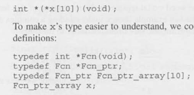
  + cannot happen
    + function that return arrays/functions/array of functions

__Initializer__
+ `{1, N, N*N}` can have constant expression only
+ uninitialized
  + _automatic storage duration_ variable have no initial value.
  + _static storage duration_ variable have zero by default, based on its type
    + `int` -> 0
    + `float` -> 0.0
    + `void *` -> NULL

_difference between scope and linkage?_
+ scope is for compiler; linkage is for linker

_`const` and constant expression?_
+ `const` stands for read-only not constant

----


#20 Program Design

__Modules__
+ A collection of _service_ (functions), consists of _interface_ (header file) and _implementation_ (source file)
+ Good properties
  + _high cohesion_: close relatedness of elements in the module, all cooperating toward a common goal
  + _low coupling_: independent of other modules, easier for reuse.
+ types
  + _data pool_: a collection of related variables / constants
    + i.e. `<float.h>` `limits.h`
  + _library_: a collection of related functions
    + i.e. `<strings.h>`
  + _abstract object_: a collection of functions on a hidden data structure
    + i.e. abstract data types implementations

__Information Hiding__  
+ concealing information from client of a module for _security_ and _flexibility_
+ Declare `static` variable with _file scope_ gives _internal storage_ !


__Encapsulation__
+ _incomplete types_:
  + types that describes object but lack information needed to determine their sizes
    + i.e. `struct t;`  
  + cannot used for variable declaration
    + i.e. `struct t foo;`
  + but legal to define a pointer type that references an incomplete type
    + i.e. `typedef struct t *T`: variable of type `T` which is a pointer to a structure with tag `t`
    + possible because size of a pointer does not depend on what it points to, regardless of size of `t` structure

__ADT__
+ Define an abstract object's type (with `typedef`) to have multiple instances of an object
  + 
+ example of stack
  + `typedef struct stack_type *Stack;`
  + with fixed-length list
    + `struct stack_type {int content[SIZE]; int top;}`

---

#21 std library
