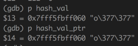
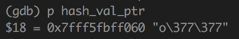
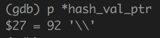
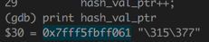
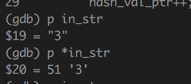
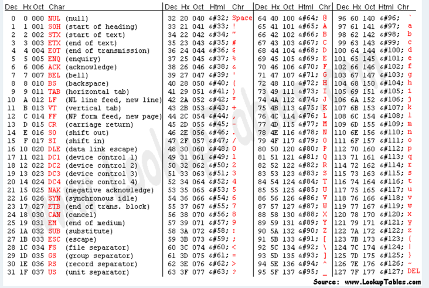

`./compute_hash 6 737069646572 < input` as a final test


__String Declaration__

```c
// 1. CORRECT; size of array taken from size of initializer
//    stored in array with terminating 0
char string[] = "october";

// 2. CORRECT: size of array specified as part of declaration
char string[100] = "october";

// 3. CORRECT; array style initializer
char string[] = {'a', 'b', 'c', 0};

// 4. WRONG; declaration incomplete because no array size specified
char string[];
string = "october";

// 5. WRONG; even if specify array size. Cannot assign string, which
//    is essentially array of char with =
char string[8];    
string = "october";


// To copy arrays use strcpy
//  char *strcpy(char *dest, const char *src);
strcp(dest, src);
```


---

__GDB__


`n` - next line
`step` - executes current line
`break` - set up break pt
`p` - prints value
`r executableName` - runs executableName
`list` - show surrounding code
`file executableName` - reloads program after change
`set args` - setting argv's




---

Note that 2 hex represent one byte
+ 


`r compute_hash 3 6fffff`

Note with `xstr_to_hash` convert `6fffff`
+ concat `0110` and `1111` -> `01101111` -> `111` as decimal -> `o` in decimal
+ so `6fffff` -> `\111\377\377` in `hash_val`
  + Note some of the characters such as `\377` not printable in ASCII that is why you get `?` in stdout

Say `6f ff ff` -> `\111\377\377`
+ shouldnt be `\377` = `0000000101111001` damn
  + `ff` should be `11111111`
+ `\111` is `01101111` in binary
+ `01101111 ^ 00110011`, i.e. xor with a `"3"` (i.e. `\51` in `char` ) then  --> `01011100` which is `\92` = `\\`


`hash_val`
+ before `xor` the first element in array is `o`

+ after `xor` notice first element in array changed to `\92`

+ jump to next location




+ note here
  + `p in_str` prints string `"3"`
  + `p *in_str` prints char consisting of int stored and its ASCII equivalent `51 '3'`





You may be tempted to use string functions here. That is a bad idea. While we are storing the data in arrays of characters, we are not really dealing with strings. (Why not?)
+ char array represented as integers in memory.
  + i.e. `char hash_val[2] = {'a', 'b'}`
  + store in  `'a' = 61 = 0x3d = 0011 1101`
    + convert to hex then convert to binary
+ Since `char` is 7bit so there are many unprintable values (Non-ASCII) for 1byte of `char`
  + so most expressive is either
    + 2 hex 
    + 8 bits
