<!--  -->


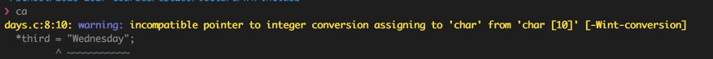


__Dynamic Memory__

+ function variables are stored on stack -- a workspace for functions
+ shouldnt access variable allocated on stack after its been deallocatedf
  + might end up being something else

```c
int * set_i(){
  int i = 5;
  return &i;  //  i is stored in stack, and the memory is freed upon return
}


int some_other_function(){
  int junk = 999;   // note that junk may take up address of i because memory is reused
  return junk;
}

int main(){
  int * pt = set_i();
  some_other_function();
  printf("but if I try to access i now via * pt I get %d\n", * pt);
  // here print 999. Since both function variable i and junk are created and destroyed. The memory of i are later changed by junk.
}
```


`void *malloc(size_t size)`
+ allocate memory on heap
  + heap memory persists until the programmer deallocates it
+ `size_t size`
  + `size` byte of memory
  + return type for `sizeof`,
  + normally unsigned int
+ `void *`
  + returns pointer to memory being allocated of generic type
  + normally pointers are initialized with a type, i.e. `int *`, which when the pointer increments, points to the next address down.
  + storing the address of memory on heap to a pointer with specific the type
    + `int *pt = malloc(sizeof(int));`


_Allocate Memory on Heap_


```
int *squares(int  max_val){
  int *result = malloc(max_val * sizeof(int));
  return result;
}

int main(){
  int *square_to_10 = squares(10);
}
```


_freeing dynamically allocated memory_

Memory leak
+ memory which is no longer needed is not released
  + an object is stored in memory but cannot be accessed by running code
  + i.e. `malloc(sizeof(int))` is not released and cannot be accessed after function `play_with_memory` returns
+ `out-of-memory error: ENOMEM`
  + when out of memory to allocate new variables

`void free(void *ptr);`
+ releases memory by the memory management system
+ `void *ptr`
  + pointer to the beginning of a block of memory that has been returned by a previous call returned by `malloc`
+ does not
  + reset value of deallocated memory
  + change the value in the block of memory being freed
+ simply tells memory management system that the memory is free for other purposes

dangling pointer
+ pointer points in memory that is already freed, which is unsafe
+ Dangling pointers arise during object destruction, when an object that has an incoming reference is deleted or deallocated, without modifying the value of the pointer, so that the pointer still points to the memory location of the deallocated memory. As the system may reallocate the previously freed memory to another process, if the original program then dereferences the (now) dangling pointer, unpredictable behavior may result, as the memory may now contain completely different data.

```
int play_with_memory() {
    int i;
    int *pt = malloc(sizeof(int));

    i = 15;
    *pt = 49;     // cause memory leak here,
                  // pointer destroyed after function returns
                  // causing *pt memory inaccessible form main

    return 0;
}

int main() {
    play_with_memory();
    play_with_memory();
    play_with_memory();
    return 0;
}
```


_Returning an address with a pointer_


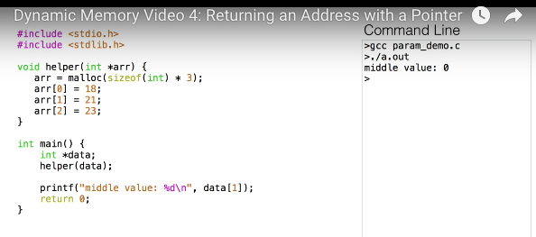

A common mistake
+ passing just `int *arr` to helper function
  + some random default value stored in `main` for `int *data` is passed by value (copy) to function `helper`
  + A local variable `arr` with that random address passed in to `helper` is created, and that is destroyed upon function return.
  + `arr = malloc(sizeof(int) * 3)` modifies value of pointer `int *arr` on `helper`'s stack frame'; this is not doing anything to the address that `int *data` is storing in `main`'s stack frame


> In general, pass a pointer (to a function as param) to the thing you want to change


+ Note here `int **arr_matey` is a pointer to the address of a pointer `int *data`.  Therefore you pass in `helper(&data)`, the address of `int *data` as parameter, with which you may access the address that `int *data` is storing in function `helper`
+ `*arr_matey = malloc()`
  + note `int **arr_matey` is a pointer that points to the `int *data`. So when dereferenced, `*arr_matey` accesses the content/value of `int *data` (not address of `int *data`)
  + and assigns the newly allocated address on heap to the value that the pointer `int *data` holds
+ `int *arr = *arr_matey`
  + creates a local pointer on stack that references the newly allocated memory on heap
  + to avoid dereferencing `arr_matey` all the time to access memory block on heap
  + cant be declared before `malloc` is called to avoid from accessing the default / random initial address assigned to `int *data`. It may cause Segmentation Fault


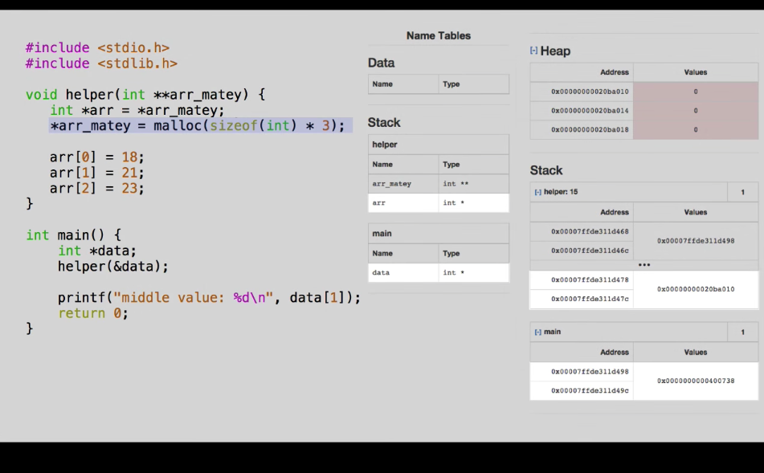

If set `int *arr = *arr_matey` before allocating memory to `*arr_matey`
  + local variable `*arr` gets the return value from `malloc`, which is destroyed after function call

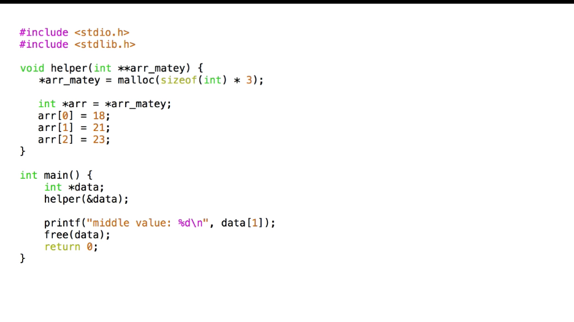

`free(data)`
+ cant be too early to cause a dangling pointer
+ free memory as soon as it is used.


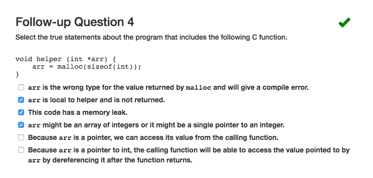

+ note because we want to change value of pointer `int *arr` we should pass in `int **arr`


_Nested Data Structures_

+ Array of pointers, each points to a subarray.
+ each call to `malloc` needs to be freed separately
  + however, cannot free top level pointer first `free(pointers)`
    + because we cannot access subarrays without using dangling pointers
  + so free subarrays first

> create data structure top down. And free memory bottom up


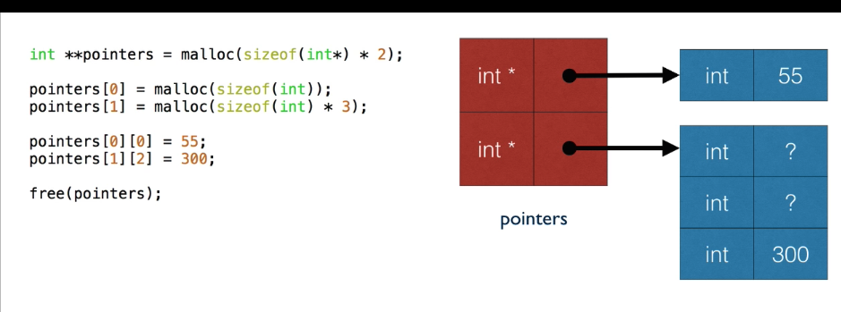


---


__C memory model__

_Code and Stack_

Memory: a large array
+ segments store different types of data

Comments
+ compiled code is stored near top of array in `code` segment
  + code segment are close but not at zero
+ Function invocation allocates space on `stack` to store local variables
  + most recent function call is at top of stack and removed in LIFO order

`sum` function
  + Stack frame, at the top of stack, is allocated to store function variables `int a, b, i`
    + which is located above its caller, function `main`
  + will be popped from stack once function finishes and return a value to the caller `main`
    + resources is freed

Observation
+ top stack frame is for function that is currently being executed
+ local variables are accessible while function that defines them are active
  + i.e. when stack space is deallocated, the variable is no longer a valid memory location


_Heap and Global segments_


`Global segment`
+ stores global variable
  + declared outside of main; accessible everywhere
+ stores string literals
  + because not all strings are assigned to variables (i.e. printing strings)
  + `char *c_ptr = "hi!"` note `"hi!"` string is a constant stored in global segment


`heap segment`
+ stores dynamically allocated memory
  + have a lifespan longer than the function in which it was allocated
    + `malloc` allocates memory while the program runs
    + `free` deallocates memory so that it becomes available for allocation

`ENOMEM`
+ out of memory error occur if exceeds size of stack or heap


`OS segment`
+ reserves largest addresses in memory for its own use
+ cannot be accessed by normal programs
  + access grants `Segmentation Fault - segfault`
    + uninitialized variables or null pointers results it pointing to zero, resulting in `segfault`.
    + this is because location 0 and close to zero belongs to `buffer`, i.e. buffer for failure


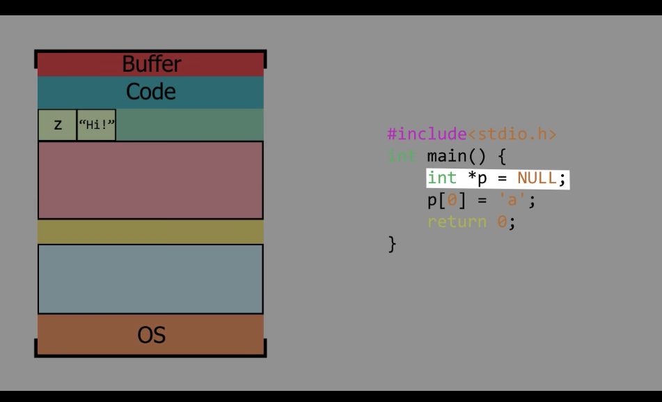


__Strings__

old way
+ an array of chars i.e. `char *` to store text with drawbacks
  + printing requires for loop
  + length is fixed upon initialization
    + printing string less than size of text would print garbages in the end


new way: `C string`
+ a character array that has a `null` character immediately after the final character of text
  + `null`
    + marks end of string
    + never displayed as part of string
    + In C, `null` is denoted as `'\0'`
+ able to use C string facilities on text
  + `printf("%s", string)` prints content of string instead of `printf("%c", string[0])`


_Initialize Strings_


1. Array initializer with each of string's characters.
  + `char text[20] = {'h', 'e', 'l', 'l', 'o', '\0'};`
  + remember that `'\0'` is a character too, and should allocate space for it
  + all characters after the text is set to `'\0'`

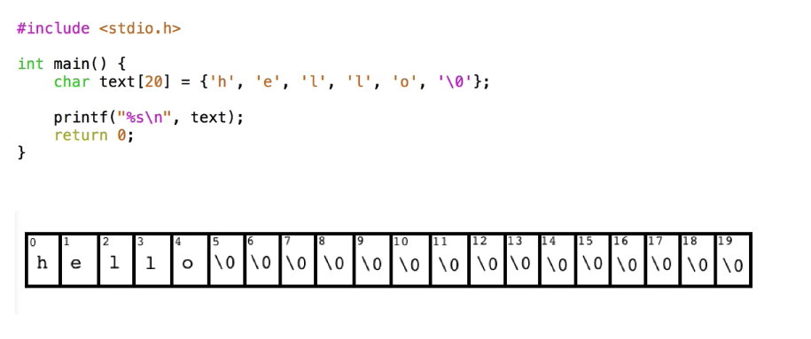

2. Give the characters of string in double quotes
  + `char text[20] = "hello";`
  + illegal for string initializer to be longer than size of char array
  + LEGAL for the array and initializer to be of same size
    + source of bugs!!! No space for compiler to add `'\0'`

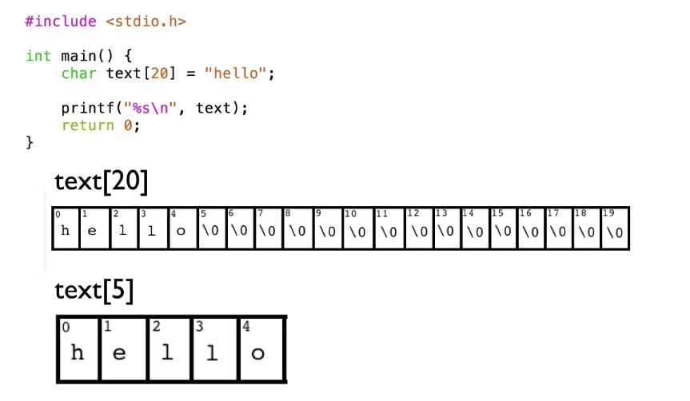

3. Shortcut to declare Initializing strings, by omitting array size completely
  + `char text[] = "hello";`
  + compiler will allocate char array with enough space for each character of initializer plus `'\0'`
  + Note the size of `char *text` is fixed during execution of program


String literal
+ `char *text = "hello"`
  + `text` points to first element in the string
+ a constant that cannot be changed
  + i.e. `text[0] = 'j'` causes runtime error because string literal not mutable
+ may be confused with double-quote initializer for string


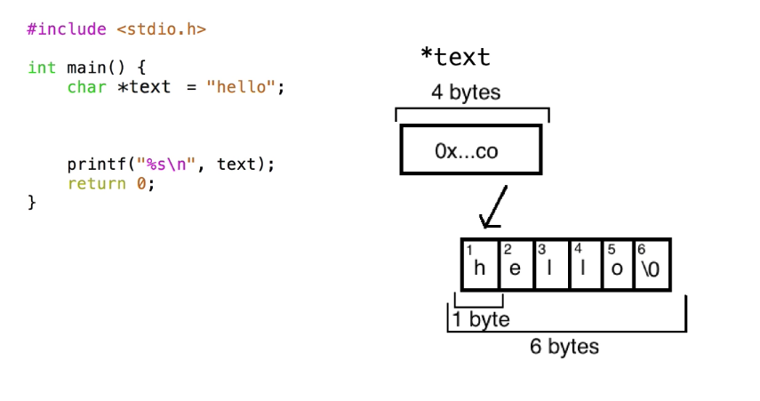

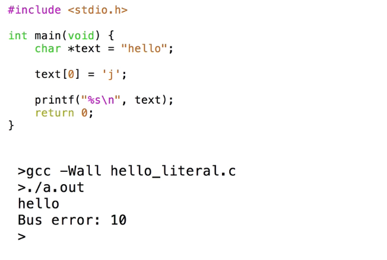


_Size and length of string_

Number of characters in string variable
+ `sizeof(char *str)`
  + always gives number of bytes occupied by array
  + a compile time operation
  + `char str[10];` will have a `sizeof(str)` of 10


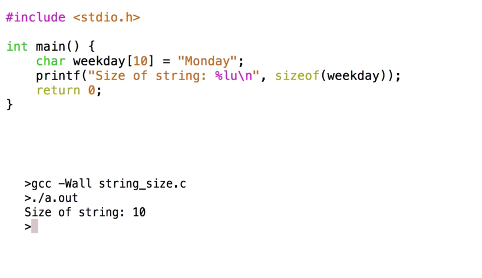


Concatenation
+ concatenation with `ptr_1 + ptr_2` simply adds up memory address of pointers

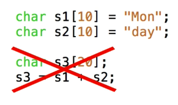


C string function
+ `#include <string.h>`


`size_t strlen(const char *s)`
+ returns number of characters `size_t` in string `s`, excluding null termination characters


_string copy_

Copy
+ essentially overwrite what was previously there

`char *strcpy(char *s1, const char *s2)`
+ copies character from `s2` to begining of `s1`, overwrites what was at start of `s1`
+ `s2` but not `s1` is required to be a string
  + either a string literal
  + or a char array with `'\0'`
+ an unsafe operation, when `s2` copies to `s1` of insufficient size
  + raise error or
  
  + without error
  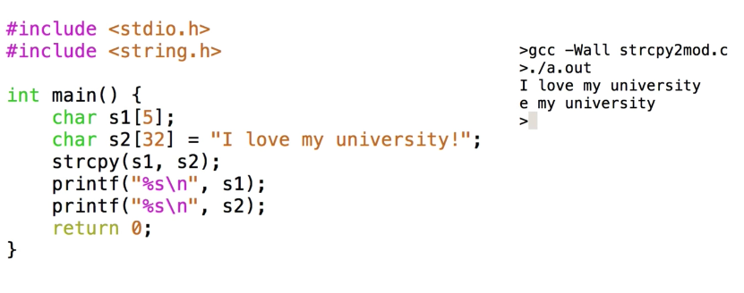

`char *strncpy(char *s1, const char *s2, int n);`
+ safer alternative with `n`
+ `n` indicates maximum number of char that `s1` can hold
  + hence an upper limit of how many chars can be copied over

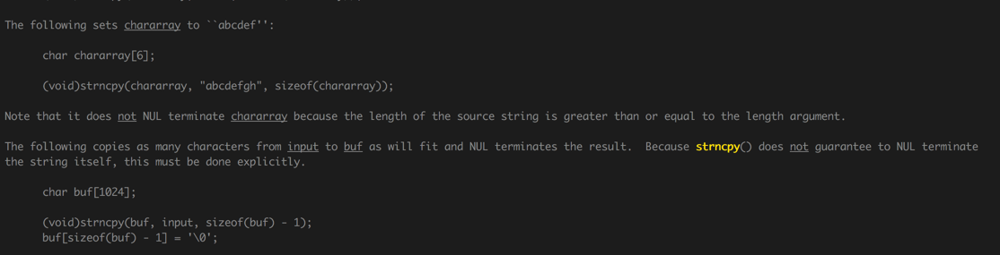

`strncpy(s1, s2, sizeof(s1));`
+ also unsafe because not guanrantees to add `'\0'`, unless it finds one in the first `n` characters of `s2`
  + i.e. when length of `s2` is larger or equal to sizeof `s1`


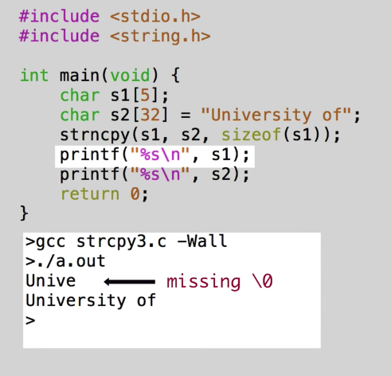


+ ensures `s1` ends with `'\0'` be explicitly adding it

Concatenation
+ adding to the end of what was previously there

`char *strcat(char *s1, const char *s2);`
+ both `s1` and `s2` are required to be strings prior to calling
+ also unsafe


`char *strncat(char *s1, const char *s2, int n);`
+ maximum of character, not including null, that should be copied from `s2` to end of `s1`
+ always adds `'\0'` terminator (unlike `strcpy` or `strncpy`) only if there is sufficient space for it.
  + so reserve space by setting up `n` well


+ `sizeof(s1) - strlen(s1) - 1` size of `s1` minus what was in there already and `1` for terminating `'\0'`


_Search Strings_


`char *strchr(const char *s, int c);`
+ `s` is the string to search  
+ `c` is the char to search for in `s`
+ search left to right and return a pointer to character found or null if not found


`char *strstr(const char *s1, const char *s2);`
+ searches from left to right for first occurence of substring `s2` in string `s1`
+ returns pointer to `s1` that begins the match to `s2` if found, otherwise `NULL`


---

__Challenges__


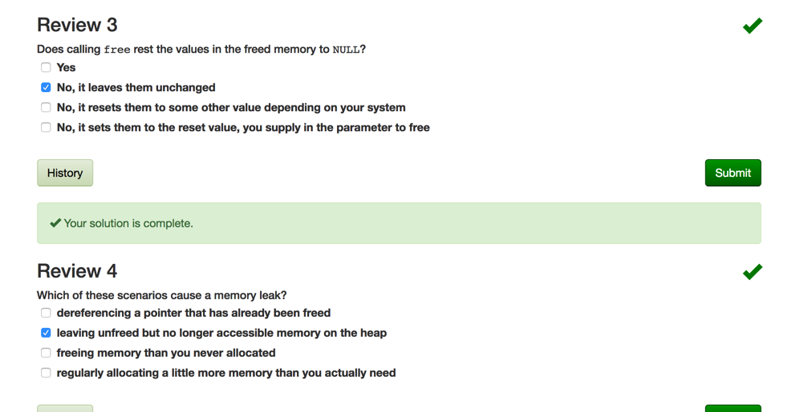


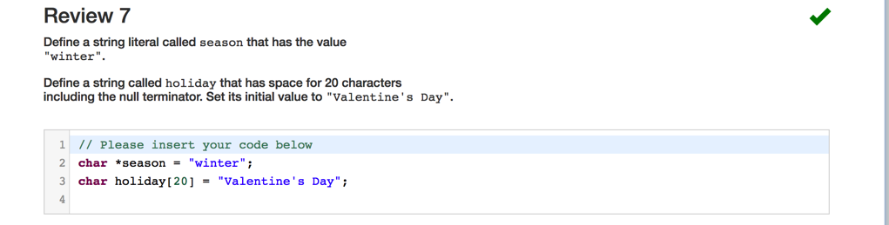


+ note `strlen` count number of character up to but not including the first `'\0'`


