__Struct__

Array: a list of values of same type   
Struct: a collection of values of possibly different type

Differences
+ Array
  + All _element_ must be of same type
  + requires declaration of number of elements in array, i.e. size
  + array index for access
+ Structure  
  + All _member_ can be different type
  + requires to list the name/type of each member
  + dot notation for access


+ `student` is a structure tag
  + gives struct type a name
+ body declare member of struct


+ Declaration of variable of type `struct student`
  + `struct student good_student;`
  + `struct` keyword required
+ Initialization of member of structure
  + `strcpy(good_student.first_name, "joe");`
  + initialization of string with `strcpy`


__Structs in Functions__


Array
+ Pass by reference, i.e. the first pointer to the first element of the array
+ therefore the function mutates the original array as desired


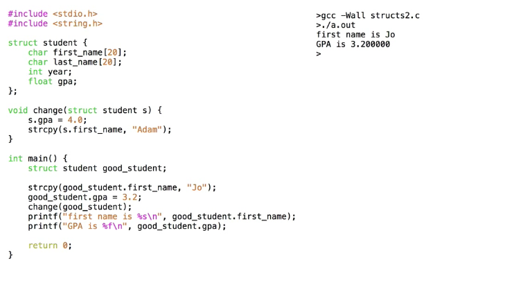


Struct
+ Pass by value, i.e. the function gets a local copy of the struct.
+ therefore the function cannot mutate the original struct, changes are applied to the local copy only
+ Note that the entire struct is copied, including arrays (which is pass by reference by themselves)


 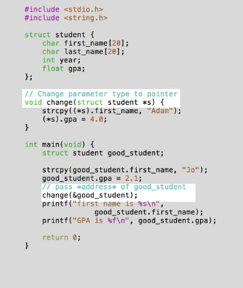

Retain changes to struct by a function

1. Return `struct` from function
  + the modified copy of struct is returned
  + disadvantage being 2 copies are created
    + once when calling the function
    + once when assigning the return valuer to original struct variable

2. Pass pointer to `struct` as function parameter
  + avoid copying struct

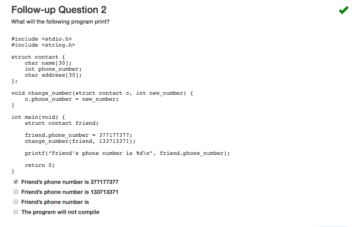


__Pointers to Structs__

+ `struct student *p`
  + a pointer to `s`
+ NOTE!! uninitialized pointers cannot be dereferenced, since it does not point to an allocated space.
  + so do `p = &s`

`(*p).gpa = 3.8`
  + `*p` in bracket because dot has higher precedence than star, so have to mark star to happen first.
  + `(*p).gpa` is equivalent to `p->gpa`


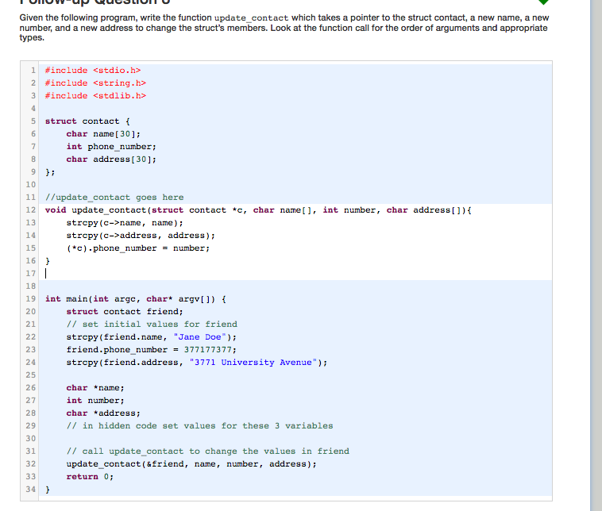


---

__Stream__
+ types
  + input stream: a source of data that provides input to program
  + output stream: destination for data output by program

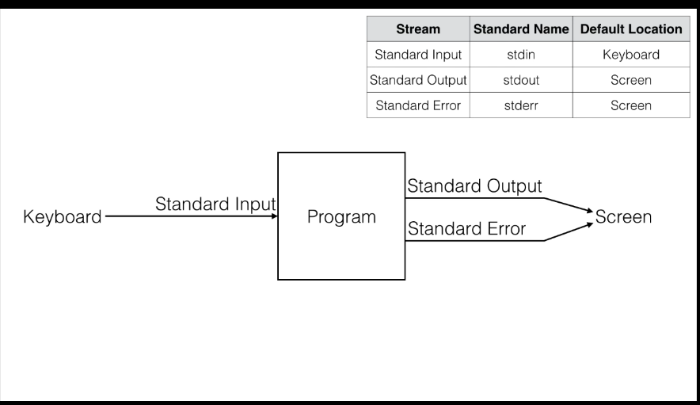


`scanf`
+ reads from an input stream called _standard input_
  + which by default is the keyboard

`printf`
+ data is written to _standard output_
  + which by default is the screen
+ cannot write anywhere else other than sdtout,
  + `fprintf` sends output to stream that user specify

_standard error_
+ another _output stream_ that is the screen by default


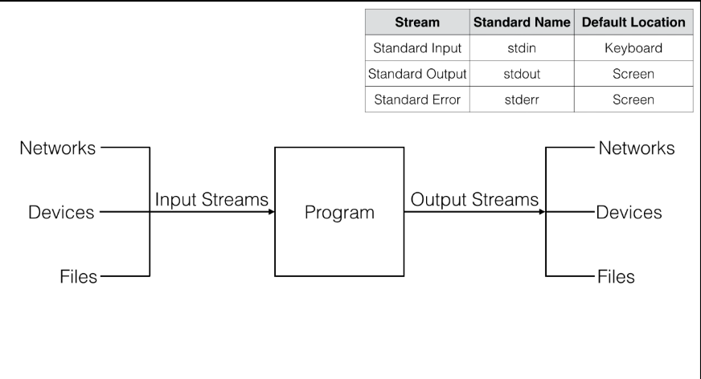


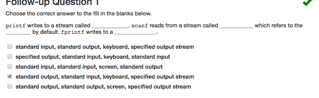


__Redirection__

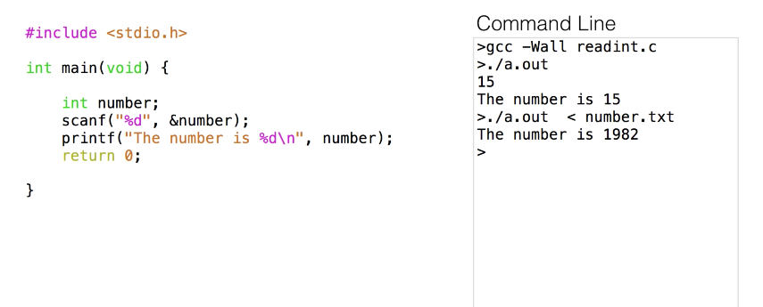


input Redirection
+ redirecting `stdin` to read from the file `number.txt` instead from keyboard in this case

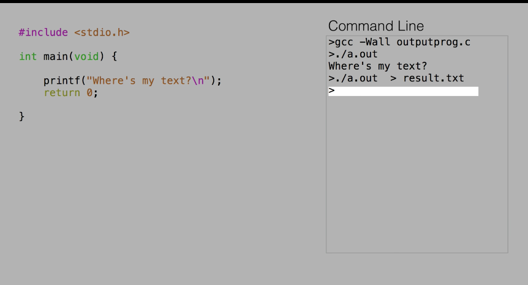


output Redirection
+ redirecting `stdout` i.e. output of a program to go into a file rather than screen in this case
  + if file exists, ` > foo.txt` will overwrite `foo.txt`

the biggest limitation is only one file is possible for redirection: use c FILE instead


---

__Files__

motivation
+ variable does not persist after program terminates
+ files are tool for retaining result and read in new data


`FILE *fopen(const char *filename, const char *mode);`
+ open a file and make it available as a stream !
+ `mode` specifies how files are opened
  + `r` -- read
    + `filename` must exists
  + `w` -- write; write to beginning of file
    + an empty file will be created if not exist
  + `a` -- write; append to file
+ `FILE *`
  + a pointer referring to file in file system
  + used for close / read / write
+ failure
  + file might not exist or the right permission to open the file
  + returns `NULL`
    + remember to check for this and do `fprintf(stderr, "error opening file")`
    + and `return 1;` for program terminate with error

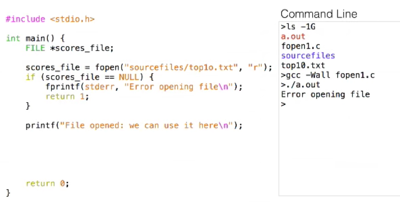


`int fclose(FILE *stream)`
+ closes file
+ returns `int`
  + nonzero value for failed  
  + `0` for success


`char *fgets(char *s, int n, FILE *stream)`
+ read text or complete lines of data
+ `char *s`: a pointer to memory where text can be stored
  + i.e. char array or memory allocated by `malloc`
+ `int n`: the max number of char allowed to put in `s`, including a null character `\0` at the end of string
  + i.e. if `n=5`, the `fgets` read 4 chars end string with `\0`
  + so `fgets` reads at most `n-1` chars...
+ `FILE *stream`: source of data
+ return value  
  + `char *s` if success
  + `NULL` otherwise
+ note `fgets` stops at end of line character `\n`; `scanf` stops at space..


+ the loop uses `fgets` to read every line in the file, assuming a maximum line length of 80


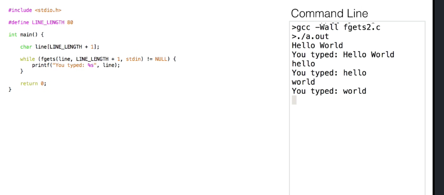

`fgets` read from `stdin`


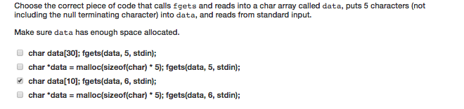


`int fscanf(FILE *stream, const char *format, ...)`
+ a stream-reading function that can read from any stream
  + compare to `scanf` which reads from `stdin` only
  + both stops reading at space
+ `FLIE *stream`: stream from which to read
+ returns number of items successfully read
  + which is equal to the number of format specifiers, unless something goes wrong

+ format
  + `%80s`: a string of at most 80 chars
  + `%80s %d`: want to read a space, its possible!
    + `name` instead of `&name` because `name` is an array pointer

`gets()`
+ an unsafe version of `fgets()`


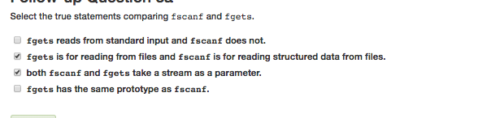


__Writing__


`fopen("file.txt", "w")`
+ original file deleted if exists


`fprintf`
+ outputs to different streams


_I/O_
+ when program writes to stream, it is writing to a location in memory controlled by the OS.
  + the location is periodically written to file on disk
    + only at this moment!
  + the contents of file will be what is written
+ In case of _lose power_
  + cannot predict if `printf` finishes.
  + therefore file I/O and `stdout` is not good for debugging
    + `printf` and `stdin` may not behave properly if program crashes prematurely
  + use `gdb` instead


`int fflush(FILE *stream)`
+ ensures key modification made to stream are there
+ requests OS to write any changes that are in its buffer


+ create `FILE *` for input and output file
+ use `fopen` to open file stream   
  + check error for `NULL`
+ use `scanf` to read from file
+ use `fprintf` to write to file
+ use `fclose` to close file stream
  + check error for nonzero `int`


---

__Low Level I/O__

> All file contain binary data (bytes = 8bits)

Text file
+ bytes interpreted as human-readable text


Binary file
+ non-human readable
  + i.e. music / image
+ not directly viewable or editable
+ opens binary file with an additional mode `b` with `fopen`


__read and write binary__


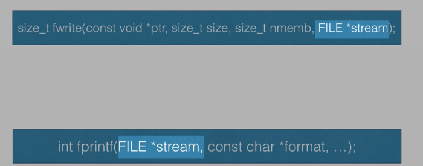

`size_t fwrite(const void *ptr, size_t size, size_t nmemb, FILE *stream)`

+ `const void *ptr`: pointer to data that we want to write
  + i.e. pointer to array
  + pointer to variable
+ `size_t size`: size of each element writing to file
+ `size_t nmemb`: number of elements writing to file
  + 1 for a variable
  + the number of element in array for array
+ `FILE *stream`: file pointer to write to
  + an opened stream in binary mode
+ return value: number of elements successfully written to file, or 0 on error


__Writing variables to binary file__

Note character (i.e. `'s'`) is human readable regardless if its text / binary file


__Writing arrays to binary file__

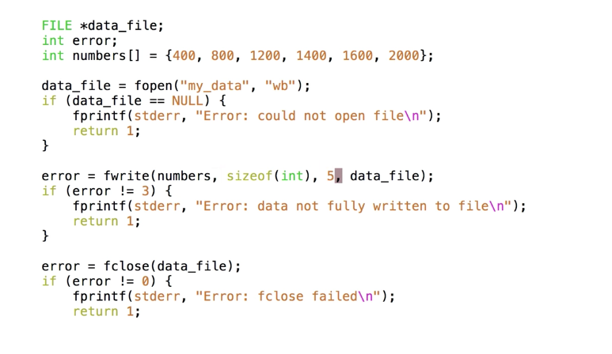


`size_t fread(void *ptr, size_t size, size_t nmemb, FILE *stream)`
+ `void *ptr`: pointer to memory where data from file will be stored
+ `size_t size`: size of one element
+ `size_t nmemb`: number of element to read
+ `FILE *stream`: stream to read from
+ return value: number of element successfully read from file
  + if 0:
    + end of file reached
    + error


+ note `fwrite` takes a `const void *ptr` because it writes data from memory to file so will not be modified. However, `fread` writes data from file to memory so parameter cannot be `const`


__Reading variables from binary file__


__Reading array from binary file__

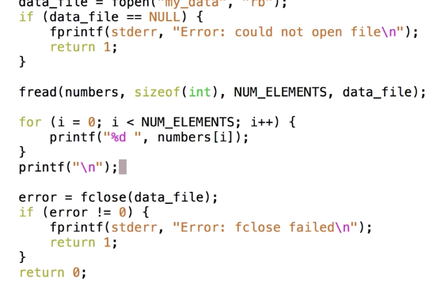

__How different computer handle binary file__

Endianness
+ the sequential order used to numerically interpret a range of bytes in computer memory as a larger, composeds word value.
+ little endian format
  + digit read from left to right
  + least significant byte stored first
+ big endian format (networks)
  + digit read from right to left
  + most significant byte stored first

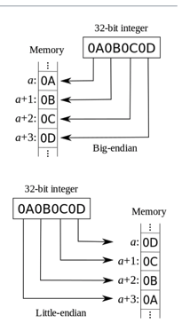

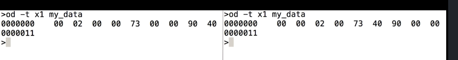


__Wav files__
+ stores sound data
+ header
  + 44 byte of data
  + contains info about the file, including parameters
+ body of one or more 2-byte integers  
  + each is called a _sample_
  + sample many thousands of times per second


`od`
+ file viewer for binary files
+ `-A` translate from base 8 to base 10
+ `-j 44` skips header
+ `-t d2` file consists of two-byte values
+ note here the entire file is `84` byte


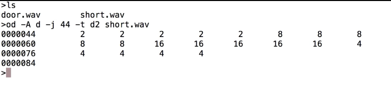

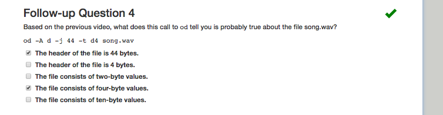


__Manipulate Wav File__

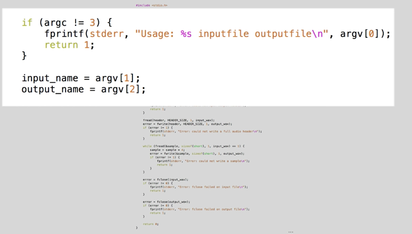

opens file in binary mode

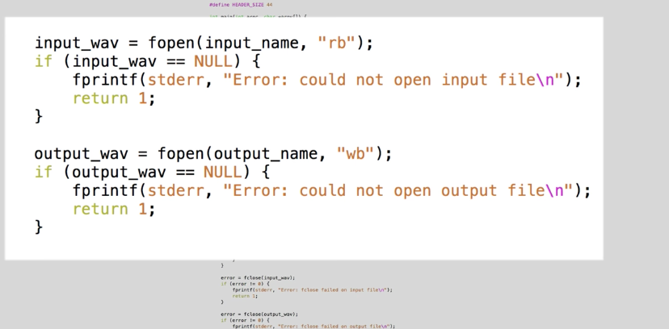

read header from input file and copy to output file

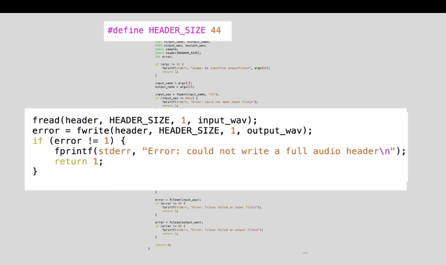

increase volume by multiplying sample by 4


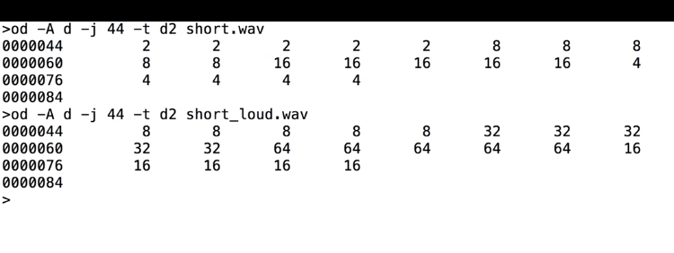


__Reading and writing structures__

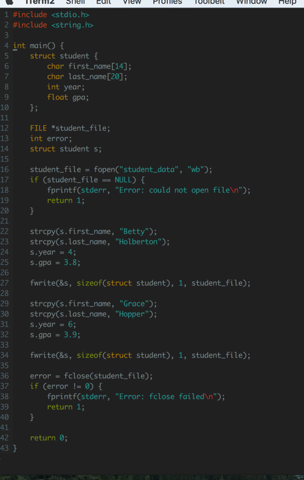

create 2 structs and write to binary file


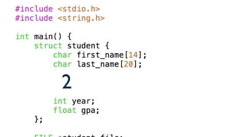

Use `sizeof` instead of manually
+ since C insert space between members of struct
  + for example, most computer requires integer start on an address that is a multiple of 4, so compiler will insert 2 byte of padding after characters to make it happen


+ use `od -A d -t u1`
  + `u1` for unsigned decimal value since chars are one byte
  + we see that ASCII for `66 101 116 116 121 0` = `Betty\0`
+ hence we see that `fwrite` places all 14 bytes of first name even though we use the first 6!!


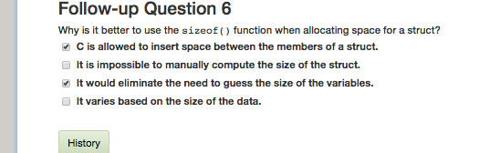

__Moving around in file__

Note every open file maintains current position
+ determines where next call of `fread` / `fwrite` starts
+ `fread` / `fwrite` also moves the file position


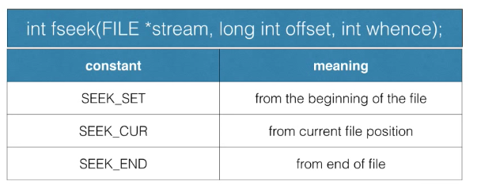

`int fseek(FILE *stream, long int offset, int whence);`
+ `FILE *stream`: stream whose position want to change
+ `long int offset`: byte count indicating how much file position to change
+ `int whence`: how second param interpreted
+ return value
  + 0: error if passing in invalid stream pointer
    + can be avoided if check call to `fopen`


```
fseek(file, 50, SEEK_SET)     // move file position to 50th position
fseek(file, 50, SEEK_END)     // move file position to 50th byte before end of file
fseek(file, 10, SEEK_CUR)     // advance by 10
fseek(file , -10, SEEK_CUR)   // move back 10
```

Error
+ say call `fseek(file, 50, SEEK_END)` but file 10 byte long.
  + `fseek` success but subsequent `fread`, `fwrite` will fail


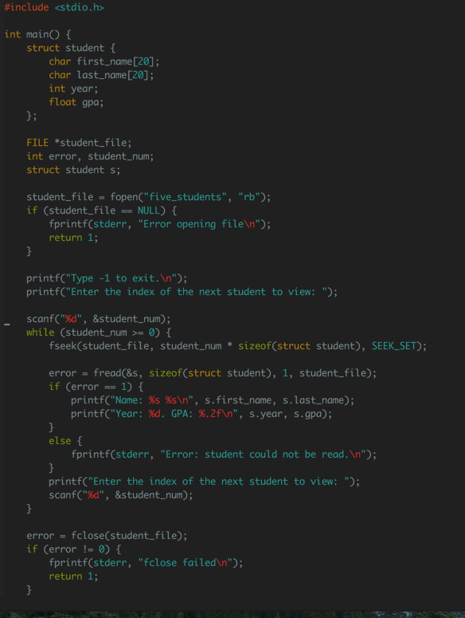


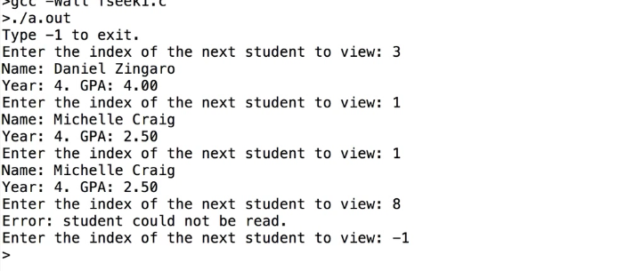

+ `fseek` is useful when handling large data set
  + loading all data into memory is bad idea!


`void rewind(FILE *stream)`
+ moving to beginning of file
+ equivalent to
  + `fseek(my_file, 0, SEEK_SET)`


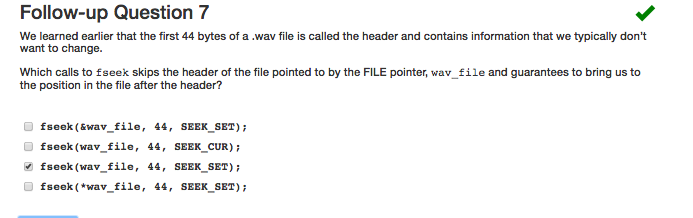


---

Inclass

`int stat(const char*file_name, struct stat *buf)`
+ requires allocating memory for stat struct before passing it to stat
+ `struct stat` contains many fields


`DIR *opendir(const char *filename);`
