## __Unbuffered I/O__
+ IO via file stream
  + `fopen`, `fclose`, `fgets`, `printf`, `fwrite`
  + buffers data
    + i.e. read or write larger blocks of data, then OS send at all at once
    + amortize cost of data transfer by reducing sys calls

+ FILE struct holds all the data that the file system code needs to implement buffering.
+ a single `write` call is generated
  + 
  + `3` : a _file descriptor_

_file descriptor_
+ representing open file / open communication channel
+ OS use file descriptor as index to a table of open files
+ `0, 1, 2` points to `stdin`, `stdout`, `stderr`
  + 

+ `int open(const char *path, int oflag, ...);`
+ operates on file descriptors

`estrace`
+ trace what sys calls made in library calls

---

##__Pipe__

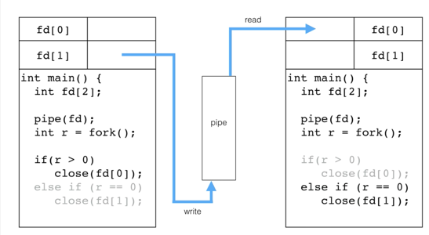
+ parent write to pipe and child read from pipe; after done close channels not in use.

+ unidirectional inter-communication channel for connecting processes
+ as an array of two file descriptors `fd[]`
  + two file descriptor opened for
    + `fd[0]`: reading from pipe
    + `fd[1]`: writing to pipe
+ communication over different processes
  + `fork` duplicates `fd[]`
  + child processes inherits all child processes
  + close `fd` not in use
  + send data over pipe

+ when all the write file descriptors `fd[1]` on the pipe are closed, a `read` on the pipe will return `0` indicating that there is no more data to read from the pipe.
+ The child process uses this to detect when the parent is finished writing lines to the pipe.
  + 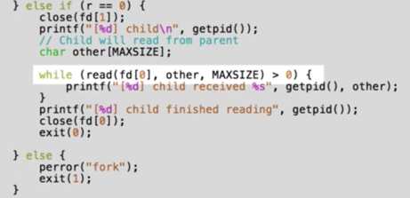
  + This loop terminates when
    + the parent closes the write end of its file descriptor.
    + error returns -1
+ in the end, close read file descriptor (or by system, when program terminates)

+ `pipe` comes before `fork`
+ `read` call return 0 if write end of pipte are closed and all data are read from the pipe

---

##__Concurrency and Pipes__

Producer (write) and Consumer (read) Problem:
  + processes won't run in lockstep with each other
  + 
    1. prevent producer from adding to a full queue
      + `write` will block if pipe is full
      + SIMULATION: multiple `write` to pipe before one `read` and use redirection from file to fasten `write`
        + 
      + Consumer has to consume before data `write` to pipe;
        + 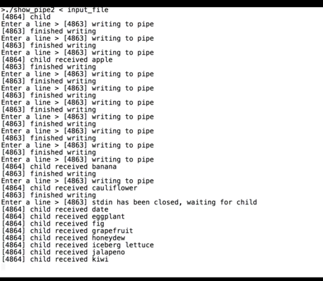
    2. prevent consumer remove from an empty queue
      + `read` will block if pipe is empty
    3. producer and consumer operate on queue simultaneously
      + OS manages pipes; so only one process is modifying it at a time

---

##__Redirecting Input and Output with Dup2__

`grep L0101 student_list.txt | wc `
+ `grep` outputs to `stdout` by default.

`grep L0101 student_list.txt > foo.txt `
+ here we are redirecting `stdout` to a file
  + achievable with `dup2` by making a copy of open file descriptor and use it to reset the `stdout` file descriptor to direct to an open file

`int dup2(int fildes, int fildes2);`
+ resets `fildes2` to refer to the same file object as `filedes`
  + i.e. if `fildes2` is already in use, it is first deallocated as if `close` has been called.
+ makes `fildes2` a copy of `fildes`.
  + if `fildes` is not valid file descriptor, call fails and `fildes2` not closed
  + if `fildes` is a valid file descriptor, and `fildes2` has the same value as `fildes`, then `dup2` does nothing and returns `fildes2`
+ returns
  + new file descriptor `filedes2`
  + -1 on failure. `errno` set

`int fileno(FILE *stream)`
+ returns file descriptor for file stream

`int open(const char *path, int oflag, ...)`
+ file name specified by path open for reading and/or writing
+ return value
  + file descriptor
  + -1 on failure

`int close(int fildes)`
+ deletes a descriptor from the per-process object reference table.

##__shell redirection__

1. shell fork a new process, child obtains a copy of file descriptor table
  + File table is inside of PCB; therefore different child processes, having duplicate PCB, have their own `fd` table inherited from parent
  + however they are pointers, hence may be pointing to the same object
    + changes to console will be observed by both processes
  + 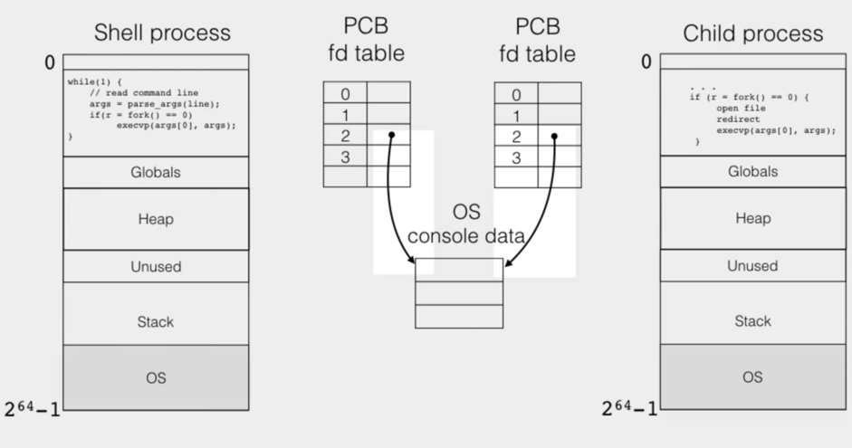
2. child runs, opens a file for storing output.
  + `filefd = open("day.txt", O_RDWR | S_IRWXU | O_TRUNC)`
    + open for reading and writing
3. call `dup2(filefd, fileno(stdout))`
  +  extract file descriptor with `fileno` of `stdout` of type `FILE *`
  + now file descriptor 2 will point to newly opened file, rather than the console.
  + 
  + Because will not write to file other than with `stdout`
    + `close(filefd)`
4. now when child process calls `exec`, shell program running grep will have its `stdout` go to file rather than console.

---

##__Implementing shell pipe operator__
+ connect two processes so that `stdout` of one process is the `stdin` of the other process

Note
+  `STDIN = STDIN_FILENO` or `fileno(stdin);`

steps
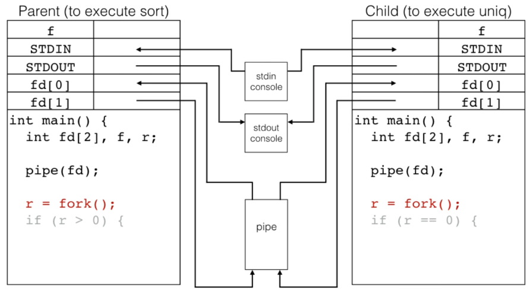
  + file descriptors are inherited

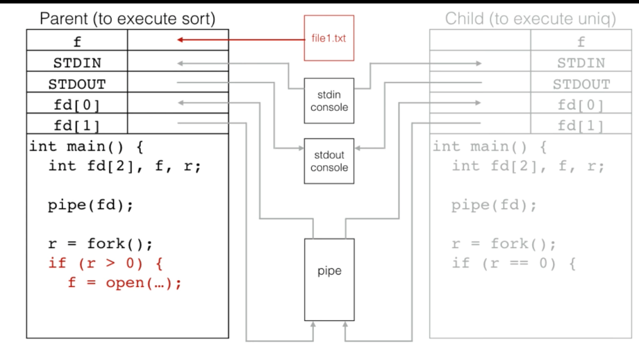
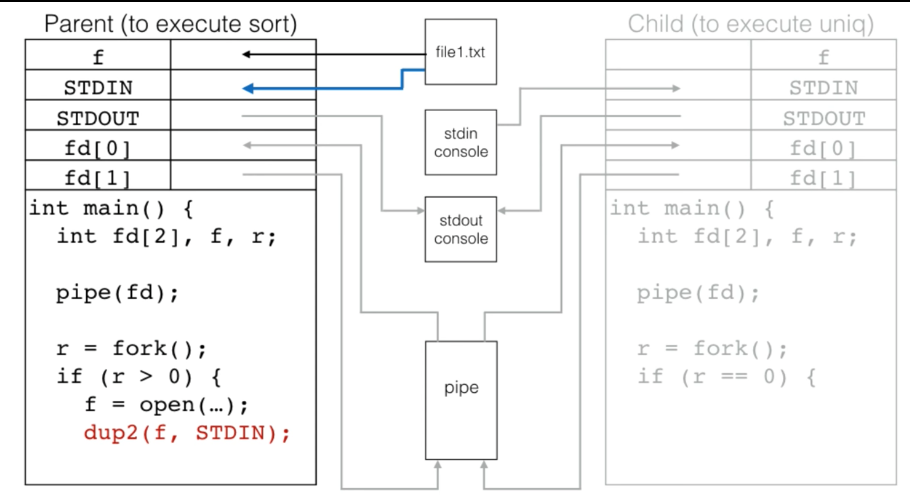
  + reset `STDIN` so that input comes from file

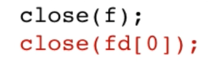
  + `fd[0]` closed because parent process is writing to instead of reading from pipe  

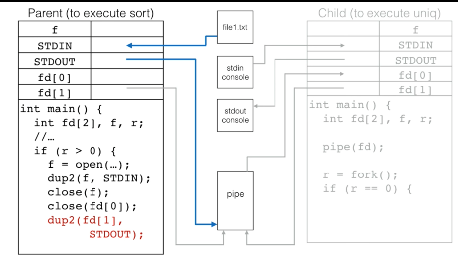
 + resets `STDOUT` so that outputs to pipe

 
+ close `fd[1]` because process will not be writing to pipe directly, but are redirected previously using `dup2`
+ if not close `fd[1]`, read end would not know when there is nothing to more read.

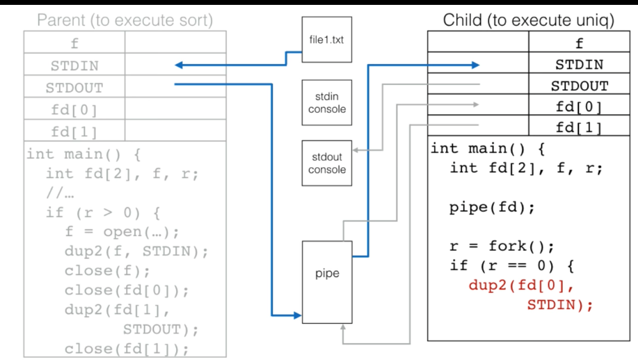
+ connects `STDIN` to read end of pipe
  + so that `read` from `stdin` will be coming from pipe

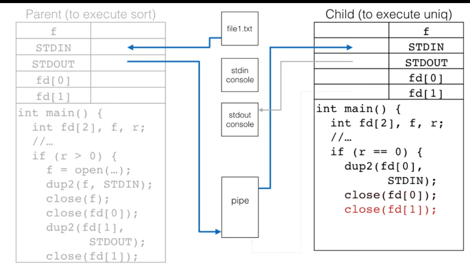
+ closes `fd[0]` because will not be using this file descriptor to read from pipe
  + use `stdin` instead
+ close `fd[1]` because process will not be writing to pipe

+ load executable with `exec` in parent and child,
  + preserves file descriptors

+ if parent calls `open` after `fork`, newly created file descriptor is not shared to child.
+ call `fork` after `pipe` for pipe to have correct file descriptor open in both processes.
