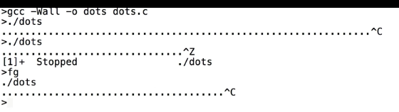
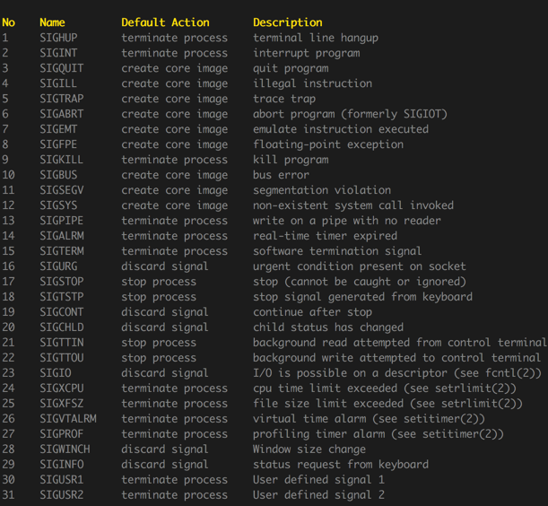
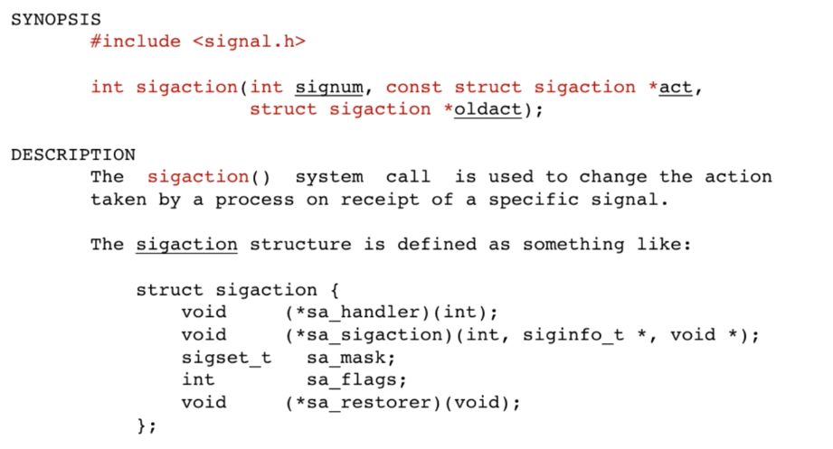
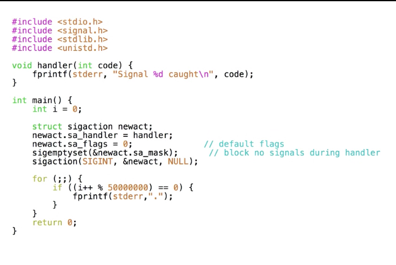
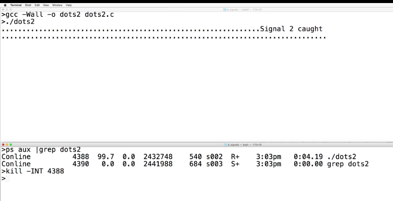
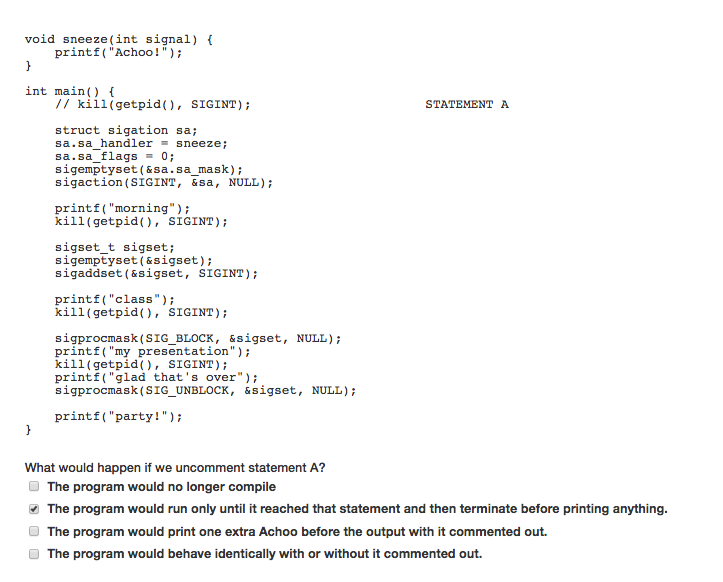
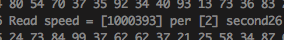

__Signals__

# Intro to Signals




+ prints dots to `stderr`, in foreground


Signals
+ mechanism that allows a process or OS to interrupt a currently running process and notify it that an event has occurred
+ identified by a number between 1 and 31, and defined constants are used to give them names. Each associated with a default action that the process receiving the signal will normally perform.
  + 
  + `SIGINT`
    + sent to process upon `control c`
    + default action: process terminates
  + `SIGSTOP`
    + sent to process upon `control z`
    + default action: process suspend execution
  + `SIGCONT`
    + sent to process upon `fg`
    + default action: suspended process continues


`kill` (terminal)
+ sends a signal to the process specified by `pid`
+ `kill -signal_name pid` or `kill -signal_number pid`


`int kill( pid_t pid, int sig );` (library function)
+ sends the signal specified by `sig` to `pid`.
+ mostly sending signal to children.


+ signal can be sent to a process from commandline so doesnt have to be a chilld / parent of the sending process


---

# Handling signals

change default action, or ignore signal


+ PCB contains a signal table
  + each signal (1 ~ 31) contains a pointer to code (_signal handling function_) that will be executed when OS delivers the signal to the process.



`int sigaction(int signum, const struct sigaction *act, struct sigaction *oldact);`
+ assigns an action for a signal specified by `signum`.
+ modifies signal table so user-specified function is called instead of default
+ `signum`: number of signal going to modify
+ `act`: pointer to struct `sigaction` initialized beforehand
+ `oldact`: pointer to struct which is filled up by OS, containing current state of the signal handler before changing it.  
  + may be useful to save previous state of the signal


`struct sigaction`
+ `sa_handler`: pointer to signal handling function we want to install


+ `sigemptyset(sigset_t *set);`: initializes a signal set to be empty
  + no other signals are blocked...
+ `sigaction(SIGINT, &newact, NULL);`: installs handler for `SIGINT` signal   



+ Since `exit` not called in handler. Control returns back to process at the pointe where it was interrupted. So dots starts printing again


+ signals whose default action cannot be altered.
  + `SIGKILL`: cause process to terminate  
  + `SIGSTOP`: suspends the process


+ _installing a signal handler_ means writing a `sa_handler` function and call `sigaction` with function pointer as an argument (in field of `struct sigaction *`)




---


```c

if(write(fileno(stdout), &num, sizeof(long)) == -1){
  fprintf(stderr, "reader is closed")
  exit(1);
}

```

If parent child process `write` to pipe, and we terminated the process during

----


Request
+ IPv4: 4 number separated by dots
  + IPv6: ... proposed not really widely used today

Domain name service
+ given name find address
+ ask
  + local name server
  + root name server
  + `org` name server
  + delegate server

HTTP
+ high level protocol


TCP/IP
+ transmission control protocol
+ tells us how to package up the data
  + HTTP content is within the packets
+ 3-way handshake SYN
  + malicious attack, not sending return signal making server hangs, (denial of service attack)
+ make packets, each given a header with sequence number and checksum
  + each send to the same address but maybe via different route


Client-server model


Routing
+ Request routes may be over several hops


size
+ 30kBytes -> 20 IP packets
  + 8 (DNS) + 20 * 15 (routing) = 308

If packet does not arrive
+ reason
  + traffic overload
  + bit corruption
+ TCP congestion control  
  + decrease window size (outstanding packets) grow until packet loss


----


## Exercises


+ `test_file` has 100 random integer from 0 to 100


Signal mask
+ The collection of signals that are currently blocked is called the signal mask.
+ each process has its own signal mask



+ read speed is fairly constant


+ by removing the print statement, the read speed more than doubles


+ write speed (i.e. `fopen(f, 'r+')`) is approximately half that of read (i.e. `fopen(f, 'r')`)
+ Hence write operation is more expensive,


+ the speed of write to different file size are approximately equal
