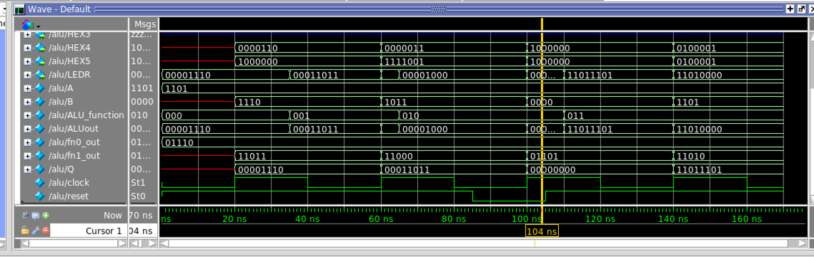
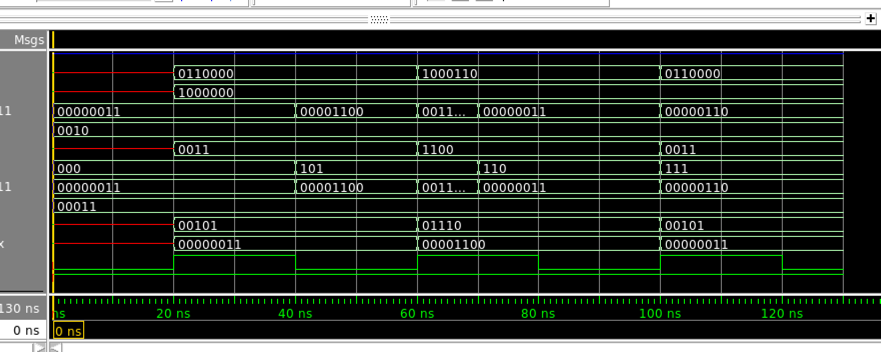
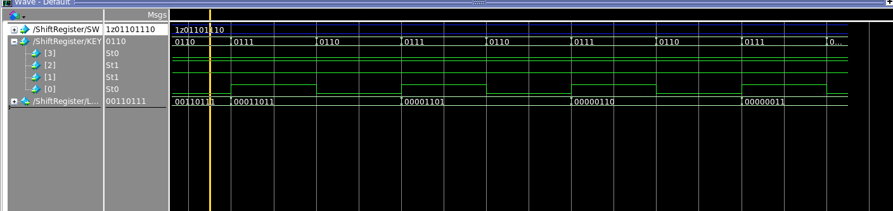

M

Part II posedge active-low reset D latch connected to alu

testing the first 4 functions

testing the last 3 shift and multiplicatin functions

---

Part III

__Shift register__
+ In digital circuits, a shift register is a cascade of flip flops, sharing the same clock, in which the output of each flip-flop is connected to the 'data' input of the next flip-flop in the chain, resulting in a circuit that shifts by one position the 'bit array' stored in it, 'shifting in' the data present at its input and 'shifting out' the last bit in the array, at each transition of the clock input.

__logical right shift__

If reset=0 (i.e. active): no signal recorded in register

WITHOUT resetting on the first cycle

with reset

__arithmetic right shift__

