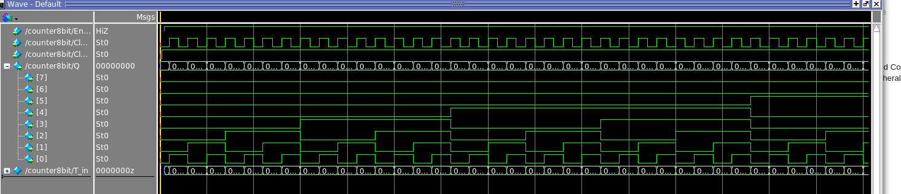
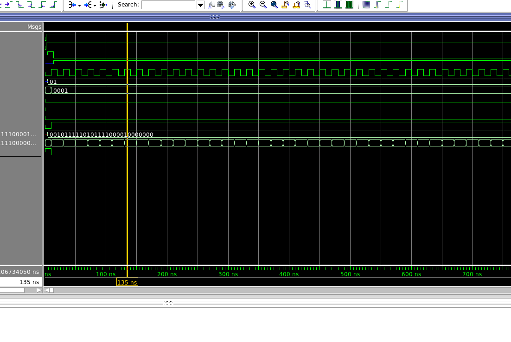
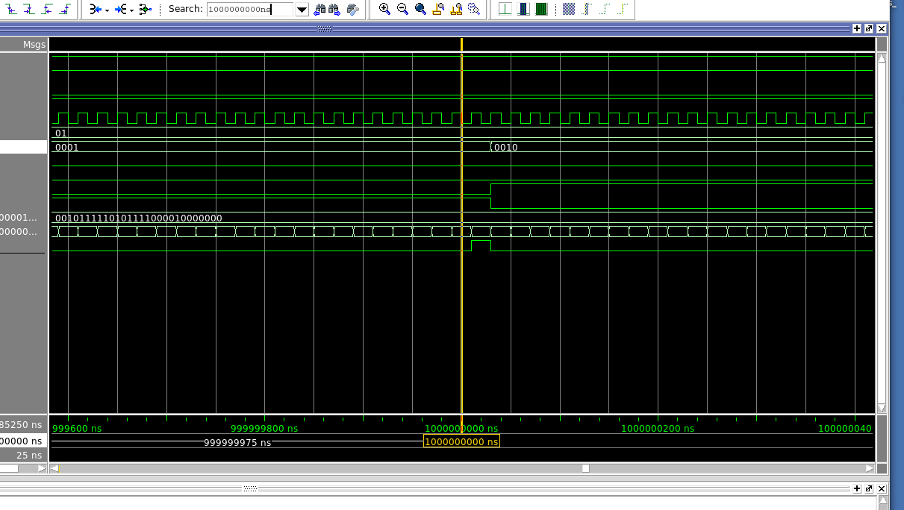
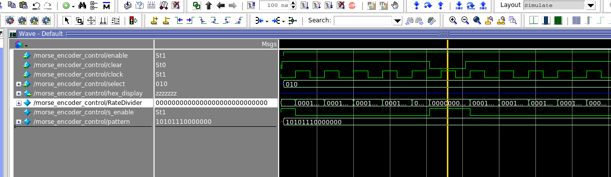

__PART1: 8 bit counter__

Logic Utilization and regiter used

maximum clock frequency

RTL viewer: how quartus synthesized the circuit

__Part II: Frequency reducer__

Since clock cycle is 20ns / posedge. Then time needed for next flash is 5 X 10^7 X 20 = 1s. We do see a change here

__Part III: morse encoder__

+ test rate counter clear and load behave expectedly
test alu look up grabs value

+ test shift register

+ test that rate divider working properly
+ shift_state remain constant for 1000ns tested

