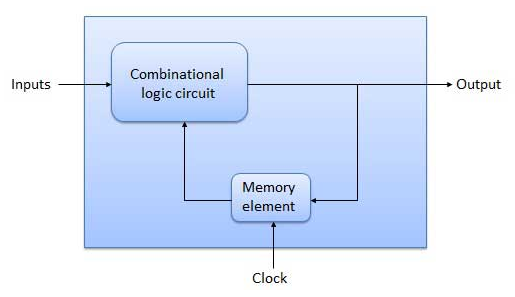
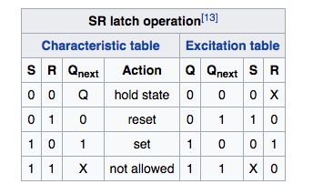
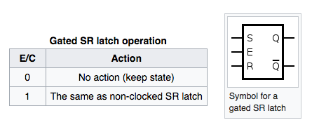
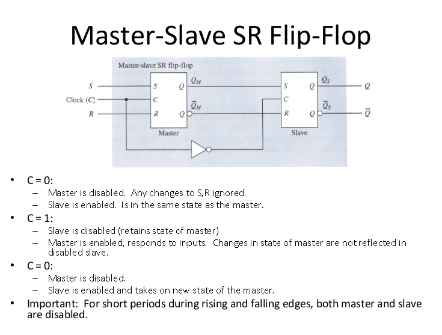
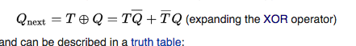

__Sequential Circuits__
+ A clock (or clock generator) generates a sequence of repetitive pulses called the clock signal which is distributed to all the memory elements in the circuit. The basic memory element in sequential logic is the flip-flop. The output of each flip-flop only changes when triggered by the clock pulse, so changes to the logic signals throughout the circuit all begin at the same time, at regular intervals, synchronized by the clock.

+ The output of all the storage elements (flip-flops) in the circuit at any given time, the binary data they contain, is called the state of the circuit. The state of a synchronous circuit only changes on clock pulses. At each cycle, the next state is determined by the current state and the value of the input signals when the clock pulse occurs.

+  The logic gates which perform the operations on the data require a finite amount of time to respond to changes to their inputs. This is called propagation delay. The interval between clock pulses must be long enough so that all the logic gates have time to respond to the changes and their outputs "settle" to stable logic values, before the next clock pulse occurs. As long as this condition is met (ignoring certain other details) the circuit is guaranteed to be stable and reliable. This determines the maximum operating speed of a synchronous circuit.

__Latches__

+ The `R = S = 1` combination is called a restricted combination or a forbidden state because, as both NOR gates then output zeros, it breaks the logical equation Q = not Q.

__Clock__
+ In electronics and especially synchronous digital circuits, a clock signal is a particular type of signal that oscillates between a high and a low state and is utilized like a metronome to coordinate actions of digital circuits.

__Clocked SR Latch__

__D Latch__

+ This latch exploits the fact that, in the two active input combinations (01 and 10) of a gated SR latch, R is the complement of S. The input NAND stage converts the two D input states (0 and 1) to these two input combinations for the next SR latch by inverting the data input signal. The low state of the enable signal produces the inactive "11" combination. Thus a gated D-latch may be considered as a one-input synchronous SR latch.

__SR master-slave flip-flop__

+ A master–slave D flip-flop is created by connecting two gated D latches in series, and inverting the enable input to one of them. It is called master–slave because the second latch in the series only changes in response to a change in the first (master) latch.

__D flip-flop__

+ he D flip-flop is widely used. It is also known as a "data" or "delay" flip-flop.

The D flip-flop captures the value of the D-input at a definite portion of the clock cycle (such as the rising edge of the clock). That captured value becomes the Q output. At other times, the output Q does not change.[22][23] The D flip-flop can be viewed as a memory cell, a zero-order hold, or a delay line.[24]

_disadvantage of a single D latch_  
+ combinatoric logical circuit that connects output of D latch to input of D latch immediately changes the state in the latch
+ we want to instead let state persists until the next clock signal

__T flip-flop__
+ If the T input is high, the T flip-flop changes state ("toggles") whenever the clock input is strobed. If the T input is low, the flip-flop holds the previous value. 

+ Achieved with an additional XOR gate

