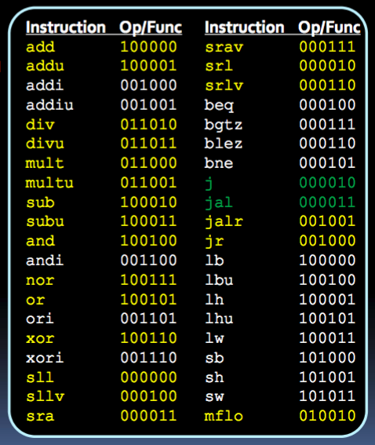
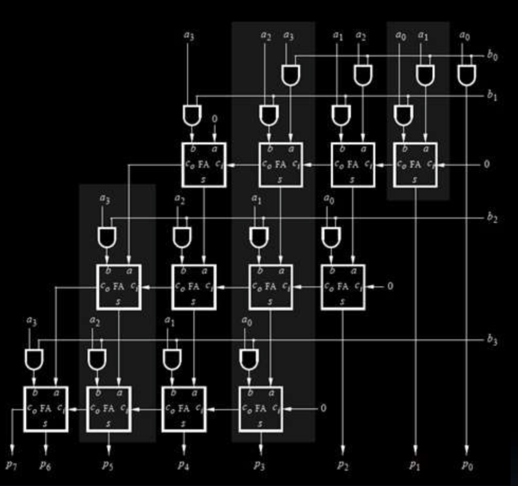
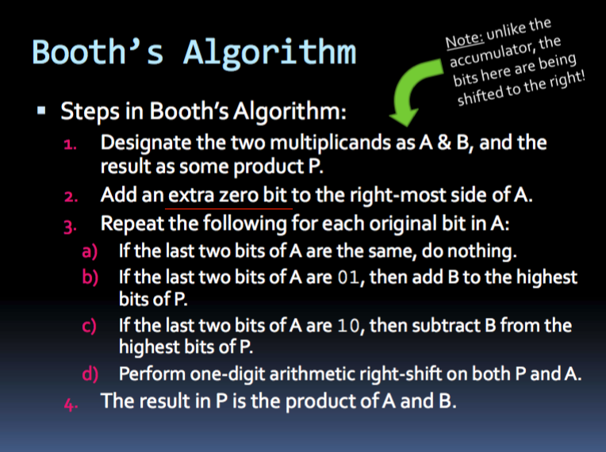

__Microprocessor__
+ The microprocessor is a multipurpose, clock driven, register based, digital-integrated circuit which accepts binary data as input, processes it according to instructions stored in its memory, and provides results as output.

__Datapath__
+ definition
  + a collection of functional units, such as ALU or multiplier, that performs data processing, registers, buses
  + illustration of how data flows between processor components during executino of operation
+ components
  + _ALU_
    + arithmetic unit: perform addition, subtraction, increment, decrement, multiplication etc..
    + logical unit: perform comparison, logical AND, OR ...
    + using a select bit to choose whichever

__Control unit__
+ definition
  + component of CPU that directs operation of processor. Tells memory, ALU, and I/O devices how to respond to program instruction
  + An _FSM_ that controls datapath by reading instruction and sending appropriate signals
+ components
  + _instruction register_
    + holds the instruction currently being executed or decoded. Each instruction to be executed is loaded into the instruction register which holds it while it is decoded, prepared and ultimately executed, which can take several steps.
  + _memory data register_
    + Contains the data to be stored in the computer storage (e.g. RAM), or the data after a fetch from the computer storage. It acts like a buffer and holds anything that is copied from the memory ready for the processor to use it.
+ __Instruction__
  + Definition
    + 32-bit (or 64-bit on 64-bit architectures) binary strings, encoding operation to perform, and detail needed.
    + Stored in `.text` segment of memory (separate from `.data` segment)
    + `main:` is first instruction to be executed
  + Execution
    1. _Fetch_ instruction from memory and place it to instruction register
    2. _Decode_ instruction type, determine how to perform instruction
    3. _Execute_ instruction
      + read value from any register needed from _register file_
      + access memory if needed to read/write data
      + write back any data needs to be stored in memory/register
    4. _Move_ to next instruction
  + _Program Counter (PC)_
    + stores location (memory address) of current instruction
    + _assumption_
      + _byte-addressable memory_: memory where every byte has its own unique address.
      + 32 bit (4 bytes) on 32-architecture. (8 bytes on 64-bit architecture)
    + _update_
      + Normally, Increment by 4 each time
      + Loop/function calls, may jump to location in memory by output of ALU
  + _Instruction decoding_
    + specified in _instruction set architecture (ISA)_
      + _MIPS ISA_, a specific implementation
        + a load-store architecture, where values have to be loaded from memory to register in one instruction and then operated upon in the next instruction
    + _instruction register_
      + takes in 32-bit instruction fetched from memory
      + first 6 _opcode_ specify instruction type
      + 
    + _instruction type_
      + __R type__
        + 5-bit `rs` and `rt` for source register
        + 5-bit `rd` for destination register
        + 5-bit for `shamt`
        + 6-bit 000000 `opcode` and 6-bit `funct`
        + register type for operation on registers only
      + __I type__
        + 5-bit `rs` and `rt` for source register
        + 16-bit `immediate`
          + immediate operand
          + branch target offste
          + displacement ofr memory operand
      + __J type__
        + 6-bit `opcode`
        + 26-bit `address`:
          + 31~28: same as current bits in program counter
          + 29~2: are 26 bits provided
          + 1~0: always 0 since instruction is word aligned.
        + `j` for jump or `jal`: jump and link

__Storage Unit__
1. program counter, instruction register
2. _register file_: fast memory, allow fast read/write
  + is a set of registers and a decoder.
  + requires
    + address: inputs to decoder that activates a single row in register file
      + `n`-bit address holds `2^n` different addresses
      + _read_: register that holds desired value; _write_: destination register
    + data input when _write_ is enabled
  + _Read/Write_ control signal
    + _read_: Use a mux with address as select inputs, which selects corresponding output from a register.
    + _write_: If `write` enable is high, `n`-bit address decoded and `load` signal for corresponding register accepts `data_in`
3. _main memory_: larger grid of memory cells used to store info processed by CPU.
  + consists of a decoder and rows of memory units
  + terminology
    + `2^m` rows where `m` is the _address width_
    + each row contains `n` bits, `n` is the _data width_
    + _size of memory_: `2^m * n / 8` bits = `2^m * n / 8` bytes
  + _one hot decoder_
    + takes `m`-bit binary address and activates a single row in memory array
  + _storage cells_
    + each row made of `n` storage cells, each stores a single bit of info
    + _RAM cell_: a type of flip-flop circuit
  + _Bus_
    + Definition
      + a communication system that transfers data between components inside a computers
      + Used to connect CPU and memory
  + _tri-state buffer_
    + allows an output port to assume a high impedance state in additional to 0 and 1 logic levels, effectively removing output from the circuit.
    + allows multiple circuit to share same output line (i.e. bus) while preventing outputs colliding to each other.
    + _only one can write to a bus at a time_
    + 
    + 
      + If `R/W'` is high (i.e. _read_) and `Memory_Enable` is high, `data` assumes `data_out`
      + If `R/W'` is low (i.e. _write_), `data` serves as source for `data_in` during write.
  + _RAM memory interface_
    + input _address port_: address-width bits wide
    + input _Write Enable_: select to read/write
    + input _data_in_: data to store in memory if write-enable is high
    + output _data_out_: data read from memory if write-enable is low

+ __Asynchronous SRAM interface__
  + note
    + SRAM is enabled only if `CE'` chip enabled' is 0 (`CE` is 1)
    + there will be valid output only if `OE'` output enabled' is 0 (`OE` is 1)
  + _read_
    + 
    + `t_AA`: _Address Access Time_ time for address to be stable before reading data values
      + i.e. time after address change to when data is valid for read
    + `t_OHA`: _Output Hold Time_ time output data is held after change of address
  + _write_
    + 
    + `t_AW`: _Address width time_ Time that write signal is high
    + `t_SA`: _Address Setup Time_ Time for address to be stable before enabling _write_ signal
    + `t_SD`: _Data Setup to Write End_: Time for `data_in` to be set-up at destination for write
    + `t_HD`: _Data Hold from Write End_: time `data_in` should stay unchanged after write signal change

---

_Multiplication_
+ layered rows of adder circuits
  + based on how multiplication is carried out by hand.
  + 
+ accumulator circuit
+ Booth algorithm
  + operations
    + when 2 neighboring digits are different
      + 01 -> multiplicand added to result at position of 0
      + 10 -> multiplicand subtracted from result at position of 1
  + hardware
    + compare neighbouring bits in lowest position of A, and look for missmatched pairs in A by shifting A to right one bit at a time
    + 
