__MIPS__
+ approach
  + determine data source and destination
  + determine path of data
  + deduce signals causing the path
    + read/write
    + mux
    + non-essential gets `X` dont care value

_Incrementing PC_
+ analysis
  + PC is the source and the destination
+ signals
  + read/write:
    + `PCWrite`: 1 (`PCWriteCond`: X)
  + mux:
    + `PCsource`: 0 (from ALUout)
    + `ALUsrcA`: 0 (PC)
    + `ALUsrcB`: 1 (4)
  + others: read/write all 0, others X
    + `ALUOp`: 001 (add)
    + `IorD`: X
    + `MemRead`: 0
    + `MemWrite`: 0
    + `MemToReg`: X
    + `IRWrite`: 0
    + `RegWrite`: 0
    + `RegDst`: X

_MIPS ISA_
  + definition
    + _Microprocessor without Interlocked Pipeline States_
    + a type of RISC (reduced isntruction set computer)
    + a type of reduced instruction set commputer ISA
  + there are 32 registers
    + `$zero`: register 0. value 0
    + `$at`: register 1. reserved for assembler (pseudocode i.e. `bge`)
    + `$v0, $v1`: register 2-3, return values
    + `$a0-$a3`: register 4-7, function args
    + `$t0-$t9`: register 8-15, 24-25, temporaries
    + `$s0-$s7`: register 16-23, saved temporaries
    + `$gp, $sp, $fp, $ra`: register 28-31. memory and function support
    + register 26-27: for OS kernel.
    + `PC, HI, LO`: not directly accessible
      + `HI` and `LO` for multiplication and division
  + instruction
    + `<instr> <param>`
    + all 32-bit (4 bytes) long
    + instruction addresses are divisible by 4

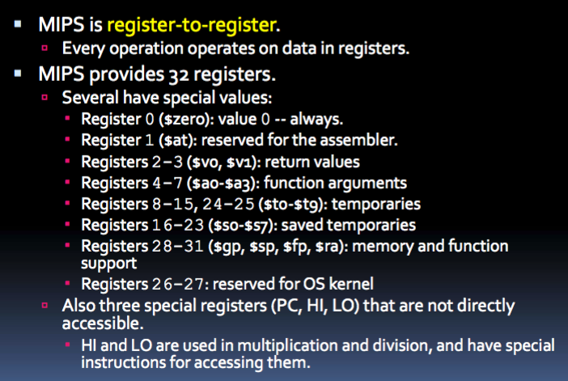

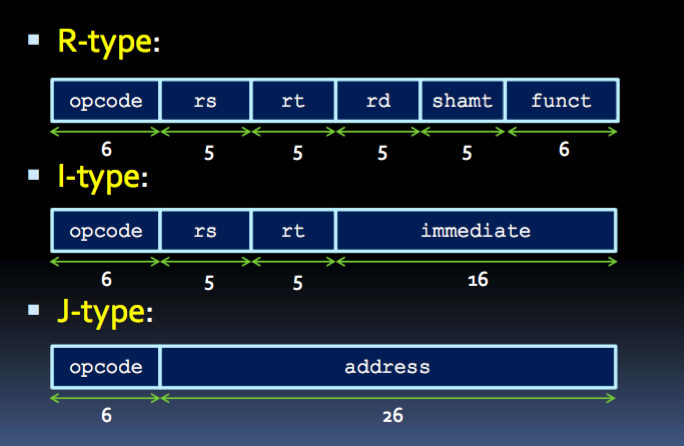

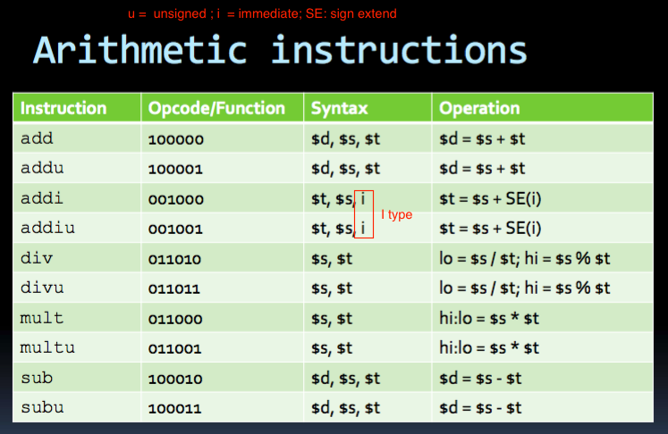
+ _arithmetic_
+ unsigned (`u`): ignores overflow
+ `addi`:
  + adds sign extended constant
  + used to copy one register to another (`addi $1, $2, 0`)
+ `mult`:
  + equivalent to `(HI, LO) = (64-bit) $s * $t`
+ `div`:
  + puts 32-bit result in `LO` and 32-bit reminder in `HI`

+ _Move_: Operating on `HI` and `LO` registers
+ move from (`mf`) vs. move to (`mt`)
+ note `$d` is specified as destination and `$s` as source for moving to and from `HI` or `LO`

+ _Logical_
+ `ZE(i)`: upper 16-bit are padded with 0

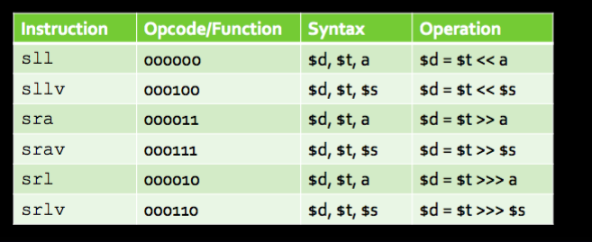
+ _shift_
+ shift left(`sl`) vs. shift right(`sr`)
+ logical (`l`) vs. arithmetic (`a`)
+ variable number of bits (`v`) specified by `$s` to be shifted vs. number of bits specified by `shamt`
+ `sll`
  + shift left logical by `shamt` number of bits

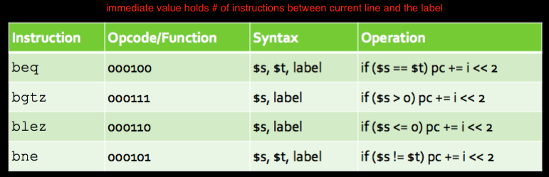
+ _branch_
  + _branch is taken_ is branch condition met.
+ calculate `i`, immediate value is
  + an offset between location of current instruction and target of the branch in memory, measured in _# of instructions_, not # of bytes
  + `i = (label location - current PC) >> 2`
    +  (last 2 bit of PC irrelevant since its word aligned, divisible by 4 always)
+ `beq`
  + go to instruction at specified address if two registers are equal.

+ _jump_
  + `j label`
    + `PC = PC + 4[31:28] | label << 2`
    + jump to instruction at specified `addr`
  + `jal`
    + used to call subroutine. `$31` or `$ra` holds return address
  + `jr`
    + jump to address contained in the specified register
    + could jump even farther away.. since no restriction on first 4 bit of address being same as PC. Could jump to anywhere

+ _comparison_
+ `slt`
  + set on less than
  + test if one register is less than the other and store the outcome 1 for true 0 for false at destination register
+ `slti`
  + test if one register is less than a constant

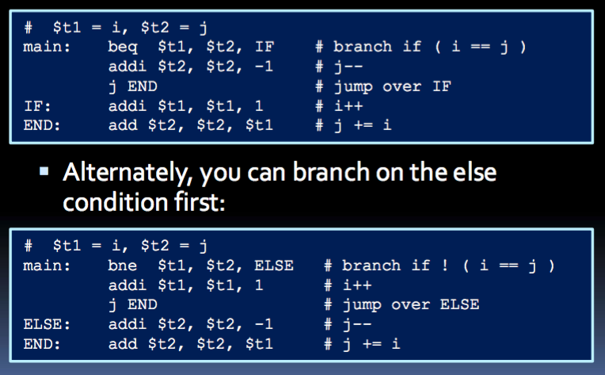

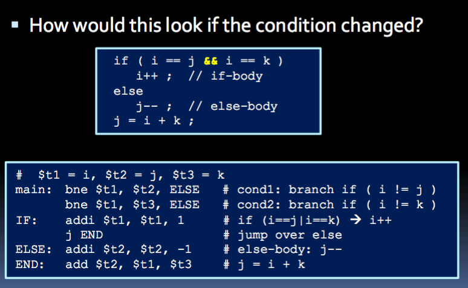
+ remember to `j END` in IF

+ _memory_
  + overview
    + I-type.
    + 
    + `instr $t, i($s)`
  + types
    + _load_: load a value from memory to register
    + _store_: write data from register to memory
  + length of data
    + `b` for _bytes_ (8-bit); `h` for _half word_(16-bit); `w` for _word_ (32-bit)
  + signed (`SE`) vs. unsigned (`ZE`)
  + `LB` means lower 8 bit. `LH` means lower 16 bit.
  + _offset_ `i`
    + useful for stack parameters, when multiple value is needed from a given memory location
  + alignment
    + word access (`lw` or `sw`) should be word-aligned (divisible by 4)
    + half word access should involve half-word aligned addresses (even addresses)
+ _Endian_
  + little endian: Least significant byte has smaller address
  + big endian: Most significant byte stored first (at `x`). 2nd most significant digits stored at `x+1`
    + same order as memory address
  + MPIS are bi-endian. Most computer is little-endian
  + 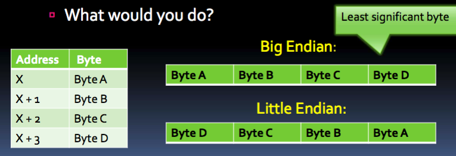
  + 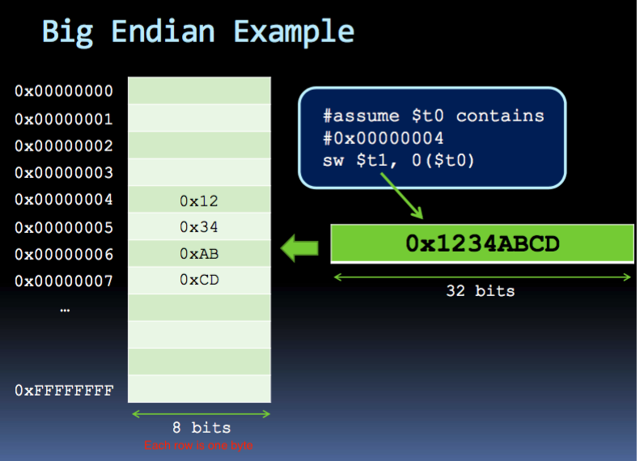
  + 
+ _trap_
  + send sys calls to OS,
  + a sync interrupt caused by exceptional conditions
  + 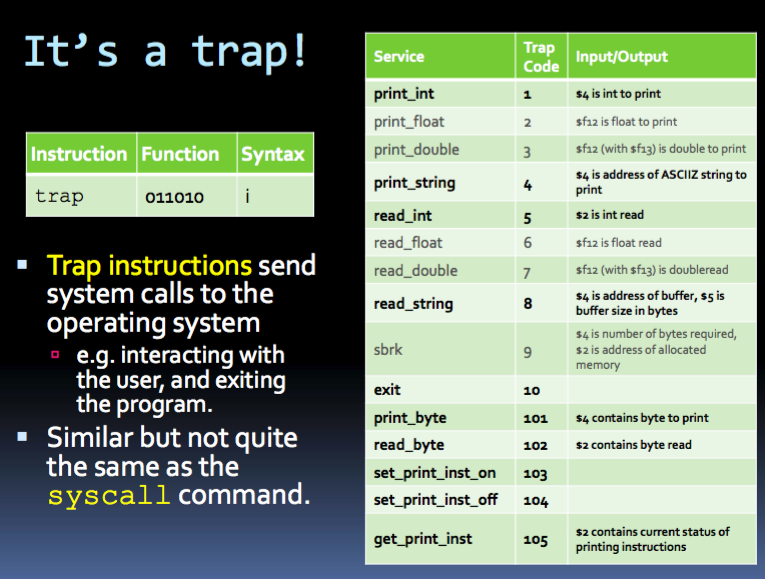
+ _memory segment_
  + `.data`: start of data declaration
    + Create labels for memory locations that are used to store values
    + `label: .type value`
    + 
  + `.text`: start of program instructions
  + `main:`: initial line to run

__Pseudo-instructions__
+ definition
  + convenience
  + assembler translates them into 1 or more MIPS assembly instructions
  + no _opcode_
+ `la`:
  + `la $d, label` loads register `$d` with memory address that `label` corresponds to.
  + implemented with
    + `lui $at, immediate`: load upper 16 bits of memory address `label` corresponds to.
    + 
+ `bge $s, $t, label`
  + branch to label iff `$s >= $t`
  + implemented with
    + `slt $at, $s, $t`: set `$at` to 1 if `$s < $t`
    + `beq $at, $zero, label`: branch if `$at == 0`, i.e. `$s >= $t`

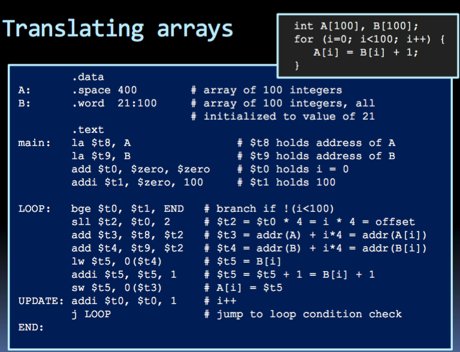
+ _Arrays_
  + definition
    + consecutive location in memory
    + address of array is address of array's first element.
  + Access
    + `i`-th element, Add `offset = i * sizeof(element)` to address of first element to get address of `i`-the element
      + `offset` is measured in bytes
    + Fetch array from memory and store to register
    + store back to memory

+ _struct_

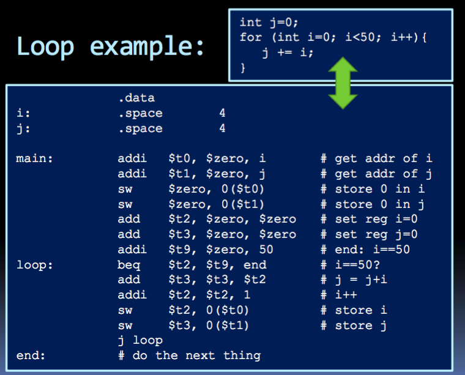
+ _loop_

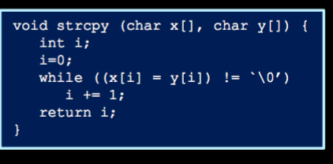
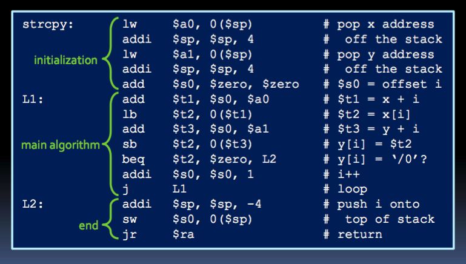
+ note
  + `$a0` is for function args
  + dont have to calculate offset, since its a char array, each element is of size 1 byte
  + `jr $ra`: subroutine finished. so jump to return address `$ra` set before by `jal`

_function_
  + specification
    + communicate function args and return values
    + store variables local to that function (use stack!)
    + return to calling site
  + 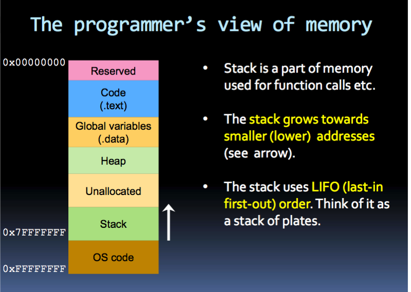
    + _stack_
      + grows towards smaller addresses
      + LIFO
  + _stack pointer_
    + points to last element pushed onto the top of stack
    + `$29` or `$sp`
    + operations
      + _pop_: do load. De-allocate space by incrementing `$sp`
      + _push_: allocate space by decrementing `$sp`, and then store
    + 
    + 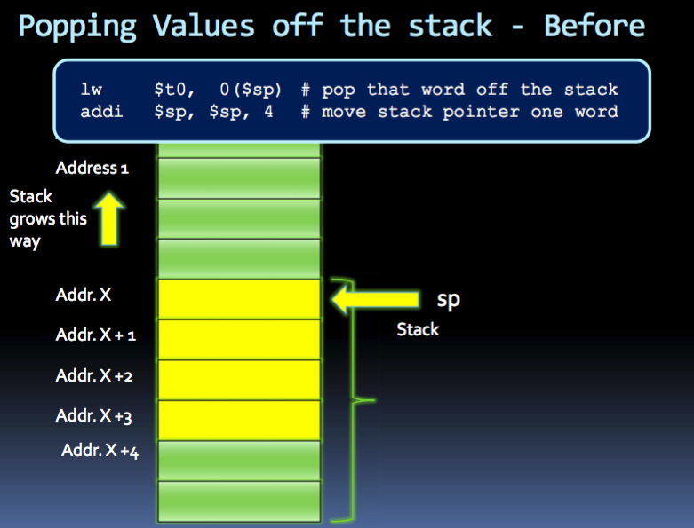
    + 
    + 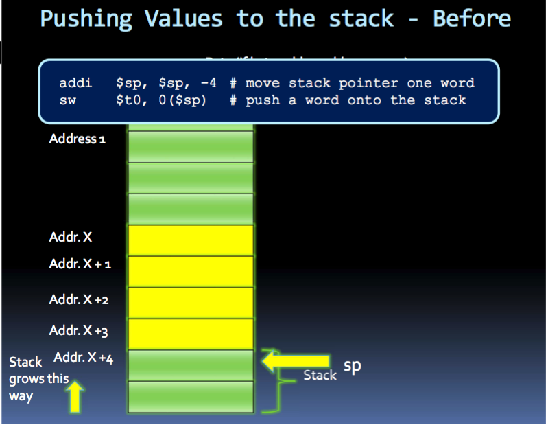
    + 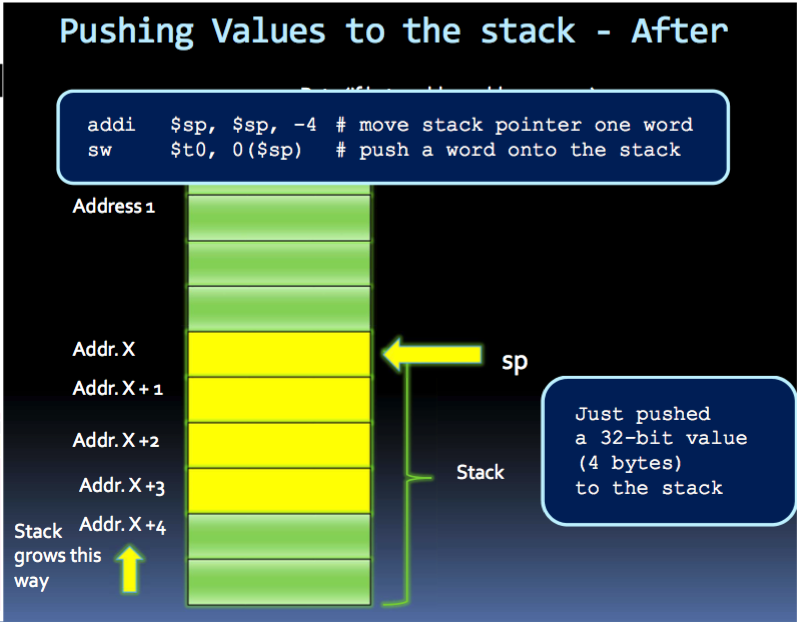
    + 
      + For pop/push more than 1 item, can de-allocate/allocate all space and then pop/push
  + convention
    + `$v0, $v1`: register 2-3 holds return values
    + `$a0-$a3`: register 4-7 holds function args
      + push all args to stack, or
      + use `$a` if # of args less than 4 and stack otherwise
  + _definitions_
    + _caller_: function that is calling others
    + _callee_: function being called
    + _caller-saved registers_: `$t0-$t9` registers that the caller should save to stack before calling a function. If not saved, there is no guarantee the contents of the registers will not be modified
    + _callee-saved registers_: `$s0-$s7`: saved temporaries. Responsibility of callee to save these registers if it's going to modify them
  + _jump usage_
    + _calling function_:
      + `jal FUNCTION_LABEL`
      + after set appropriate `$a0-$a4` and/or pushed args to stack
      + `jal` updates `$ra = PC + 4` and also `PC -> label`
    + _return from function_
      + `jr $ra`
      + set `PC` to address in `$ra`
    + 
    + 
  + _nested function_
    + problem: `$ra` is overridden by subsequent function calls
    + solution:
      + store `$ra` in stack. (different `$ra` for different function on stack)
      + stack: also to store function args, return values, and register values
    + _caller vs. callee calling convention_
      + _caller-saved register_ (`$t0 - $t9`)
        + caller should save before calling function
        + push them onto stack before calling another function and restore immediately after function returns
      + _callee-saved register_ (`$s0 - $s7`)
        + callee should save these registers and later restore them, if you plan to modify them (in function body)
        + push them to stack is first thing in function body and restore them just before `jr $ra`

+ __Recursion__
  + solution: stack
    + before recursive call, store register value onto stack, restore them when come back to that point.
    + also store `$ra`
  + steps
    1. pop `x` off stack (function arg)
    2. check if `x == 0`
      + if true, push `1` onto stack and _return_ to calling program.
      + if false, push `x-1` to stack (as function arg) and _call_ factorial again
    3. after recursive call, pop result off stack and multiply value that `x`
    4. push result onto stack, _return_ to calling program

_Interrupt_
+ definition
  + when external event requires a change in execution (i.e. overflow, syscall, undefined instruction)
  + usually signaled by external input wire, checked at end of each instruction
+ 2 ways
  1. _polled handling_
    + processor branches to address of interrupt handling code, which has instruction that check cause of exception, which branches to handler code section depending on type of _cause register_
      + 
    + if original program can resume, handler will return to program by calling `rfe`
    + otherwise, stack dumped and execution continue elsewhere
  2. _vectored handling_
    + processor branch to a different address for each type of exception. Each exception addr separated by only one word. A jump instruction is placed at each of these addresses for handler code for that exception
    + MIPS used this 
