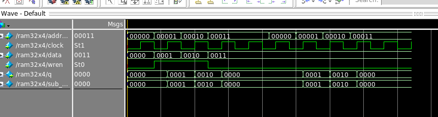
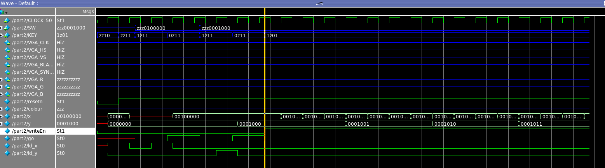
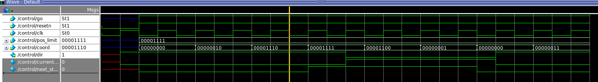

__part 1__
+ writing to then reading from RAM

__Part 2 VGA__

frame buffer
+ portion of RAM containing a bitmap that is used to refresh a video display from a memory buffer containing .a complete frame of data

__datapath__
+ notice `x_out` and `y_out` loops over a 4x4 coordinate at a predefined coordinate (0,0)

__control__
+ controls loading of `ld_x` and `ld_y`

__combination__
+ combination of control unit and datapath, observe (x,y) generated

---

__Part 3 move box__

+ control sets direction in x and y coordinate upon reaching the boundary of the screen

+ delay counter output d_enable does not change for 1000ns

+ a 4 frame / sec frame counter, notice how output enable high once every 4 clk cycle

+ coordinate counter initialize at position 00001000 with direction = 1,
direction is changed to 0 half way through.
+ notice how coordinate updated once every time enable is high
