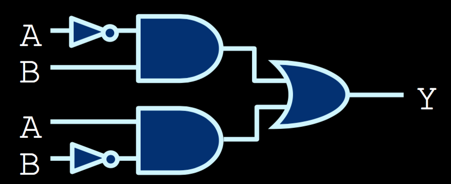
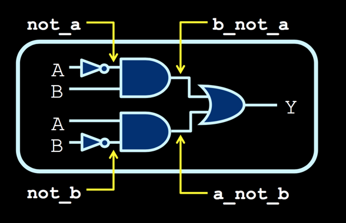
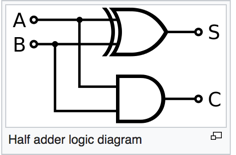
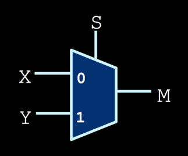

__Verilog__
+ hardware description language (HDL) used to model electronic systems.
  + describes the structure and behaviour of electronic circuits, and most commonly, *digital logic circuits*.
  + simply, it specifies circuit diagrams
+ most commonly used in the design and verification of digital circuits at the register-transfer level of abstraction.

---

Primitive gates:
+ `and(out, in, in, ...)` specifies AND gate.   
+ `or(out, in, in..)`, `not(out, in)`, `nand(out, in, in, ..)`, `nor(out, in, in, ..)`, `buf(out, in)`, `xor(out, in, in, ..)`, `xnor(out, in, in, ..)`

---

Modules:
+ a combination of logical gates with a set of inputs and output signals


Make an XOR gate.


express using logical gates



`wire`: declares wires that are used _internally_ in the circuit to connect components together. Usually want to label the output of each gates so that we can refer to it later as input to another gate.





Circuit description
+ Declare the `module` indicating start/end of module as well as input/output signals
+ Describe which of module's external signals are input/output
+ provide labels for internal `wire` needed in the circuit
+ Specify components of circuit and how they are connected; Order does not matter hre.


```v
module xor_gate(A, B, Y);
  input A, B;
  output Y;

  wire not_a, not_b;
  wire a_not_b, b_not_a;

  and(b_not_a, B, not_a);
  and(a_not_b, A, not_b);
  or(Y, b_not_a, a_not_b);

  not(not_a, A);
  not(not_b, B)
endmodule
```


`assign` is an alternate way to express internal logic of a module
+ `assign Y = A & B;` equivalent to `and(Y, A, B)`
+ `assign Y = A | B;` equivalent to `or(Y, A, B)`
+ `assign Y = ~A;` equivalent to `not(Y, A)`


---

Operators
+ _Bitwise_ operation takes multi-input bits and perform operation on corresponding bits of each value

| operator | operation   |
| :------------- | :------------- |
| ~     |  bitwise NOT |
| & | bitwise AND |
|&#124; | bitwise OR |
| ^ | bitwise XOR |  
| ! | NOT |
| && | AND |
| &#124;&#124;| OR |
| == | test equality |


```v
module xor_gate(A, B, Y);
  input A, B;
  output Y;

  assign Y = A & ~B | B & ~A;
endmodule
```


---

A module can be used in other components once created

*Half_adder*
+ The half adder adds two single binary digits A and B. It has two outputs, sum (S) and carry (C). The carry signal represents an overflow into the next digit of a multi-digit addition.
+ The value of the sum is `2C + S`

```v
module half_adder(X, Y, C, S);
  input X, Y;
  output C, S;

  and(C, X, Y);
  xor_gate(S, X, Y);
endmodule
```





*mux*
+ In electronics, a multiplexer (or mux) is a device that selects one of several analog or digital input signals and forwards the selected input into a single line.
+ used to economizing connection over a single channel
+ Requires `log n` switches for n inputs
+ specifically a 2-to-1 mux has boolean equation





```v
module mux(X, Y, S, M);
  input X, Y, S;
  output M;

  assign M = X & ~S | Y & S;
endmodule
```


A 3-to-1 mux

```v
module mux(X, Y, Z, S0, S1, M);
  input X, Y, Z, S0, S1;
  output M;

  assign M = S0 & ~S1 & X | ~S0 & S1 & Y | S0 & S1 & Z;
endmodule
```

Now a 3-bit mux

 __busses__
+ indicate several different wires with ranges
  + useful for working with multi-bit values, or an array of wires
  + i.e. a byte is 8 bits wide
+ `input [2:0] X` and `input [0:2] X` are equivalent, differing only in that the former specify the first bit as `X[2]` and the latter with `X[0]`.
  + by convention go from high to low
+ `{a[2], a[1]}` is equivalent to `a[2:1]`
  + takes the two wire and forms an un-named bus from them

```v
module mux(X, Y, S, M);
  input [2: 0] X, Y;   // 3 bit input
  input S;             // 1 bit input
  output [2: 0] M;     // 3 bit output

  assign M[0] = X[0] & ~S | Y[0] & S;
  assign M[1] = X[1] & ~S | Y[1] & S;
  assign M[2] = X[2] & ~S | Y[2] & S;
endmodule
```

The above could be expressed as follows since the operators are bitwise

```v
assign M = X & ~S | Y & S;
```


---


_Sequential Circuits_


---

__hierarchy__


```v
add_two(a,b,out);
  input a,b;
  output out;

  assign out = a & b;
endmodule


module add_three(a, b, c, out);
  input a, b, c;
  output out;
  wire w;

  add_two u1(
      .a(a),      
      .b(b),
      .out(w)   // Connects port out in add_two to wire w
    );

  add_two u2(
      .a(w),
      .b(c),
      .out(out);
    );
endmodule

```


---

FPGA
+ A field-programmable gate array (FPGA) is an integrated circuit designed to be configured by a customer or a designer after manufacturing – hence "field-programmable".

```v
module top(SW, LEDR);
  input [9:0] SW;
  output [9:0] LEDR;

  add_three(
      .a(SW[0]),
      .b(SW[1]),
      .c(SW[2]);
    );
endmodule
```


---

Simulation
+ An abstract model of real world system


---

Constant
+ expressed in terms of
  + bitwidth
  + radix
    + b: binary
    + h: hexidecimal
      + 16 bit
      + 0-9 to represent 0-9
      + A,B,C,D,E,F to represent 10-15
    + d: decimal


```v
wire a, b;

assign a = 1'b1
assign b = 1'b0

assign c = 8'b1 // padded with 0 -> 00000001
assign d = 8'b1 = 1010_0001  // underscore to separate into 4bit groups
                             // since any 4 bit can be translated to hex digits
assign e = 16'hABCD  
```


---

Conditional Operator (ternary)
+ <condition> ? <value if true> : <value if false>

```v
wire [3:0] a, b;
wire s;

assign b = s ? 4'b0 : a

// note 4'b0 connects to ground
```


---

Addition / Subtraction

```v
// addition
input [3:0] a,b;
output [4:0] c;

assign c = a + b;

```

---

Concatenation

```v
wire [3:0] a,b;
wire [7:0] c;

assign c = {a, b};   // c = a[3] ... a[0] b[3] ... b[0]

assign {carry, sum} = x + y
```


---

Relational / Equality / Logical operators
+ Relational
  + used unsigned comparison
  + `a < b`
  + `a > b`
  + `a >= b`
  + `a <= b`
+ Equality
  + `a == b`
    + this could be implemented as many XNOR gates joined with AND gate
  + `a != b`
+ Logical
  + different from bitwise operators
  + `!`
  + `&&`
  + `||`

```v
// equality

wire [3:0] a,b;
wire c;

assign c = a & b | ~a & ~b;   // XNOR gate
```

---


Always block
+ another way of describing a circuit
+ syntax
  + `always @ (<sensitivity list>) begin <body> end`
+ outputs must be of `reg` type
+ must have a new value at the end of always block

```v
// mux
reg m;  // used as outputs to always block
always @ (*) begin;
  m = s ? y : x;
end

// another method
reg m ;
always @ (*) begin;
  if(s)
    m = y;
  else
    m = x;
end
```
