# Review

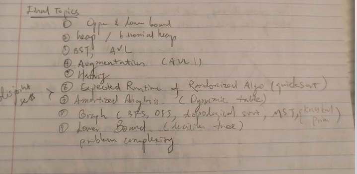

---

## Heap

+ Heap  
  + near complete binary tree
  + property
    + _max heap property_: for all node i other than root A[parent(i)] >= A[i]
    + _height_: `O(lg n)`
  + choice
    + efficient to track of largest/smallest value.
    + Inefficient for insert/delete and search

+ precondition: binary subtree at `A[i]` are max-heaps
+ post condition: binary tree at `A[i]` is max-heap
  + largest element determined and swapped to correct position
+ `O(lg n)`

+ call MAX-HEAPIFY  bottom up convert unsorted array to max-heap
+ `O(n)`

+ Always swapping `A[1]` after the heap, the correct location.
+ `O(n lg n)`

## Priority Queue
+ implemented with heap

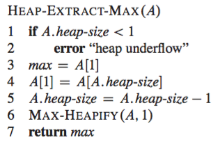
+ extract `A[1]` and
  + maintain tree structure by swapping with last element
  + maintain heap property by calling MAX-HEAPIFY
+ `O(lg n)`

+ bubble up after changing priority, if needed.  
+ `O(lg n)`

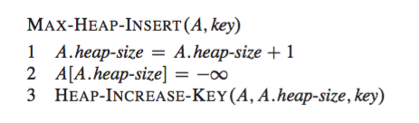
+ `O(lg n)`

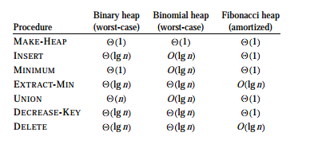

## Binomial Heap
+ ordered tree
  + `B_0` is a single node
  + `B_k` consists of 2 `B_{k-1}` linked together (root of one is left-most child of the other)

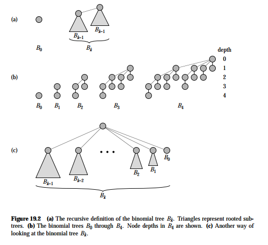

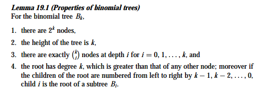

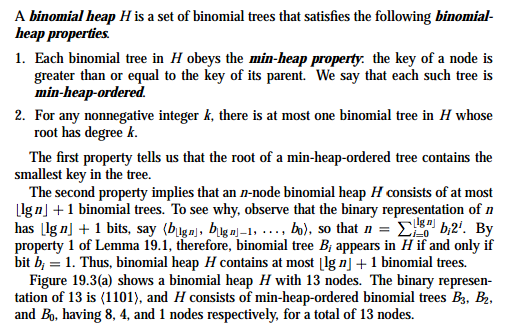

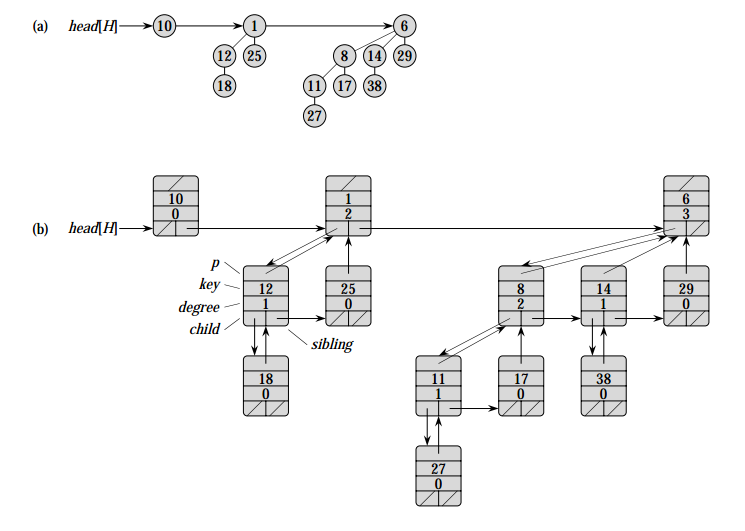

+ FIND-MIN
  + minimum key reside in root node. So algorithm checks all roots, which is at most `lg(n) + 1`
  + `O(lg n)`

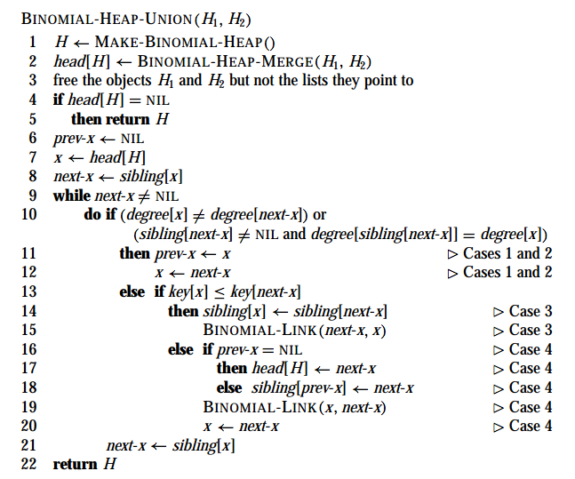
+ UNION: unites `H_1` and `H_2` returning the resulting heap.
   + merge root list of two binomial heaps, sort in increasing order
   + links roots of equal degree until at most one root remains of each degree

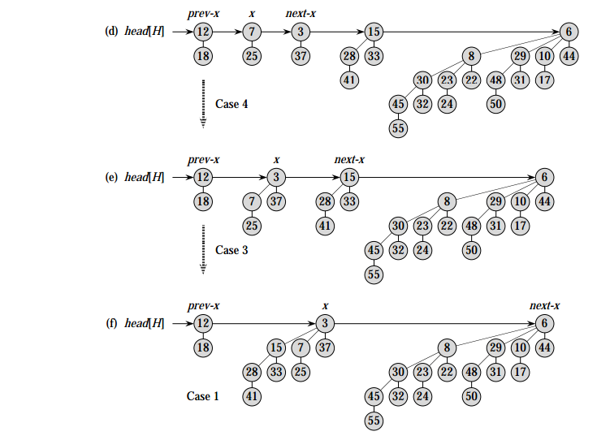

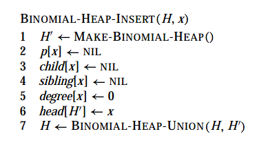
+ INSERT
  + creates a one-node binomial heap and units it with `H` with UNION

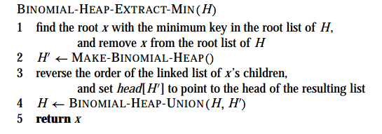
+ EXTRACT-MIN
  + `H'` is the binomial tree with root (the min to be extracted) removed.
  + `H` original binomial heap without the binomial tree containing the min
  + `O(lg n)`

## BST
+ property
  + height: worst case `O(n)` expected height `O(lg n)`
  + binary search tree property:
    + 

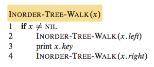
+ TREE-WALK: `O(n)`

+ TREE-SEARCH: `O(h)`

 
+ TREE-MIN/MAX: `O(h)`

+ TREE-SUCCESSOR: `O(h)`

+ TREE-INSERT: `O(h)`

  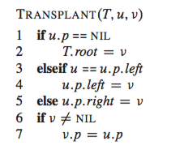

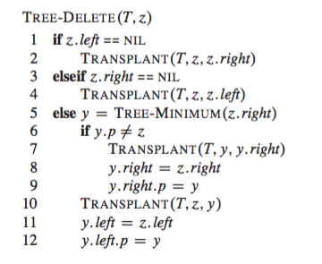
+ TREE-DELETE: `O(h)`

---

## AVL tree
+ height-balanced BST
  + height-balanced: height of left and right subtrees of every node differ by at most 1.
  + height
    + 0 node: 1 (leaves)
    + 1 node: 0 (root)
  + balancing factor (BF) = h_r - h_l
    + +1: right heavy
    + -1: left heavy
    + 0: balanced
+ algorithms
  + _SEARCH_: same as BST-SEARCH
  + _INSERT_:
    + _procedure_
      + BST-INSERT
      + trace path from leaf (inserted `n`) upward towards root
        + update BF at root `i`
        + If `BF[i] = 0`, height balanced, STOP
        + If `BF[i] = +1/-1`, CONTINUE
        + If `BF[i] = +2/-2`, rebalance and update BF, STOP
          + new leaf added to right subtree of a node that is right heavy
          + new leaf added to left subtree of a node that is left heavy
    + Rotation property
      + rebalances subtree rooted at node `n`
      + maintains BST property
      + `O(1)`
      + height of `n` is restored to before insertion
    + _theorem_
      1. insertion of new leaf can only affect BF of its ancestors
      2. let `m` be closest ancestor of `n` with `BF[m] = +/-1`. Only BF of nodes between `n` and `m` needs updating as a result of insertion of `n`
  + _DELETE_
     + _procedure_
      + BST-DELETE
      + trace path from leaf (deleted `n`) to root
        + update `BF[i]`
        + `BF[i] = 0`: height is balanced, CONTINUE
        + `BF[i] = +1/-1`: STOP
        + `BF[i] = +2/-2`: rebalance and update `BF`, CONTINUE
          + reduces height of right subtree of a left heavy node
          + reduces height of left subtree of a right heavy node
    + Rotation property
      + rebalances subtree rooted at node `n`
      + maintains BST property
      + `O(1)`
      + height of `n` may be decreased before/after delete
+ `O(lg n)` for all procedures

---

## Augmentation
+ steps
  1. pick initial data structure
  2. determine additional info
  3. maintain additional info during original operation
  4. implement new operations

+ _ordered set_ `T`
  + implementation
    + augment AVL tree with additional param `x.size`, (size of subtree at `x`)
    + `x.size` can be efficiently maintained.

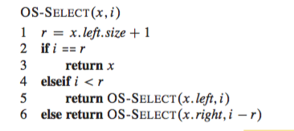
+ `SELECT(rank)`: retrieve element with a given rank
  + returns pointer to element containing `i`-the smallest key
  + `r` is the current rank at node `n`
  + `i`-th smallest element in subtree rooted at `x` is the `(i-r)`-th smallest element in subtree rooted at `x.right`
  + `O(lg n)`

+ `RANK(key)`: determines rank of an element
  + returns position of `x` in linear order determined by inorder tree walk of `T`
  + invariant: `r` is rank of `x.key` in subtree rooted at `y`

+ _interval tree_ `T`
  + `[t_1, t_2]` has `i.low = t_1` and `i.high = t_2`.
  + interval overlaps if `i intersetct i'` is not empty set

+ _interval trichotomy_: exactly one of following holds
  + `i` and `i'` overlaps
  + `i` is to left of `i'` (`i.high < i'.low`)
  + `i` is to right of `i'` (`i'.high < i.low`)

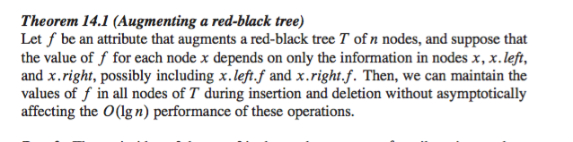
+ implementation
  + AVL tree with `x.int` for interval and `x.key = x.int.low`
    + hence in-order tree walk lists interval in sorted order by low endpoint
  + `x.max` is the maximum value of any interval endpoint stored in subtree rooted at `x`
  + `x.max` can be maintained with `x.int` and `max` values of node `x`'s children
    + `x.max = max(x.int.high, x.left.max, x.right.max)`
    + insertion and deletion runs `O(lg n)` by theorem

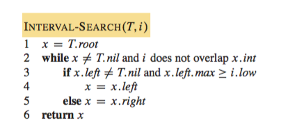
+ SEARCH:
  + starts at root of tree and proceed downward.
  + at each iteration, if `x.int` does not overlap with `i`, then the search always procceds in a safe direction.

---

## Hash Tables
+ dynamic set that supports INSERT, SEARCH, DELETE.

+ _direct addressing_
  + Assume `U` the universe of keys is reasonably small
    + If `U` is large, keys actually stored may be small relative to `U` so space wasted
  + direct-address table is an array `T[0..m-1]`, slot `k` points to element in the set with key `k`

+ _hash tables_
  + `K` set of keys stored in dictionary is much smaller than `U`, set of all possible keys
  + storage: `O(K)`
  + time: `O(n)` worst case, `O(1)` average case
  + _hash function_
    + `h: U -> T`, where `|T| << |U|`
    + element with key `k` hashes to slot `h(k)`

+ collision resolution by chaining
  + _collision_: two keys hashes to the same slot
+ analysis
  + hash table `T` with `m` slots that stores `n` element
    + _load factor_: `alpha = n/m`
  + worst case:
    + all `n` key hash to same slot, search is `O(n)`
  + average case:
    + _Simple uniform hashing assumption_: Any given element is equally likely to hash into any of the `m` slots.
      + `P(h(k_1) = h(k_2)) = 1/m`
      + `n_j` is length of list `T[j]` where `n = n_0 + .. + n_{m-1}`
      + `E[n_j] = \alpha = n/m`
    + SEARCH depends linearly on length `n_{h(k)}`, consider expected number of elements in list `T(h(k))` that algorithm checks to see whether any have a key equal to `k`
    + 
      + always search to the end so average running time is expected value of length of linked list
    + 
      + expected of elements examined is 1 plus expected number of elements added to `x`'s list after `x` was added to the list.
      + 
    + If `n = O(m)`, i.e. number of slots is linear w.r.t. number of elements in the table. `O(1 + n/m) = O(1 + O(m)/m) = O(1)`

---

## Probability and Average Running time

+ _average-case running time_
  + Average the running time over all possible inputs, which follows a certain distribution
  + Let algorithm `A` operate on `S_n`, the set of all possible inputs of `n`, which assumes pdf `Pr(x)`. Let `t_n` be random variable denoting number of steps taken by `A` on input `x`, for `x` in `S_n`. The average case running time `A` is`E[t_n] = \sum t_n(x) * Pr(x)`.
+ _randomized algorithm_
  + behavior is determined not only by its input but also by values produced by random-number generator
  + Running time is the expected running time over distribution of values returned by random-number generator. Here we talk about _expected running time_

---
## Bloom Filters
+ space-efficient randomized data structure
+ property
  + allow false positive (Type I Error)

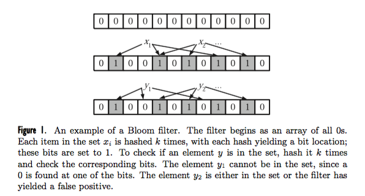
+ Description
  + `S = {x_1, ..., x_n}` of `n` elements described by an array of `m` bits.
  + `k` independent hash functions `h_1, ..., h_k` with range `{1, ..., m}`
  + INSERT: For each `x in S` bits `h_i(x)` are set to 1 for `1 <= i <= k`
  + SEARCH: check if all `h_i(y)` are set to 1
+ Derivation
  + Probability that a specific bit is not set to 1 after `n` items are inserted  
    + 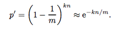 = `p`
  + Probability that a specific bit is 1
    + `(1-p)`
  + Now test membership that `y` is not in the set.
    + Each of `k` array position computed by hash function is 1 with probability `(1-p)`
    + False positive rate: probability that `h_i(y) = 1`, causing algo to erroneously claim element in set when its not is given by
    + 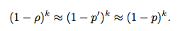
  + Choose `m > nk`. `k = ln(2) m/n` minimizes false positive rate
    + higher `m` and lower `n` makes false positive rate decrease.

---

## Quicksort

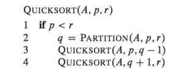
+ divide: partition into two subarray, such that each element of `A[p..q-1] <= A[q] <= A[q+1..r]`
+ conquer: sort 2 subarrays recursively
+ combine: subarrays are sorted, no need to combine them

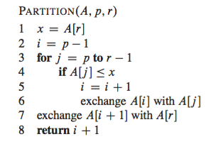
+ `x=A[r]` is a pivot element

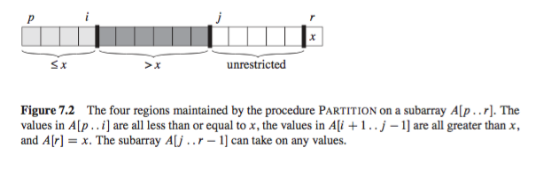

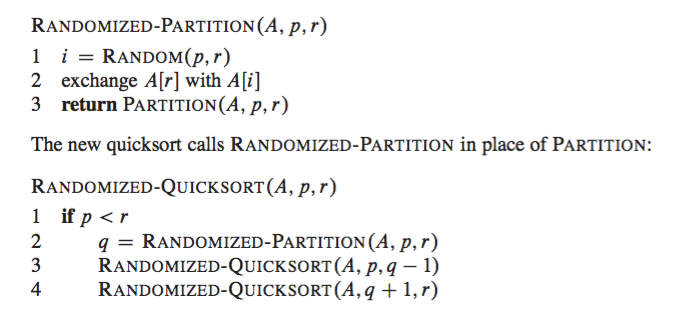
+ randomize algorithm by explicitly permuting the input

_analysis_
+ worst case  
  + partition to `n-1` and `0` element.
  + `T(n) = T(n-1) + O(n)` => `T(n) = O(n^2)`
+ best case
  + partition to `n/2`
  + `T(n) = 2T(n/2) + O(n)` => `T(n) = O(n lg n)`
+ average case
  + Assume all permutations of input numbers are equally likely
  + observation
    + pivot is selected in PARTITION and never included in future recursive calls
      + hence at most `n` calls to PARTITION,
      + each taking `O(1)` and time proportional to number of iterations of the for loop,
      + which is equivalent to number of times the pivot is compared to `A[j]`
      + 
        + the idea is to derive an overall bound on the total number of comparisons
    + Each pair of elements is compared at most once.
      + Since pivot is only compared once and never used again.
    + Once a pivot `x` is chosen, `z_i` and `z_j` cannot be compared. But if `z_i` or `z_j` is chosen as pivot first, then they will be compared to every other element.
  + 

  + 

  + 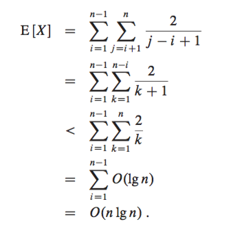

---

## Disjoint Set
+ maintains a collection `S = {S_1, ..., S_k}` of disjoint dynamic sets.
  + identify each set by representative, a member of a set.
  + Let `n` be number of MAKE-SET and `m` be total number of MAKE-SET, UNION, FIND-SET operations

+ Determine connected component of a graph
  + two vertices are in same connected component iff they are in the same set.

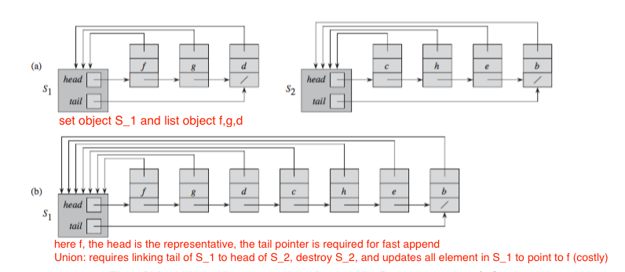
+ _linked list with no modification_
  + FIND-SET: `O(n)`.
  + UNION: `O(1)`.
  + sequence
    + `n` MAKE-SET, `n-1` UNION, `n` FIND-SET  
    + WCSC = `O(m^2)`
+ _linked list each member points to `head`_
  + FIND-SET: `O(1)`.
  + UNION: `O(n)`.
    + appends one list's to the other list.
    + updates pointer to set object, takes linear time
  + sequence
    + `n` MAKE-SET, `n-1` UNION, `m = 2n-1`
    + WCSC = `O(n^2)`, Amortized = `O(n / (2n-1)) = O(n)`

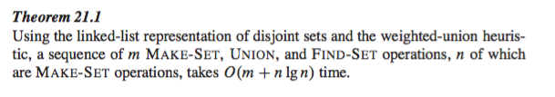
+ _linked list with weighted-union heuristic_
  + Each list includes length of the list, always append shorter list to longer list during UNION.
  + FIND-SET `O(1)`
  + UNION `O(n)`.
  + sequence
    + `n` MAKE-SET,
    + `lg n` UNION at most.
      + because any arbitrary `x` updated has its residing set size double
    + WCSC = `O(m + n lg n)`

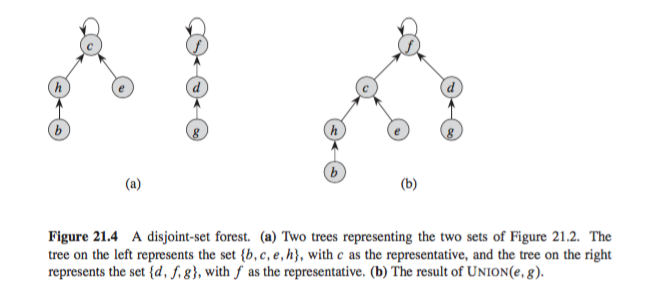
+ _disjoint-set forests_
  + implementation
    + rooted trees, with each node containing one member and each tree representing a set.
    + Each member points only to its parent.
    + root is representative and its own parent
  + FIND-SET `O(n)`
    + follows parent until reached root.
  + UNION `O(1)`
    + links root of one tree to another
  + complexity same as before
+ _disjoint-set forests with union by rank (height)_
  + maintain a `rank` for each node, which is upper bound on height of the node; make root with smaller rank point to root with larger rank. `rank` is unchanged in FIND-SET, and updated during UNION.
  + FIND-SET: `O(lg n)`
  + UNION: `O(1)`
  + sequence
    + `n` MAKE-SET, `n-1` UNION, the rest say about `m` is FIND-SET,
    + WCSC = `O(m + m lg n) = O(m lg n)`

   
+ _disjoint-set forests with path compression_
  + during FIND-SET, make each node on find path point directly to the root instead
  + If use union by rank and path compression
    + WCSC = `O(m alpha(n))`, where `alpha(n)` is very slow growing function, treat it as a constant.

---

## Amortized analysis
+ average the time required to perform a sequence of operations over all operations performed
  + average maybe small even though a single operation might be expensive
  + differs from average-case analysis in that amortized analysis is average performance in worst-case

__Aggregate analysis__
  + Determine worst case upper bound `T(n)` on total cost of sequence of `n` operations
  + average cost per operation is `T(n)/n`, same for all operations
  + problem solving steps
    + State cost
    + provide an upper bound `f` on total cost of a sequence of `n` operations
    + divide `f` by `n` to get amortized  cost

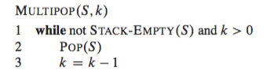
+ _stack_
  + operations
    + `PUSH(S, x)`:
    + `POP(S)`:
    + `MULTIPOP(S, k)`
      + `O(n)`
  + observations
    + pop each object from stack at most once for each time we push it onto stack
  + sequence of `n` operations
    + WCSC = `O(n)`; Amortized `O(1)`

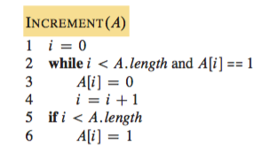
+ _incrementing binary counter_
  + implementation
    + `k`-bit binary counter that counts upward from 0
    + `A[0..k-1]` to store the number, where `A.length = k`
  + INCREMENT: `O(k)`
  + observation
    + Not all bits flip. `A[0]` flips every time; `A[1]` flips every other time ...
    + In fact `A[i]` flips `n/(2^i)` time in sequence of `n` operations
    + 
  + sequence
    + Upper bound = 
    + WCSC = `O(n)`; Amortized `O(1)`

__Accounting Method__
  + Determine Amortized cost of each operation, may be different
    + _amortized cost_: amount we charge an operation
    + _credit_: `amortized cost - actual cost`
  + Idea
    + Overcharges some operation early in sequence, storing charge as credit, and pays for operations that are charged less than they actually cost.
  + Requisite
    + Have to ensure total amortized cost of a sequence of operations provides an upper bound on the total actual cost of the sequence
    + Relationship must hold for all sequences of operations
      + `c_i`: actual cost of `i`-th operation; `hat(c_i)`: amortized cost of `i`-th operation
      + requires 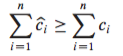
    + In other words, total credit stored in data structure must be nonnegative at all times
      + requires nonnegative for 
  + problem solving steps
    1. State your costs as accurately as possible
    2. State what you are going to charge for each operation
    3. State how and where your credits are going to be stored
    4. State your credit invariant
    5. Prove that your credit invariant is valid initially and across all possible operations
    6. Show that you can always pay for each operation, based on the credit invariant
    7. Calculate the amortized sequence complexity

+ _stack_
  + operations: charge
    + `PUSH`: 2
    + `POP`: 0
    + `MULTIPOP`: 0
  + proof
    + when PUSH, use 1 credit to pay actual cost of push and are left with 1 credit
    + when POP/MULTIPOP, use the 1 credit to pop from stack
    + Each element on stack has 1 credit, since number of element is nonnegative, total credit is nonnegative.
    + Hence for any sequence of `n` PUSH, POP, MULTIPOP operations, total amortized cost is an upper bound on the total actual cost.
    + Total amortized cost is `O(n)` so its the total actual cost.

+ _incrementing binary counter_
  + Observation
    + running time proportional to number of bits flipped.
  + operation: charge
    + set bit to 1: 2
    + set bit to 0: 0
  + proof
    + when a bit is set to 1, use 1 credit to pay for actual setting of the bit, 1 credit left for credit to be used later when flip the bit back to 0.
    + Every 1 in the counter `A[0..k-1]` has a credit of 1
    + In INCREMENT, setting bit to 0 in while loop is paid for by the credit stored; also INCREMENT set at most one bit to 1 each time. Hence amortized cost is 2 for INCREMENT.
    + Number of 1s in counter is nonnegative, hence amount of credit stays nonnegative at all times.
    + Hence for any sequence of `n` INCREMENT, total amortized cost is `O(n)`, which bounds actual cost
  + proof by credit invariant
    + _credit invariant_
      + when counter is 0, trivially true
      + At any step during the sequence, each bit of the counter that is equal to 1 will have a credit of 1.
        + Assume invariant is true at one point, now perform INSERT.
        + the cost of flipping bits from 1 to 0 is payed for by the credit stored with each 1, the cost of flipping a single bit from 0 to 1 is payed for with 1 from the 2 charged to the operation, and we store the remaining 1 together with the bit that was just changed to 1
        + credit invariant is true
    + total charge is upper bound on total cost

_Dynamic Tables_
+ Reallocate table with a larger size and copy all objects stored in the original table over into the new, larger table.
  + _load factor_: `alpha(T)` the number of items stored divided by its size (number of slots)

+ TABLE-INSERT
  + implementation
    + expansion of table when inserting an element into a full table (with `alpha(T) = 1`)
    + Creates a new table double in size and transfer over elements
  + Observation
    + running time corresponds to number of _elementary insertion_ at line 6/10. We assign 1 to each elementary insertion.
      + Assume actual running time is linear in time to insert individual item.
    + _expansion_ is a rare event. `i`-operation cause expansion only when `i-1` is power of 2
  + _aggregate analysis_
    + 
    + sequence of `n` INSERT bounded by `3n`. Hence Amortized cost of `O(1)`
  + _accounting method_
    + Charge 3 for elementary insertion
      + 1 for inserting itself into table
      + 1 for moving itself when table expands
      + 1 for moving another item that has already been moved once table expands
    + reasoning
      + `T.size = m` immediately after expansion. table holds `m/2` items, containing no credit
      + INSERT charge 3. Insertion itself cost 1 credit. Put 1 as credit on inserted item, put 1 credit on one of the `m/2` items already in the table.
      + Placed 1 credit on each item to pay for expansion once the table is full

---

## Graphs

+ __Graph representation__
  + _adjacency list_
    + implementation
      + `|V|` lists, one for each vertex in `V`
      + `Adj[u]` contains all vertices adjacent to `u` in `G`
      + represent edges in graph, hence sum of lengths of all adj lists is
        + `|E|` directed
        + `2|E|` undirected
    + properties
      + memory efficient `O(V+E)`
      + inefficient search `O(n)`
      + good for sparse graph (`|E| << |V|^2`)
  + _adjacency matrix_
    + implementation
      + `|V| X |V|` matrix
        + transpose of itself if graph undirected
    + properties
      + memory inefficient `O(V^2)`
      + search `O(1)`
      + good for dense graphs (`|E| ~ |V|^2`)

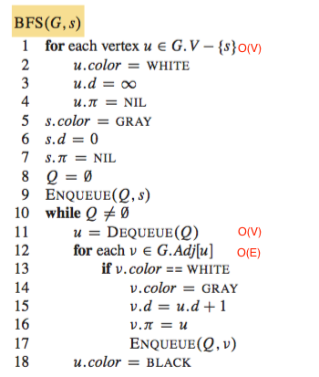
+ __BFS__
  + Starting from `s`, BFS discovers every vertex reachable from `s`, computes smallest distance from `s` to vertices, produces a breadth-first tree with root `s`.  The simple path in BF-tree from `s` to `v` is the shortest path from `s` to `v` in `G`.
  + implementation
    + `color`: black, gray, black.
  + observation
    + loop invariant: `Q` the queue is a set of gray vertices
  + analysis
    + Initialization attributes. `O(V)`
    + Aggregate analysis: Each vertex is enqueued and dequeued once. Queue operation `O(V)`
    + Scanning adjacency list line 12. `O(E)`
    + Total `O(V + E)`
  + Proof of correctness
    + 
    + 
    + 
    + 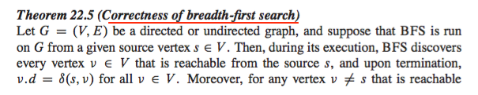
    
  + breadth first tree
    + `G` contains unique simple path from `s` to `v` that is also the shortest path from `s` to `v` in `G`.
    + `|E| = |V| - 1`

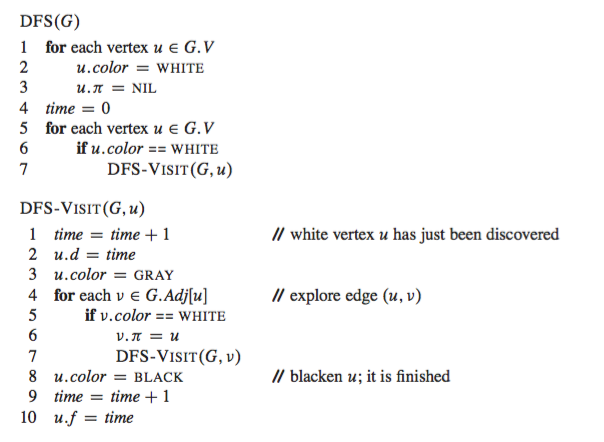
+ __DFS__
  + implementation
    + `v.d` discover time; `v.f` finish time
      + `v.d < v.f`.
      + `v` is WHITE before `v.d`, GRAY between `v.d` and `v.f`, BLACK thereafter
  + analysis
    + for loop in DFS takes `O(V)`
    + aggregate analysis on for loop in DFS-VISIT
      + DFS-VISIT called exactly once for every `v in G.V`. Because vertex `v` on which DFS-VISIT is invoked must be WHITE and first thing it does is painting `v` GRAY
      + bounded by 
      + cost for executing line 4 of DFS-VISIT is `O(E)`
    + Total: `O(V + E)`
  + properties
    + _parenthesis theorem_
      + 
    + _nesting of descendents' intervals_
      + 
    + _White path theorem_
      + 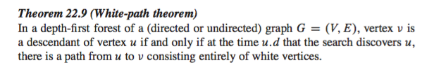
  + _classification of edges_
    + 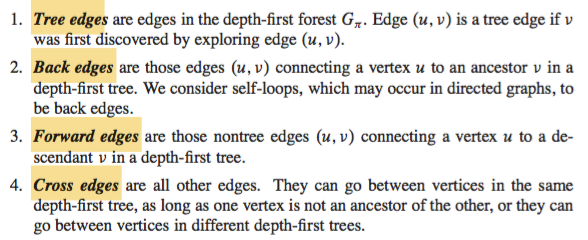
    + 
      + When exploring `e = (u, v)`, `v`'s color tells us about `e`
      + In last case, `e` is forward edge if `u.d < v.d`, cross edge if `u.d > v.d`
  + theorems
    + forward and cross edge never occur in DFS on undirected graphs
      + 

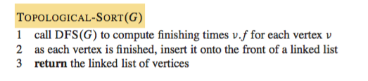
+ __Topological Sort__
  + outputs
    + Topological sort of a dag `G` is a linear ordering of all its vertices such that if `G` contains an edge `(u, v)`, then `u` appears before `v` in the ordering.
    + Note we are inserting to front of linked list. Nodes inserted later are in front of the list.
  + analysis
    + `O(V + E)`
  + proof of correctness
    + 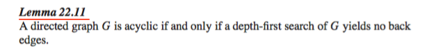
    + 
      + prove that for any pair of `(u, v)`, explored by DFS, then `v.f < u.f`
      + 3 cases on `v.color`
        + cannot be GRAY, otherwise we have back edge (not dag anymore)
        + WHITE: `v` is descendent of `u` so `v.f < u.f`
        + BLACK: `v`has already been finished so `v.f < u.f`

---

## MST

+ The modeling problem  
  + outputs an acyclic subset of the edges `T subset G.E` of a connected, edge-weighted undirected graph that connects all the vertices together, whose total weight is minimized 
+ MST
  + __Multiplicity__
    + If there are n vertices in the graph, then each spanning tree has n − 1 edges.
  + __Cycle property__
    + For any cycle C in the graph, if the weight of an edge e of C is larger than the individual weights of all other edges of C, then this edge cannot belong to a MST.
  + __Cut property__
    + For any cut C of the graph, if the weight of an edge e in the cut-set of C is strictly smaller than the weights of all other edges of the cut-set of C, then this edge belongs to all MSTs of the graph.

+ __Generic Problem__
  + loop invariant
    + prior to each iteration, `A` is a subset of some MST
    + _safe edge_: edge when added to `A` maintains the loop invariant. That is `A cup {(u, v)}` is also a subset of MST
  + Definitions
    + _cut_: `(S, V-S)` is a partition of `V`
      + A cut _respects_ `A` if no ege in `A` crosses the cut
    + edge `(u,v)` _crosses_ the cut if one of endpoints in `S` the other in `V-S`
    + _light edge_: edge crossing the cut with minimum weight among those that crosses a cut.

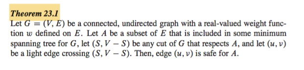
+ proof
  + `T` is MST including `A`. if `(u,v) in T`, done.
  + Otherwise, we construct another MST `T'` such that `A cup {(u, v)} in T'` (i.e. `(u,v)` is safe for `A`)
    + `(u, v)` along with a simple path `p` that connects `u` to `v` in `T` forms a cycle (since MST spans every vertices)
    + exists at least one edge `(x, y) in p` such crosses the cut.
    + Remove `(x, y)` breaks `T` into two components (`p` is unique simple path)
    + Define `T' = T - {(x, y)} + {(u, v)}`
    + `T'` is MST because `(u, v)` is a light edge. `w(u,v) <= w(x,y) => w(T') <= w(T)`
    + Now prove `T'` is safe for `(u, v)`. `A in T'` then `A cup {(u,v)} in T'`

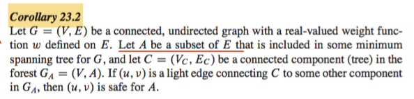

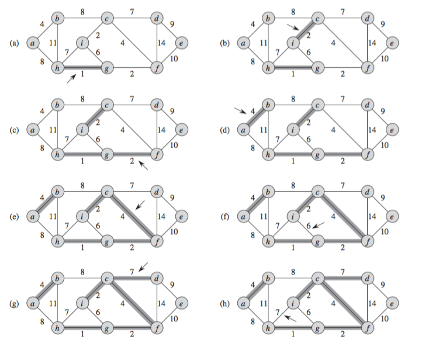

+ __Kruskal's Algorithm__
  + description
    + safe edge added to `A` is a least-weighted edge in the graph that connects 2 distinct components
  + analysis
    + Sorting edges: `O(E lg E)`
    + disjoint set operations:
      + `O(E)` FIND-SET and UNION, `O(V)` MAKE-SET.
      + Total `O((V+E)*alpha(V))`. Since `|E| >= |V| - 1`. simplify to `O(E lg E)`
      + `|E| <= |V|^2`. Simplify total to `O(E lg V)`

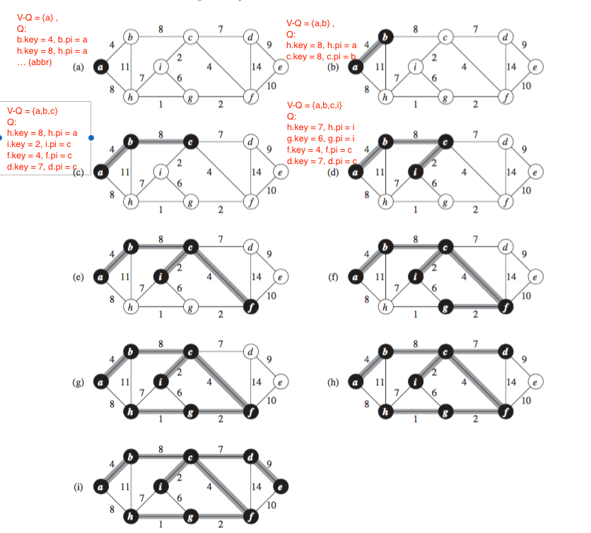

+ __Prim's Algorithm__
  + description
    + `A` always form a single tree
    + Starts from arbitrary root and adds to tree `A` a light edge that connects `A` to an isolated vertex, hence safe for `A`
    + At each step, adds to tree an edge that contributes the minimum possible weight
  + observation
    + vertices _not_ in tree reside in min-priority queue `Q`, with `v.key` be minimum weight of any connecting `v` to a vertex in the _tree_ (not in `G`)
    + vertex `u` is incident on a light edge that crosses the cut
    + For loop updates `key` attr for every vertex `v` adjacent to `u` but no the tree
  + _while_ loop invariant
    + vertices already in MST are those in `V - Q`
    + all vertices `v in Q`, if `v.pi \= NIL` then `v.key < infinity` and `v.key` is the weight of light edge `(v, v.pi)` connecting `v` to some vertex already placed into the MST.
  + anlaysis
    + BUILD-MIN-HEAP: `O(V)`
    + while loop: executes `|V|` times
      + EXTRACT-MIN: each `O(lg V)`. Total `O(V lg V)`
    + for loop: executes `2|E|` times
      + test membership could be `O(1)` if keeps extra bit for each vertex
      + DECREASE-KEY: each `O(lg V)`. Total `O(E lg V)`
    + Total: `O(V lg V + E lg V) = O(E lg V)`

---

## TSP

+ _approximation algorithm_
  + _approximation ratio_: 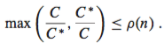 (`C` is cost of algo, `C*` is cost of optimal solution). `rho = 1` means optimal

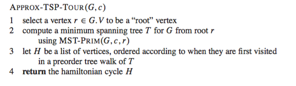
+ __Traveling salesman problem__
  + Input: complete undirected graph with nonnegative cost `c(e) forall e in G.E`
  + Output: hamiltonian cycle (a path that visits each `v` once) with minimum cost
    + i.e. minimize total cost `c(A)` (`A subset of G.E`) 
  + assumptions
    + graph is complete
    + triangular inequality: `c(u,w) <= c(u,v) + c(v,w)`
  + proof of correctness
    + 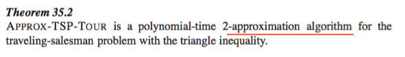
      + weight of MST computed gives lower bound on cost of optimal tour
        + i.e. `c(T) <= c(H*)`
      + Full walk of `T`, denote as `W`, traverses each edge twice
        + `c(W) = 2c(T)`
        + hence `c(W) <= 2c(H*)`
      + By triangular inequality, we delete visit to any vertex from `W` and cost does not increase
        + Remove from `W` all but the first visit to each vertex
        + `c(H) <= c(W)`
      + Hence `c(H) <= 2c(H*)`

---

## Decision Tree

+ Comparison sort
  + the sorted order is based only on comparisons between input elements.

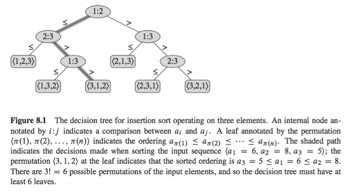
+ __Decision Tree__
  + description
    + A full binary tree
    + internal node: A test
    + branch: outcome of test
    + leaf: Class label
  + Algorithm traces a simple path from root down to leaf. A correct algorithm must be able to produce each permutation of its input, each of `n!` permutations on `n` elements must appear as one of the leaves of the decision tree
+ __Lower bound on sorting__
  + observation
    + Length of longest simple path from root of decision tree to any reachable leaves represents the worst-case number of comparisons that sorting algorithm performs.
    + Worst-case number of comparison is equal to height of decision tree
    + Lower bound on heights of all decision tree in which each permutation appears as reachable leaf is therefore a lower bound on running time of any comparison sort algorithm
  + proof
    + 
