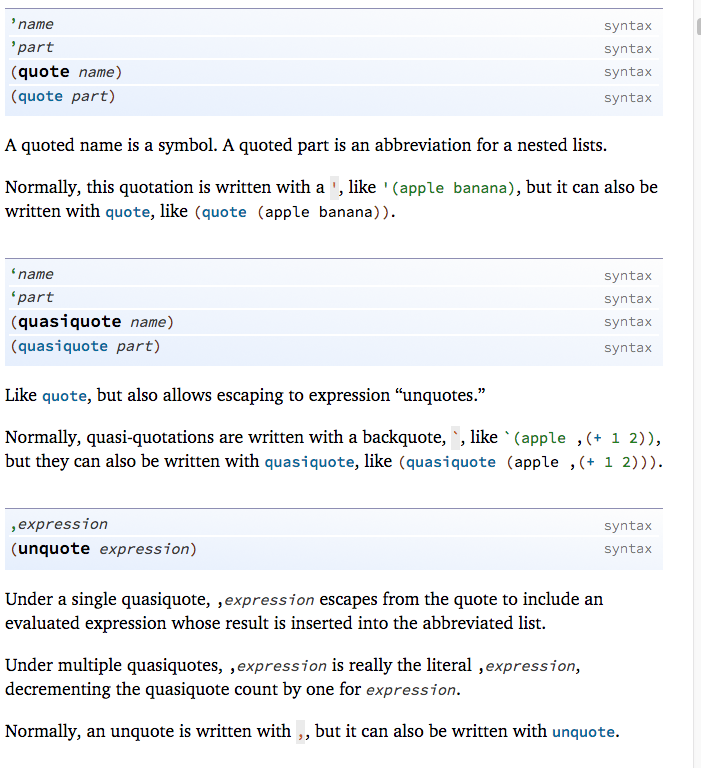

+ _string interning_ 
    + In computer science, string interning is a method of storing only one copy of each distinct string value, which must be immutable
    + Modern Lisp dialects typically distinguish symbols from strings; 
        + interning a given string returns an existing symbol or creates a new one, whose name is that string. 
    + _motivation_ 
        + _speeds up string comparisons_, which are sometimes a performance bottleneck in applications (compiler and dynamic pl runtime)
        + rely heavily on _associative arrays_ with string keys to look up the attributes and methods of an object. 
            + without interning, checking 2 keys are equal require comparing every char of string
            + is slow `O(n)`
            + fills up cache
            + with interning, _simple object identity test_ suffices after the original intern operation; typically implemented as a pointer equality test, normally just a single machine instruction with no memory reference at all.
+ _De Bruijn indexing_
    + _goal_ 
        + eliminate names in lambda calculus for eliminating need of names

```scheme
'<identifier>
(quote <identifier>)
; similar to chars in quotes 
"<characters>"
```
+ _note_ 
    + a literal: do not evaluate it as expression

```scheme
(quote foo)
'foo
```
+ _meaning_ 
    + do not evaluate the name `foo` and replace it with its value; I really mean the name foo.
+ _idea_ 
    + _quote_ turns code into data

+ _quoting and unquoting_ 
    + [reading](http://www.ccs.neu.edu/home/matthias/HtDP2e/Draft/i2-3.html)
+ _quoting_ 
    + _goal_ 
        + Quotation is a short-hand mechanism for writing down a large list easily
    + _constructing lists_ 
        ```scheme
        > '(1 2 3)
        (list 1 2 3)
        > '("a" "b" "c")
        (list "a" "b" "c")
        > '(#true "hello world" 42)
        (list #true "hello world" 42)
        ```
        ```scheme 
        > '(("a" 1)
            ("b" 2)
            ("d" 4))
        (list (list "a" 1) (list "b" 2) (list "d" 4))
        ```
    + _simplistic innerworking_ 
        + When `'` encounters a plain piece of data—a number, a string, a Boolean, or an image—it disappears. 
        + When it sits in front of an open parenthesis, `(`, it inserts `list` to the right of the parenthesis and puts `'` on all the items between `(` and the closing `)`. For example,
        ```scheme
        '(1 2 3)	 
        ; short for
        (list '1 '2 '3)
        ```
        ```scheme
        '(("a" 1) 3)	
        ;is short for
        (list '("a" 1) '3)
        ```
    + _summary_ 
        + if `'` before parenthesis, it is distributed over all parts between it
        + if appears to basic piece of data, it dissapears
        + if in front of a variable name, get a symbol 
+ _quasiquote and unquote_ 
    + _drawback of `quote` and `'`_
        ```scheme
        (define x 42)
        '(40 41 x 43 44)        ; (list 40 41 'x 43 44)
        ```
        + _note_ 
            + quoting construct values, 
            + `'x` is a symbol;  a symbol is a value
    + _motivation_ 
        + might want a _true expression_ in a quoted list and want to evaluate the expression during construction of the list 
    + `quasiquote` (or backquote as abbr) 
        ```scheme
        `(1 2 3)        ; (list 1 2 3)
        `("a" "b" "c")  ; (list "a" "b" "c")
        ```
    + _additional rule_ (augment `'`)
        ```scheme
        (define x 42)
        `(40 41 ,x 43 44)       ; (list 40 41 42 43 44)
        ```
        + if `quasiquote` is followed by unquote, then both characters disappear
        ```scheme
        `(1, ,(+ 1 1) 3)    
        ; (list `1 `,(+ 1 1) `3)
        ; (list 1 (+ 1 1) 3)
        ; (list 1 2 3)
        ```
+ _summary_     
    + 