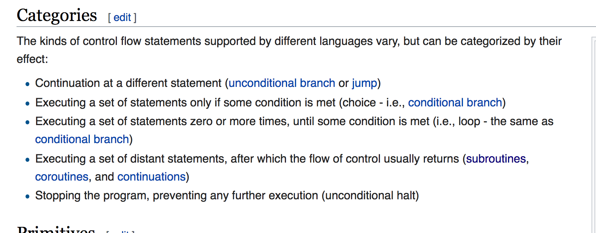

+ _control flow_ 
    + the order in which individual statements, instructions or function calls of an imperative program are executed or evaluated. 
    + Within an imperative programming language, a control flow statement is a statement the execution of which results in a choice being made as to which of two or more paths to follow.
    + Interrupts and signals are low-level mechanisms that can alter the flow of control in a way similar to a subroutine
+ _category_ 
    + 
+ _coroutine_ 
    + functions that can `yield` control to each other 
        + a form of co-operative multitasking without threads.
+ _continuation_ 
    + an abstract representation of the control state of a computer program.
    + _current continuation_
        + continuation that, from the perspective of running code, would be derived from the current point in a program's execution. 

+ `prompt` and `abort`
    ```scheme
    > (+ 1 (+ 1 (+ 1 (+ 1 (+ 1 (+ 1 (/ 1 0)))))))
    /: division by zero
    ```
    + `prompt` marks the evaluation context with an escape point.
        + If an exception is not caught, then information about the exception is printed, and then evaluation aborts to the nearest enclosing prompt. 
        + More precisely, each prompt has a prompt tag, and there is a designated default prompt tag that the uncaught-exception handler uses to abort.


```scheme
(abort v ...) → any
  v : any/c
```
+ Returns the vs to a prompt using the default continuation prompt tag and the default abort handler.

```scheme
(prompt
    (printf "start here\n")
    (printf "answer is ~a\n" (+ 2 (abort 3))))
```


+ `call-with-composable-continuation`
    + Composable continuations are a means of inverting control by reification of continuation segments
    + `reset`
        + a special continuation, or mark, on the stack, and evaluates expression (used to refer back to)
    + `shift`
        + jumps back to the mark (where `reset` is used) 
        + saves the portion of program between that and where `shift` is called
        + it _reifies_ the segment of the program, known as _composable continuation_ into a composable procedure, binds variable to that procedure, and evaluates expression
    + Calling a _composable continuation procedure_ 
        + has the effect of returning control to the point where `shift` was called. 
        + However, when control subsequently returns to where the thunk passed to `reset` was called, instead of returning then to where `reset` was called, it rather returns to where the composable continuation procedure was called!