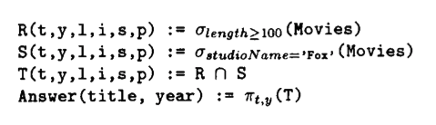

# 2.4 An Algebraic Query language

+ _algebra_ 
    + operator and atomic operands
+ _overview_ 
    + _set operation_ 
        + union, intersect, difference
    + _filter operation_ 
        + _selection_ (eliminates rows)
        + _projection_ (eliminates columns)
    + _combine operation_ 
        + _cartesian product_ 
        + _joins_ 
            + natural join
                + tuples agree in attributes in common to schemas of R and S are joined
            + theta join
                + take `R X S`
                + select from product only tuples that satisfy condition `C`
    + _renaming operation_ 
        + changes relation _schema_ i.e. name of atributes and/or name of relation itself

+ _joined tuple_    
    + if 2 tuples are successfully joined, resulting in a joined tuple
+ _dangling tuple_ (in joins)
    + a tuple that fails to pair with any tuple of the other relation is a dangling tuple

+ _linear notation_ 
    + 

# 2.5 Constraint on Relations

+ _2 types of restriction_ 
    + 
