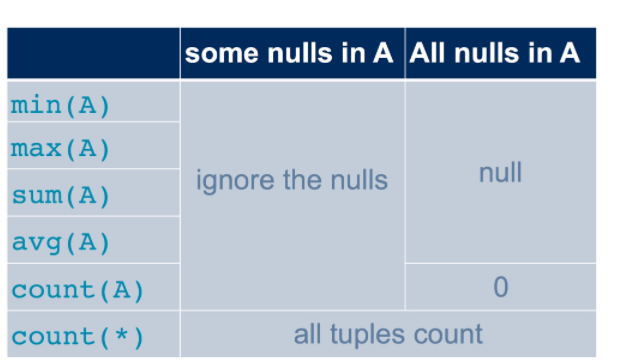
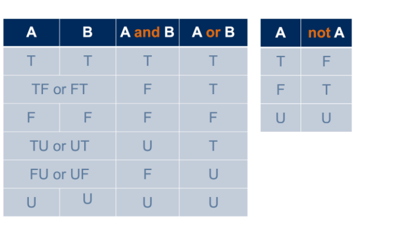
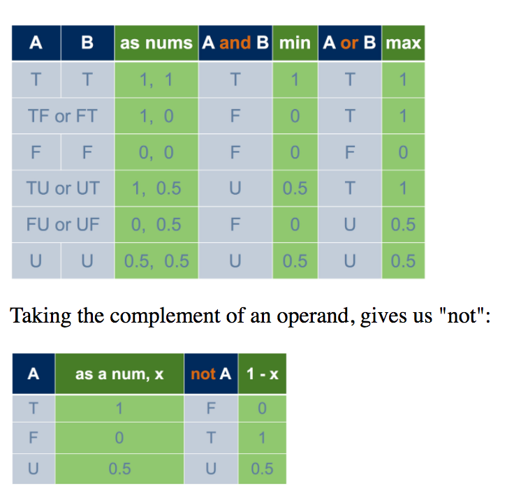
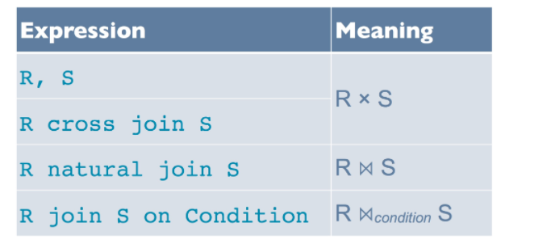
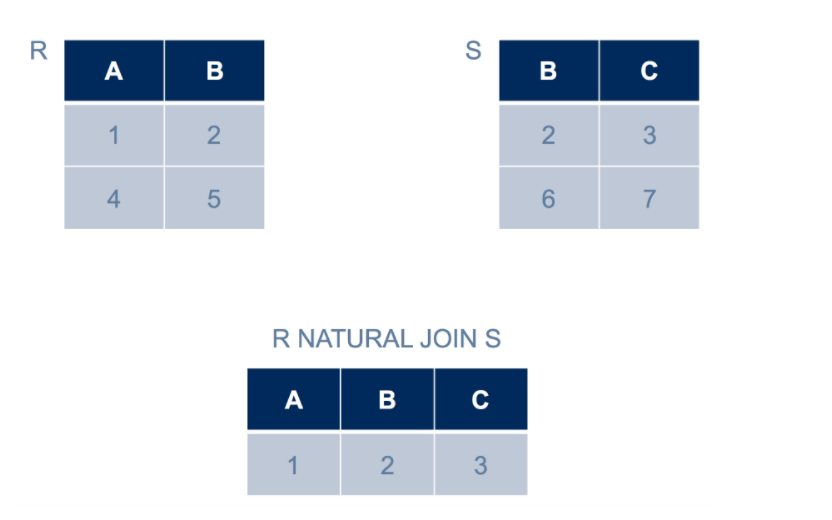
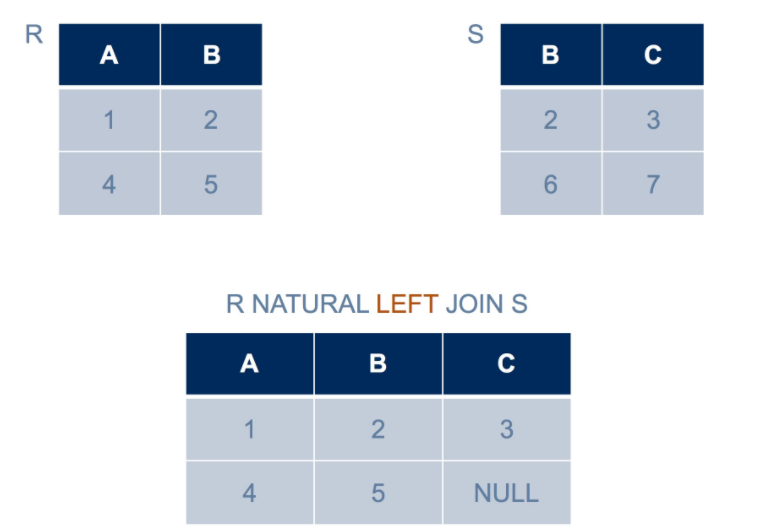
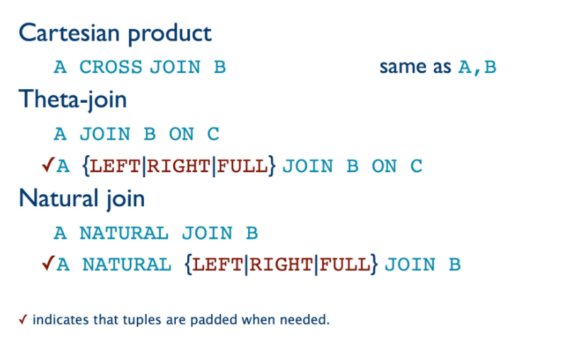

+ sql query order of execution
    + look at tables in `from` 
    + filter rows with `where`
    + form groups with `group by`
    + filter groups with `having`
    + collapse group with `select`


---

Readings 

[null values in SQL](http://www.teach.cs.toronto.edu/~csc343h/fall/readings/SQL/nulls.html)


```sql 
INSERT INTO Student VALUES (35461, NULL, 'Batman', NULL, 'bruce@batcave.com', 4.0);
SELECT * FROM Student WHERE breadth IS NULL;
SELECT * FROM Student WHERE breadth IS NOT NULL;
```


```sql 
SELECT *
FROM Student
WHERE campus = 'StG';
```
+ _`unknown`_
    + if _one or both operands is `NULL`_, a comparison evaluates to "unknown".
+ _impact on_
    + `WHERE` does not include rows for which the truth-value of the `WHERE` clause is unknown
    + `NATURAL JOIN` does not include ... (since it has `WHERE` clause underlying it)
    + _aggregation_
        + `NULL` never contributes to a sum, avg, or count
        + `NULL` makes no difference to the max or min of a column, unless every value is NULL. In that case, both the max and the min are NULL.
        + in case where all values are `NULL`, the result of aggregation is most likely `NULL`  
            + `COUNT(*)` is 0 in this case
    + 
        + Note `count(*)` includes every row, regardless of any `NULL`s
+ boolean condition 
    + 
    + 
        + `true` is 1, `unknown` is 0.5, `false` is 0
        + `and`: take max of the two 
        + `or`: take min of the two
        + `not`: complement (i.e. `1-x`)
+ _tautology_ 
    ```sql 
    SELECT *
    FROM Course
    WHERE breadth OR NOT breadth;
    ```
    + Note `breadth` and `NOT breadth` is a tautology
        + the statement does not include every row (if some row has `NULL`)
        + if `breadth` is `NULL`, then `NOT breadth` is `NULL`, or of 2 `NULL` is `NULL`
    ```sql 
    SELECT *
    FROM Ages
    WHERE AGE >= 10 OR AGE < 10
    ```
    + Note _comparison with `NULL`_ yields `unknown`
    ```sql 
    SELECT *
    FROM Ages
    WHERE AGE * 0 = 0;
    ```
    + both cases, if `AGE` is `NULL`, then row is missing 

[joins in SQL](http://www.teach.cs.toronto.edu/~csc343h/fall/readings/SQL/joins.html)

+ _inner joins_
    + conceptually will only include keys that is intersection of `R` and `S`
    + 
    + _condition to be in the joined table_
        + `NATURAL JOIN`: r and s must agree on all attributes of the same name; 
        + `JOIN ON cond`: they must satisfy the join condition.
    + _dangling tuple_ 
        + 
        + rows in `R` that does not satisfy condition with every row in `S` is not included in the joined table
+ _outer join_ 
    + Preserves dangling tuples by padding them with `NULL` values where needed.
    + _type_ 
        + _left outer join_
            + 
            + preserves dangling tuple from left hand side tuple only
            + include all keys in in the union PLUS keys in `S` 
        + _right outer join_ 
            + include all keys in in the union PLUS keys in `R` 
        + _full outer join_
            + include all keys that is in the union
+ _sql syntax_ 
    + 
+ _natural join is brittle_ 
    + since condition out of control, subject to change upon change in schemas
    ```sql 
    SELECT sID, instructor
    FROM Student NATURAL JOIN Took
                 NATURAL JOIN Offering
    WHERE grade > 50;
    ```
    ```sql 
    -- with cross join + condition
    SELECT Student.sID, instructor
    FROM Student, Took, Offering
    WHERE Student.sid = Took.sid and
          Took.oid = Offering.oid and
          grade > 50;
    ```
    ```sql 
    -- with theta join
    SELECT Student.sID, instructor
    FROM Student JOIN Took ON Student.sid = Took.sid
                 JOIN Offering ON Took.oid = Offering.oid
    WHERE grade > 50;
    ```
    + `join on` is better
        + separate join with selection 
        + needed to use `full join`
+ `join using (colnames...)`
    + same as `natural join` but specify column name to match
    + less brittle since we specify what columns to join, 
    + but `colnames` must be same in both table
        + use `join on` for different column names
        