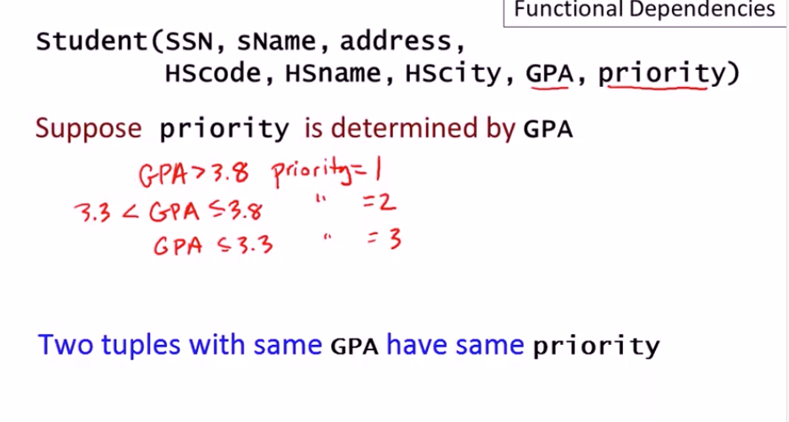
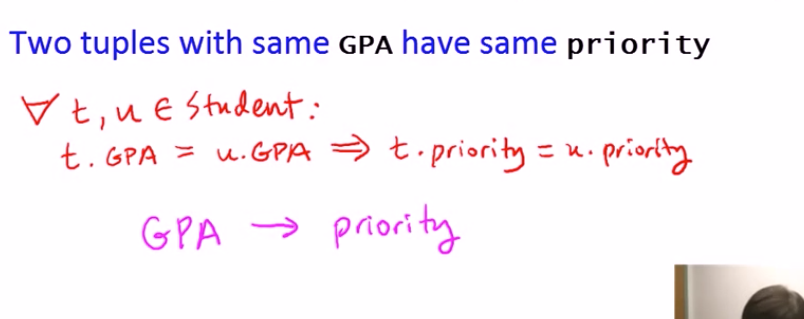
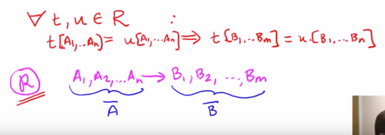
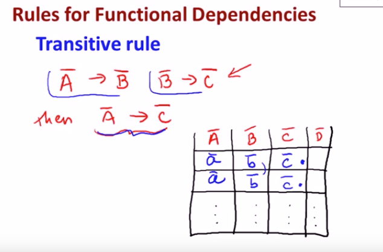
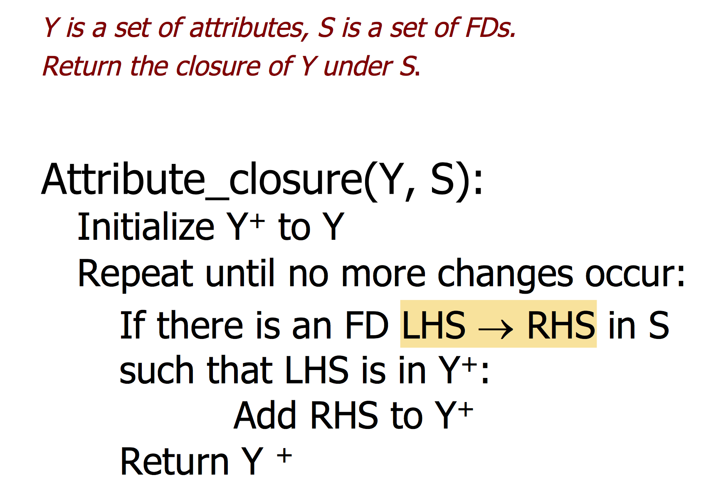
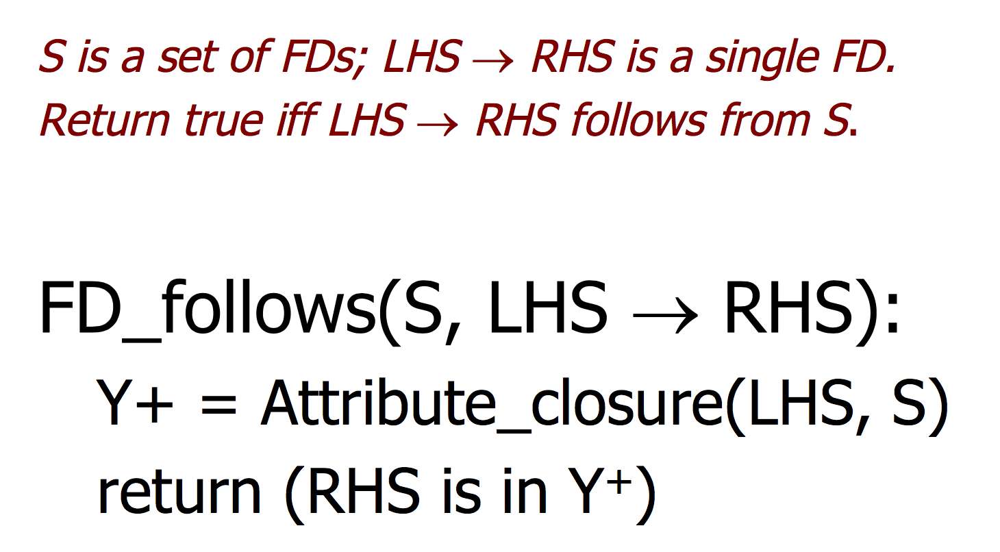
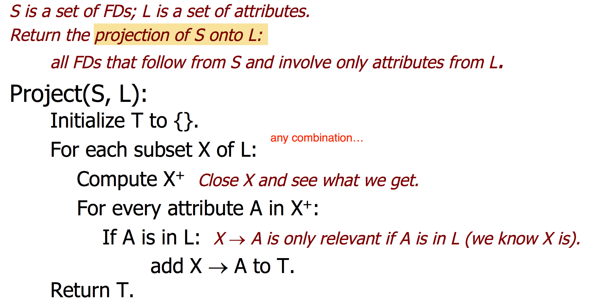
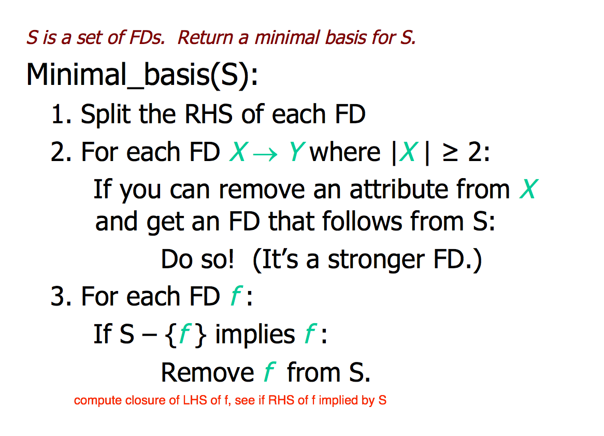
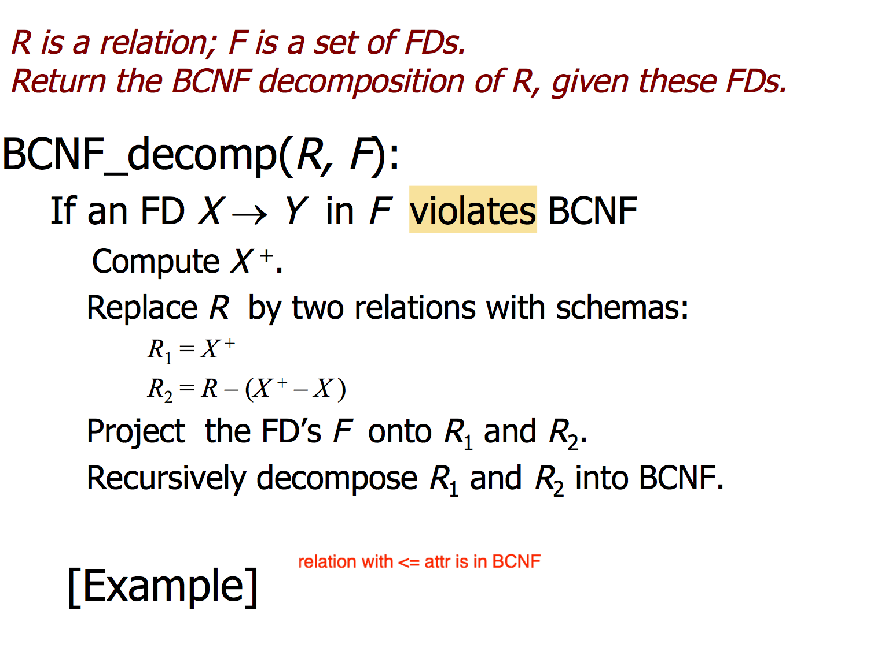

#### functional dependencies [vid](https://www.youtube.com/watch?v=Mkm1h5AtsXI&t=129s&list=PLroEs25KGvwzmvIxYHRhoGTz9w8LeXek0)

+ _design by decomposition_ 
    + functional dependency  ->  boyce-codd normal form
    + multivalued dependency -> fourth normal form





+ _functional dependency_
    + _definition_ 
    ```
    for relation R, A_1, A_2, ... A_n -> B_1, B_2, ..., B_n implies 

    for all t,u\in R
        t[A_1, ..., A_n] = u[A_1, ..., A_n] 
        => t[B_1, ..., B_n] = u[B_1, ..., B_n]
    ```
    + _based on knowlege of real world_


+ _transitive rules_ 
    + 


#### Design theory 




+ _closure test_


+ _projection_
    + points
        + the projected FDs has `LHS cup RHS = emptyset`
        + no need to compute closure of empty set or set of all attr  
        + if find `X+ = all attr` (superkey), then can ignore any superset of X


+ _minimal basis_ 
    + a set of FDs that is equivalent, but has
        + no redundant FDs, and
        + no FDs with unnecessary attributes on the LHS
    + _steps_
        + split RHS
        + reduce LHS, to find more stronger FD
        + try to eliminate FDs, 
            + remove if `S - {f} -> f` 
            + note cannot use a FD removed when computing subsequent closures 
    + _note_


+ _decomposition_ 

+ BCNF
    + _criteria_ 
        + for all nontrivial `X -> Y` `X` is a superkey
        + _nontrivial_ 
            + `Y` not in `X`
        + basically the only FD allowed are superkeys, since no duplicate rows there is no duplicate data



+ _BCNF decomposition_
    + basically the idea is pick a FD `X -> Y` that violates BCNF, and replace R by relation with schema that is 
        + `X+`
        + `R - (X+ - X)`
    + Project the FDs, and recursively decopose untill all FDs satisfies BCNF
+ _speed-ups_  
    + only superkey matter
        + dont need to know all superkeys, only check if LHS of each FD is a superkey
        + closure test
    + when projecting FDs to a new relation, 
        + check each new FD, does it violates BCNF because of this FD, 
        + if so abort the projection, and use it to decompose further
    