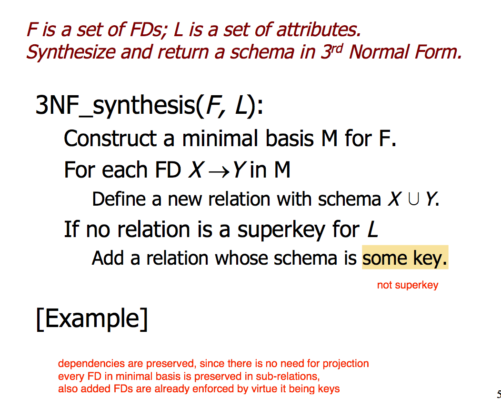

```
A B C D E 
1 2 3 4 5
9 8 7 6 5
4 2 3 0 5
```
+ if `C -> E` or `E -> C`
    + then the `E` at first and third row are redundant
+ _redundancy_ 


```
AB -> DE    AB+ = ABDEC  (superkey)
C -> E      C+ = CEA     (not superkey)
D -> C 
E -> A
```
+ not BCNF


+ BCNF
    + reduce redundancy but also loses some FDs


--- 


+ _Decomposition goal_ 
    + no anomalies (duplicates)
    + lossless join
        + project original relations onto decomposed schema
        + reconstruct original by joining, should be exactly the original tuples
            + if get spurious tuples, then lossy
    + dependency preservation

+ _3NF_
    + _prime_ 
            + `X` is prime if it is a member of any key
    + `X -> A` violates 3NF iff
        + `X` not a superkey 
        + `A` not prime



+ _3NF synthesis_  
    + find minimal basis
    + for each `X -> Y` 
        + define new relation with schema `X cup Y`
    + if no relation is a superkey for `L`
        + add a relation whose schema is some key
    + how does this ensure that `A` is at least prime?


+ _decomposition_ 
    + no anomalies
        + BCNF
    + lossless join 
        + BCNF decomposition
            + however, BCNF property does not guarantee this
        + 3NF
    + dependency preservation
        + 3NF


+ _chase test_ 
    + tests for if a schema guarantees lossless join
    + idea
        + assume `t=abc...` in final projection
        + for 2 rows agree on LHS of a FD, make RHS agree too 
        + replace a subscripted symbol by corresponding unsubscripted on, if possible
        + if get a completely unsubscripted row, konw any tuple in the project-join is in the original (join is lossless)
        + otherwise, final tableau is a counter example (join is lossy)