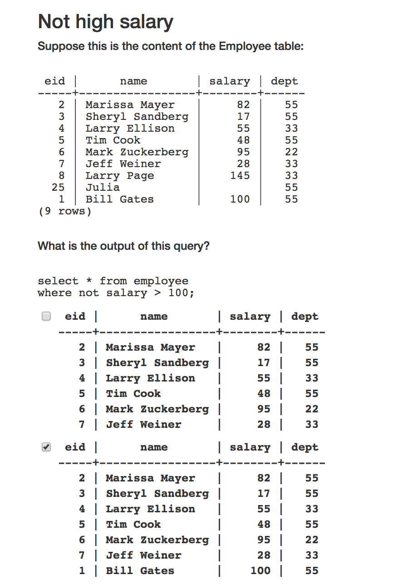
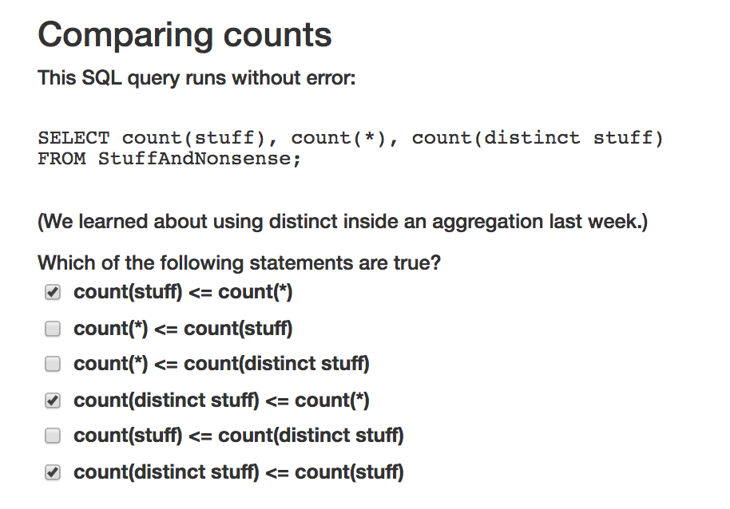
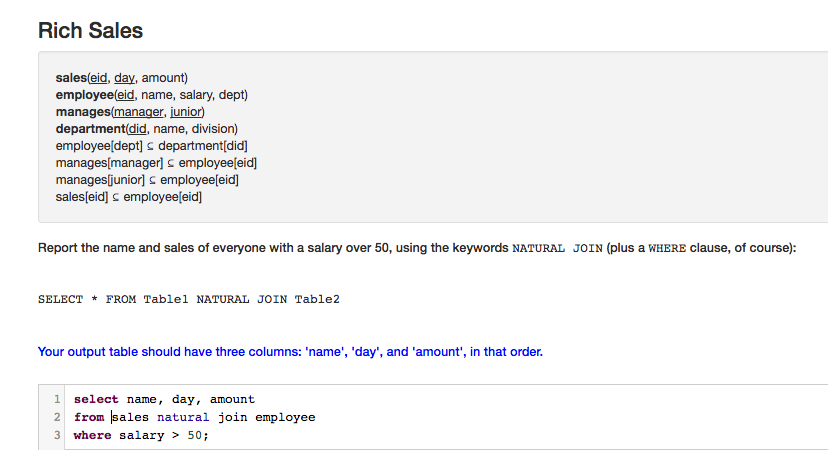
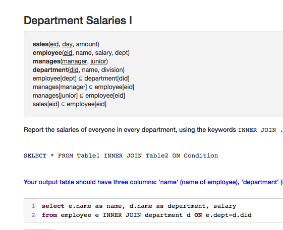
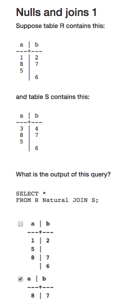
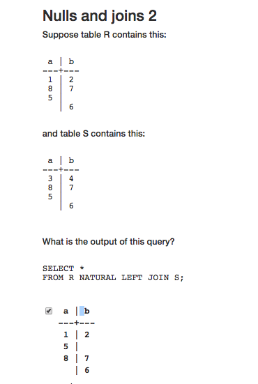
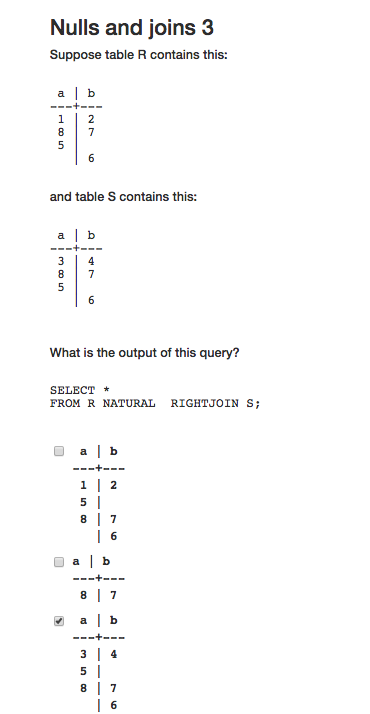
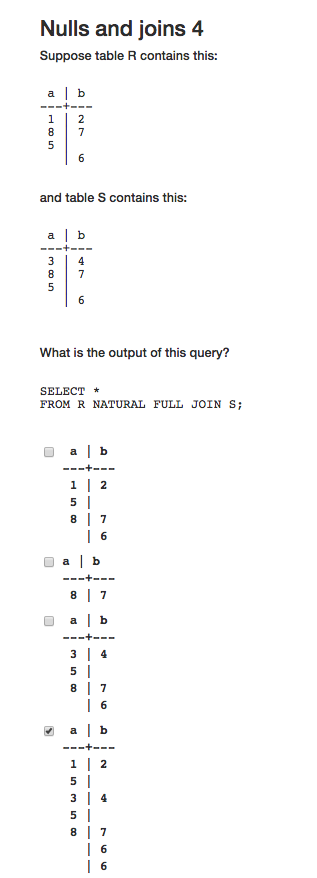
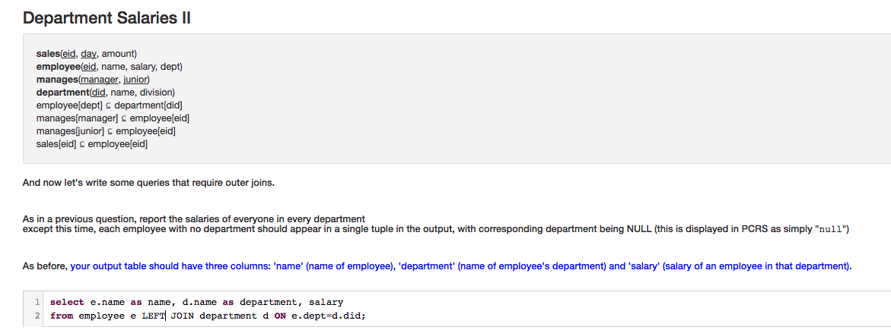
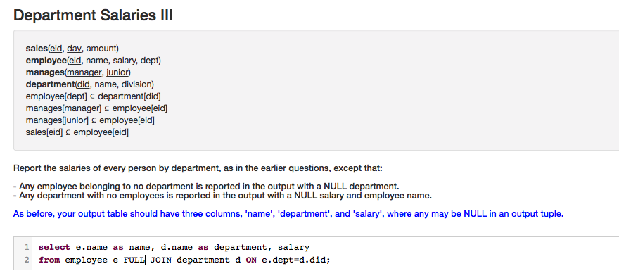

```sql 
select e.eid as manager
from employee as e cross join manages as m
where e.eid=m.manager
group by e.eid
having count(*) >= 2;
```




+ rows containing `null` is excluded from result for `natural join`s
    + because there is an implicit `where` clause




Why?


