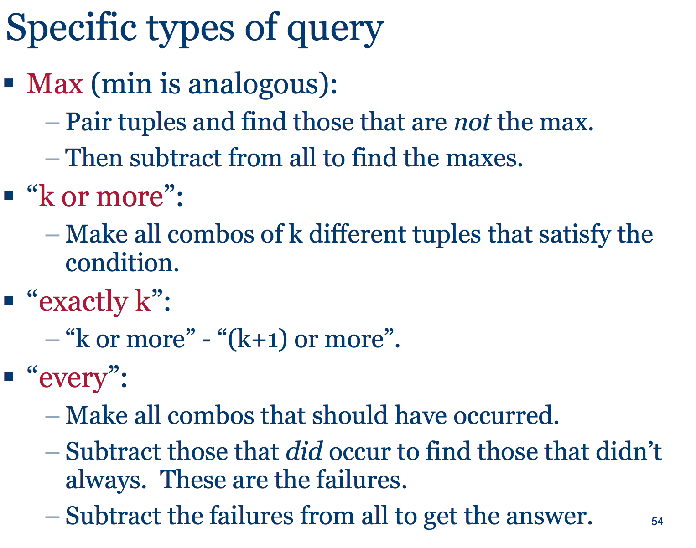
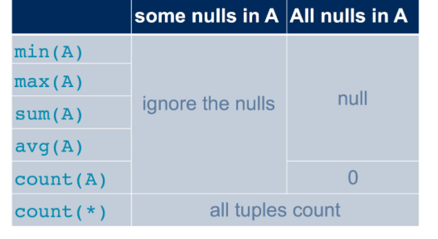
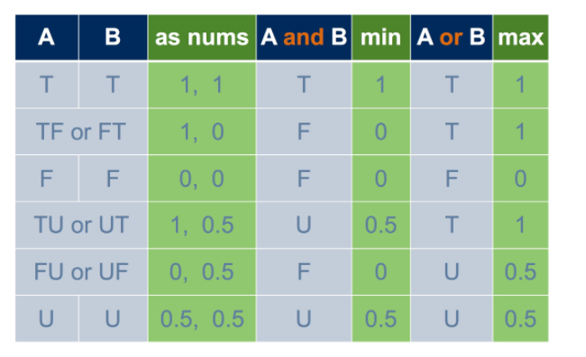

#### TODOS

+ look at w7, w8 exercise solution



+ tricks for solving relational algebra questions


--- 

#### SQL

+ aggregation
    + each row contribute to aggregation despite duplicates
+ order of execution 
    + `from` 
    + `where` filters rows 
        + cant reference names defined in `select`
    + `group by`
        + organize rows into groups, each resulting in one row 
    + `having` 
        + filters group
        + referring attr OK only if it is either aggregated or is an attribute on the `group by` list
    + `select`
        + projects/add columns
    + `order by`
        + sorts rows 
        + can reference column names in `select`
+ _bag semantics_ 
    + sql
        + allow duplicates 
    + `select-from-where`
        + leaves duplicates by default
        + `distinct`
            + enforces set semantics
            + works at row level
            + simply turn query into sets
            + so 1 `distinct` allowed in `select`
    + `union,intersect,except`
        + set semantics by default, duplicates eliminated
        + `all`
            + enforces bag semantics
            + `union` dump everything
            + `intersect`/`except` match up individual elements
        + `union all` ... 
+ `unknown`
    + if one or both operand `null`, then comparison evaluates to unknown
    + `where`/`natural join`
        + `unknown` value not included 
    + `aggregation`
        + 
    + _boolean_ 
        + 
+ `join`
    + dangling tuple    
        + joins that require some attributes to match, tuples lacking a match are left out of the results.
    + `outer join`
        + preserves dangling tuple by padding with `null`
+ _subqueries_
    + in set operation 
    + as a relation in `from`
        + enclosed in brackets and named
    + as a value in `where`
        + subquery must produce 1 row, yield false if 0 row
    + quantifying over multiple result in `where`
        + `all` 
        + `some/any`
        + `in/not in` 
        + `exist`
+ _correlated queries_ 
    + use table from outer scope, recomputed for each row
    + uncorrelated subquery
        + make no reference to outer query
```sql
delete from relation 
where condition;

-- delete all 
delete from relation;

-- update
update Student 
set campus = 'UTM'
where sid = 99999;

-- alter domain/table 
alter table Course
    add column numSections integer;
alter table Course
    drop column breadth;

-- remove table
drop table Course;
```
+ JDBC
    + call level interface
    + steps
        + prepare statement
        + execute query
+ `unique`
    + form a key 
    + values can be null
        + 2 `null` are considered not equal
        + can insert `(null, foo)` and `(null, foo)`
        + not allowed in primary key
+ `foreign key`
    + reference attr are `primary key` or `unique`
+ `check`
    + _attribute-based_
        + reference to that attribute, subquery allowed
        + `not null`
            + specific type of attribute based constraint
    + _tuple-based_
        + can refer to any attributes of the table
    + note only fails when evaluates to `false`, `unknown` is OK
        + vs. in `where`, `unknown` implies fail
+ `trigger`
    + cross-table, but can control cost over when they are applied
    + `after delete on relation` ... 
+ reaction policy   
    + for foreign key constraint
    + note policy is affecting table for which policy is defined, i.e. the referring table
    + `restrict`
        + do not allow deletion/update in referred table
    + `cascade` 
        + propagate change to referring table
    + `set null` 
        + sets referring attributes to null