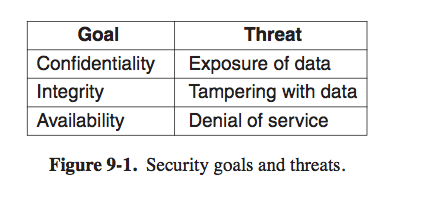
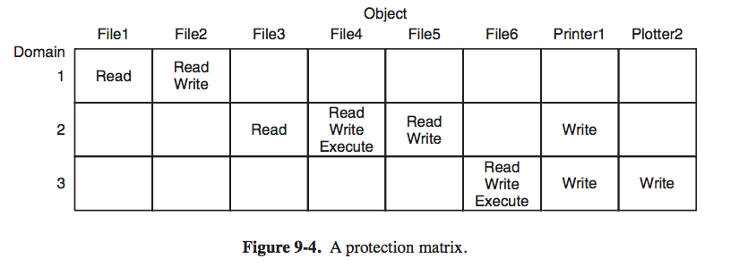
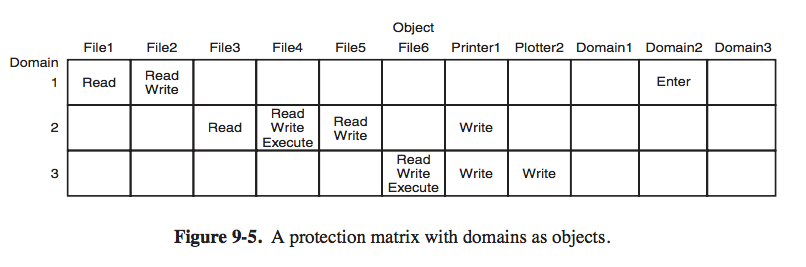
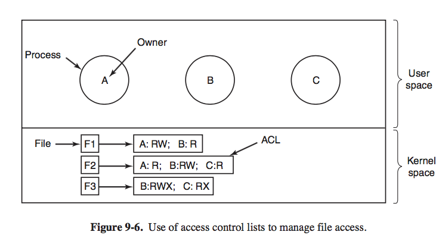
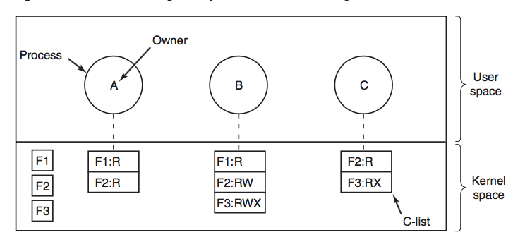
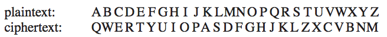
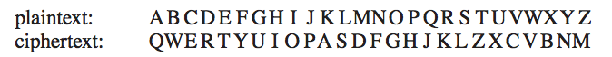
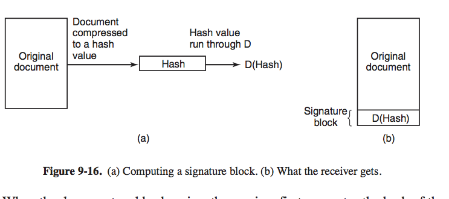
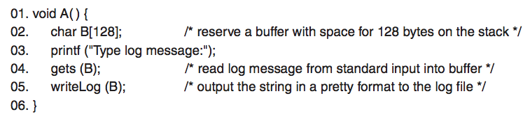
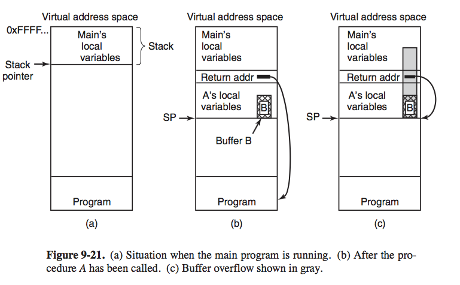

# 8 Security
 
+ _history_ 
    + up til 1990s, most people use multiuser computers isolated from network, so design has been focused on keeping user out of each others' way 
    + with rise of PC, phone, internet, most device has one user, but network snooping still happens
+ _encryption_ 
    > without the knowledge of the key, the adversay should not be able to read the message

+ _category_ 
    + _vulnerability_ 
        + a software bug (by application bloating) which introduce security loophole
        + _exploit_
            + bug triggering input
    + _virus_
        + needs at least some user interaction to propagate
    + _worm_ 
        + self-propelled 
    + _trojan_
        + a attack software installed willingly by the user

### 9.1 The Security Environment 

+ _terminology_ 
    + _security_ 
        + the problem of making sure files are not read/modified by unauthorized persons
    + _protection mechanism_ 
        + specific OS mechanisms used to safeguard information in the computer
+ _threat_ 
    + _security goals: CIA_
        + 
        + _confidentiality_ 
            + concerned with having secret data remain secret
            + OS guarantee that release of confidential data to unauthorized people never should happen
        + _integrity_ 
            + unauthorized user should not be able to modify any data without the owner's permission
            + including 
                + change data 
                + remove + add false data
        + _availability_ 
            + nobody can disturb the system to make it unusable
            + _denial-of-service_
                + a computer send more request than a server can handle, it might crash
        + _authenticity_ 
        + _accountability_
        + _norepudiability_ 
        + _privacy_ 
            + protect individuals from misuse of information about them...
    + _tooling_ 
        + `nmap` try and set up TCP connection to every possible port number...
        + _bot, zombie_ 
            + computer in control of attacker
        + _botnets_
            + thounsands of compromised computers 
        + _cyberweapon_ 
            + `Stuxnet` physically damanged a uranium enrichment facility
+ _attackers_ 

### 9.2 OS Security

+ _secure system?_
    + _argument_ 
        + in theory yes, we can build 
            + software without bugs
        + building secure system
            + no insentive...
            + the only known way to build a secure system is to keep it simple
            + features are enemy of security
                + i.e. ascii text can be fairly secure, but decoding `.word` file require running thirdparty softwares
+ _trusted computing base_
    + _trusted system_
        + system that obyes TCB (trusted computing base) consisting of hardware + software for enforcing all security rules
        + 
        + _reference monitor_ all syscall to one place to check

### 9.3 Controlling access to resources 

+ _protection domain_ 
    + _object_  
        + resources, maybe hardware or software
    + _goals_ 
        + a way to prohit processes from accessing objects that they are not authorized to access
        + restrict processes into a subset of legal operations when needed
    + _domain_ 
        + 
        + a set of `(object, rights)` pairs 
        + each pair specifies an object and some subset of operations that can be performed on it
        + at each instance
            + process runs in some protection domain
            + process can switch from domain to domain
    + _right_ 
        + permission to perform one of the operations
    + _POLA (Principle of Least Authority)_
        + security works best when each domain has the minimum objects and priviledges to do its work - and no more
    + _UNIX_
        + domain defined by `UID` and `GID`
        + on start
            + shell gets `UID` and `GID` in entry in password file 
            + inherited by all children
            + For each combination, create a list of all objects that can be accessed, and if they can be accessed for reading/writing...
        + _syscall_ 
            + kernel has access to all pages in memory, entire disk, and other protected resource 
            + so a _domain switch_ on syscall
        + `exec` with `SETUID` and `SETGID`
            + domain switch
        + _storing domain_ 
            + _a protection matrix_ 
                + 
                + rows are domains 
                + colmns are objects        
                + _domain switching_ 
                    + 
                     + impl by adding an `enter` object to column
                     + realize that domain switching is also an object
            + _problem_ 
                + sparse and a waste of disk space
+ _access control lists (matrix by column)_ 
    + _idea_
        + associate each object an (ordered) list containg all domains (`GID`, `UID`) that may access the object and how 
        + the list is access control list
    + 
        + _subject/principle_ 
            + users of objects
        + _object_ 
            + things owned by subject
        + Each file has an ACL associated with it.
            + each entry is a `(UID, GID, rights)`...
            + _rights_ granted by the user, not by process 
            + i.e. any process owned by `A` can read/write to `F1`
            + so it is the owner (`GID`, `UID`) that matters instead of process (`PID`)
        + _group_ 
            + group of users, 
            + each group represent a _role_
            + _everyone_ means a everyone group, `foo, *:RW`
    + ACL used in UNIX + Windows
+ _capabilities (matrix by row)_ 
    + _idea_
        + associate each process a list of objects that may be accessed, along with an indication of which operations are permitted on each
        + called _capacity list (C-list)_, where each individual item is called _capacities_ 
            + each capacity grants the owner certain rights on a certain objects
    + 
        + _sharing_ 
            + view capacity list as objects, 
            + so a capacity may point to a capacity list, for shared subdomains
    + _protection from modification_ 
        + _tagged architecture_ 
            + hardware design in which each memory word has an extra bit (tag) which tell if the word contains a capability or not 
            + modifiable in kernel only 
        + _keep C-list inside OS_
            + capabilities referred to by their position in the list
            + i.e. `read` 1kb from file pointed to by capability 2
        + _user space_ 
            + manages capabilities cryptographically so users cannot tamper with them
            + 
            + good with distributed systems
    + _types of capabilities_ 
        + `read`
        + `write`
        + `copy`: create a new capability for the same object 
        + `copy object`: create a duplicate object with a new capability
        + `remove`: delete an entry from C-list 
        + `destroy`: permanently remove an object and a capability
    + _ACL vs. capabilities_ 
        + _capabilities are efficient_
            + if a process say _open file pointed to by capability 3_
            + no checking needed
            + _ACL less so_
                + a long search of ACL may be needed
                + i.e. granting everyone read access to a file requires enumerating all users in the ACL. 
        + _ACL allows selecively revocation of rights_
            + _capabilities cant_
        + _ACL holds well if an object is removed_
            
### 9.5 Basics of Cryptography

+ _intro_ 
    + _plaintext_ 
        + message or file 
    + _ciphertext_
        + encrpyted plaintext
    + _purpose_
        + take a plaintext and encrpt it into ciphertext in such a way that only authorized people know how to convert it back to plaintext 
    + _encryption/decryption_ 
        + always public,
        + secrecy depends on keys 
    + _keys_
        + parameter to cryption algorithm
    + 
    + _encryption_
        + `P` is plaintext
        + `K_e` is encryption key, 
        + `C` is ciphertext
        + `E` is encryption algorithm 
        + `C = E(P, K_e)`
        + a ciphertext is obtained by using the (known) encryption algorithm `E` with plaintext `P` and the (secret) encryption key `K_e` as parameters
    + _Kerchhoff's principle_
        + idea that algorithm should be public and secrecy reside entirely in keys
    + _decryption_  
        + `P = D(C, K_d)` where `K_d` is the decryption key
+ _secret-key (symmetric-key) cryptography_ 
    + cyptographic systems where given the encryption key, it is easy to find the decryption key    
    + _monoalphabetic substitution_ 
        + replace each letter by a different one 
        + easy to break
            + natural language has certain frequency, 
        + 
            + `K_e`: `QWERTYUIOPASDFGHJKLZXCVBNM`
            + `K_d`: `KXVMCNOPHQRSZYIJADLEGWBUFT`
    + _advantage_ 
        + computation is not that time consuming
    + _disadvantage_
        + sender/receiver must possess the shared secret key
        + either have to get together physically for one to give it to the other
+ _public-key cryptography_ 
    + cryptographic systems where distinct keys are used for encryption and decryption
        + so virtually impossible to discover the corresponding decryption key
        + sometimes encryption key made public and decryption key private
    + _idea_
        + encryption make use of easy operation but decryption without the keys requires performing a very hard operation
    + _step_
        + everyone picks a `(pub, sec)` pair and publishes the public key
            + public key is the encryption key 
            + private key is decryption key 
        + To send a secret message, the correspondent encrypts the message with receiver's public key
        + since only receiver has the private key, only the receiver can decrypt the message
    + _RSA_
        + _idea_
            + multiplying big numbers is much easier for a computer to do than factoring really big numbers
    + _problem_
        + thousands of times slower than secret key cryptogrpahy
+ _one-way functions_ 
    + _cryptograpic hash function_ `f`, 
        + given `f` and `x`, computing `f(x)` is easy 
        + given `f(x)`, finding `x` is computationally infeasible
+ _digital signatures_  
    + _idea_
        + 
        + run document with one-way hash algorithm thats hard to invert 
            + `SHA-1` secure hash algorithm
                + produces 20-byte result 
            + the result is a checksum 
        + document owerner applies his private key to hash to get `D(hash)`, which is called _signature block_, is appended to document and sent to receiver
            + not decryption, since hash is not encrypted
            + just a mathmatical transformation
        + receiver computes hash `hash'` of document with algorithm agreed in advance, 
        + receiver applies sender's public key to _signature block_ to get `E(D(hash))`
            + this encrypt the decrypted hash 
        + if previous 2 hash does not match, the document must have been tampered
            + `E(D(hash)) = hash'`
    + _need to disclose public key senders_ 
    + _certificate_
        + contains public key and is signed by a trusted 3rd party
        + 3rd party accepts certificates from all senders 
    + _certificate authority (CA)_
        + a trusted third party that signs certificates
    + _PKI (public key infrastructure)_
        + require a scheme for managing public keys

### 9.7 Exploiting softwares

+ _red queen effect_   
    + arms race to survive... attacker/defender both becomes more sophisticated
+ _buffer overflow attack_
    + _idea_
        + no C compiler does array bound checking
    + 
        + `gets` 
            + reads a string of unknown size into fixed buffer until encounters `\n`
            + no buffer bounds checking
            + overflowed bytes will be stored on stack, overwritten
    + 
        + _steps_
            + push return address (addr of next instruction) onto stack
            + transfer control to `A`, which decrements SP by 128 to allocate storage for local variables (buffer `B`)
            + user provides more than 128 bytes, overwrites return address to subvert program's control flow, i.e. store address to start of `B`
            + program jump to beginning of `B` starts executing code stored in buffer `B`
            + program completely under attacker's control
                + usually to launch a shell, to enable intruder access..
        + called _shellcode_
    + _condition_
        + happens when there are changes of copying user-provided data in a buffer without checking for boundary violations
    + _nop sled_
        + attacker need to know exact address to return to?
        + approximately is OK, 
        + just prepend the shellcode with a nop sled, which is a sequence of 1 byte `NO OPERATION` instructions. 
        + as long as attacker land anywhere on nop sled, execution will eventually reach the real shellcode

    
