# 10.3 Process in Linux 


+ _fundamental concepts_ 
    + _daemon_ 
        + background processes 
        + start up by shell script when system booted 
    + _cron daemon_ 
        + wakes up to check if there is any work to do
    + `fork` 
        + 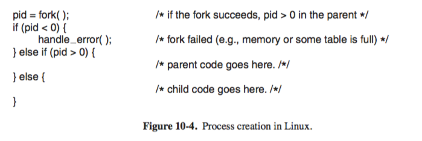
        + parent and child process 
        + each with private memory images, 
        + resources are identical copies
    + inter-process communication 
        + `pipe`
        + `signal` 
            + 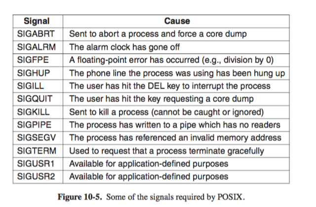
            + signal handling procedure... 
            + a process can send signals only to members of its process group, which consists of its parent, siblings and children (and furthur descendents)
+ _process management syscall in Linux_ 
    + 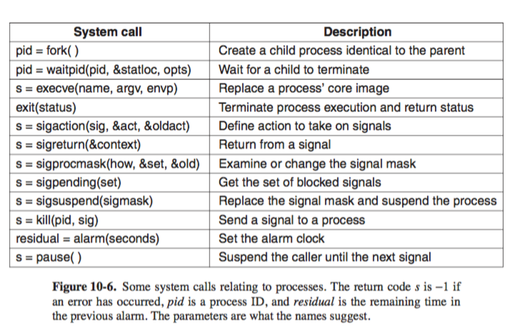
    + `fork` 
    + `waitpid` 
    + `exec`
    + simplied shell 
        + 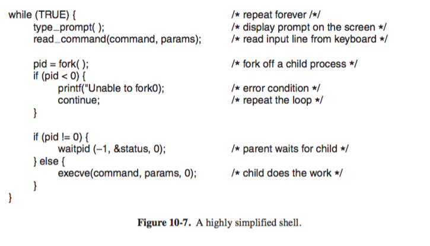
    + _zombie_ 
            + if process exists and its parent has not yet waited for it, 
            + when parent finally waits for it, the process terminates
    + `sigaction`
    + `alarm`
        + process often needs to be interrupted after a specific time interval to do something,
                + i.e. transmit potentially lost packet over a network 
        + specifies time interval, after which a `SIGALRM` is sent to the process
        + one outstanding (the last specified) is executed only 
    + `pause`
        + tells Linux to suspend process until next signal arrives 
+ _implementation of processes and threads in Linux_ 
    + in kernel, process is represented as `task` via structure `task_struct`
        + `task_struct` does not distinguish process, light process, or threads
            + i.e. each thread has its own `task_struct`
    + process is identified by `pid`, processes are organized in doubly linked list of `task_struct`
        + `pid` is mapped to address of `task_struct`, allowing random access in addition to linked list traversal
    + process descriptor of type `task_struct` reside in memory at all time. 
        + 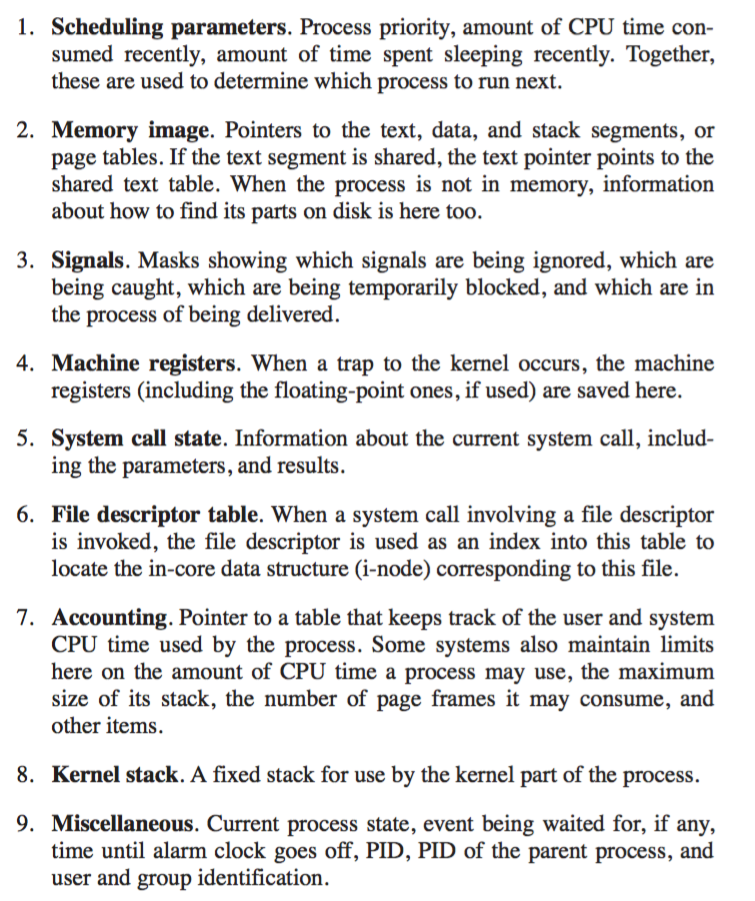
        + _scheduling params_ (priority, amount of CPU consumed recently, time spent sleeping)
        + _mem usage_ (Pointers to text,data,stack,page tables)
        + _signals_ (masks, caught, blocked, in process of deliverance)
        + _machine registers_ (saved upon trap to kernel)
        + _syscall state_ (info about current syscall, including param, result)
        + _fd table_ (`fd` used in this table to locate in-core data structure (`i-node`) corresponding to this file)
        + _accounting_ (pointer to table keeping track of user/system CPU time)
        + _kernel stack_ (fixed stack for use by kernel part of process)
        + _misc_ (current process state, time to next clarm, `pid`, `ppid`, `uid`, `gid`)
    + _process creation_    
        + `fork` traps to kernel 
            + create `task_struct` and `thread_info`, etc...
                + content filled from parent 
            + child given `pid`, 
                + updates `pid` hash-table entry to point to the new `task_struct`
            + memory map set up 
                + allocate and make copy over to child's data and stack segment 
                + however copy is expensive, usually just give child page table, have them point to parent's page, marked as read only. 
                + so whenever either process tries to write on a page, gets a protection fault 
                + kernel then allocates a new copy of page to the faulting process and marks it read/write
                + so only pages that are actually written to are copied (_copy on write_)
            + shared resources given 
            + registers setup and ready to run 
        + `exec`
            + finds executable, copies arg and env stirngs to kernel
            + releases old addresss space and its page table 
            + New address space created and filled in, new page table set up to indicate no pages are in memory 
            + process starts running 
            + page fault, cause loading of first page from executable file, hence nothing needs to be loaded in advance, so program starts quickly 
            + args and env copied to new stack 
            + signals reset 
            + registers init to zero 
            + starts running...
    + _executing `ls`_ 
        + 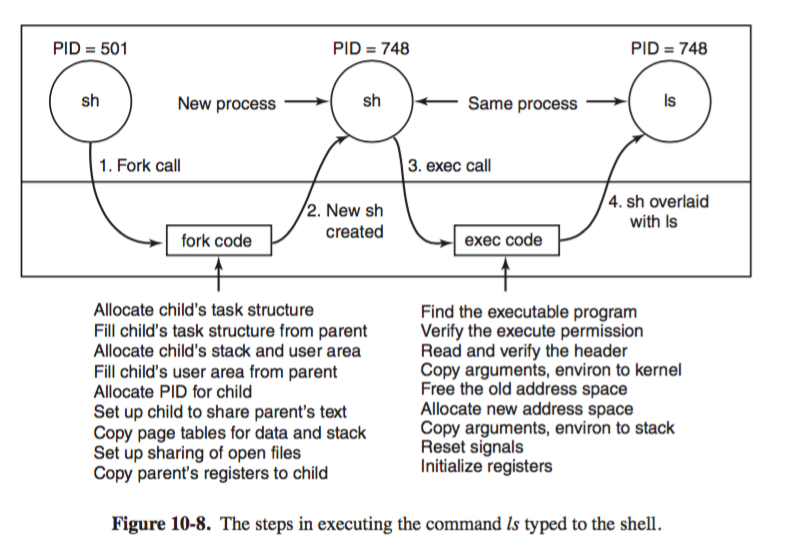
+ _threads in Linux_ 
    + problem 
        + does `fork` a multithreaded process create all corresponding thread in child?
        + how does 
            + blocked syscall in another thread affect be handled 
            + File IO 
            + signal handling 
             ...
    + `clone`
        + traditionally, 
            + a newly created thread shared everything but their registers, `fd`, signal handler, alarms, global properties were per process not per thread
        + `pid = clone(function, stac_ptr, sharing_flags, arg)`
            + makes each aspect and others to be process specific or thread specific 
            + makes thread in current or new process depeneding on `sharing_flags`
                + if new thread in current process,
                    +  shares address space with existing threads, every subsequent write to any byte in address spsace by any thread is immediately visible to all other threads. 
                + if address space not shared, then create new thread gets an exact copy of address space, but subsequent write by new thread are not visible to old ones. ( same as `fork` )
            + in both case, 
                + thread begin executing `function`, called with `args`
                + new thread gets its own private stack, with stack pointer initialized to `stack_ptr`
            + `sharing_flags`
                + bitmap where each bit determines if new thread copies some data, or shares it with the calling thread. 
                + 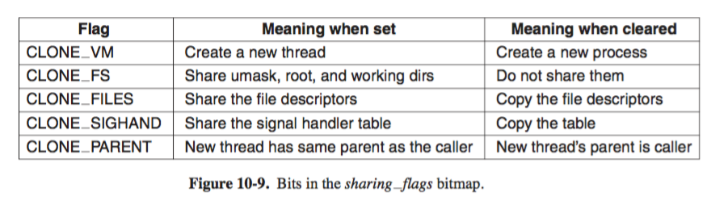
                    + note `CLONE_VM` is essentially creating a thread if set and creating a new process if unset
                    + `CLONE_FS`: controls hsaring fo root and working directories of `umask` flag. So even if new thread has its own address space, hence able to use `chdir` from a thread in one process to change directory of another thread in another process 
                    + similar mechanism works for `CLONE_FILES`, `CLONE_SIGHAND`
                    + `CLONE_PARENT`: decides parent...
                + fine-grained sharing is possible because separate data structure for various item above are stored independently, `task_struct` just points to these data stuctures
            + problem 
                + UNIX specifies a single `PID` with a process, regardless if its single- or multi-threaded 
                + to be compatible with UNIX, Linux distinguishes `PID` and `TID` for task identifier 
                    + so if `clone` used to create a new process, `PID` is set to new value, otherwise, task receive a new `TID` but inherits the `PID`.
                

# 10.5 Booting in Linux

+ steps 
    + _BIOS_ 
        + power-on-self-test (POST)
        + initial device discovery and initialization (since OS booting requires access to disk, screens, keyboard)
    + _MBR(master boot record)_
        + MBR in first sector of disk read into memory and executed
        + contains small (512-byte) program that loads standalone program called `boot` from boot device, such as SATA, or SCSI disk 
    + `boot` 
        + reads root directory of boot device 
        + understand file system and directory format 
            + as in GRUB(GRand Unified Bootloader)
        + reads in OS kernel and jumps to it 
        + job finished, kernel starts running 
    + _kernel start-up code_
        + start-up code written in assembly, and machine dependent 
        + setting up kernel stack 
        + identify CPU type 
        + calculate RAM present 
        + disable interrupts 
        + enable MMU 
        + calling C-language `main` procedure to start man part of OS 
    + _kernel_
        + allocate kernel data structure 
        + begins autoconfiguration,
        + probe I/O devices, and attach available devices 
            + note device driver not need to statically linked, but loaded dynamically 
            + a tradeoff between _convenience and security_
        + create process 0, setup its stack, run it 
    + _process 0_
        + 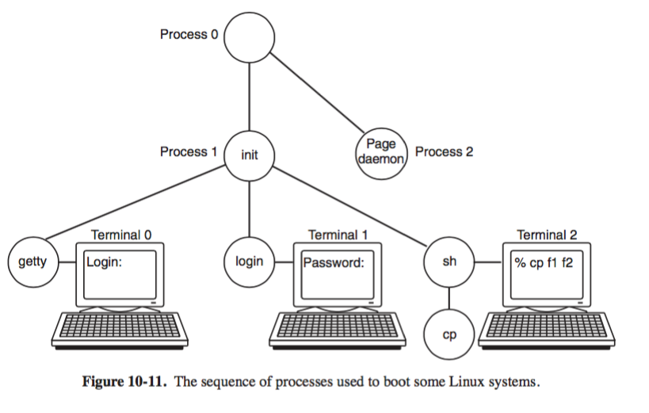
        + programming real time clock and mounting root file system 
        + create `init` process 1 and `page daemon` process 2
        + `init` 
            + forks off a process that 
                + executes system initialization shell script `/etc/rc`, 
                    + consistency check, mount additional file system, starts daemon 
            + reads `/etc/ttys`, a list of terminals and some properties 
                + forks a copy for each enabled terminal
                + `getty`, 
                    + to set line speed, and other properties 
                    + displays and handles _login_
                    + terminates by executing `/bin/login`, 
                + `login`
                    + which verify encripted password to `/etc/passwd`, 
                    + if correct, `login` replaces itself with user shell
                + `shell`


# 2.3 Interprocess communication (IPC)

+ _race condition_ 
    + _definition_: output is dependent on the sequence or timing of other uncontrollable events.
        + when two or more processes are reading or writing some shared data and the final result depends on who runs precisely when, are called race conditions
    + _print spooler_ example 
        + 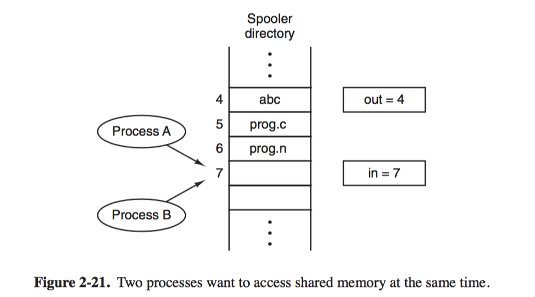
        + OS communicate by sharing a common storage for read/write
            + every process has address of `out` and `in` which points to next file to be printed and next free spot respectively
            + if two processes A and B decide to queue file simultaneously 
                + `A` reads `in` as 7
                + clock interrupt CPU switches to `B`
                + `B` also reads `in` as 7, and store file name in `in`, updates `in` to 8
                + `A` run again, overwrites the file name `B` just wrote, and also updates `in` to 8
                + Note `B` never gets its file printed because its overwritten
+ _critical region_ 
    + race condition revolves around _shared_ resources, (memory, file). 
        + so need a way of making sure if one process is using a shared variable/file, the other process will be excluded from doing the same thing.
    +  _mutual exclusion_ 
        + is a property of concurrency control, which is instituted for the purpose of preventing race conditions; 
        + it is the requirement that one thread of execution never enter its critical section at the same time that another concurrent thread of execution enters its own critical section.
    + _critical region_ 
        + process can be doing internal computations and other things not leading to race condition, but sometimes it has to access shared memory/files which can lead to races. That part of program where shared memory is accessed in critial region
        + almost always a valid problem since parallel processes coorporate on shared data 
    + _condition for securing exclusive access to shared resources?_ 
        + __mutual exclusion__ no 2 processes may be simultaneously inside critical regions 
        + no assumption may be made about speeds or number of CPUs
        + no process running outside its critical region may block any processes 
        + no process should have to wait forever to enter its critical region (_no deadlocks_)
            + waiting threads must be able to enter critical section eventually 
        + __progress__  if no process is executing in its critical section and some processes wish to enter their critical sections, then only those processes that are not executing in their remainder sections can participate in making the decision as to which process will enter its critical section next.
            + A process cannot immediately re-enter the critical section if the other process has set its flag to say that it would like to enter its critical section.
        + __bounded waiting__ the number of times a process is bypassed by another process after it has indicated its desire to enter the critical section is bounded by a function of the number of processes in the system
    + 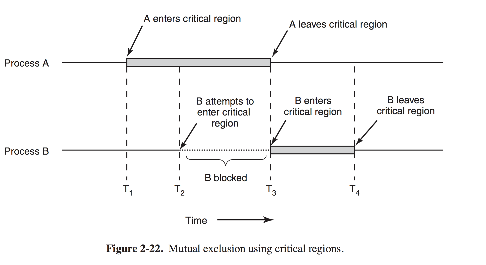
    + _process execution states_ 
        + _non-criticle section_ 
            + process not requesting/using shared resources
        + _trying_ 
            + attempts to enter critical section
        + _critical section_    
            + process is accessing shared resources
        + _exit_ 
            + process leaves the critical section and makes shared resources available to others
+ _mutex with busy waiting_ 
    + _disabling interrupts_ 
        + specifically, have each process disable all interrputs after entering critical region and re-enable them just before leaving it. 
        + consequence 
            + no clock interrupts can occur, hence no context switching 
            + process must finish its work in the critical section and exits, which ensures mutex
        + discussion 
            + unwise to give user processes to turn off interrupts (never turn back on again?)
            + problematic for multiprocessor CPU, since disabling one CPU does not prevent other CPUs from interfering with operations the first CPU is performing
    + _lock variable_ 
        + description 
            + shared `lock = 0`, 
            + when process wants to enter critical section, 
                + test lock 
                + if `lock == 0` (no process in critical region atm), then process sets it to 1 and enters critical section 
                + if `lock == 1`, then process waits until it beomes 0
        + discussion 
            + cannot avoid race condition, suppose one process reads `lock` and see its 0, enters critical section and sets `lock` to 1, another process is scheduled, runs, sets `lock` to 1, the processes will be in critical section at the same time
    + _strict alteration_ (_spin lock_)
        + description 
            + 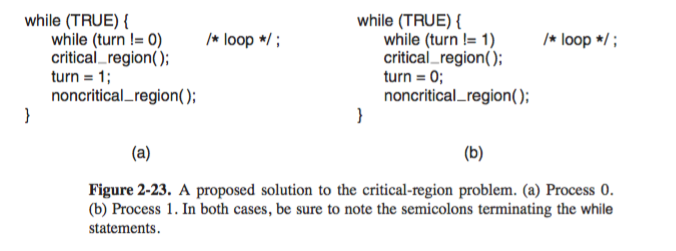
            + shared `turn = 0`, keep track of whose turn it is
            + _busy waiting_ 
                + constantly testing a variable until some value appears 
                + constant CPU strain, appropriate only when expecting short wait time 
            + _spin lock_ 
                + a `lock` that uses _busy waiting_
        + simulation 
            + process `A` ( `turn = 0`) and `B` (`turn = 1`) 
            + `A` inspects `turn`, finds it be `0`, enters critical region 
            + `B` scheduled, inspects `turn`, finds it be `0`, sits in tight loop continually testing `turn` to see when it becomes `1`
            + `A` exits, set `turn` to `1`
            + `B` scheduled, enters critical region, sets `turn = 0`, and exits,
                + so far so good 
            + `A` enters critical region and exists while setting `turn = 1`, it goes back to top of loop again, 
                + note it is not permitted to enter because `turn=1` 
                + hangs in `while` loop until `B` sets `turn` to `0`
        + discussion 
            + not a good idea to take turns if one is much slower than the other
            + violates 3rd assumption on _no process running outside its critical region may block any processes_
                + here `A` is blocked by `B`, which is not in critical region
            + this solution, although avoids race conditions, requires _strict alteration_ between 2 processes 
    + _Peterson's Solution_ 
        + description 
            + software solution: avoids _strict alteration_
            + assume single _assignment_ is atomic
            + before entering critical region, each process calls `enter_region(pid)`
                + wait if need be, until safe to enter 
            + before exiting critical region, each process calls `exit_region(pid)`
                + indicate it is done, allows other process to enter, if it so desires
        + C implementation 
            +   ```c
                #define FALSE 0 
                #define TRUE 1
                #define N 2         /* number of processes*/

                int turn;           /* whose turn is it */
                int interested[N]   /* all values initially 0 (FALSE) */ 

                void enter_region(int process); /* process is 0 or 1 */
                {
                    int other;                  /* number of other processes */
                    other = 1 - process;        /* the opposite process */
                    interested[process] = TRUE; /* show you are interested */
                    turn = other;             /* set flag */
                    while(interested[other] == TRUE && turn == other){};          /* null statement */ 

                    /* here only if either 
                        -- interested[other] == FALSE (`other` left critical region)
                        -- turn != other (`other` is trying to enter, but is waiting at while)
                    */
                }

                void leave_region(int process)      /* process: who is leaving */
                {
                    interested[process] = FALSE     /* indicate departure from critical region */
                }
                ```
        + simulation 
            + process `0` and `1`
            + _scenario 1_
                + `0` calls `enter_region`, indicates interest by setting `interested[0] = TRUE` and `turn` to 0, since `1` not interested, `enter_region` returns immediately 
                + `1` calls `enter_region`, will hang there until `interested[0]` goes `FALSE`, which only happens when `0` calls `leave_region`
            + _scenario 2_
                + If `0` and `1` call `enter_region` almost simultaneousy, both will store `process` in `turn`, but whichever store is done last is the one that counts; the first is overwritten and lost 
                + suppose `1` stores last, `turn` is `1`, when both processes come to `while`, `turn=1` in both cases and 
                    + `0` executes it zero times and enters critical region. 
                    + `1` loops and does not enter critical region until `0` exits its critical region
        + satisfy condition 
            + _mutual exclusion_: 
                + If `0` in critical region, then `interested[0]` is `TRUE`. In addition, either
                    + `interested[1] = FALSE` (`1` left critical region), or
                    + `turn = 0` (`1` is just now trying to enter but is waiting)
                + so if both `0` and `1` in critical region, must satisfy both `interested[0] = TRUE`, `interested[0] = TRUE`, `turn = 0` and `turn = 1`. The latter condition on `turn` is not possible
            + _progress_: if `0` in critical region, then `turn = 0` and `interested[0] = TRUE`, when `0` finishes `intersted[1] = FALSE` and `1` waiting will now be able to enter the critical region 
            + _bounded waiting_: a process in Peterson's algo never wait more than one round for entrance to critical region
                + if `0` is waiting, `1` can only enter its critical section once, since 
                + when `1` exits, `interested[1] = FALSE`, ( as in _progress_ ) 
                    + if `0` is scheduled, this condition breaks busy waiting and will allow `0` to enter
                    + if `1` calls `enter_region` again, it will have to wait 
    + _The TSL Instruction_ 
        + description 
            + hardware solution 
            + `TSL RX,LOCK` _Test and Set Lock_
                + memory bus locked until accessing memory is done
                + different from interrupts, in that it works for multiple CPU as well
            + __[Atomic --__ reads content of memory word `lock` into register `RX` and then stores a nonzero value at mem addr `lock` __--Atomic]__
            + `lock`
                + `= 0` any process may set it to `1` 
                    + start read/write shared resources
                    + resets to `0` on exit
                + `= 1` 
        + implementation 
            + 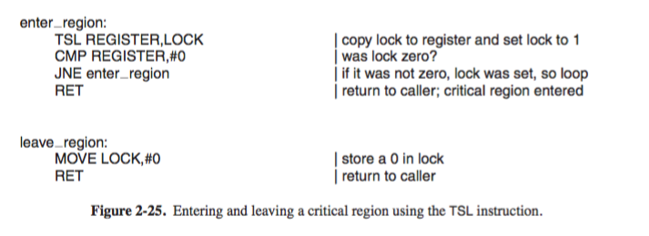  
                + copies old value of `lock` to `register` 
                + compare `register` with 0 
                + sooner or later `register` is going to become `0` (i.e. other process exits critical region and sets `lock` to `0`)
                + when it does, subroutine returns with `lock` set to 1
            + 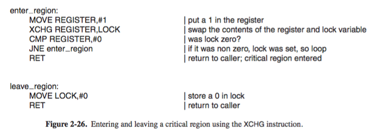
    + _Sleep and Wakeup_
        + description 
            + _blocking_: avoids busy waiting (wasting CPU time) with  
            + `sleep`
                + causes caller to block, i.e. suspended, until other process wakes it up 
            + `wakeup(pid)`
                + wakes up process `pid` 
    + _Producer-Consumer (bounded-buffer) problem_   
        + _problem description_ 
            + 2 process share a common, fixed-sized buffer 
            + _producer_ puts information into buffer 
            + _consumer_ takes it out 
        +  solution (with fatal race condition)
            + 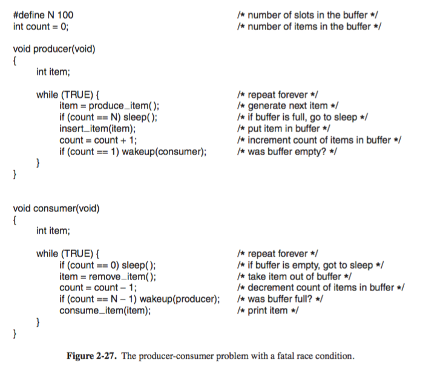
            +   ```c
                #define N 100 
                int count = 0

                void producer(void)
                {
                    int item;
                    while(TRUE){
                        item = produce_item();
                        if(count == N) sleep();         // goes to sleep if buffer is full
                        insert_item(item)               // otherwise able to insert item 
                        count++
                        if(count == 1) wakeup(consumer)     // wake up the asleeped consumer if buffer were empty
                    }
                }

                void consumer(void)
                {
                    int item;
                    while(TRUE){
                        if(count == 0) sleep()              // go to sleep if buffer is empty
                        item = remove_item()
                        count--
                        if(count == N-1) wakeup(producer)               // wake up asleeped producer if buffer were full
                        consume_item(item)
                    }
                }
                ```
            + _producer_ put new item to a full buffer 
                + let producer sleep, to be awaken when the consumer removed one or more items 
            + _consumer_ takes item from an empty buffer
                + let consumer sleep until producer puts something in the buffer and wake it up
        + race condition to shared `count` variable
            + initially, buffer is empty with `count = 0` 
            + _consumer_ check `count -> 0`, about to but had yet to call `sleep`
            + _producer_ is scheduled, 
                + inserts an item and increments `count -> 1`
                + calls `wakeup`, but consumer is not logically asleep, so wakeup signal is lost. 
            + _consumer_ runs, it will test value of `count` previously read, find it to be `0`, an go to sleep. 
            + sooner or later, _producer_ fill up buffer and also go to sleep 
            + both sleep forever
        + discussion 
            + problem is that a `wakeup` sent to a process no (yet) sleeping is lost. 
            + a quick fix involves adding a _wakeup waiting bit_ to the picture, 
                + when wakeup is sent to a process still awake, set this bit, 
                + later when process tries to go to sleep, if the bit is on, it will be turned off but process will stay awake
    + _semaphores_  
        + description 
            + _semaphore_ 
                + a recorde (integer) of how many units of a particular resource are available, coupled with operations to adjust that record safely (i.e. to avoid race conditions) as units are required or become free, and, if necessary, wait until a unit of the resource becomes available
            + _binary semaphores_ 
                + initialized to `1` to ensure only one of them can enter its critical region 
            + _atomic action_ 
                + a group of related operations are either all performed without interruption or not performed at all.
            +  __[Atomic]__ `down`
                + checks if value is greater than 0
                    + if so decrement value and continues
                    + otherwise process put to sleep (not completing `down` yet)
            +  __[Atomic]__ __[Non-blocking]__ `up`
                + increments value of semaphore addressed. 
                + If one or more processes where sleeping on that semaphore, unable to complete an ealrier `down` operation, one of them is chosen (by system at random) and is allowed to complete its `down`
            + `up` and `down` implementation 
                + as syscalls where the system disables all briefly disables all interrupts while it is testing the semaphore, updating it and putting the process to sleep
                + or on multi-processor systems, as `TSL` to prevent multiple CPU from accessing it concurrently
            + _semaphores  (blocking)_ vs. `TSL` (_busy waiting_)
                + `TSL` on preventing concurrent access to semaphore is different from the producer/consumer busy waiting (with `TSL`) for the other to empty/fill the buffer. 
                + semaphore operation takes a few microseconds 
                + producer/consumer might take arbitrarily long
        + _solution to producer-consumer lost-wakeup problem_   
            + 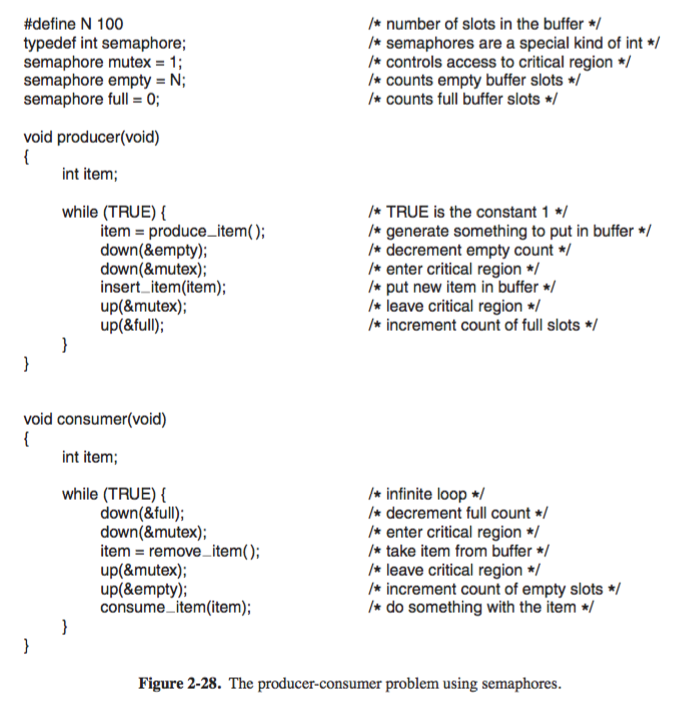
            + `full`: counts number of slots full 
            + `empty`: counts number of slots empty
                + both are for _synchronization_ (i.e. making sure certain event sequences do not occur)
            + `mutex`: make sure producer/consumer do not access the buffer at same time
                + _binary semaphore_ init to `1`
                + if `down` before enter and `up` before exit, then _mutual exlusion_ guaranteed
        + simulation 
            + `full = 0`, `empty = N`, `mutex = 1`
    + _Mutexes_ 
        + description 
            + simplified semaphore where the ability to count is not needed 
        + `mutex` ADT
            + shared variable in one of 2 states 
                + `unlocked <- 0` 
                + `locked <- non-zero`
            + procedures 
                + `mutex_lock`  
                    + request access to critical region 
                    + if `mutex` is `unlocked`, then call succeeds and calling thread is free to enter critical region 
                    + otherwise, if `mutex` is `locked`, the calling thread is blocked until thread in critical region finishes and calls `mutex_unlock`; if multiple threads blocked on the `mutex`, then any one of them is chosen at random and allowed to acquire `mutex`
                + `mutex_unlock`
                + __[optional]__ `mutex_trylock`
                    + acquire lock or return code for failure, but does not lock
            + implementation 
                + 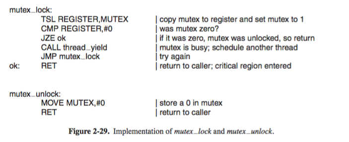
                + easily with `TSL` in userspace 
                + simlar to `enter_region`, but differs in scheduling 
                    + `enter_region` uses _busy waiting_, 
                        + _processes_ clock will eventually run out and some other process is scheduled to run, sooner or later the process holding the lock gets to run and releases it 
                        + _threads_ there is no clock to stop thread from running too long, hence thread tries to acquire a lock by busy waiting will loop forever, and never acquire the lock because it never allows any other threads to run and release the lock  
                    + `mutex_lock`, no _busy waiting_
                        + failure to acquire lock calls `thread_yield` to give up CPU to another thread, hence no busy waiting
                        + `thread_yield` is a call to thread scheduler in userspace, hence 
                            + no need for kernel trap 
                            + very fast 
    + _Futexes_ 
        + tradeoff
            + _spinlocks_ with busy waiting is fast if the wait is short, but waste CPU cycles if not 
            + _semaphores/mutexes_ may be more efficient as they block processes and let kernel unblock it only when lock is free, but continuous switch to kernel mode is expensive
        + solution 
            + _fast user space mutex (futex)_
                + avoids dropping into kernel unless it really has to 
    + _Mutexes in `Pthreads`_
        + 

                        


# tutorial 

+ _loadable kernel module_ 
    + object file that contains code to extend the running kernel of OS
        + `.ko`
    + support for new hardware, filesystem, added syscalls 
+ loading unloading 
    + `insmod mymodule.ko`
    + `rmmod mymodule.ko`
+ `modprobe`
    + add remove modules from linux kernel 
        + also manages module dependencies `depmod`
    + looks in _/lib/modules/`uname -r`_ for module and other files
    + module failure accompanied by kernel message `dmesg`
+ `dmesg`
    + prints kernel ring buffer 
+ `kbuild`
+ error handling 
    + see [`include/asm-generic/errno.h`](https://github.com/torvalds/linux/blob/master/include/uapi/asm-generic/errno.h) and [`include/asm-generic/errno.h`](https://github.com/torvalds/linux/blob/master/include/uapi/asm-generic/errno-base.h)
    
