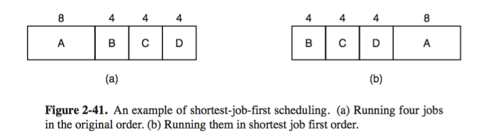
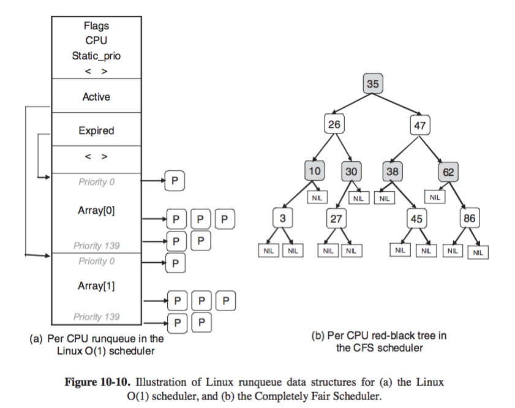

# 2.4 Scheduling 

+ _definitions_
    + _scheduling_ 
        + determine which of the two or more of processes/threads in _ready_ state gets to run next
        + considers making efficient use of CPU to avoid context switching
    + _scheduler_
        + part of OS that makes such choice 
    + _scheduling algorithm_
        + algorithm it uses 
+ _intro_ 
    + _history_
        + batch system: run next job 
        + batch and timesharing service: decide if a batch job or interactive user should go next 
        + PC: 
            + changes: just one user present and CPU is not a scarse resource 
            + hence not of importance
        + networking server: decide if a process that gathers daily stat vs. one that handles user request 
    + _process behavior_    
        + 
        + nearly all processes alternate bursts of _computing_ with _(disk or network) I/O_
            + e.x. CPU runs for a while, syscall made to read a file. When syscall finishes, CPU computes again
        + _Compute-bound (CPU-bound)_: 
            + spend most of their time computing 
            + long CPU bursts and infrequent I/O waits 
        + _I/O bound_: 
            + spend most their time waiting for I/O
            + short CPU bursts and frequent I/O waits 
            + should prioritize I/O requests so as to make disk busy
        + _observation_ 
            + _length of CPU bursts_ is of matter here, not _length of I/O waits_ 
                + IO-bound processes are IO bound because they do not compute much between IO requests, not because they have especially long I/O requests 
            + processes tend to get more I/O-bound as CPU gets faster (i.e. CPU burst gets shorter in length)
                + because CPU improving faster than disks 
    + _when to schedule_ 
        + _situations_ 
            + _`fork`_: pick either child or parent, both in _ready_ state 
            + _`exit`_: an idle process is run 
            + _blocked on I/O, on semaphore, ..._: 
            + _I/O iterrupt_: run the process that waited for the I/O job to finish, or some other process 
        + _clock interrupts_: 
            + hardware clock provides periodic interrupts at 60Hz or other frequency, a scheduling decision can be made at each or `k`th interrupts
            + _nonpreemptive scheduling algo_: picks a process to run and then just lets it run until it blocks (on I/O or waiting for another process) or voluntarily release the CPU
                + can theoretically run forever 
                + no scheduling decision at clock interrupts 
            + _preemptive scheduling algo_: picks a process and lets it run for a maximum of some fixed time. If it is still running at end of time interval, it is suspended and the scheduler picks another process to run 
                + requires clock interrupt at end of time interval to give control of CPU back to scheduler
    + _categories of scheduling algo_ 
        + different algo is needed since different application area have different goals 
        + _environment_ 
            + _batch_ 
                + for periodic tasks with no interactive users 
                + nonpreemptive algorithms, or preemptive algorithm with long time periods for each process, are acceptable
                    + reduces process switches and improves performance
            + _interactive_ 
                + multiple interactive users, e.x. a server 
                + preemption is essential 
            + _real time_ 
                + process data as it comes 
                + preemption sometime not needed since process know they may not run for long periods of time and usually do their work and block quickly
    + _scheduling goals_ 
        + _all system_ 
            + _fairness_: each process has a fair share of CPU 
            + _policy enforcement_: stated policy is carried out (usually a tradeoff with fairness)
            + _balance_: keep all parts of system busy, i.e. both CPU and disk 
                + e.x. batch system have some CPU-bound processes and some I/O bound processes running together
        + _batch system_ 
            + _throughput_: maximize jobs/hour 
            + _turnaround time_: minimize job averaged time between submission and termination 
                + a measure of how long a user waits for a job for ouput
                + __TRADEOFF__: system may still achieve _high throughput_ by running lots of short jobs (that arrives at a fairly steady rate), which, as a tradeoff, causes _high turnaround time_
            + _CPU utilization_: keeps CPU busy all the time 
                + usually not a good metric, _throughput_ and _turnaround time_ are what matters
        + _interactive system_ 
            + _response time_: respond to request quickly
                + reduce time between issuing a command and getting the result
                + e.x. on PC
            + _proportionality_: meet users' expectation 
                + examples
                    + uploading 500MB video take 60s is expectedly long 
                    + clicking on icon that breaks connection to server after video uploaded takes 60s is unexpectedly long 
                    + caused by: perception that sending lot of data is supposedly take longer than just breaking connection
        + _real-time system_
            + _meeting deadlines_: avoids losing data 
                + example: if computer is controlling a device that produces data at regular rate, failure to run the data-collection process on time may result in data loss
            + _predictability_: avoids quality degradation in multimedia systems 
+ _Scheduling on Batch system_ 
    + _First-Come, First-Serve_ 
        + processes are assigned CPU in order they request it 
            + a single queue of ready processes
            + nonpreemptive, i.e. long running tasks are not interrupted 
        + _discussion_  
            + _advantage_ 
                + easy to implement: a single linked list keeps track of all ready processes
            + _disadvantage_
                + average wait time is high
                + inefficient with lots of I/O-bound processes and few blocking CPU-bound process 
                    + 1 CPU-bound process take say 1s to finish, everytime its run, it has to run the entire 1s. If there is preemption, I/O-bound process can be run many times within the 1s time interval, the average wait time decreases without slowing down the CPU-bound process very much
    + _Shortest Job First_ 
        + picks shortest job first
            + assumes runtime known in advance, possible in batch-systems, where routine jobs running time information may be known in advance
            + nonpreemptive
            + _provably optimal_ only when all jobs are available simultaneously  
                + if job becomes ready at different time points, algorithm not optimal
        + 
            + average turnaround time 
                + a. `8 + 12 + 16 + 20 / 4 = 14`
                + b. `4 + 8 + 12 + 20 / 4 = 11` provably optimal
    + _Shortest Remaining Time Next_ 
        + picks process whose remaining run time is shortest. If a new job arrives, compare with current process' remaining time. The current process suspended and new job starts if new job needs less time
            + preemptive version of shortest job first 
        + assumes runtime known in advance
+ _Scheduling in Interactive System_ 
    + _Round-Robin Scheduling_
        + steps 
            + Each process assigned a time interval, _quantum_, during which it is allowed to run
            + If process is still running at end of quantum, CPU preempted and given to another process 
            + If process blocked or finished before quantum elapsed, CPU switching happens at that time
            + implies all processes equally important
        + implementation 
            + keep a list of runnable processes 
            + when process usess up its quantum, it is put to end of list
        + _length of quantum_ is a tradeoff 
            + If quantum set too short, context switch dominates and lowers CPU efficiency
                + e.x. 4 msec quantum and 1 msec to context switch, 20% CPU wasted...
                + process _context switch_ requires time for administration for 
                    + saving / loading registers 
                    + memory maps 
                    + updating tables, lists 
                    + flush and reload memory cache
            + If quantum is long, 
                + response time suffers for short interactive requests, 
                    + e.x. 50 runnable jobs, first one runs for 100msec (now only 1% CPU wasted on context switch), the second have to wait for that long to start, the last one needs 5s to start
            + if _quantum is set longer than mean CPU burst_, then preemption will not happen very often 
                + e.x. most process blocks before quantum runs out 
                + improves performance 
                + _compromise_: about `20-50 msec`
    + _Priority Scheduling_ 
        + idea 
            + each process assigned priority, and 
            + the runnable process with highest priority is allowed to run
        + details 
            + To prevent high-priority processes from running indefinitely, 
                + scheduling may _decrease priority_ of currently running process at each clock tick (clock interrupt), so next highest process starts running sometime in the future, _or_
                + each process _assigned a time quantum_ that it is allowed to run, next-highest-priority process is allowed to run after the quantum is used up
        + priority assignment
            + _static_: beforehand 
            + _dynamic_: 
                + I/O-bound process should be given CPU immediately, so that it starts the I/O request 
                    + algo: set priority to `1/f` where `f` is fration of last quantum used 
                        + e.x. process using 1msec of 50msec quantum is assigned priority of 50 (I/O bound) process using all of 50msec quantum is assigned priority of 1 (CPU-bound)
        + _priority + round-robin scheduling_
            + group processes into priority classes and use 
                + _priority scheduling among classes_, but 
                + _round-robin scheduling within each class_
            + 
                + run each for one quantum (round-robin) if there are processes in highest priority class 4
                + If priority class 4 empty, then run class 3 processes round robin
                + and so on...
            + problem 
                + low-priority classes may _starve to death_ (never gets CPU) if priorities not adjusted properly
    + _Multiple Queues_ 
        + case 
            + timesharing system 
            + context switching is costly 
            + more efficient to give CPU-bound process a large quantum (reduce context switching)
            + but may result in poor response time if give all processes a large quantum 
        + solution 
            + priority classes 
            + processes in highest class run for one quantum
            + processes in next-highest class run for two quanta 
            + processes in next class run for 4 quanta
                + essentially different algo for each priority class (i.e. round-robin, of FCFS)
            + ,etc...
            + processes are moved down one class if it used up all its quanta
        + example 
            + a CPU-bound process requiring 100 quanta to finish 
                + first given one quanta, then swapped out 
                + then 2, 4, 8, 16, 32, 64 quantas
                + a total of 7 swaps to finish (vs. 100 required if it were round-robin)
                + run less and less frequently, saving CPU for short, interactive processes
            + problem
                + a process that is CPU-bound initially, became interacive later is punished in low priority classes (i.e. very long response time) 
    + _Shortest Process Next_   
        + idea 
            + make estimate based on past behavior and run process with shortest estimated running time 
        + example 
            + say estimated time for a process is `T_0`, suppose next run is `T_1`
            + should update estimate by taking weighted sum of the two, i.e. `aT_0 + (1-a)T_1`, where `a` determines how long the effect of past runtime affect present runtime
        + _aging_ 
            + estimating next value in a series by taking the weighted average of current measured value and the previous estimate 
    + _Quaranteed Scheduling_   
        + make real promises to user about performance and live up to those promises 
        + idea 
            + For `n` processes running, each one gets `1/n`th of CPU cycle, seems fair 
        + implementation 
            + system keep track of how much CPU each process has had since creation 
            + computes amount of CPU each process is entitled to (i.e. time since creation divided by `n`)
            + compute ratio of actual CPU time to CPU time entitled 
            + so the next process that runs is one with lowest ratio, until its ratio is moved above that of its closest competitor 
        + discussion 
            + difficult to implement
    + _Lottery Scheduling_ 
        + make promises and live up to it, which is easy to implement
        + idea 
            + give processes lottery tickets for system resources 
            + whenever scheduling decision is made, a ticket is chosen at random 
            + process holding tickets gets resource 
            + more important process are given extra tickets. 
        + _all processes are created equal, but some are more equal_ 
            + one process holding 20/100 tickets will get 20% of CPU
        + discussion 
            + highly responsive, since a new tickets assigned a lot of tickets will have a chance of winning in proportion to number of tickets it hold
    + _Fair Share Scheduling_ 
        + previous scheduling algo 
            + disregard the owner 
            + e.x. user 1 starts 9 processes while user 2 starts 1 process. user 1 gets 90% of CPU, unfair!
        + idea 
            + takes into account which user owns a process before scheduling it 
            + Each user allocated some fraction of CPU and scheduler picks process in a way to enforce it. 

# 10.3.4 Scheduling in Linux 

+ _threads_ 
    + linux threads are kernel threads, so scheduling is based on threads, not processes 
    + 3 claases of threads
        1. _real-time FIFO_
            + highest priority 
            + not preemmptable, except by newly readied real-time FIFO with higher priority 
        2. _real-time round robin_ 
            + each associated with a quantum, run for its quantum, after which it goes to end of list of _real-time round-robin_ threads
            + preemptable by clock 
        + Note _real-time_ is not actually real time in that no deadline is met and no guarantees are given. they are internally represented with priority level from 0(highest) to 99(lowest)
        3. _timesharing_  
            + a different algorithm than real-time algorithm 
            + priority level from 100 to 139
+ _time_ 
    + measured as number of clock ticks 
    + older version 
        + _jiffy_: clock ran at 1000Hz and each tick is 1ms
    + new version 
        + frequency can be configured to 500, 250, or 1Hz
+ _nice_ 
    + each thread has a `nice` value 
        + represents _static priority_ 
    + default to 0, modifiable by 
    + `nice(value)` syscall, 
        + where `-20 <= value < 19`, 
        + only admin can assign `value` from -20 to -1 
+ _runqueue_
    + data structure used by scheduler to track runnable processes
    + one runqueue for each CPU
+ 
+ _O(1) scheduler_ 
    + task selection, enqueue constant time 
    + runqueue 
        + 2 arrays, `active`, `expired`
        + each an array of 140 list head, each corresponding to a different priority 
        + Each list head points to doubly linked list or processes at a given priority
        + Each priority levels assigned a different _timeslice_ value 
            + higher quanta assigned to higher-priority processes 
                + i.e. process at level 100 has `quanta = 800msec` and process at level 139 has `quanta = 5msec`
                + idea is to _get processes out of kernel fast_, if a process is starting I/O requests, should finish in one go, instead of waiting for 1s for it to finish
    + algorithm 
        + scheduler selects a task from highest-priority list in active array 
            + if task's _timeslice_ (quantum) expires, it is moved to expired list 
            + if task blocks before timeslice expires, then event occurs, it gets _ready_, it is placed back to the original active array, with timeslice decremented to reflect CPU time it already used, runs, timeslice exhausted and moved to expired list too 
        + When no more tasks in active array, scheduler swaps pointers so expired array in become active, and vice versa
            + ensures low-priority task will not starve.
    + idea 
        + I/O-bound process assigned higher priority so that it is run immediately after each I/O request is completed, so it can make next one quickly
            + `read` call to disk shouldnt have to wait 
        + Interactive process also assigned higher priority to ensure fast response time
            + i.e. process waiting for keyboard input are given high priority as soon as it is ready
        + CPU-bound process gets left over services when all I/O bound and interactive processes are blocked
    + _how to determine if a process is I/O or CPU-bound_ 
        + maintain _interactivity heuristics_ based on static/dynamic priority 
        + _dynamic priority_ 
            + continuously recalculated 
            + reward interactive threads (max `-5`)
            + punish CPU-hogging threads (max `+5`)
            + `sleep_avg`
                + associated with each task 
                + incremented when a task is awakened 
                + decremented when a task is preempted or quantum expires
                + dynamicaly mapps task's bonus to values in `-5 ~ +5`
        + priority is recalculated when a thread is moved from _active_ to _expired_ list 
    + discussion 
        + O(1) access to task is great 
        + heuristics to determine inactivity of a task is complex and imperfect, resulting in poor performance for interactive tasks
+ _Completely Fair Scheduler (CFS)_
    + runqueue 
        + a RB tree for implementation 
            + process(internal nodes) ordered by amount of time spent running on CPU (`vruntime`), ascending 
            + i.e. so left child had less CPU so will be scheduled sooner 
    + algorithm
        + always schedules the task which has had least amount of time on CPU, i.e. leftmost node in the tree 
        + Periodicaly, CFS increments task's `vruntime` based on time its already run, and compares this to the current leftmost node in tree
            + if running task still has smaller `vruntime`, it will continue to run 
            + otherwise, it will be inserted at appropriate place in RB tree, and CPU will be given to task corresponding to the new leftmost node 
        + `niceness -> vruntime` 
        + `priority -> effective rate a task's virtual time passes when its on CPU`
            + low priority task, time passes more quickly, their `vruntime` will increase more rapidly, hence will lose CPU and reinserted into RB tree sooner than if they had a higher priority value 
            + avoids separate runqueue structure for different priority levels (the doubly linked list)
        + complexity 
            + search/insert/delete `O(nlgn)`