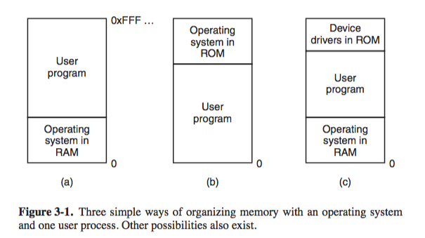
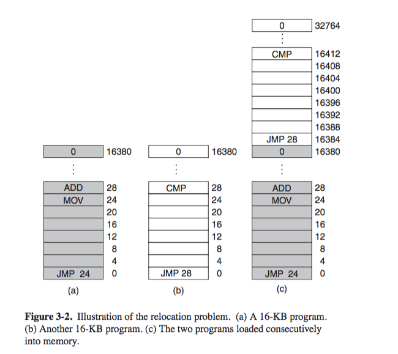
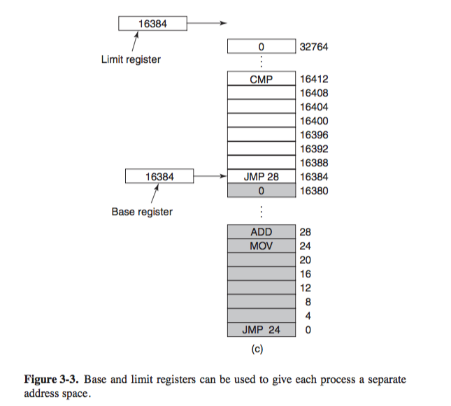
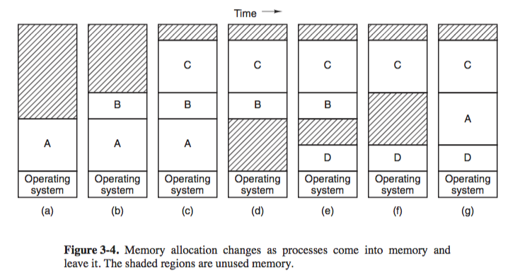
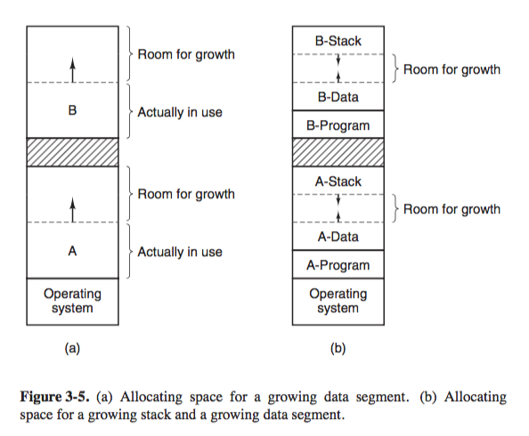
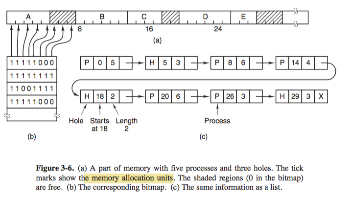
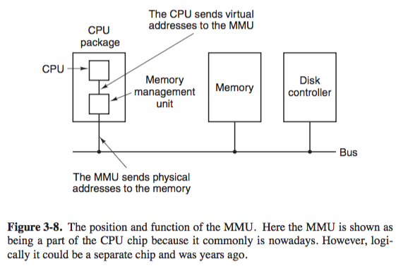
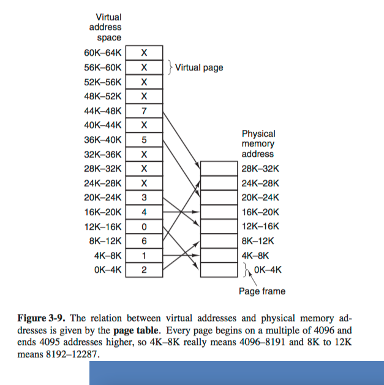

# 3.1 - 3.3 Memory Management 

> Programs expand to fill the memory available to hold them 
>                               --- Parkinson's Law

+ _the dream_
    + inexpensive, private, infinitely large, infinitely fast, nonvolatile memory 
+ _the reality_ 
    + _memory hierarchy_ 
    + 
        + few MB of very fast, expensive, volatile cache memory
        + few GB of medium speed, medium priced, volatile main memory 
        + few TB of slow, cheap, nonvolatile mgnetic/SSD storage
+ _memory manager_ 
    + part of OS that manages memory hierarchy efficiently
        + keep track of which parts of memory in use 
        + allocate memory to processes when they need it, 
        + deallocate it when they are done
    + cache memory usually done by hardware 
    + here focus on model of main memory 

### 3.1 No Memory Abstraction 

+ _no memory abstraction_ 
    + model of memory was simply physical memory, a set of addresses from 0 to some maximum, each address corersponds to a cell containing some number of bits, usually 8
        + i.e. program _saw the physical memory_ 
            + `MOV REGISTER1, 1000`
    + early computers have no memory abstraction
        + early mainframe  (1960)
        + early minicomputers (1970)
        + early PC (1980)
    + disadvantage 
        + not possible to have 2 processes in memory at same time.
            + arises when both accessing same memory location 
+ _no abstraction memory models_ 
    + 
        1. OS at bottom of memory in RAM (early mainfrae)
        2. OS at top of memory in ROM (embedded system)
        3. derive driver in ROM (i.e. BIOS) and rest in RAM (early PC)
    + problem 
        + if OS in memory alongside with userprogram, a bug in user program may crash the OS 
        + generally only one process at a time can be running 
        + may want to use thread, but cannot handle unrelated programs
+ _running multiple programs without memory abstraction_ 
    + _swapping_
        + save entire content of memory to disk file 
        + then bring in next program
        + as long as there is one program at a time in memory, no conflicts 
    + _segmented memory blocks with keys_ + _static relocation during loading_
        + idea 
            + memory divided into 2-KB blocks and each assigned a 4-bit protection key held in special registers inside CPU
                + 1MB memory requires 512 4-bit keys = 256 bytes for key storage
            + PSW (program status word) also contains 4-bit key 
            + OS
                + prevent attempts by a running proces to access memory with a protection code different from PSW key
                + _prevent processes from interfering with one another_
        + _relocation problem_
            + 
                + 2 programs are loaded into memory, 
                + execution of `JMP 28` when the second program is taking control of CPU, will execute an `ADD` operation of the first program
            + the problem  
                + both program reference absolute physical memory 
        + _static relocation_ as solution to relocation problem
            + modify the second program during its loading into memory address `16384`
            + the constant `16384` is added to every program address during the load process
            + problem 
                + slows down loading 
                + requires extra information in all executale program to indicate which word contain (relocatable) addresses and which do not.
                    + i.e. `MOV REGISTER1, 28` 28 is a constant and not an address, need a way to differentiate that 

### 3.2 A memory abstarction: Address Spaces
 
+ _motivation_ 
    + _exposing physical memory to processes_ is problematic
        + if user program can address every byte, it can trash the OS
        + difficult to have multiple program running at the same time (on a single CPU)
+ _the problems_ 
    + _protection_ 
        + multiple programs must not interfere with each other
            + e.x. previously mentioned label chunks of memory with protectio key and compare key of executing process to that of every memory word fetched.....
    + _relocation_ 
        + allow multiple programs to be in memory at same time
            + e.x. relocating programs during loading, but it is slow and complicated
+ _address space_ as a solution to protection/relocation problem 
    + a set of addresses that a process can use to address memory 
        + provides abstract memory for programs to live in 
        + each process has its own address space, independent of those belonging to other processes
    + how to give each program its own address space, so same address space in different program maps to different physical location?
+ _base and limit register_ 
    + _motivation_ 
        + a simple solution to providing programs address space 
        + map each process' address space onto a different part of physical address akin to _dynamic relocation_ with `base` and `limit`
    + 
    + idea 
        + each CPU equipped with 2 special registers `base` and `limit`
        + programs are loaded into _consecutive_ memory locations when 
            + there is room, and
            + without relocation during loading 
        + when a process is run 
            + `base` register: loaded with physical address where its program begins in memory 
            + `limit` register: loaded with length of the program 
        + during every memory reference, either to fetch intruction of read/write data word
            + CPU automatically adds `base` to address generated by the process before sending address out on the memory bus 
            + simultaneously, it checks whether the address offered is equal to or greater than the value in the limit register, 
                + in which caes a _fault_ is generated and program aborted
    + example 
        + `JMP 28`
        + hardware adds `base = 16384` to the `28`
        + so `JMP 16412` instead 
    + disadvantage 
        + overhead in performing unnecessary during every memory reference 
            + 1 addition 
            + 1 comparison 
+ _memory overload problem_ 
    + if physical memory (RAM) is large enough to hold all processes, then `base` and `limit` register works fine
    + but if the total amount of RAM needed by all processes is often much more than can fit in memory 
        + _number_: a lot of processes in background
        + _size_: some processes are too large to fit in main memory (software bloat)
    + solutions 
        + _swapping_ 
            + bringing in each process in its entirety, running it for a while, and putting it back on disk
            + idle process are on disk, so they dont take up memory when not running 
        + _virtual memory_
            + allows programs to run even when they are partially in main memory 
+ _swapping_ 
    + 
        + note program `A` in different location in a) vs. g) 
            + implies address contained in it must be relocated 
                + software: _static relocation_ during loading 
                + hardware: _base and limit register_ during program execution
    + problems 
        + creates multiple holes in memory, waste memory 
            + _memory compaction_: combine memory holes into one big one by moving all processes downward as far as possible
            + but it is CPU intensive... so not done 
        + Program may grow in size to allow for dynamic allocation
            + fine if there free space adjacent to the memory the program occupies but problematic if adajcent to another process
                + may have to swap out other processes to make up room
                + process may have to wait if swap space is full
                + or be killed...
            + may reduce overhead if allocate a little extra memory? but how?
                + 
                + process can have heap/stack 2 growing segments
                    + stack grows down
                    + heap grows up
                + process will have to 
                    + move to a hole with sufficient space 
                    + swapped out of memory until a large enough hole can be created, 
                    + killed
+ _managing free memory_ 
    + dynamic allocation require OS to keep track of memory usage
    + solution 
        + _bitmaps_ 
        + _free lists_ 
+ _Memory Management with Bitmaps_ 
    + 
    + idea 
        + memory divided into _allocation unit_ (ranging from few words to severl kB) 
        + each allocation unit is _a bit in the bitmap_ 
            + 0 if unit is free 
            + 1 if unit is occupied 
    + _size of allocation unit is a design issue_
        + small allocation unit
            + bitmap size gets larger 
            + i.e. say allocation unit is 4bytes each, 
                + then 32bits of memory requires 1 bit of storage dedicated to bitmap. 
                + 32n bits will use n maps, bitmap will take up _1/32 of memory_ (which in a sense is OK)
        + large allocation unit 
            + appreciable memory may be wasted in the last unit of process if process size is not an exact multiple of allocation unit
    + advantage 
        + simple way to keep track of memory words in fixed amount of memory 
        + bitmap size depends on size of memory and size of allocation unit only
    + disadvantage 
        + require searching linearly in the bitmap to find `k` consecutive `0` (i.e. free) bits in the map when bring a `k`-unit sized process into memory
        + _search is slow!_
+ _Memory management with Linked List_ 
    + idea 
        + maintain a linked list of _allocated and free memory segments_
        + each entry in the list specifies 
            + a hole (`H`), or a process  (`P`)
            + address at which it starts 
            + the length 
            + pointer to next item 
        + list sorted by address 
            + updating the list when a process terminates/swapped out is easy 
                + 
                + 4 scenarios 
                    + a. replace `P` by `H` 
                    + b. and c. two entries coalesced into one
                    + d. 3 entries merged and two items removed from the list
            + hence a doubly-linked list may be better as its easier to find the previous entry and see if a merge is possible
    + _algo for memory allocation_ (assuming known how much to allocate)
        + _first fit_   
            + scans along list of segments and picks the first hole that is big enough
            + hole is broken into 2 pieces 
                + one for process 
                + one for unused memory 
            + _performance_
                + fast since searches as fast as possible
        + _next fit_ 
            + similar to first fit 
            + except keep track of where it is whenever it finds a suitable hole
            + for next allocation, the search starts from place where it left off last time 
            + _performance_ 
                + slightly worse performance than first fit 
        + _best fit_
            + searches the entire list
            + takes the smallest hole that is adequate 
            + _performance_
                + slower than first fit 
                + surprisingly, also waste more memory since it tend to fill up memory with tiny, useless holes
                + but widely used with some optimization
        + _worst fit_
            + seaches the entire list 
            + takes the largets available hole 
                + so that new hole will be big enough to be useful
            + _performance_ 
                + not a good idea... 
        + data structure improvement 
            + maintain separate list for processes `P` and holes `H` 
                + `H` list may be _sorted on size_, to make best fit faster
                    + i.e. sort list ascending, the first hole that is adequate is the best fit
                    + this way, _first fit_ and _best fit_ are equally fast, _next fit_ is pointless.
                + optimization: information stored in `H` list can be stored in the holes instead 
                    + the first word of each hole is hole size 
                    + second word a pointer to the following entry 
                    + the one bit (`P/H`) indicating hole/process is not needed, hence save space 
            + __TRADEOFF__
                + faster during memory allocation, since algo works on list for holes only
                + slower during memory deallocation, since algo have to remove entry from `P` list and insert into correc position in `H` list
        + _quick fit_ 
            + maintain separate lists for some of more common sizes requested 
            + table with `n` entries 
                + first entry a pointer to head of a list of 4-kB holes
                + second entry a pointer to a list of 8-kB holes 
                + third entry a pointer to a list of 12-kB holes 
                + holes of 21-kB could be put either in 20-kB list or on a special list of odd-sized holes 
            + _performance_ 
                + allocating memory is fast since constant time to get to list of required size
                + de-allocating memory is slow since 
                    + holes sorted by size 
                    + finding a process's neighbor to decide on if merge is possible is quite expensive 
                    + if merging not done, memory will fragment into large numbers of small holes into which no processes fit 

### 3.3  Virtual Memory 

+ _motivation_ 
    + Need to 
        + support programs that are too large to fit into memory 
        + have systems that can support multiple programs running simultaneously 
            + where each would fit into memory, but collectively exceed memory capacity
    + the alternative: _swapping_ not attractive 
        + disk transfer rate peaks several hundred MB/sec, really slow 
    + primitive solution
        + split program into piecies, _overlays_ 
        + program starts 
            + _overlay manager_ loaded 
            + overlay 0 ran 
            + when its done, the manager load overlay 1 (swapping from disk)
                + above overlay 0 if there is space 
                + on top of overlay 0 if there is no space 
        + problems 
            + programmer has to be making the choice of splitting the program into overlays 
                + which is time consuming, boring, error prone
        + virtual memory come into rescue
+ _virtual memory_ 
    + idea 
        + each program has its own address space 
        + address space is broken down into chunks, called _pages_ 
            + each page is a _contiguous range of addresses_
            + pages are mapped onto physical memory, 
            + but not all pages have to be in physical memory at the same time to run the program
        + program reference memory access to its address space
            + if address space (i.e. page) is in memory
                + hardware performs necessary mapping on the fly 
            + if address space (i.e. page) is not in mmeory
                + OS alerted to get missing pieces and re-execute instruction that fails
    + concepts 
        + _generalization_ of base-and-limit register idea 
            + base-and-limit register, cases where there are multiple `base` register for say `text` and `data` separately
            + instead of having separate relocation for just text and data, the entire address space can be mapped onto physical memory in fairly small units
+ _paging_ 
    + a technique used in implementing virtual memory
    + 
    + idea 
        + _virtual address_: 
            + program-generated address (i.e. the address space of a process) that forms the _virtual address space_ 
            + consists of fixed-size units called _pages_, 
        + On computer without virtual memory, 
            + virtual address put directly in memory bus and causes physical memory word with same address to be read/written 
        + On computer with virtual memory, 
            + virtual address go to _MMU (Memory Management Unit)_ 
            + MMU maps virtual addresses to physical addresses, and correspondingly into _page frames_
        + _swapping_ 
            + transfer of page <-> page frame always in whole pages 
    + _page_ 
        + a fixed-size unit that made up the _virtual address space_
    + _page frame_ 
        + a fixed-size unit that made up the _physical address space_ 
    + _size of pages / page frames_ 
        + usually page and page frames are of same size, 4KB often used, i.e. 4096 bytes
    + _how mapping works_ 
        + 
            + 64KB virtual address space and 32KB of physical memory 
                + we get 16 virtual pages and 8 page frames
            + `MOV REG, 0`, program try to access address 0
            + virtual address 0 sent to MMU
            + MMU sees that it falls in page 0 ( 0 ~ 4096 ) and is mapped to page frame 2 ( 8192 ~ 12287 ) 
            + memory oblivious of MMU and processes the mapped physical address 8192
        + 
