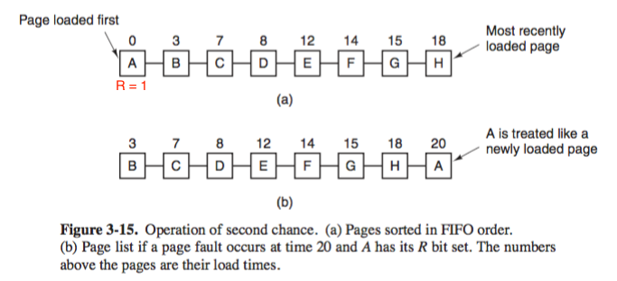
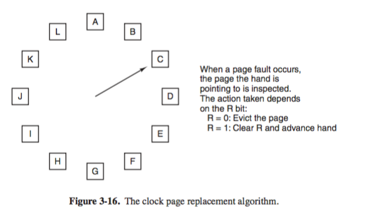
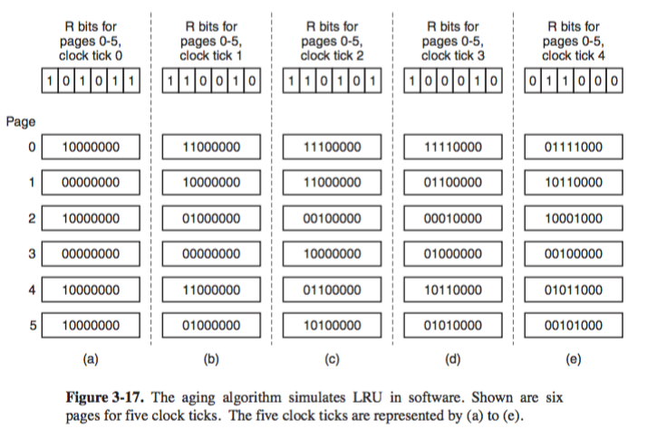
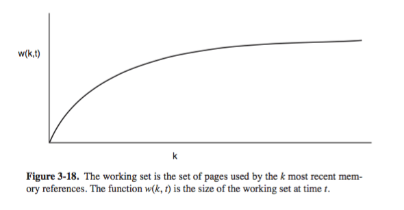
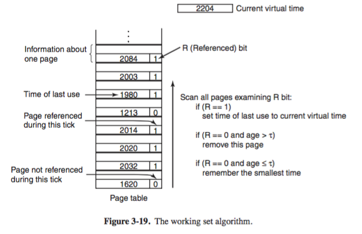
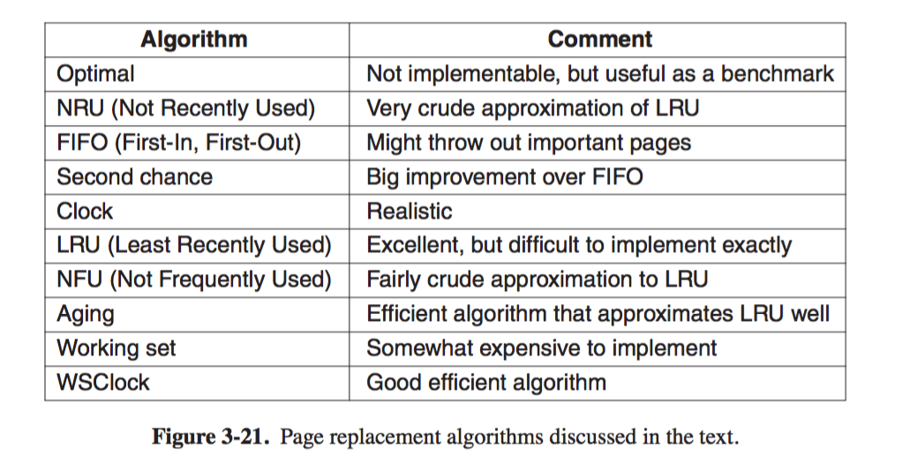

# 3.4  Page Replacement 

## 3.4 Page replacement algorithms 

+ _motivation_
    + when page fault happens, OS has to pick a page `P` to _evict_ (remove from memory) to make room for the incoming page `Q` from disk 
        + if `P` is modified 
            + `P` must be rewritten to disk to bring the disk copy up to date 
        + else (i.e. `P` contains program text hence not changed)
            + disk copy of `P` already up to date, so no rewrite is needed 
    + _page replacement problem_ 
        + Pick which page (preferably not heavily used) to evict such that page fault rate is minimized 
        + similar to _cache replacement_, where the problem happens on a shorter time scale (done in nanoseconds)
        + or _web server cache_, where have to decide on which web pages to be kept in memory
+ _The Optimal Page Replacement Algorithm (Belady's algorithm)_
    + idea 
        + when page fault happens 
            + some set of pages in memory 
            + each page will be labelled with _number of instructions that will be executed before the page is first referenced_
        + the optimal algorithm says that the _page with highest label should be removed_
            + i.e. pick page that will not be used for longest time
    + problem 
        + cannot be implemented in actuality since OS has no way of knowing which page will be referenced next...
    + usage 
        + used to compare performance of realizable page replacement algorithms as it behaves as an optimal benchmark
+ _The Not Recently Used (NRU) Page Replacement Algorithm_ 
    + _philosophy_
        + better to remove a modified page that has not been referenced in at least on clock tick (20msec) than a clean page that is in heavy use (used recently with `R` set)...
    + idea 
        + Maintain page statistics on each memory reference
            + by hardware
                + `R`: set whenever a page is referenced (read/written)
                + `M`: set when a page is written to (modified)
            + If hardware does not support `R` or `M`, use software to simulate 
                + On page fault, OS 
                    + sets `R` bit in internal table 
                    + change PTE to point to the correct page 
                    + now PTE has `R` set, with permission `READ ONLY`
                + restarts instruction 
                + if page is subsequently modified 
                + Another page fault, OS 
                    + sets `M` bit 
                    + change mode to `READ/WRITE`
        + Periodically (on clock interrupts)
            + `R` bit is cleared 
                + to distinguish pages that have not been referenced from those that have been
        + Now on page fault, whern deciding which page to evict 
            + classify all pages into catgories 
                + _class 0_: not referenced, not modified 
                + _class 1_: not referenced, modified 
                    + happens when clock interrupts clears `R` for page of class 3
                + _class 2_: referenced, not modified 
                + _class 3_: referenced, modified
            + Removes a page at random from the lowest-numbered nonempty class
    + discussion 
        + low overhead
+ _The First-In, First-Out (FIFO) Page Replacement Algorithm_ 
    + idea 
        + OS maintains 
            + list of all pages currently in memory, with most recent arrival at the tail and the least recent arrivial at the head 
        + On page fault 
            + page at head removed, and new page added to tail of the list 
    + discussion
        + a page that is the oldest may be used often 
        + hence FIFO is rarely used in its pure form 
+ _The Second-Chance Page Replacement Algorithm_ 
    + _philosophy_
        + pick an old page that has not been referenced in the most recent clock interval
        + if all pages are referenced, second chance degenerates into pure FIFO 
    + idea 
        + extension of FIFO,
        + inspect `R` bit of oldest change 
            + If `0`, page is both old and unused, hence replaced immediately 
            + If `1`, 
                + `R` bit is cleared, 
                + the page is put onto the end of list of pages
                + load time updated, as if it had just arrived in memory
                + continue the search 
    + 
        + page fault at time 20, 
        + oldest change `A`, 
            + if `R` is 0, it is evicted 
            + If `R` is 1, `A` put to end of list and its load time reset to current time (20) and `R` cleared to 0
    + discussion 
        + improvement over FIFO
        + unnecessarily inefficient, since requires constantly moving pages around on the list 
+ _The Clock Page Replacement Algorithm_ 
    + idea
        + keeps page frames on a circular list in the form of a clock
            + hand points to the oldest change
        + On page fault 
            + the page the hand is pointing to (oldest) insepcted 
            + If `R`, 
                + `0`: evict the page, insert new page at current location, advance hand by one
                + `1`: clears `R`, advance hand and continue the search
    + 
    + discussion 
        + improvement over second chance 
+ _The Least Recently Used (LRU) Page Replacement Algorithm_ 
    + _observation_ 
        + pages heavily used in last few instructions will probably be heavily used again 
        + pages not having been used for ages will probably remain unused for a long time 
    + idea 
        + maintain 
            + a linked list of all pages in memory, with most recently used page at the front and least recently used page at the rear 
        + On page fault 
            + evict the page that has been unused for the longest time 
            + search the list for the next page, delete it, and move to the front of the list 
    + _hardware impl_
        + 64-bit counter `C` in hardware, automatically decremented after each instruction 
        + each PTE have a field to contain the counter 
        + during each memory reference, current value of `C` stored in PTE for page just referenced 
        + On page fault 
            + OS examines all counters in page table, to find the lowest one, i.e. the most recently used one
    + discussion 
        + realizable but implementation is not cheap 
            + the list have to be updated during every memory access
            + search page in the list, deleting it, and moving it to the front is very time consuming
+ _software simulation of LRU: Not Frequently Used (NFU)_
    + idea: _Least Frequently Used_
        + software counter is associated with each page, initially zero 
            + the counter roughly tracks how often each page has been referenced 
        + at each clock interrupts 
            + OS scans all pages in memory
            + for each page, add `R` bit to its counter 
        + On page fault 
            + page with lowest counter is chosen for replacement 
    + _problem_
        + the counter never resets, so never forgets previous reference 
            + may be case when there is a highly used page (hence yield high count `C`) that then went into disuse, but never evicted since the second highly referred page never exceed `C`
        + what if there is a tie, i.e. multiple pages with the lowest count 
            + by recording 1 bit per time interval, ability to distinguish references early in clock interval from those occurring earlier is lost 
    + _solution: aging_ _Most Frequently Used_
        + counters are shifted right 1 bit before `R` is added 
        + `R` is added as leftmost (instead of rightmost) bit
        +  
            + 6 pages (6 counters) after 4 clock ticks
            + page fault happens, lowest counter page 3 is removed 
    + discussion 
        + good approximation to LRU
        + _aging_ 
            + in case of tie, naive LRU cannot distinguish earlier references; in contract, aging is able to
            + counter has finite number of bits, which limits past horizon.
+ _The Working Set Page Replacement Algorithm_
    + _demand paging_ 
        + process starts with none of their pages in memory 
        + CPU fetch first instruction, page fault, OS bring in page containing first instruction 
        + Other page faults bring in global variables, stack, ...
        + After a while, proccess has most of pages it needs and settles down to run with relatively few page faults 
    + _locality of reference_ 
        + during any phase of execution, the process references only relatively small fraction of its pages
        + hence demand paging will unlikely exhaust memory
    + _working set_ 
        + the set of pages that a process is currently using 
        + if memory is large enough such that entire working set in memory 
            + process will run without many faults until it moves into another execution phase 
        + if meory is too small to hold the entire working set 
            + process will cause many page faults and run slowly 
            + execute a instruction: `~nsec`
            + handle page fault: `~msec`
            + _thrashing_
                + a program causing page faults every few instructions 
                + i.e. 1~2 instructions per 10msec is extremely slow
    + _working set model_ 
        + _motivation_ 
            + process pages saved to disk 
            + process gets CPU again, will cause page faults until its working set has been loaded 
            + numerous page faults every time a process starts is time consuming...
        + _the working set model_
            + let OS keep track of each process' working set, 
            + and use _prepaging_, i.e. load them before running the process 
        + the working set `w(k, t)` 
            + definition: at any time `t`, a set of all pages used by the `k` most recent memory reference 
            + a monotonically nondecreasing function of `k`
            + limit of `w(k, t)` becomes large is finite because a program cannot reference more page than its virtual address space 
        + behavior 
            + 
            + most program randomly access a small number of pages initially
            + the set changes slowly in time for large `k`'s
            + hence content of `w(k, t)` is not sensitive to `k` chosen
            + i.e. there exists a wide range of `k` for which the working set is unchanged
            + therefore possible to make reasonable guess as to which pages will be needed when program restarts on the basis of working set when it was last stopped.
            + prepage whose pages before resuming the process...
    + _implementation_ 
        + choose `k` in advance
        + OS needs to keep track of which pages are in the working set 
            + on every memory reference, OS must determine set of pages 
        + _shift register_ represents the working set
            + of length `k`, 
            + with every memory reference shifting register left one position 
            + insert most recently referenced page number on the right
        + on page fault 
            + read and sort shift register 
            + duplicate pages removed 
            + evict page that is not in the working set
        + discussion 
            + implementation is too expensive, so never used
    + _implementation using approximation_ 
        + define working set as set of pages used during last 100msec of execution time
            + note execution time here refers to _current virtual time_, CPU time a process actually used
        + 
        + assume 
            + hardware sets `R` and `M` bits 
            + clock interrupts periodically resets `R`
            + `tau` be length of execution time that we define the working set on
        + on page fault 
            + page table scanned to look for page to evict
            + If `R = 1`
                + current virtual time written into the `Time of last use` field 
                + indicate page in use during fault 
                + hence part of the working set, not candidate for removal 
            + if `R = 0`
                + page not referenced during current clock tick, 
                + candidate for removal 
                + `age = current virtual time - time of last use` computed and compared to `tau`
                    + if `age` is greater than `tau`, page no longer in working set, hence replace with new page 
                    + otherwie, 
                        + temporarily spared, 
                        + however page with greated age (smallest time of last use) is noted,     
                        + if entire table is scanned without finding a candidate to evict, then all pages in working set, in this case, the one with largest `age` is evicted 
+ _Page Replacement Algorithm Summary_ 
    + 
    + NRU
        + divides pages into 4 classes  based on `R` and `M` 
        + random page in lowest-numbered class chosen 
    + FIFO 
        + track order in which pages were loaded into memory, in linked list 
        + evict page that is oldest on the list, but such page may still be in use 
    + Second chance 
        + modification of FIFO, that checks if a page is in use (i.e. see if `R` is set) before removing it, 
    + Clock 
        + A different implementation of second chance, same performance but takes less time to execute the algorithm 
    + LRU
        + excellent algo, but cannot be implemented with special hardware
        + hardware keeps a counter (decrements every clock tick) that is written to PTE on every memory reference, page with lowest counter value (referenced earliest) is evicted 
    + NFU
        + crude approximation to LRU,
        + each page tracks a count, which is incremented by `R` on every clock interrupts, and on page fault, page with smallest count is evicted 
    + Aging 
        + better approximation to LRU, 
        + same with NFU except `R` added to leftmost bit of count after the counter is shifted right one bit 
    + working set 
        + good performance hard to implement 
        + keep track of working set in a shift register of page numbers which gets updated every memory reference, and page not in the working set is evicted

