# 5 File System 


+ _motivation_ 
    + _virtual address is limited_
        + i.e. some running process need to store/retrive info larger than virtual address space
    + _memory is volatile_ 
        + i.e. database require info persists
    + _need for concurrent access cross processes_
        + need to make information itself independent of any process
+ _Goal_ 
    + _able to store very large amounts of info_ 
    + _info must survive termination of process using it_
    + _multiple processes must be able to acces info at once_ 
+ _disk_  
    + a linear sequence of fixed-size blocks with 
        + read block `k`
        + write block `k`
+ _File_
    + logical units of information created by processes, 
        + located on disk, 
        + indepedent of each other 
        + persistent, unaffected by process creation/termination 
    + abstraction for information stored on disk
        + user dont care about how/where information is stored, but how to access them
+ _File system_ 
    + part of OS dealing with file
        + structure
        + naming
        + access 
        + use 
        + protection 
        + implementation 
        + management
    


### 4.1 Files 

+ _Different fs_
    + FAT-16
        + a MS-DOS file system 
    + FAT-32
        + Windows 98
    + NTFS
        + Windows 8
    + exFAT
        + extension to FAT-32 that OSX can r/w!
+ _File structure_ 
    + 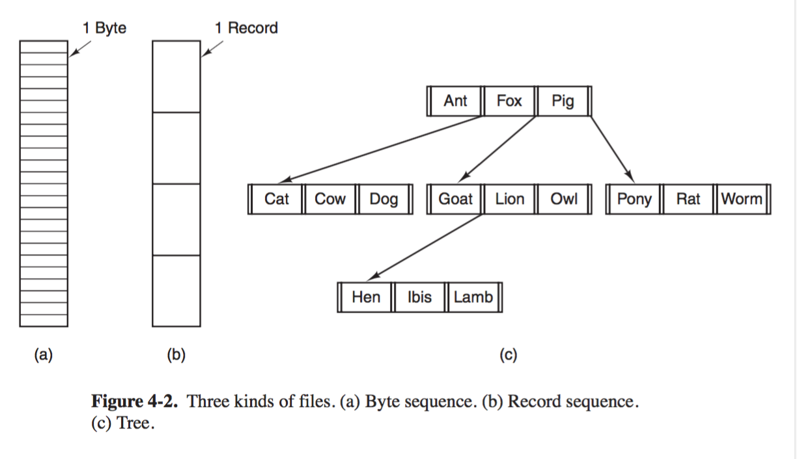
    + 3 kinds of file
        + _byte sequence_ 
            + great flexibility, user program determines the rules 
            + used by UNIX + Windows 
        + _record (fixed length) sequence_ 
        + _tree_ 
+ _File Types_ 
    + _regular file_ 
        + contain user info 
        + either ASCII or binary
        + _executable binary file_
            + 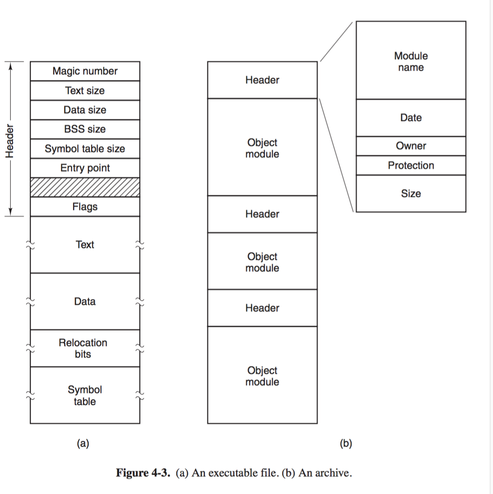
            + _magic number_ identifies file as executable
        + _archive binary file_ 
            + consists of a collection of library procedures compiled but not linked
            + header tells about its name, creation date, owner, protection, size..
    + _directory_ 
        + system files for maintaining structure of file system 
    + _character special files_
        + models serial I/O devices
    + _block special files_ 
        + models disks 
+ _File access_ 
    + _access type_ 
        + _Sequential access_ 
            + process could read all bytes/records in a file in order, starting at the beginning, 
            + but could not skip around 
        + _Random-access_
            + file read out of order, access by key rather than position
            + _random-access file_
    + _where to start `read`_
        + every `read` gives the position in file to start read at, or
        + `seek` sets current position, then files read sequentially from the now-current position
            + used by UNIX + Windows
+ _File attributes_ 
    + 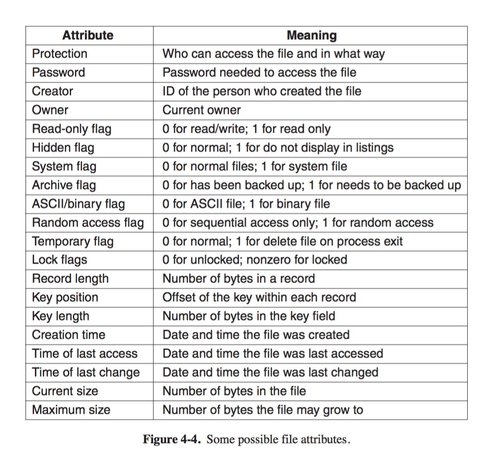
    + _attribute_ (metadata)
        + metadata information such as modified time, file size 
    + _flags_ 
        + control properties, 
        + i.e.
            + hidden files flag do not appear in listing of all files 
            + arhive flag indicate if file has been backed up
                + back-up program clears it 
                + OS sets it if file changed 
+ _File Operation_ 
    + _syscalls_ 
        + `create`
            + file created with no data
            + announce file is coming, set initial attributes 
        + `delete`
            + free up disk space 
        + `open`
            + allow system to fetch attributes and list of disk addresses into main memory for random access 
        + `close`
            + free up internal table space containing file attributes and disk addresses acquired during `open`
            + closing of file also flushes writing file's last block, even if blocks is yet full
        + `read`
            + data read from file 
            + usually come from current position
            + specify how many bytes to read, and put result in a buffer 
        + `write`
            + data written to file 
            + usually at currernt position 
        + `append`
            + add data to end of file only 
        + `seek`
            + specify where to take data 
            + for random-access files only 
        + `get attributes`
            + i.e. `make` gets modification time 
        + `set attributes`
            + i.e. set protection bits
        + `rename`
            + usually copy to new file and delete old file, so not necessary 
    ```c
    /* open files */
    fd = open(argv[1], O   RDONLY);
    if (in fd < 0) exit(2);
    out fd = creat(argv[2], OUTPUT   MODE); 
    if (out   fd < 0) exit(3);

    /* copy loop */
    while(TRUE){
        rd_count = read(in_fd, buffer, BUF_SIZE);
        if(rd_count <= 0) break;
        wt_count = write(out_fd, buffer, rd_count);
        if(wt_count <= 0) exit(0);
    }

    /* close files */
    close(in_fd);
    close(out_fd);
    ```
    + note
        + _file descriptors_ 
            + integers returned when a file is open, 

### 4.2 Directories 

+ _motivation_ 
    + directories are themselves files which keep track of files 
+ _Single-level directory system_ 
    + 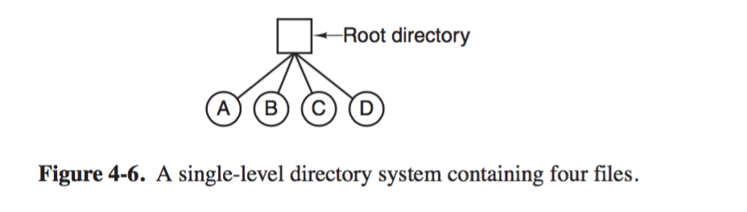
    + one directory containing all files 
        + called _root directory_
    + _properties_ 
        + simple 
        + fast lookup for files, 
+ _Hierarchical directory system_ 
    + 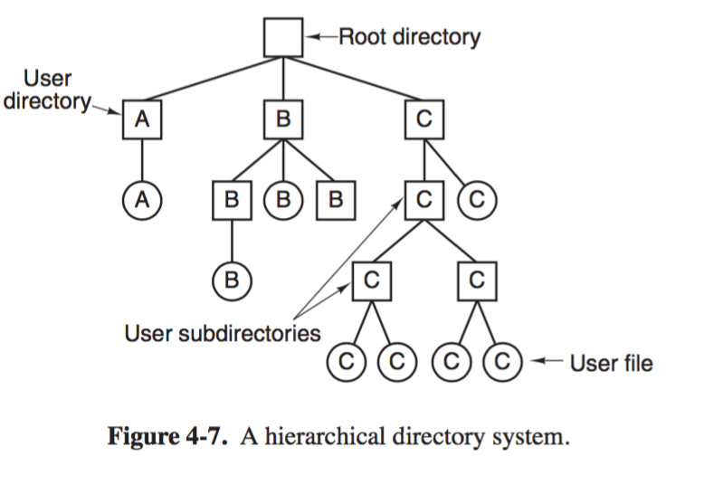
    + _motivation_ 
        + group related files together 
        + enforce privacy for multi-user server
    + _path names_ 
        + the need to specify file names in a directory tree 
        + 2 methods 
            + _absolute path name_ 
                + path from root directory to file 
            + _relative path name_ 
                + path not beginning at the root directoy can take relative to the _working directory_
    + _special entries_ 
        + `.` current directory, and 
        + `..` its parent 
    + 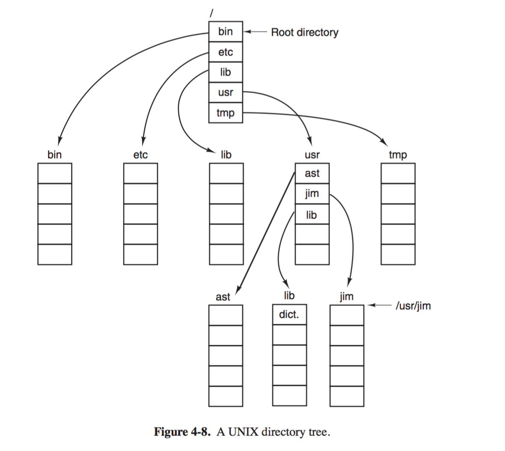
    + _directory operations_ 
        + `create`
            + empty except for `.` and `..`, which are put automatically by the system 
        + `delete`
            + only empty directory can be deleted, containing `.` and `..` are empty
        + `opendir`
            + read direction, i.e. list all files, 
        + `closedir`
            + closed to free internal table space 
        + `readdir`
            + return next entry in an open directory
        + `rename`
        + `link`
            + allow a file to appear in more than 1 directory 
            + specifies an existing file and a path name and creates a link from existing file to the name specified by path 
                + _hard link_ 
                    + increment a counter in file's inode (# of directory containing the file)
                    + 2 names pointing to the same internal data structure representing a file
                + _symbolic link_ 
                    + a name can be created that points to a tiny file naming another file
                    + fs follow path and finds sym link and the name it specifies, then starts lookup process again using the new name
                    + _advantage_   
                        + can cross disk boundaries
                        + name files on remove computers
                    + _disadvantage_
                        + inefficient
        + `unlink`


### 4.3 File-system implementation 

+ _File-system layout_ 
    + _layout_ 
        + file system stored on disk 
        + divided into one or more partitions 
    + _master boot record (MBR)_
        + sector 0 of the disk 
        + end of MBR contains the partition table
            + i.e. start/end address of partitions
        + used to boot computer 
            + BIOS read/execute MBR
            + one partition is marked active
            + MBR locates active partition, reads in first block, the _boot block_, and execute it, which loads OS in this partition
    + 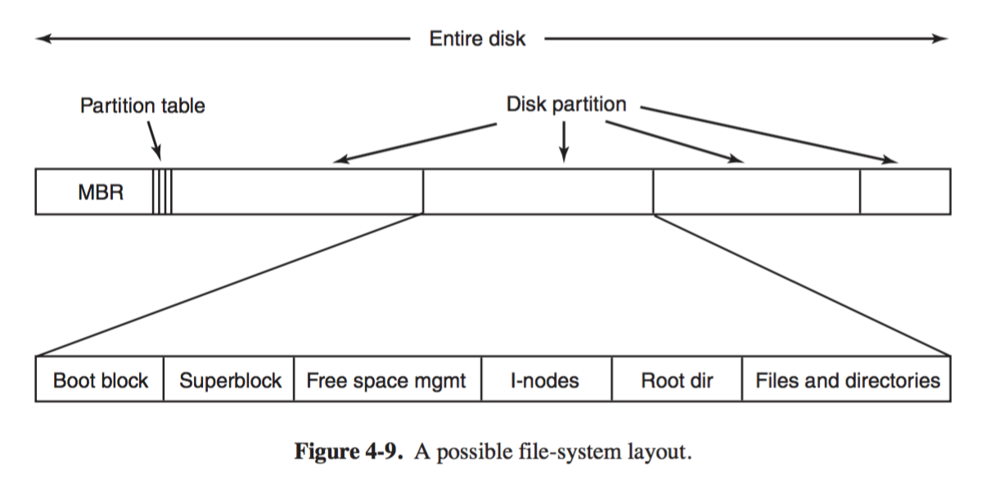
    + _Partition_ 
        + _each partition contains_
            + a boot block even if there may be no bootable OS 
            + _super block_
                + contains key parameter about fs 
                + is read into memory when 
                    + computer is booted or 
                    + file system first touched
                + i.e.
                    + magic number indicating file-system type 
                    + number of blocks in file-system 
                    + admin info
            + _Free space management_ 
                + contain info about free blocks in the file system 
                + i.e. a bitmap, or list of pointers. 
            + _I-Nodes_
                + followed by i-nodes, an array of data structures, 
                    + one per file, telling all about the file
            + _Root directory_ 
                + contains top of file-system tree
            + _files and directories_ 
                + remainder of disk 
+ _Implementing files_ 
    + _problem_ 
        + how to keep track of which disk block go with which file 
    + _Contiguous Allocation_ 
        + 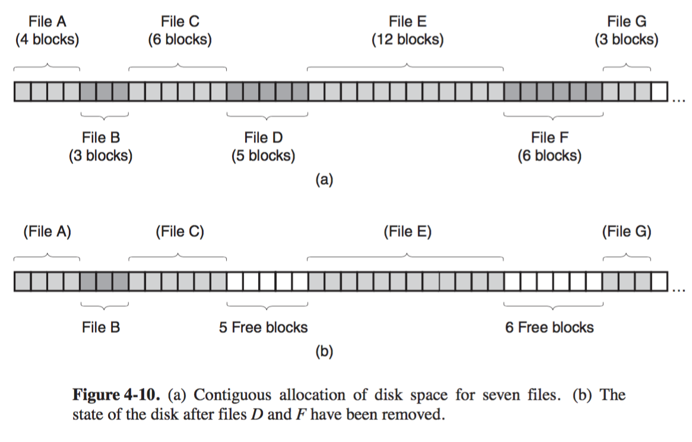
        + _rule_
            + Store each file as a contiguous run of disk blocks 
                + i.e. 50KB file with 1KB block allocated 50 consecutive blocks
            + Some space may be wasted at end of last block if file does not fill it
                + i.e. 3/2 block files is allocated 2 blocks, with 1/2 space unused
        + _advantage_
            + _simple to implement_
                + keep track of a file's block is reduced to remembering 2 number
                    + address of first block
                    + number of blocks in the file
            + `read` performance is excellent
                + entire file can be read with one `seek` and one `read`
                + data comes in at full bandwidth of the disk
        + _drawback_
            + _fragmentation_ 
                + compaction is time-consuming, since that involves copying all subsequnt blocks (millions) after the hole
                    + i.e. hours or even days 
                + _scenario_ 
                    + initially, new file write to end of disk no problem 
                    + when disk is filled, either have to compact the disk (very expensive) or 
                    + keep track of holes and reuse the space, but then have to know a new file's final size to choose a hole of correct size
                    + if no hole of correct size is possible, the file cannot be created
    + _Linked-list Allocation_ 
        + 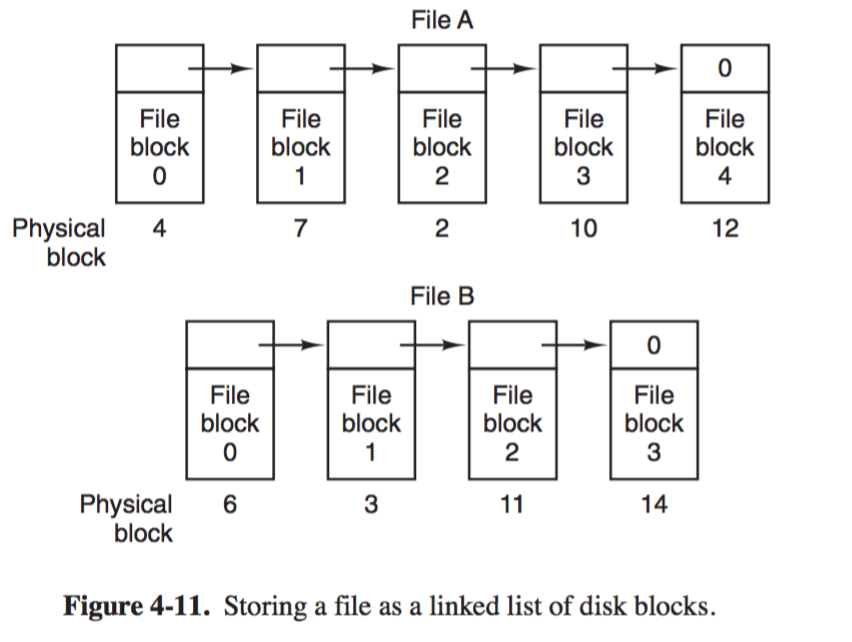
        + _rule_
            + keep each file as a linked list of disk blocks
        + _advantage_ 
            + _every disk block can be used in this method_ 
                + eliminates external fragmentation
                + although internal fragmentation at last block is still there
            + _Directory simply stores disk address of the first block_
                + i.e. head of linked list
        + _disadvantage_
            + _random access is slow_ 
                + OS has to start from beginning and read all preceding blocks to get to any particular location 
            + _pointers takes space_ 
                + data size in a block is peculiar as a result, which is problematic
                    + many program has `read` and `write` in blocks whose size is power of 2
                    + reads of the full block size reuqire acquiring and concatenating information from 2 disk blocks, 
    + _Linked-List Allocation using a table in memory_ 
        + 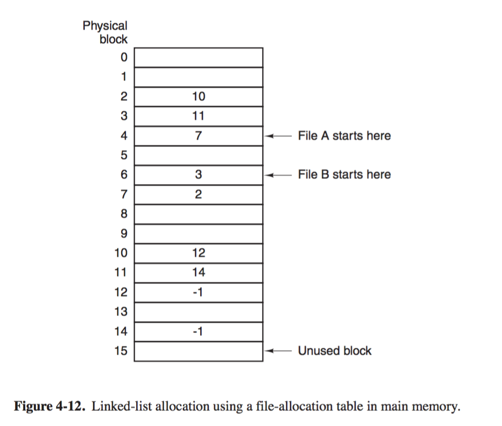
            + File A, `4, 7, 2, 10, 12, -1`
        + _motivation_
            + solves problem of linked-list allocation problem 
        + _rule_
            + A pointer word is taken from each disk block and put in a table in memory
            + _FAT (File Allocation Table)_ 
                + index is block number on disk 
                + value is the next block number of file on disk 
                + end of file specified by `-1` block number
        + _advantage_
            + _Random-Access overhead reduced_ 
                + From follow linked-list of blocks (_in disk_) to process follow linked-list of pointers with FAT (_in memory_)
                + random-access is fast because no disk reference required
            + _No need to store pointers in place_
                + each block has its entire space available for data
            + _directory can just store the start block number_
                + just like before
        + _disadvantage_ 
            + _entire FAT table must be in memory_ 
                + 1TB disk and 1KB block size, the table needs 1 billion entries
                + Each entry has to be  >= 3,4 bytes
                + FAT takes 3GB or 2.4GB in main memory 
                + not scalable, the original MS-DOS file system
    + _I-nodes_
        + 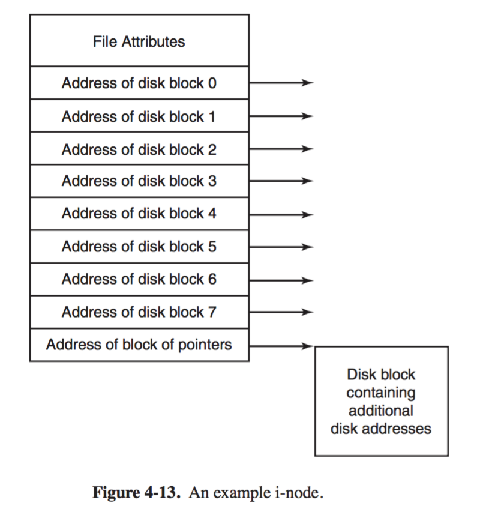
        + _rule_
            + each file have an associated data structure called `i-node` (index-node)
            + _i-node_
                + lists attributes, and disk addresses of the file's blocks
                + able to find all blocks of a file given inode
        + _advatange_
            + _memory-efficient_
                + only open file's inode need to be in memory 
                + _i-node vs FAT_   
                    + FAT
                        + size of in memory table proportional to size of disk 
                    + i-node    
                        + size of array of in memory inode proportional to maximum number of open files
        + _problem_ 
            + what if file grow beyond size of i-node 
                + _solution_ reserve last disk adress not for a data block but instead for address of a block containing more disk-block addresses 
            + 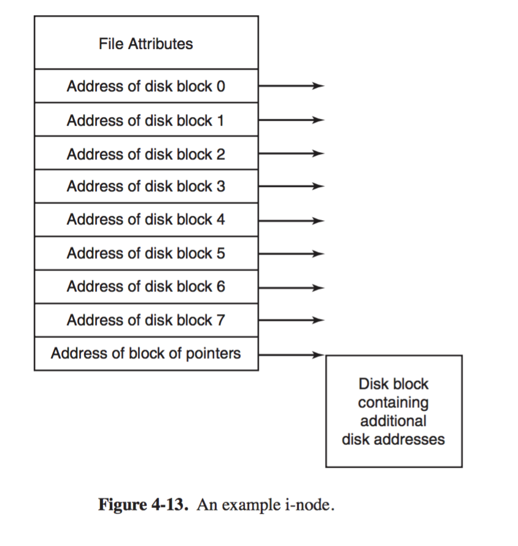
+ _Implementing Directories_ 
    + _things to consider_
        + _How to locate file blocks_ 
            + require a mapping between ASCII name of the file onto the information needed to locate the data
                + path `/foo/bar` -> block number `1,4,5`
            + _example_
                + OS locate directory entry with _path name_ supplied by the user
                + directory entry contain _info_ needed to find disk blocks, can be either
                    + _disk address of entire file_ (with contiguous allocation), or
                    + _the number of first block_ (linked-list allocation), or
                    + _the number of inode_
        + _Where to store file attributes_ 
            + _approaches_ 
                + 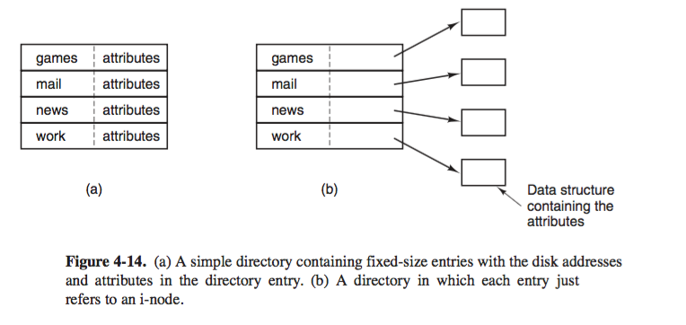
                + _store attributes in directory entry_ 
                    + Each directory has a list of fixed-size entries, one per file,
                    + Each entry contains 
                        + file name, 
                        + structure for attributes, and 
                        + disk addresses telling where disk blocks are
                + _store attributes in i-nodes_
                    + Directory entry contains 
                        + file name, 
                        + i-node number
        + _how to store long (varaible-length) file names_
            + set limit on file-name length, 255 chars and reserve space for each file name
                + but waste disk space
            + _alternatives_ 
                + 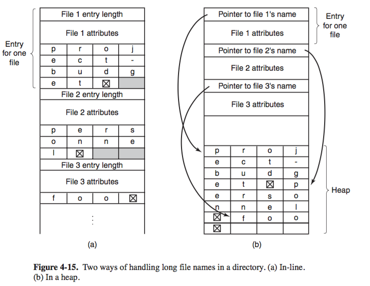
                + _inline_ 
                    + Each entry contains 
                        + length of entry 
                        + header: attributes with fixed format, i.e. owner, creation time, ...
                        + actual file name, however long, terminated with `\0`
                    + _disadvantage_
                        + _fragmentation_ 
                            + when a file is removed, a variable-sized gap is introduced into which the next file to be entered may not fit
                            + not so much of a problem, since the table is in memory, easy to compact 
                        + _page fault_
                            + since its in memory, page fault may happen while reading files
                + _in heap_ 
                    + Each directory entry is fixed sized 
                    + file names are in a heap at the end of directory
                    + _advantage_ 
                        + if an entry is removed, next file entered will always fit
                    + _disadvantage_ 
                        + have to manage heap 
                        + page fault might still happen
        + _how to look up directory entry_
            + _motivation_ 
                + traversing sequentially is slow 
            + _solution_
                + use a hash table in each directory 
                    + hash file name to directory entry
            + _advantage_
                + fast look up 
            + _disadvantage_
                + more complex administration
+ _Shared files_ 
    + _motivation_ 
        + need to have a shared file appear simultaneously in different directories, belonging to different users
    + 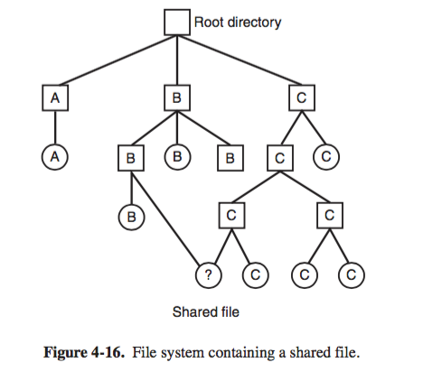
        + _link_ 
            + Connection between B's directory and the shared file 
        + _file system_
            + a DAG instead of tree
    + _problems: directory contains disk address_ 
        + so if B's directory is modified, the change is not reflected to other users
    + _solution_ 
        + _store file in i-node_ (_hard link_)
            + disk blocks of a file not in directoy entry 
            + but in a structure that can be shared 
            + _scenario_ 
                + B links to C's file 
                + inode of file is owned by C
                + linking increase the link count in i-node
            + _drawback_
                + If the owner of file (C) tries to remove the file while the file still has links (from B) to it, 
                    + B will have a directory entry pointing to an invalid i-node
                    + If the i-node is later reassigned to another file, B's link will point to the wrong file
                + _remedy_ 
                    + remove C's directory entry
                    + leave i-node intact, decrement count
                    + B can still use the inode, if B removes the shared file, the file is freed
        + _use symbolic link_ 
            + file contains path name of file to which it is linked
            + so reading a Link file, makes the OS looks up name of file again, and read that file
            + _advantage_
                + _ownership is unique_
                    + the shared file is freed as soon as the owner tries to remove it
                    + subsequent find for a link will fail since OS cannot locate the file
                + _flexibility_ 
                    + domain ignorant, can be used to link files on machines anywhere in the world
            + _disadvantage_ 
                + _overhead_ in disk access 
                    + find the link file 
                    + parse the path in the link 
                    + follow the path from root to find link target
+ _Log structured file system_ 
    + _motivation_ 
        + We have faster CPU, larger/cheaper disk (but not faster)
        + disk seek time is the bottleneck 
        + Memory is growing exponentially in size
    + _Observation_
        + as memory getting larger, most read requests will be satisfied from file-system cache in memory 
        + so more disk access will be writes    
        + small writes are inefficient 
            + 50-microsec write preceded by 10-millisec seek and 4millisec rotational delay
        + small writes are made when 
            + on new file, inode for directory entry, the directory block, and i-node for the file will be written 
    + _Goal_
        + Achieve full bandwidth of write of disk in face of small random writes
    + _impl_ 
        + _pending writes_ being buffered in memory are 
            + collected into a single segment and 
            + written to disk as a single contiguous segment at end of the log
        + _i-node_ still there, but instead scattered all over the log
            + same way to locate file blocks 
            + but much harder to find i-node, since not calculated from the i-number
            + have to keep an i-node map
    + _summary_ 
        + all writes initially buffered in memory
        + periodically all writes are written to disk in a single segment, at end of 
        + open files consists of using the map to locate i-node for the file
            + then look for file block address from there
+ _Journaling File System_ 
+ _Virtual File System_
    + _motivation_ 
        + multiple file system in use on a single OS
    + _Windows_
        + a main NTFS, but a legacy FAT-32 partition containing old data
        + Different partition C:, D:, drive letter specify separate file systems
    + _Linux_
        + integrate multiple filesystem into one 
        + i.e. ext2 for root file system, ext3 parittion mounted on `/usr`, and some other fs on `/home`
    + _Virtual File System_ 
        + 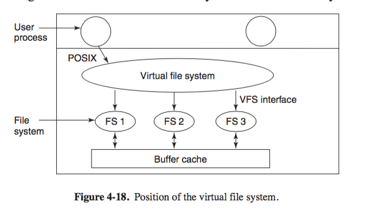
        + attemps to integrate multiple file system into an orderly structure
            + by abstract out part of fs common to all file systems and 
            + put that code into a separate layer that calls underlying concret file system to actually manage the data
        + VFS does not know where data is coming from
    + _impl_ 
        + _POSIX inteface_, `open`, `read`, `write`, `lseek`
        + _VFS interface_, 
            + designer of new file system provides a list of function calls VFS expects and write their file system to provide all of them`
    + _example_ 
        + _on boot_
            + root fs registered with VFS, other fs mounted and registed with VFS
            + registration involves providing a list of addresses of functions VFS requires
            + so each call table specific for each VFS object
        + `open("/usr/include/unistd.h". O_RDONLY)`
            + VFS parse path 
            + see new file system mounted on `/usr` 
            + locates superblock by searching list of superblocks of mounted file system
            + find root directory of mounted file system, look up `include/unistd.h` there
            + creates a _v-node_ and makes call to concrete file system (with supplied function) to return all information of the file's i-node
            + information of i-node copied to v-node
            + newly created v-node pointed by a new entry in open fd table
            + VFS returns fd to caller 
        + `read(fd, ...)`
            + 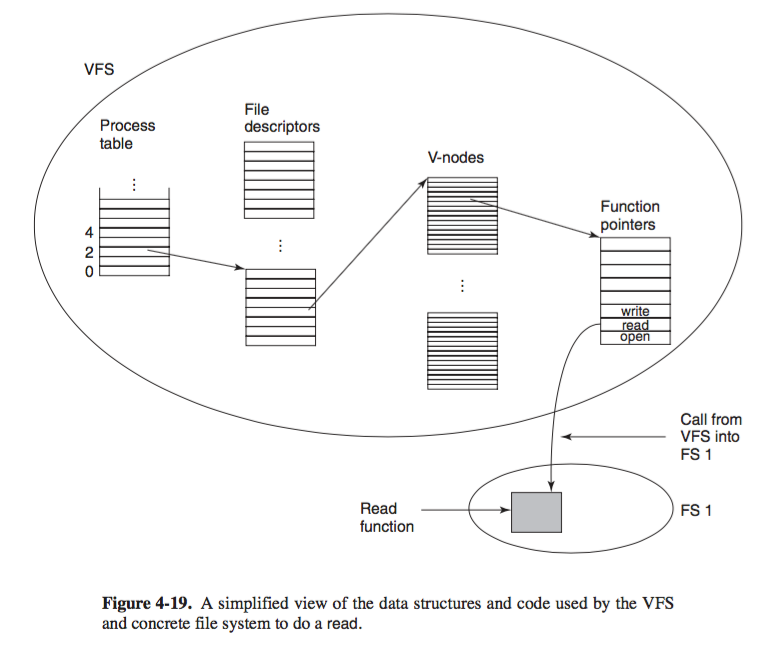
            + VFS locates v-node from process and file descriptor table 
            + follows function pointer and calls registered `read` provided by the concrete file system 


                
