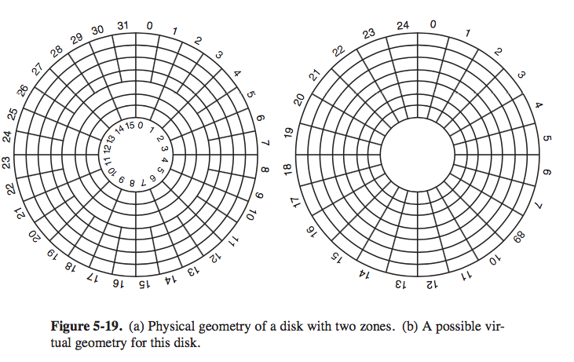
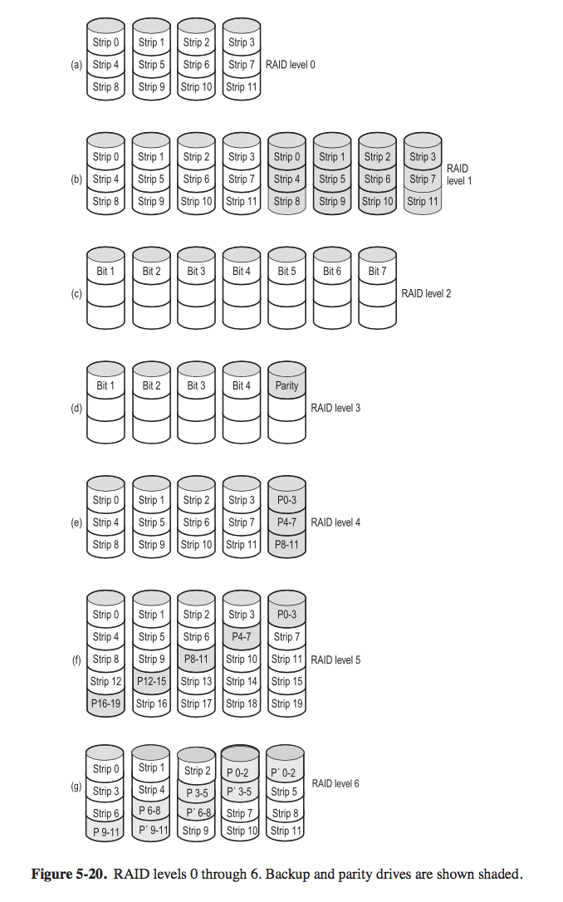
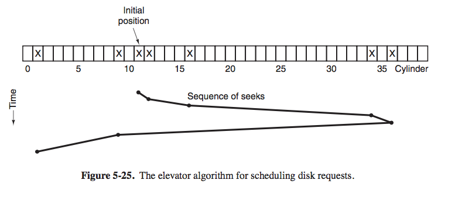

# 4. Input/Output

### 5.1 Principles of IO hardware

+ _IO device_ 
    + _block device_ 
        + store info in fixed-size bytes, 
        + transfer in blocks, 
        + random access read/write in terms of blocks
            + have `seek`
        + _disk, tape_ is block addressable
    + _character device_ 
        + deliver/accept a stream of characters, without any block structures
        + not addressable, have no seek operation
        + _printer, network sockets_ 
+ _device controller_  
     + the electronic component of a IO unit (mechanical part is device itself)
     + usually a chip on parentboard
     + i.e. 
        + _disk_: 
            + input: 2000000 sectors of 512 bytes per track -> bit stream
            + controller converts serial bit stream into blocks of bytes
+ _interrupts_ 
    + _steps_
        + 
        + IO finish work, cause interrupt
        + signal a busline, detected by controller chip (on motherboard)
        + controller issues interrupt
        + interrupt causes CPU to stop, go to interrupt vector to fetch new PC
        + starts interrupt-service procedure
            + acknowledge interrupt controller's IO ports

### 5.4 Disks

+ _disk hardware_ 
    + useful for secondary storage (paging, fs)
    + _magnetic disk_ 
        + 
        + organized into _cylinders_, 
        + each cylinder contain as many _tracks_ as there are heads stacked vertically
        + _tracks_ are divided into _sectors_ (tens ~ hundreds / track on hard disk)
        + _SATA_
            + disk itself has microcontroller, 
        + `seek` time
            + usually in `msec`
    + _RAID (redundant array of inexpensive disks)_    
        + idea: parallel IO like parallel CPU 
            + vs. _SLED (single large expensive disk)_ 
        + install a box of disks and use a RAID controller 
            + interface the same, but seek done in parallel if possible
            + data is distributed over drives, to allow parallel operations
        + level `0~6`
            + 
            + `0`: 
                + view virtual single disk simulated by RAID as being divided up into strips of `k` sectors each.
                + _strip 0_ contains sector `0~k-1` and so on
                + if `k=1`
                    + then each strip is a sector
                + distributing data over drives like this is called _striping_
                + controller 
                    + to read a data containing 4 strips, RAID controller break into 4 commands, one for each of the 4 disks
                + _good_
                    + large request, larger the better
                    + bad for OS that asks data one sector at a time, since no parallelism, no performance gain
                + _bad_
                    + reliability is a problem 
                        + a RAID with 4 disks will fail on average 4x faster than a single SLED
            + `1`:
                + duplicates all disks, there are 4 primary disks and 4 backup disks
                + on write, 
                    + every disk written twice 
                + on read 
                    + either copy can be used, can distribute load
                + _good_ 
                    + fault-tolerance
                    + simply use the backup copy, and install a new drive and copy content from the backup drive
            + `2`
                + works with strips on a word (even byte) basis.
                + write 1 bit per drive (8 drives)
                + _good_
                    + fast throughput 
                    + good fault-tolerance by hamming code 
                + _bad_
                    + requires all drive to be rotationally synchronized
                    + needs lots of drives
                    + needs controller to do hamming checksum
            + `3`
                + simplified version of `2`
                + only error detection but not error recovery 
            + `4` `5`
                + strips again, but with an extra drive storing parity 
                    + parity = `xor` of all strips, and is `k` bytes long
                + use rr to distribute parity 
            + `6`
+ _disk arm scheduling algorithms_ 
    + _3 factor influencing read/write time_
        + _seek time_ (time to move arm to proper cylinder)
            + dominates
        + _rotational delay_ (how long for proper sector to appear under reading head)
        + _actual data transfer time_ 
    + _condition_ 
        + disk maintains a table, 
        + index by cylinder number,
        +  with all pending requests for each cylinder chained by a linked list of entries by multiple processes
    + _FCFS (first-come, first-server)_ 
        + accepts one request at a time and carries them out in that order
    + _SSF (shortest seek first)_
        + 
        + always handle the closest request next, to minimize seek time
        + _advantage_ 
            + lowers seek time compared to FCFS
        + _disadvantage_
            + _tradeoff betweed response vs. fairness_ 
                + with a heavily loaded disk, 
                    + arm tend to stay in the middle most of the time
                + so requests at the extreme 
                    + will have to wait until a statistical fluctuation in the load causes there to be no requests near the middle
                    + get poor service
                + tradeoff is like building elevators for tall buildings 
                    + floors = cylinders 
    + _elevator algorithm_
        + 
        + keep moving in same direction until there are no more outstanding requests in that direction, then switch directions
            + an extra direction bit `UP` and `DOWN`
            + after tending a request, check direction bit 
                + if `UP`, then move to next highest (cylinder #) pending request. If no such request possible, direction bit reversed
                + if `DOWN`, move to next lowest requested position
        + _advantage_ 
            + _more fair_
            + _upper bound_ on the total motion, 
                + Given any set of requests, need to move at most twice number of cylinders 
    + _elevator modified_ 
        + always scan in the same direction 
        + when highest-numbered cylinder has been serviced, the arm goes to the lowest numbered-cylinder with a pending request and continue move upward
    + _observation_ 
        + seke and rotational delay so dominate 
            + reading 1 or 2 sectors at a time is inefficient 
            + so many disk controller always read and cache multiple sectors, even if 1 is requested 
            + typically, any request to read a sector will cause that sector and much or all the rest of current track to be read

    