# 6 Deadlocks

+ _intro_
    + _scenario_ 
        + computer system full of resource which can be used by 1 process at a time 
        + OS must have the ability to grant a process exclusive access to certain resource
    + _problem_
        + processes may require exclusive access to >1 resources
    + _deadlock_ 
        + processes blocked indefinitely 
    + _example_ 
        + `A` requests scanner and gets it 
        + `B` requests blu-ray recorder first and gets it
        + `A` asks for blu-ray recorder, and suspends until `B` releases it
        + `B` asks for scanner, and suspens
        + at this point, both processes are locked, and remain so forever

### Resources 

+ _resource_   
    + anything that must be 
        + _acquired_, 
        + _used_, and 
        + _released_
        over the course of time
    + objects granted to processes 
        + i.e. 
            + hardware: devices
            + software: files, records, information
    + _preemptable resource_
        + can be taken away from the process owning it with no ill effect 
        + i.e. _memory_ (contextual)
            + PC: preemptable because pages can be swapped in/out 
            + phone: nonpreemptable because no paging...
        + _example_  (no deadlock)
            + `A` and `B` are 1 gb processes, there is 1gb ram, and 1 printer
            + `A` requests and gets printer
            + `A` exceeds its quantum, swapped out to disk
            + `B` asks for printer, fails, (temporarily locks)
            + `B` has memory preempted 
            + `A` swapped in, do its printing, release the printer 
        + _deadlock_
            + can be resolved by reallocating resources from one process to another 
    + _nonpreemptable resource_
        + cannot be taken away from its current owner without potentially causing failure
        + i.e. _blu-ray recorder_
        + _deadlocks_
            + usually deadlocks invovles nonpreemptable resources
    + _abstraction of resource related events_ 
        + request the resource 
            + process will sit in tigh loop requesting resource, sleep, and try again 
            + although not blocked... it is as good as blocked because cant do any work
            + hence, assume _resource denied == `sleep`_
        + use resource 
        + release resource
+ _resource acquisition_ 
    + _example_ 
        + _database record_
            + user process manage resource rather than the OS
            + use a _semaphore_ with each resource
                + initialized to 1
                + `down` acquires resource 
                + `up` releases resource 
            ```c
            typedef int semaphore 
            semaphore resource_1;
            semaphore resource_2;

            void process_A(void){
                down(&resource_1);
                down(&resource_2);
                use_resource_1();
                use_resource_2();
                up(&resource_1);
                up(&resource_2);
            } 
            ```
            + works fine with one process
            + 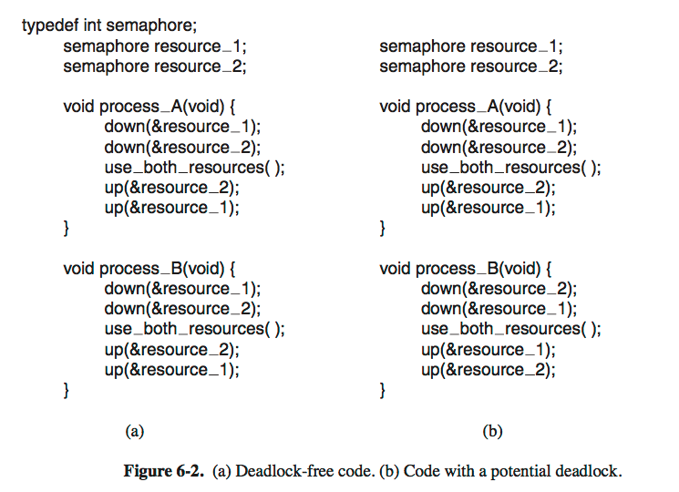
            + _two processes: potential for deadlock_
                + _a, deadlock-free_
                    + either `A` or `B` will acquire the first resource 
                    + this process will acquire the second resource and do work
                    + the other process will simply block until it becomes available
                + _b, potential deadlock_
                    + maybe the above scenario, but also maybe that 
                    + `A` acquire resource 1, `B` acquire process 2
                    + Each one will now block when trying to acquire the the resource the other process is holding
                    + neither process will ever run again!!! 


### Intro to deadlocks

+ _deadlock_
    > Formally, a set or processes is _deadlocked_ if each process in the set is waiting for an event that only another process in the set can cause.

    + _In other words_
        + because all processes are waiting, none of them will ever cause any event that could wake up any of the other member of the set
        + all processes continue to wait forever
+ _categories_
    + _resource deadlocks_
        + where _event_ is the _release of some resource_ possessed by another member of the set. 
        + i.e. waiting for a resource owned by a deadlocked process
        + _note_
            + number of processes, and number/kinds of resource owned/requested is unimportant
+ _competition synchronization causes resource deadlock_
    + independent process would complete service if their execution were not interleaved with competing processes.
    + To prevent inconsistent resource state cuased by interleaving processes, process locks the resource
    + interleaved access to locked resources (owned) cause deadlocks
        + a process successfully acquire one resource (semaphore)
        + then deadlocked trying to acquire another one 
+ _Condition for resource deadlocks_ 
    + _4 conditions_
        1. _mutual exclusion_
            + each resource is either currently assigned to exactly 1 process or is available
        2. _hold-and-wait_ 
            + process currently holding resources that were granted earlier can request new resources
        3. _No-preemption_
            + resources previously granted cannot be forcibly taken away from a process. They must be explicitly released by the process holding them (in form of an event)
        4. _Circular wait_
            + must be a circular list of two or more processes, each of which is waiting for a resource held by the next member of the chain
    + all 4 condition must be present for a resource deadlock to occur
        + equivalently, absence of any one condition cannot yield resource deadlock
+ _deadlock modeling_ 
    + _as a graph problem_ 
        + _circle vertices_
            + process
        + _square vertices_
            + resource
        + _directed edge from a resource to process_
            + resource has been requested, granted, and is currently held by the process
        + _directed edge from a process to resource_ 
            + process is currently blocked waiting for that resource
    + 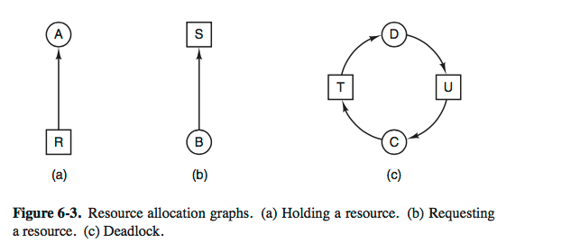
        + _a cycle_ in the graph model indicates a deadlock
    + 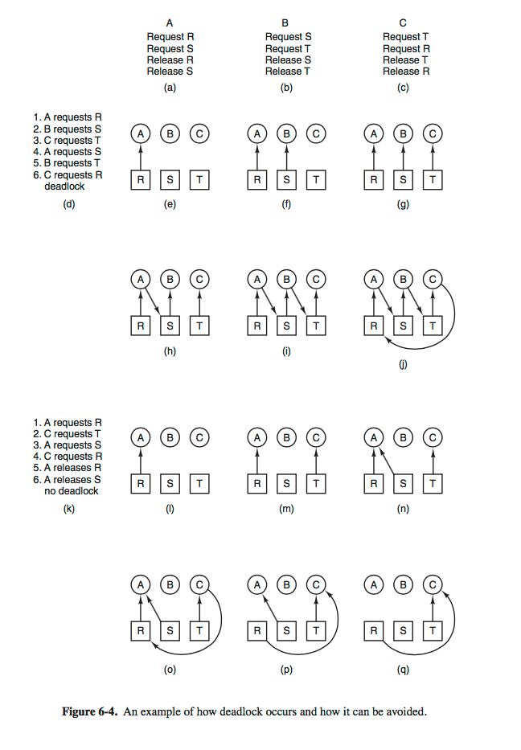 
        + _note_
            + _e-j_: 
                + forms a deadlock as there is a cycle
            + _i-q_:
                + an alternative schedule that is deadlock-free
                + the OS, if at all possible, may prevent deadlock by using a different schedule
+ _Strategy to deal with deadlock_
    1. _ignore the problem_
    2. _detection and recovery_
    3. _dynamic avoidance by careful resource allocation_ 
    4. _prevention, by structurally negating one of 4 conditions_


### 6.3 The ostrich algorithm  

+ _tradeoff: if its worth it to solve the problem_

### 6.4 Deadlock Detection and Recovery


+ _motivation_ 
    + does not attempt to prevent deadlocks from occurring
    + let deadlock occur, detect when this happens, and then take actions to recover
+ _deadlock detection with one resource of each type_ 
    + _assumption_ 
        + one resource of each type, no more 2 resource of each class 
            + 1 blu-ray recorder, 1 tape driver... 
    + _methods_ 
        + construct a resource graph 
            + 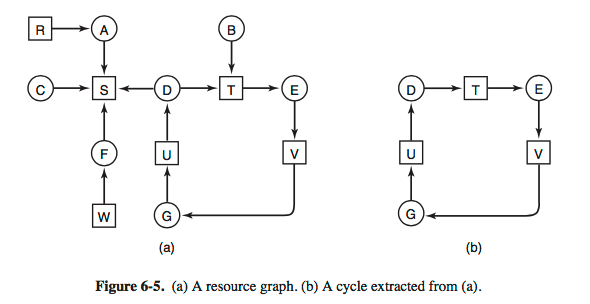
        + if the graph contains at least 1 cycle, there is a deadlock
            + algorithm for finding a cycle: DFS...
+ _deadlock detection with multiple resources of each type_     
    + _method_ 
        + 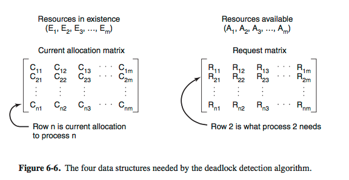
        + `m` class of resources
        + `E_i` where `1 <= i <= m` is _existing resource vector_
            + total number of instancs of each resource in existence
        + `A_i` where `1 <= i <= m` is _available resource vector_
            + number of instance resource `i` are currently available
        + `C` _current allocation matrix_
        + `R` _request matrix_
        + ...
+ _recovery from deadlock_ 
    + _through preemption_ 
        + dependent on nature of resource
        + recovering may be difficult or impossible 
    + _through rollback_ 
        + _checkpoint_
            + process checkpointed, i.e. its state written to a file so that it can be started later
            + contains memory image + resource state
        + _on detecting deadlock_ 
            + a process that owns a needed resource is rolled back to a point in time before it acquired that resource, by startinsg on of its earlier checkpoints
            + all work since that checkpoint is lost
            + the requested resource (that breaks the cycle) is assigned to one of deadlocked process
+ _recovery through killing processes_
    + choose a process that holds resource that some process in the cycle needs.
    + best to kill a process that can be rerun from beginning with no ill effect
        + i.e. compilation
        + not a good idea for database...


### Deadlock Avoidance

+ _motivation_ 
    + system must determine if a resource is _safe_ or not and make allocation only when it is safe (i.e. will not generate deadlock)
+ _resource trajectories_ 
    + 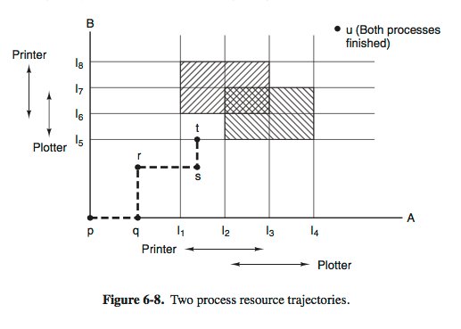  
        + axis represent number of instructions from start executed by `A` and `B`
        + resource
             + `A` request printer at `I_1` and request plotter at `I_2`
             + `A` release printer at `I_3` and release plotter at `I_4`
             + similar for `B` as shown
        + _execution_ 
            + horizontal lines means `A` gets CPU
            + vertical lines mean `B` gets CPU
            + any point is the state of both processes `A` and `B`
        + `r->s`
            + `A` grants printer
        + `s->t`
            + `B` grants plotter
        + _shaded region_ 
            + by mutual exclusion, impossible to enter this region...
        + _unsafe state_ 
            + system enter bounded by `I_1` `I_2` and `I_5` and `I_6`
                + will eventually deadlock when it gets to intersection of `I_2` and `I_6`
                + entire shaded box is unsafe and must not be entered
        + _safe state_ 
            + at `t`, 
                + `B` is requesting plotter
                + but system must decide to let `A` run till `I_4` even if `A` has yet to request plotter
                + this will be deadlock-free
+ _safe and unsafe state_
    + _safe state_ 
        > a state is safe if there is some scheduling order in which every process can run to completion even if all of them suddenly request their maximum number of resources immediately

        + guarantees all process will finish
    + _unsafe state_
        + complement of safe state
        + is not a deadlocked state, may or maynot give rise to deadlock
    + 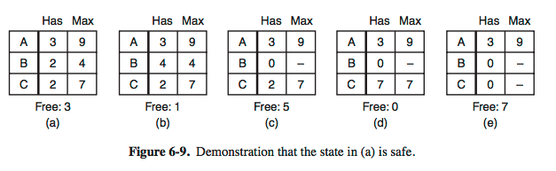
        + _initially_ 
            + total of 10 resource 
            + 7 allocated, 3 free
        + _safe states_  `B -> C -> A`
            + since exists a sequence of allocations that allows all processes to completion
    + 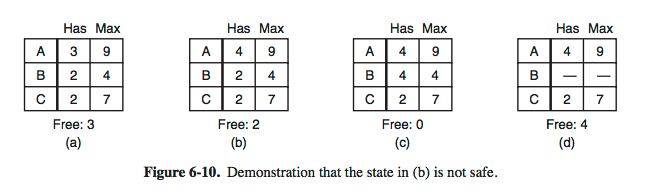
        + _unsafe states_
            + no sequence that guarantees completion from `b`
        + `a -> b` 
            + give `A` one more resource
            + the allocation decision moved the system from safe to an unsafe state
+ _Banker's algorithm_
    + _history_ 
        + _max credit_ (max resource)
        + _current credit_ (current resource used by processes)
        + _banker_ (OS) 
            + grants credits (resources) to a set of customers 
            + does not grant max credit immediately, since not all customer needs all of them
        + _customer_ (processes)
            + may ask for resource from banker from time to time
    + _summary_ 
        + check to see if granting a request leads to a safe state 
            + if safe, carried out 
            + if not safe, 
    + 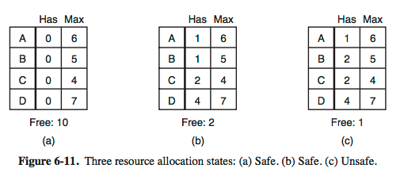
        + single resource
        + `b` is safe, since 
            + banker can give `C` 2 resources, 
            + let `C` finish and release 4 resources
            + give resource to `D` or `B` and so on
+ _Banker's algorithm for multiple resources_ 
    + 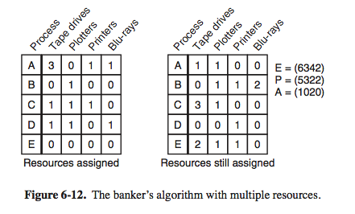
        + _left matrix_: resource assigned 
        + _right matrix_: resource each process still needs to complete
        + _assumption_ 
            + process declare total resources required before executing.
    + _disadvantage_ 
        + process rarely know in advance what max resource needs will be
        + number of processes is not fixed 


### Deadlock Prevention


+ _motivation_
    + avoidance is essentially impossibl,e since it requires information about future requests
+ _Attaching the mutual exclusion condition_ 
    + _idea_
        + If no resource is exlusively assigned to a single process, we would never have deadlock
    + _example_ 
        + _data_
            + make data read-only, so processes can use data concurrently
        + _printer_
            + _printer daemon_ will request printer only 
                + so no deadlock for printer (no hold-and-wait)
            + printer daemon only starts printing after the complete output file is available...
                + deadlock may still happen if 2 processes fill up spoolilng space 
    + _idea_
        + avoid assigning a resource unless absolutely necessary
+ _Attaching the Hold-and-Wait condition_ 
    + prevent processes that hold resource from waiting for more resource
    + _idea_
        + require all processes to reqeust all process before start
        + if all resource is available, allocate and run
        + if one or more resources are busy, nothing will be allocated, process have to wait
    + _problem_ 
        + processes must report all resources needed, many do not know what they need
            + in fact, we can use banker's algorithm if we know every request...
        + resources will not be used optimally
            + since process might only be using a fraction of resource requested
+ _Attaching the No-Preemption condition_   
    + _idea_
        + swap in/out resources which can be _virtualized_ 
    + _example_
        + printer daemon is a virtualization of printer...
        + records in database cannot be virtualized, ... 
+ _Attacking the Circular Wait condition_ 
    + _idea 1_
        + each process is entitle to a single resource at a time
        + if a process needs a second resource, it has to release the first one
    + _idea 2_
        + provide a global numbering of all resources
        + process can request however they wanted
        + but all requests must be made in numerical order 
            + i.e. process may request printer then tape drive, but not reversed
        + 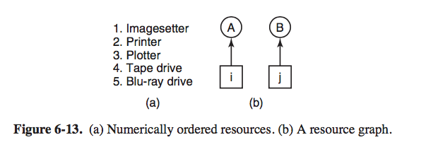
        + _note_
            + no deadlock possible
            + deadlock only possible if `A` request `j` and `B` request `i`
            + if `i>j`, then `A` is not `A` is not allowed to request `j` because `j` has a lower number
            + if `i<j`, then `B` is not allowed to request `i`
        + _generalization_ 
            + at any point, one of assigned resource is highest
            + process holding the resource will never ask for any resource that is assigned (i.e. resource with a lower number)
            + safe sate, exists a scenario in which all processes finish, so no deadlock
    + _problem_ 
        + hard to find an ordering that satisfies everyone
        + impossible with miriad of different resources
+ _summary_
    + 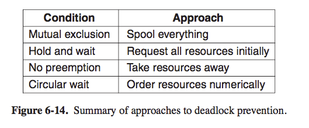


### 6.7 Other issues


+ _two-phase locking_
    + _motivation_ 
        + preventing deadlocks in database systems 
        + similar to requesting all resources in advance, 
    + _idea_
        + first phase, 
            + the process tries to lock all records i needs, one at a time
            + if succeeds, begins the second phase, 
            + if some record already locked, process just releases all its locks and start from the first phase all over.
        + second phase.
            + perform updates, and release locks
    + _problem_
        + not applicable to real-time system to just terminate a process partway through because a resource is not available and start over again.
        + not applicable to start over if process has read/written messages to network, file...
+ _Communication deadlocks_
    + _communication deadlocks_
        + _scenario_ 
            + 2 process communicate by sending messages, 
            + process `A` sends message to `B`, then blocks until `B` sends back a reply
            + but message get lost `A` is blocked forever, `B` is blocked waiting for a request asking it to do something
        + _note_
            + no resource in sight 
            + but still a deadlock is present, since we have a set of 2 processes, each blocked waiting for an evenrt only the other can cause
    + _cooperation synchronization_ 
    + _contrast to resource deadlock_
        + cannot be prevented by ordering resources (since no resource)
        + cannot be avoided by careful scheduling (since no moments when a reqeust could be postponed)
    + _idea_    
        + _timeout_
            + a timer is started whenever a message is sent to which a reply is expected
            + if timer goes off before reply arrives, the sender assumes messsage is lost and sends it again
            + no deadlock
            + a _heuristic_ to detect deadlocks and enables recovery
    + _problem_
        + may get message > 2 times, assume the message is not lost but is simply delayed because of network
        + _protocol_ comes into play...
+ _livelock_
    + 