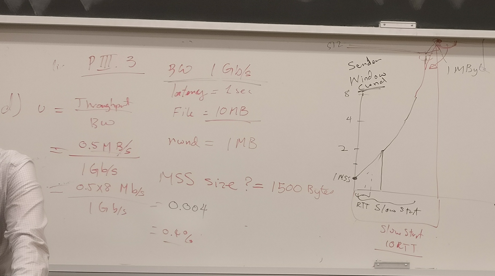
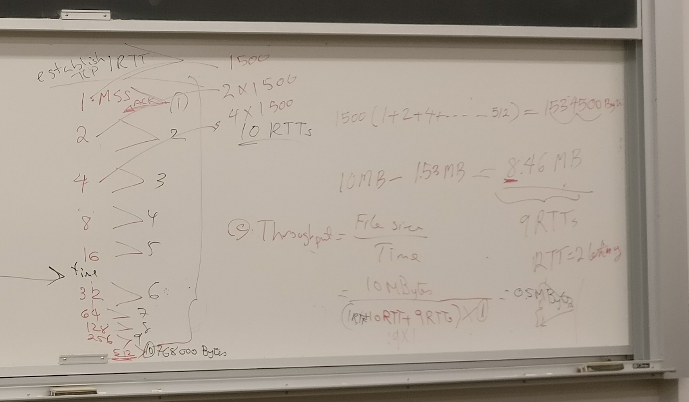
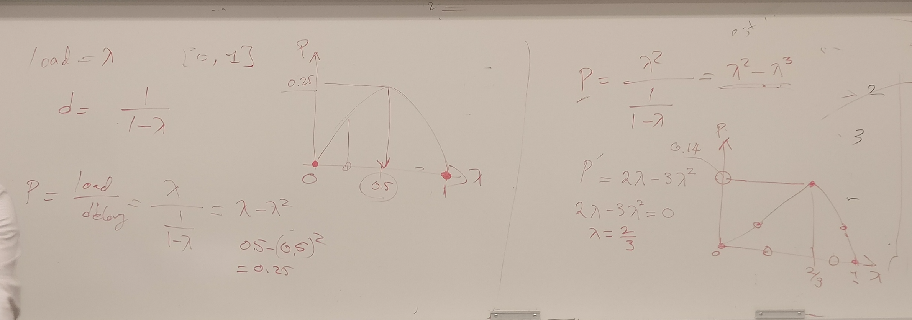

PIII 3 

+ 1Gb/s bandwidth 
+ latency 1s
+ file 10MB
+ receiver windowsize 1MB
+ MSS 1500Bytes
+ packet in 1KB chunks




+ how many RTTs take until slow start opens send window to 1MB?
    + 10+1
    + including the RTT for establishing connection
```
1   > Ack
2   >
4   >
... >
256 >
512 > 768KB
before sending 1024, sent window stays at 1MB,  (assuming no packet loss) until file finished transmitting
```

+ how many RTTs needed to send the file ?
    + 1500(1+2+4+...+512) = 1.53MB
    + left with 10-1.53 = 8.46MB
    + Needs 9 more RTT to send the rest, (each RTT sends 1MBs)
    + Note not a strictly exponential increase, after reach sender window size, will be a constant 1MB 

+ what is throughput 
    + throughput = file size / time = 10MB / (1RTT+10RTT+9RTT)*1s/RTT = 0.5MB/s
        + the added 1RTT used for establishing RTT
    + utilization  = throuput / bandwidth = 0.5MB/s/1Gbps = 0.5 x 8Mb/s / 1Gbps = 0.004 = 0.4%


6. power P = load / average delay


+ way power is commonly used, and in what sense its arbitrary 
    + maybe multiple flows

+ approximation between normalized load (0~1) and average delay is `d = 1 / (1 - \lambda)`
    + lambda is normalized load offered to the network 
    + `P = load/dela = lambda / (1 / (1 -lambda)) = lambda - lambda^2`
    + sketch vlaue of power as a function of load
        + reach max at `lambda=0.5`


+ modify power to give more emphasis on throughput than delay `P = lambda^2 / d`
    + `P = lambda^2 / (1 / (a - lambda)) = lambda^2 - lambda^3`
    + `P' = 2lambda - 3lambda^2`, let `P'=0 => lambda = 2/3` 
    + sketch new power fucntion against offered load
        + reach max at `lambda=2/3` and `P=.14`

MC

+ TCP? 
    + a routing protocol (wrong, a transport)
    + 2-way handshake  (3-way)
    + TCP learns congestion via packet loss (packet loss) or variation in delay (measure RTT with timeout)
    + if SYN sent by TCP is lost, then connection lost (no, sender will keep try to send the lost packet)

+ coding. 1Mb/s use Manchester sending stream of 1s, how many transitions per second will signal emerging from this adapter have
    ```
    1: high to lows
    0: low to high
    ```
    + sending each bit with twice number of transitions, 
    + so 20 Million transitions per second

+ random early detection 
    + RED tolerant of bursts, because average queue occupancy is close to maximum threshold, there is still room in the queue to accept new bursts of packets. 
        + not always true, since we can set max threshold to max of queue
    + probability of RED dropping a packet belonging to a flow is proportional to number of flow's packets queued at router
        + yes
    + RED drop packets with probability 1 when routers queue length is greater than max threshold value
        + not true, if its average queue length then statement is true
    + 2 flows, 1 TCP and 1 UDP, share RED router, RED algo will ensure both flows receive an identical share of outgoing link
        + RED drops TCP packets only 
        + sender of UDP is not affected by a dropped packets 

+ TCP 
    + can only be lost when router queues overflow 
        + 
    + no perf benefit than having window size larger than receiver window size 
        + yes
        + flow control... sender adjust to receiver window size
    + The sender sees duplicate ACKs only when a packet is lost
        + no
        + could be that its just delay 
    + receiver reduces advertised window in response to congestion 
        + no
        + only based on memory 