+ _physical layer_ 
    + physical wire (of voltage) or wifi 
+ _link layer_ 
    + metadatas (headers) for directing information (i.e. destination) within a network
+ _IP layer_ 
    + adds IP headers for directing information between networks
+ _transport protocol_ 
    + inform which application initiates the data transmission
    + different protocols depending on different goals
        + video: UDP  (fast, maybe packet loss)
        + mail: TCP (secure, everything sent)
+ _application layer_ 
    + i.e. mail, skype, youtube,...


+ _networks_     
    + communication between networks mediated by a _router_ (gateway)
        + the link layer headers directs to the router
        + the IP layer headers directs to the destination in another network
+ _switch_ 
    + a server that dispatches information to a collection of clients
    + needs to support
        + physical layer
        + link layer 
    + usually implemented in hardware, for cost-effectiveness
+ _router_ 
    + relay information between one network to another
    + _supports_ 
        + physical layer
        + link layer 
        + IP layer
+ _server/client_ 
    + need to support 
        + physical layer 
        + link layer
        + IP layer 
        + transport
        + application layer
+ _note_ 
    + different devices doesn't need to support layers that it doesnt require


--- 

### Chapter 1 Foundation

#### 1.1 Applications 

+ _application_ 
    + web pages
    + streaming 
    + voice-over-IP (skype) 
        + tighter timing constriant

#### 1.2 Requirements 

+ _Scalable Connectivity_
    + _terminology_
        + 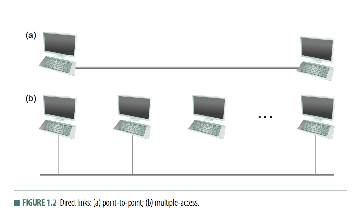
        + _link_ 
            + physical medium  (cable, optical fiber) that connects computers
        + _node_
            + computers link connects 
        + _point-to-point_
            + physical links limited to a pair of nodes
        + _multiple-access_ 
            + more than 2 nodes may share a single physical link (WIFI)
            + usually limited in size
        + _cooperative-connectivity_
            + indirect connectivity achieved amongst a set of coorperating nodes
    + _switched network_ 
        + 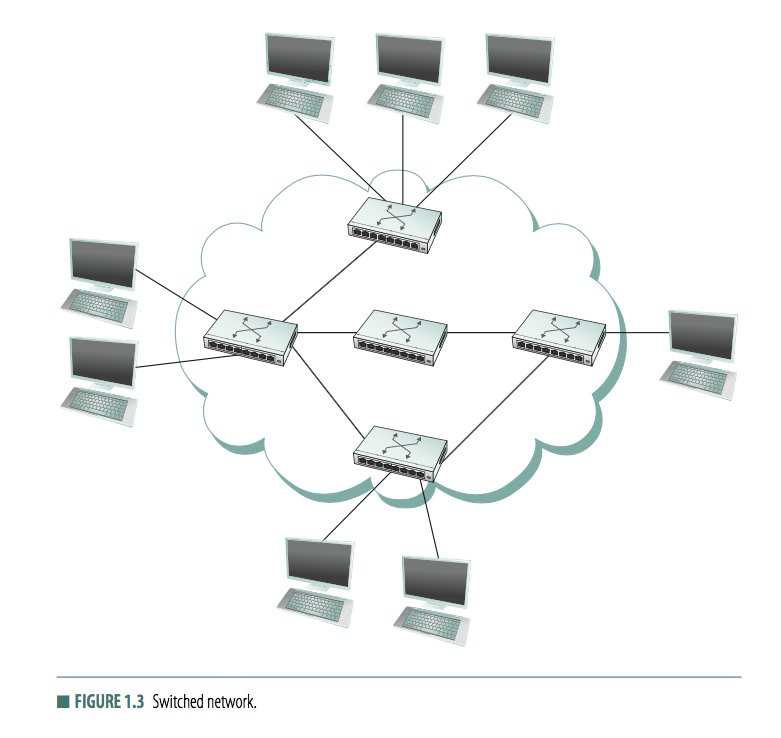
        + a set of nodes, each attached to one or more point-to-point links 
        + _switches_ 
            + or _forwarding nodes_, nodes that implements the network 
            + nodes that forward data received on one link out on another 
        + _hosts_ 
            + nodes that use the network
        + _circuit switched_
            + telephone
            + must establish a dedicated circuit across a sequence of links and then allows the sourec node to send a stream of bits across this circuit to a destination node
        + _packet switched_ 
            + computer networks 
            + nodes in network sends discrete blocks of data, or _packet_, to each other 
            + _store-and-forward_ 
                + each node receive a complete packet over some link
                + stores packet in internal memory
                + forward to next node 
    + _Internetwork (internet)_ 
        + 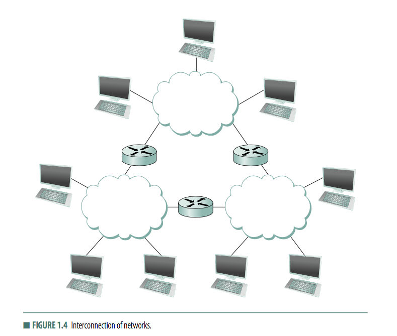
        + a set of independent networks interconnected 
            + `i` for generic internetwork of networks 
            + `I` for TCP/IP network 
        + _router/gateway_ 
            + node that is connected to 2 or more networks 
            + forwards messages from one network to another
        + _address of node_ 
            + a byte string that identifies a node 
            + network can use node's address to distinguish from other nodes 
            + maybe used by swithes/routers to decide how to forward the message 
        + _routing_ 
            + process of determining systematically how to forward messages toward the destination node based on its address
        + _unicast_ 
            + the source node wants to send a message to a single destination 
        + _broadcast_ 
            + the source node wants to send a message to more than 1 destination
+ _Cost-effective resource sharing_  
    + _multiplexing_ 
        + 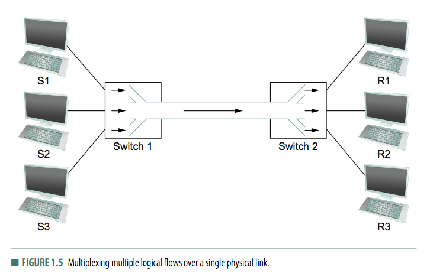
        + a system resource (physical link) is shared among multiple users
            + and then demultiplexed back into separate flows 
    + _methods for multiplexing_ 
        + _synchronous time-division multiplexing (STDM)_
            + divide time into equally-sized quanta and, in round-robin fashion, give each flow a chance to send its data over the physical link
        + _freuqency-division multiplexing (FDM)_
            + transmit each flow over the physical link at a different frequency
        + _limitations of STDM and FDM_ 
            + if flows does not have any data to send, the share of physical link/ time quantum or frequency remains idle
            + max number of flow is fixed and known ahead of time
                + cannot resize quanta
        + _solution: statistical multiplexing_ 
            + physical link is shared over time like STDM, but data is transmitted from each flow on demand rather than during a predetermined time slot,
            + _properties_ 
                + efficient, as it ensures no channel will go waste
                + flexible, as it allows link to be divided among a variable number of channels
                + however, delay time is not determinstic as in STDM
            + _consider_
                + cant ensure that all flows eventually get their turn to transmit over the physical link
                + so defines an upper bound on the size of block of data that each flow is permitted to transmit at a given time
                + _packet_ 
                    + the limited-size block of data 
                    + implies may need to fragment message to meet the size limit
                + _message_ 
                    + arbirtarily large that application might want to transmit 
            + _decision as to which packet is transmitted is on a per-packet basis_ 
                + 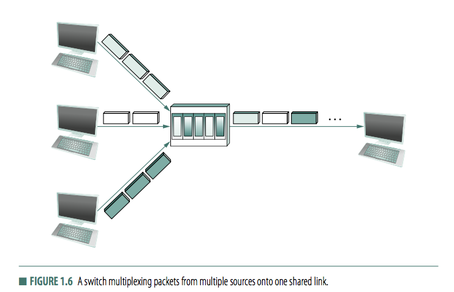
                + so, concurrent flows will have packets interleaved on the physical link
            + _decide which packet to send_ 
                + _FIFO_
                + _round-robin_
            + _congestion_ 
                + a switch may have to buffer packets if line is busy 
                + if a switch receive packets faster tha it can send them for some time, buffer will run out
                + some packets will have to be dropped -> congested
+ _Support for common service_ 
    + _motivation_ 
        + network is complex, which strains application developer
        + network designer build common services, aim to hide complexity of network from application 
    + _solution: channels_    
        + 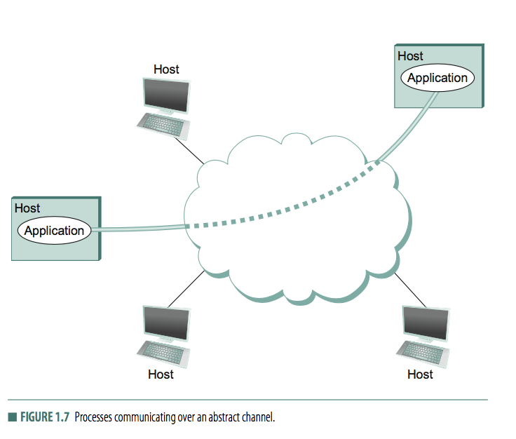
        + network provides logical _channels_ over which application-level processes can communiate with each other
        + like a pipe that connects 2 applications over the network 
        + different channels focus on certain functionality 
            + order of data
            + timing of transmission
            + integrity of data 
            + security
    + _File transfer protocol (FTP)_ or _Network file system (NFS)_
        + _goal_
            + a pair of processes
            + _client_: one process requests that file be read/written 
            + _server_: a second process that honors this requests
    + _request/reply channel_ 
        + ensures requests are sent and only one copy of message is delivered 
        + protect privacy and integrity of data 
    + _message stream channel_ (video records)
        + supports different delay property 
        + does not need to guarantee all messages delivered, 
            + since video is fine even if some frames missing 
        + but have to ensure messages delivered arrive in the same order in which they were sent
        + might want to support multicast (teleconferencing)
+ _Reliability_ 
    + _Types of problems_ 
        + _bit error_ 
            + packet have 1 turned to 0 or vice versa 
            + _cause_   
                + outside forces 
            + fairly rare 
        + _packet loss_ 
            + a complete packet is lost by the network 
            + _cause_ 
                + contains bit error, so discarded, or
                + overloaded forwarding nodes drops the packet 
                + software bug, cause packet to forward to incorrect destination 
            + _have to distinguish lost packet vs. delayed packet_
        + _failed node/link_ 
            + physical link cut or computer crashes
            + _cause_ 
                + power failure
                + software crash 
            + _may reroute packets around a failed node/link_
+ _Manageability_ 
    + _motivation_ 
        + want to make changes to network to make it scale 


#### 1.3 Network Architecture


+ _Layering and Protocols_ 
    + _abstraction_ 
        + hiding details behind a well-defined interface
    + _layering for networking_     
        + 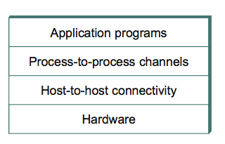
        + 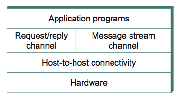
    + _protocols_  
        + provides 
            + a communication service is exports locally as _service interface_, and 
            + set of rules governing messages that the protocol exchanges with its peers to implement the _peer service_
        + the abstract objects that make up the layers of a network system 
        + _example_ 
            + a request/reply protocol
            + a message stream protocol
        + _two interfaces_ 
            + 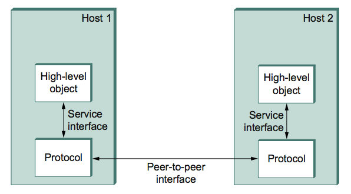
            + _service interface_ 
                + used by other objects on the same computer that want to use the communication service 
                + i.e. HTTP protocol support operation to fetch HTML from a remote server
            + _peer interface_ 
                + used by objects on other machines (peer) 
                + defines the form and meaning of messages exchanged between protocol peers to implement the communication service
                + i.e. HTTP protocol defines how a `GET` command is formatted, what args can be used with the command, and how a server should respond
    + _protocol graph_ 
        + _motivation_ 
            + peer-to-peer communication is usually indirect 
            + maybe different protocols at any given level (providing different services)
        + _nodes_ 
            + represent protocols 
        + _edges_ 
            + a _depend on_ relation
        + 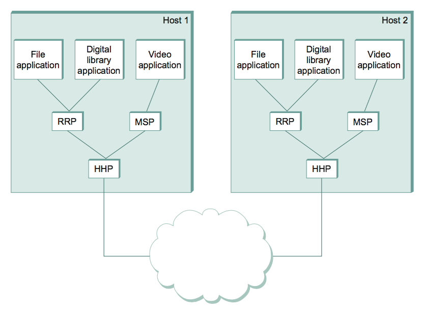
            + _RRP: request/reply protocol_ 
                + provides a type of P2P channel
            + _MSP: message stream protocol_
                + provides a type of P2P channel
            + _HHP: host-to-host protocol_
                + provides connectivity service
            + _steps_ 
                + file application asks RRP to send message 
                + RRP invokes service of HHP, to send message to its peer 
                + HHP on end host passes message up to RRP, which translates message to file application on remote machine
        + _protocol stack_
            + a set protocols that an application employs
    + _protocol specification_ 
        + abstract interfaces, i.e. operations defined by the service interface and the form and meaning of messages exchanged between them  
    + _protocol module_ 
        + implementations of a protocol specification
    + _network architecture_ 
        + the set of rules governing the form and content of a protocol graph 
        + IETF/ISO standardize rules
+ _Encapsulation_ 
    + _request/replay protocol (RRP)_ 
        + sees an array of bytes, does not care about what data is sent, 
        + attach a _header_ to the message
            + instruct peers how to handle the message
            + usually to the begining of message 
        + _header_
            + a data struture used among peers to communicate with each other 
            + defined by protocol specification
        + _body (payload)_ 
            + rest of the message, 
        + _encapsulation_ 
            + application data is enapsulated in the new message created by RRP
    + 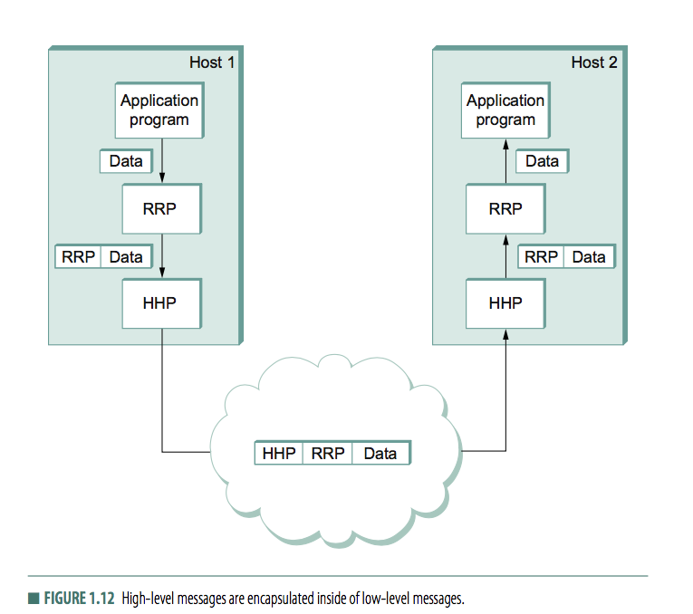
        + _encapsulation_ is repeated at each level of the protocol graph 
        + _result_ 
            + resulting message are equivalent 
        + _observation_ 
            + low-level protocol does not interpret message given by high-level protocol
+ _Multiplexing and Demultiplexing_ 
    + _packet switching_   
        + multiplex multiple flows of data over a single physical link, 
    + _RRP_ 
        + conceptually, RRP implementing a channel, with 
        + messages from two difference applications _multiplexed_ over this channel at the source host 
        + _demultiplexed_ back to the appropriate application at the destination host
    + _RRP header_ 
        + contains RRP's demultiplexing key, _demux key_, an identifier that aids destination host demultiplex message to the correct application 
    + _HHP_
        + implements multiplexing/demultiplexing mechanism
        + has its _demux key_
+ _The 7-layer model_ 
    + 
    + _reference model_
        + bottom 3 layers implemented on all network nodes, including switches and hostss
    + _Open Systems Interconnection (OSI)_  
        + devised by ISO
        + partitions network functionality into 7 layers
        + one/more protocols implement the functionality assigned to a given layer
    + _Physical layer_ 
        + transmission of raw bits over a communication link
    + _Data link layer_ 
        + collects a stream of bits into a larger aggregates, called a _frame_
        + network adaptors, device in node's OS
        + implies frames are delivered to hosts
    + _Network layer_
        + handles routing among nodes within a packet-switched network
        + _packet_ as units of data exchange 
    + _Transport layer_ 
        + implements _process-to-process_channel
        + _message_ as unit of data exchange
        + usually run only on end hosts and not on intermediate switches/routers
    + _Session layer_ 
        + providess a name space that is used to tie together potentially different transport streams that are part of a single application
        + i.e. combine audio and video stream in a teleconferencing application
    + _Presentation layer_ 
        + concerned with format of data exchange
        + i.e. `int32` vs `int16`
    + _Application layer_ 
        + HTTP
+ _Internet Architecture (TCP/IP)_ 
    + 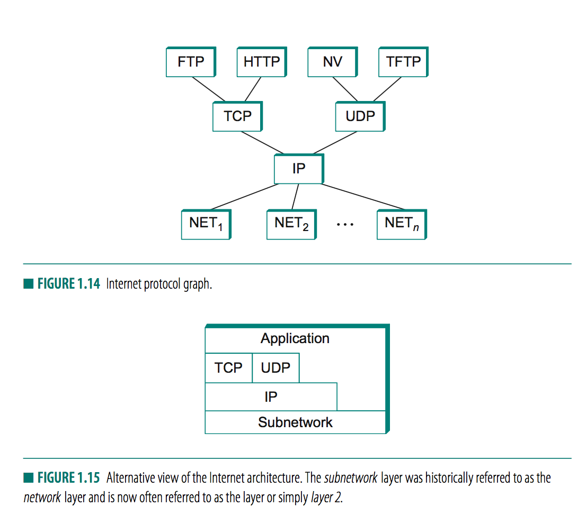
        + _4-layer model_ 
        + _observation_ 
            + does not enforce layering
            + application free to bypass transport layer to directly use IP or underlying networks
    + _link/subnet (layer 2)_ 
        + NET1/NET2
        + combination of hardware (network adaptor) and softwrae (network device driver)
        + i.e. `802.11 Wi-Fi`
    + _network (layer 3)_
        + IP only
        + protocol that supports interconnection of multiple networking technologies into a single, logical internetwork
    + _transport or end-to-end (layer 4)_ 
        + _Transmission Control Protocol (TCP)_
            + reliable byte-stream channel
        + _User Datagram Protocol (UDP)_
            + unreliable data-gram delivery channel
        + logical channels to application programs 
    + _application protocol (layer 7)_
        + HTTP, FTP, Telnet
        + Simple Mail Transfer Protocol (SMTP)
    + _Idea_ 
        + IP defines a common method for exchanging packets 
        + Above IP, there can be arbitrarily many transport protocol
            + each a different channel abstraction to application programs
        + Below IP, allow for arbitrarily many different network technologies
            + wireless, P2P, ethernet

#### 1.4 Implementing Network Software

+ _Network application (application-level protocols)_ 
    + may need to implement a network application on top of the Internet
    + such program is both 
        + an application (interact with users)
        + a protocol (communicate with peers)
+ _Application Programming Interface (Socket)_
    + _network API_ 
        + implements network protocols
        + OS provided
    + _socket interface_ 
        + widely supported, 
        + part of the network API 
        + _2 concerns_ 
            + protocl provides _service_ 
            + API provides _syntax_
        + _defines_ 
            + create, attach socket
    + _socket_ 
        + the point where a local application process attaches to the network
    + `int socket(int domain, int type, int protocol)`
        + `domain`: protocol faminly 
            + `PF_INET`, Internet family
            + `PF_UNIX`, UNIX pipe 
            + `PF_PACKET`, direct access to network interface, bypass TCP/IP
        + `type`: semantics of communication 
            + `SOCK_STREAM`, byte stream 
            + `SOCK_DGRAM`. message-oriented service (i.e. UDP)
        + `protocol`, 
            + `UNSPEC` (combination of `PF_INIT` nad `SOCK_STREAM` implies TCP)
        + returns a handle for socket
    + _Server_ 
        + _passive open_, socket is prepared to accept connection but does not actually establish a connection
        ```c
        int bind(int socket, struct sockaddr *address, int addr len)
        int listen(int socket, int backlog)
        int accept(int socket, struct sockaddr *address, int *addr len)
        ```
        + `bind`, newly created socket to specified `address` (network address of server)   
            + IP address + TCP port number
            + port number is part of a demux key 
        + `listen`, defines how many connections can be pending on the specified `socket`
        + `accept`, carries out passive open
            + _blocking_, does not return until participant established a connection 
            + on success, returns a _new socket_ that corresponds to just-established connection 
            + `address` contains participant's address
    + _Client_ 
        ```c
        int connect(int socket, struct sockaddr *address, int addr len)
        ```
        + `connect`, performs _active open_
            + does not return until TCP has established
            + `address` contains remote address
    + _Both_ 
        ```c
        int send(int socket, char *message, int msg len, int flags) int recv(int socket, char *buffer, int buf len, int flags)
        ```
        + `send` sends `message` over `socket`
        + `recv` receives message from `socket` into `buffer`
+ Example application 
    + _client_ 
        + `gethostbyname`
            + translate name into remote host IP address
    ```c
    #include <stdio.h>
    #include <sys/types.h>
    #include <sys/socket.h>
    #include <netinet/in.h>
    #include <netdb.h>
    #define SERVER_PORT 5432
    #define MAX_LINE 256
    int
    main(int argc, char * argv[])
    {
        FILE *fp;
        struct hostent *hp;
        struct sockaddr_in sin;
        char *host;
        char buf[MAX_LINE];
        int s;
        int len;
        if (argc==2) {
            host = argv[1];
        }
        else {
            fprintf(stderr, "usage: simplex-talk host\n");
            exit(1); 
        }
        /* translate host name into peer's IP address */
        hp = gethostbyname(host);
        if (!hp) {
            fprintf(stderr, "simplex-talk: unknown host: %s\n", host);
            exit(1); 
        }

        /* build address data structure */
        bzero((char *)&sin, sizeof(sin));
        sin.sin_family = AF_INET;
        bcopy(hp->h_addr, (char *)&sin.sin_addr, hp->h_length);
        sin.sin_port = htons(SERVER_PORT);
        /* active open */
        if ((s = socket(PF_INET, SOCK_STREAM, 0)) < 0) {
            perror("simplex-talk: socket");
            exit(1); 
        }
        if (connect(s, (struct sockaddr *)&sin, sizeof(sin)) < 0)
        {
            perror("simplex-talk: connect");
            close(s);
            exit(1);
        }
        /* main loop: get and send lines of text */
        while (fgets(buf, sizeof(buf), stdin)) {
            buf[MAX_LINE-1] = '\0';
            len = strlen(buf) + 1;
            send(s, buf, len, 0);
        } 
    }
    ```
    ```c
    #include <stdio.h>
    #include <sys/types.h>
    #include <sys/socket.h>
    #include <netinet/in.h>
    #include <netdb.h>
    #define SERVER_PORT  5432
    #define MAX_PENDING  5
    #define MAX_LINE     256
    int main() {
        struct sockaddr_in sin;
        char buf[MAX_LINE];
        int len;
        int s, new_s;
        /* build address data structure */
        bzero((char *)&sin, sizeof(sin));
        sin.sin_family = AF_INET;
        sin.sin_addr.s_addr = INADDR_ANY;
        sin.sin_port = htons(SERVER_PORT);
        /* setup passive open */
        if ((s = socket(PF_INET, SOCK_STREAM, 0)) < 0) {
            perror("simplex-talk: socket");
            exit(1); 
        }
        if ((bind(s, (struct sockaddr *)&sin, sizeof(sin))) < 0) {
            perror("simplex-talk: bind");
            exit(1);
        }
        listen(s, MAX_PENDING);
        /* wait for connection, then receive and print text */
        while(1) {
            if ((new_s = accept(s, (struct sockaddr *)&sin, &len)) < 0) {
                perror("simplex-talk: accept");
                exit(1);
            }
            while (len = recv(new_s, buf, sizeof(buf), 0))
                fputs(buf, stdout);
            close(new_s);
        } 
    }
    ```

#### 1.5 Performance

+ _Bandwidth and Latency_ 
    + _round trip time(RTT)_
        + time duration from sending a message to getting a response back
    + _bandwidth (not throughput!)_ 
        + number of bits that can be transmitted over a network in a certain period of time
            + i.e. 10Mb/s
        + literally, width of a frequency badn in `Hz`
        + _bandwidth vs. throughput_ 
            + bandwidth represent data rate over a communication link
            + throughput enphasizes _measured performance_ of a system
            + i.e. a link with bandwidth of 10Mbps achieved a throughput of 2Mbps
        + _bandwidth bound_     
            + server send a 25MB image
                + more bandwidth the faster image is able to transmit
                + for 10Mbps network, needs 20s, a 1-ms channel vs 100ms channel yields minor differences
    + _latency (delay)_
        + how long it takes a message to travel from one end of a network to the other 
        + measured in time
            + i.e. transcontinental network has latency of 24ms
        + _components_ 
            + 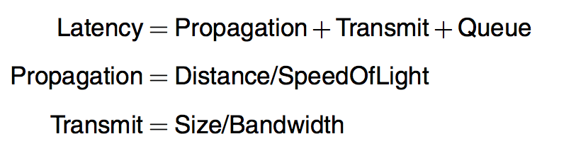
            + _speed of light propagation delay_
                + `3x10^8m/s` in vacuum, 
            + _time to transmit data_ 
                + a function of network bandwidth and size of packet 
            + _queuing delay inside network_ 
                + packet switches may store packets
        + _latency bound_ 
            +  client sending 1byte-message is latency bound
                + bandwidth doe snot matter much 
    + 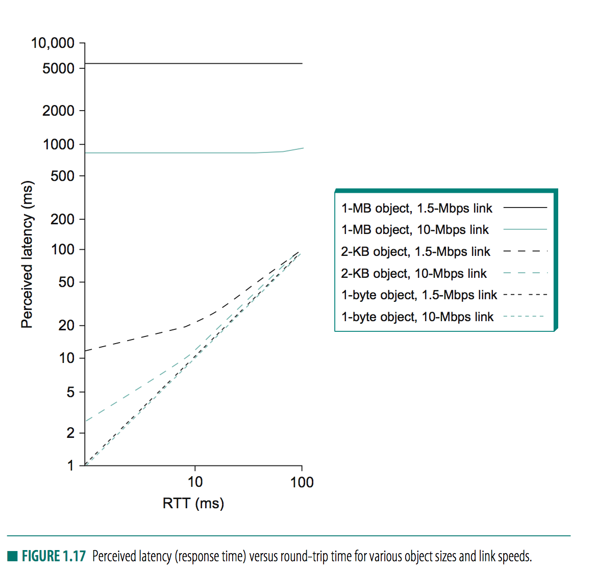
        + _note_ 
            + _1-byte object_ 
                + latency almost exactly equal to RTT
                + cant really distinguish network of different bandwidth
            + _1-kb object_ 
                + link speed makes different on 1ms RTT network
                + link speed negligible on 100-ms RTT
            + _1-Mb object_ 
                + RTT makes no difference, 
                + link speed dominates performance cross full range of RTT
    + `Deley X Bandwidth` (in bits)
        + _imagine_ 
            + 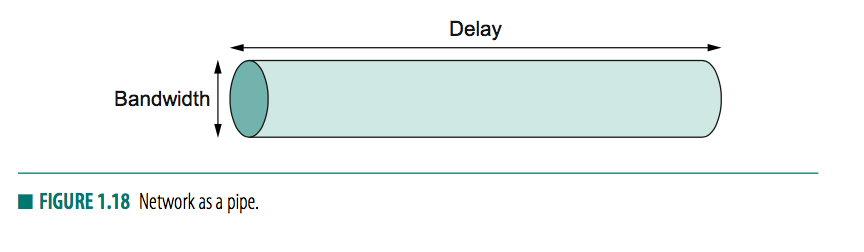
            + channel as pipe 
            + latency corresponds to length of pipe
            + bandwidth gives diameter of pipe
            + _deley X Bandwidth_ gives volumne of the pipe - the maximum number of bits that could be in transit through the pipe at any given instant
        + _example_ 
            + one-way lentency of 50ms 
            + bandwidth 45Mbps
            + channel holds 50ms X 45 Mbps = 2.25 x 10^6 bits
            + about 280Kb of data
        + _usually talk about RTT (2-way) delay_ 
        + _importance_ 
            + if sender wants to here back from receiver that the data is arriving 
                + the sender can send up one RTT x bandwidth worth of data before hearing from the receiver that all is well. 
            + If the sender does not fill the pipe
                + the sender does not fully utilize the channel
    + _high speed network_ 
        + 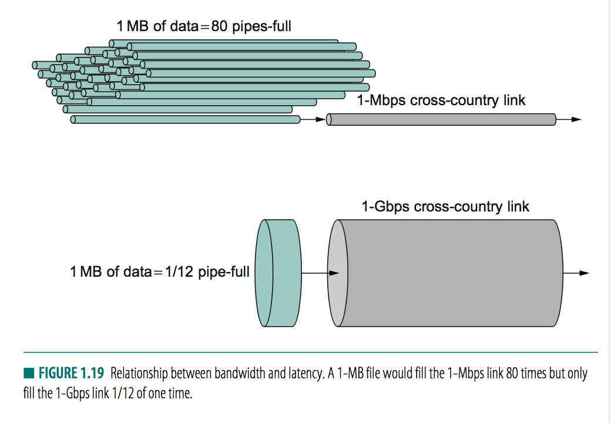
        + _note_ 
            + more data can be transmitted during each RTT on a high-speed network, so much so that a single RTT becomes a significant amount of time.
            + _latency, rather than throughput, starts to dominate network design_
        + `throughput = transferSize / transferTime`
        + `transferTime = RTT + TransferSize/Bandwidth`
            + transfertime includes not only `Latency` but also additional time spent requesting or setting up the transfer
        + _example_ 
            + 1MB file over 1-Gbps network with RTT of 100ms
            + `TransmitTime = 1MB/1Gbps = 8x10^6 bit/ 1x10^9 bps = 8ms`
            + `RTT = 100ms`
            + `TransferTime = RTT + TransmitTime = 108ms`
            + `ThroughPut = TransferSize/TransferTime = 1MB/108ms = 74.1Mbps` 
            + Note throughput is not bandwidth `1Gbps`
            + increasing data size improve effective throughput
    + _performance need_ 
        + _video_ 
            + 24-bit/pixel 352x240 pixel size
            + 30 frames / s
            + `requested throughput = (352x240x24)/8 x 30 = 75Mbps`

