#### Link layer
 
+ _bit encoding_
    + 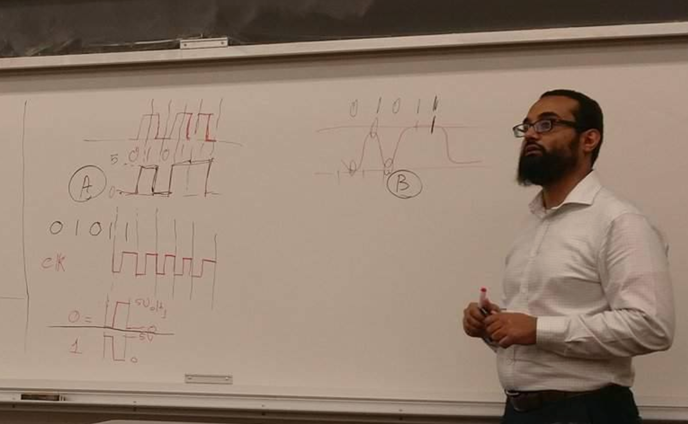
    + different voltage corresponds to 0/1
    + duration of signals representing bit is important
    + _clock signal_ 
        + tracks duration of signals
            + posedge of clock signal represent sampling points (middle of the bit)
        + _how to send_ 
            + send signal along another frequency, 
                + but _wastes resource_
            + send alongside with bit encoding
                + but _using higher bandwidth_ (doubles the alteration)


+ _frame_ 
    + `flag-data-flag`
    + `flag` 
        + some unique bit pattern 
    + if `flag` appears in `data` 
        + escape the bits (`flag` and escape bits) with a special escape bit pattern

+ _model_ 
    + _latency_ 
        + progapation delay + time to put data given a certain bandwidth

+ _error detection/correction_ 
    + _goal_ 
        + reduce sending wrong bits over network 
    + _naive solution_ 
        + sending `101` as `110011` if dont have consecutive `00` and `11`s then there is an error
            + but doubles amount of data sent
    + _even parity (1D)_
        + sending `010111110-_` 
            + where the last 1-bit makes the entire frame has even number of `1`s
            + in this case its 0
        + say if received `010111100`
            + compare last bit `0` with computed parity bit `1`
            + if different, then error happens
        + _problem_ 
            + even number of errors, cannot detect 
    + _2D parity_
        ```
        // A
              | Parity
        01011 | 1 
        11100 | 1
        _ _ _ _ _
        10111   Parity
        ```
        ```
        // B: error 1->0
              | A   B  parity
        01011 | 1   1
        11000 | 1   0  --> mistake
        _ _ _ _ _
        10111   A parity
        10011   B parity
          |--> mistake
        ```
        + if 1 error, able to detect exact bits that is changed, 
            + just flipped the bit to correct it
        + if  >1 error, unable to detect exact bit
            + but know its wrong,
            + so ask for resending data


+ _hamming distance_ 
    ```
    data: 10011010

    // 2^n spots filled with parities 
    _ _ 1 _ 0 0 1 _ 1 0 1 0 

    // for Parity1 (P1): take 1 bit in/out s
        1   0   1   1   1  -> even parity P1 = 0
    0 _ 1 _ 0 0 1 _ 1 0 1 0 _ _ _ _ 
    // for P2: take 1 bit in/out s
      _ 1     0 1     0 1  -> P2 = 1
    0 1 1 _ 0 0 1 _ 1 0 1 0 
          _ 0 0 1         0  -> even parity P4 = 1
    0 1 1 1 0 0 1 _ 1 0 1 0 
                  _ 1 0 1 0  -> even parity P8 = 0
    0 1 1 1 0 0 1 0 1 0 1 0 
    // gets transmitted
    ```
    ```
    0 1 1 1 0 0 1 0 1 1 1 0 
    
    // calculate parity 
    0 0   1       1
    | |- wrong    |- wrong
    |-OK  OK
    ```

+ _checksum_ 
    ```
    0101,0011       // data
    1010,1100       // 1s complement 

    1010
    1100
    ----- + 
    0110
       1        // overflow bit
    ----- + 
    0111        // chrcksum added to messag
    ```
+ _cyclic redundancy check_ 
    ```
    M: 10011010     // message
    G: 1101         // generator
                    // degree of G = 4-1 =3 

    // x^3 + x^2 + 0x + x^0
    // -> x^3 + x^2 + 1, 

    M' = 10011010000    // add degree # of 0s to message 
                        // last 3 bit here is reminder
    // Divide M' by G -> R = 101
    M'' = 10011010101 
    ```

--- 


# Chapter 2 Getting Connected

+ _motivation_ 
    + _physical medium_ 
        + to make connection
        + wire, optical fiber
    + _issues to address_  
        + _encoding_
            + should be part of transmission medium 
        + _framing_ 
            + delineating sequence of bits transmitted over link into complete messages that can be delivered to the end node
        + _error detection_
            + detect and correct corrupted frames
        + _reliable delivery_ 
            + make link appear reliable
        + _access mediation_  
            + mediate access to link shared by multiple host

#### 2.1 Perspectives in Connecting 

+ _link_ 
    + 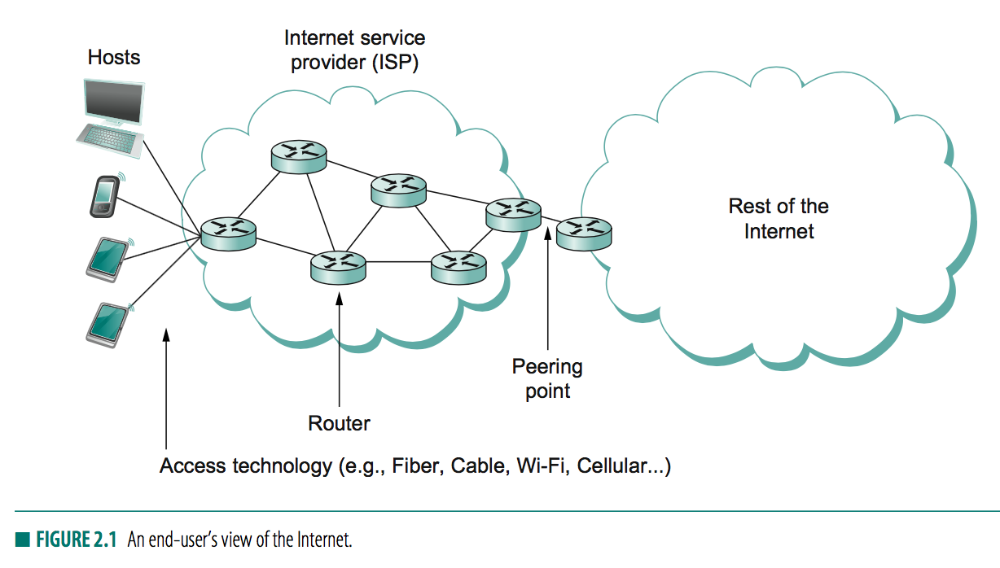
    + _note_ 
        + various type of devices used by end-users
    + _goal_
        + provides common abstraction of something as complex and diverse as a link
        + idea is devices does not care what sort of link it is connected to, only thing that matters is that it has a link to the Internet
+ _classes of links_ 
    + _characteristic_  
        + a physical medium carrying signals in the form of electromagnetic waves
        + binary data is encoded in the signal
    + _waves_ 
        + 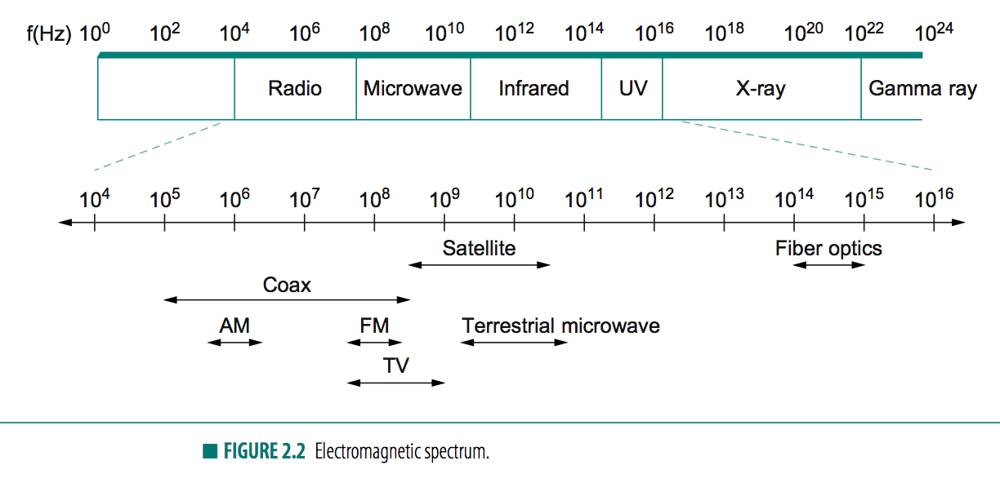
        + _frequency_ (Hz) with which electromagnetic waves oscillate
        + _wavelength_ distance between adjacent maxima
        + `speedOfLight = frequency x wavelength`
        + _modulation_ 
            + varying frequency, amplitude, or phase of the signal to effect the transmission of information
    + _assumption_ 
        + have high/low signals over the network and we are concerned with encoding data 
    + 


#### 2.2 Encoding (NRZ, NRZI, Manchest, 4B/5B)

+ _goal_ 
    + encode binary data that source node want to send into signals that the links are able to carry and then to decode the signal back to the corresponding binary data at the receiving node
    + assume working with high/low voltage
+ _network adaptor_ 
    + connects a node to a link
    + responsible for encoding,  
+ _Non-return to zero (NRZ)_ 
    + 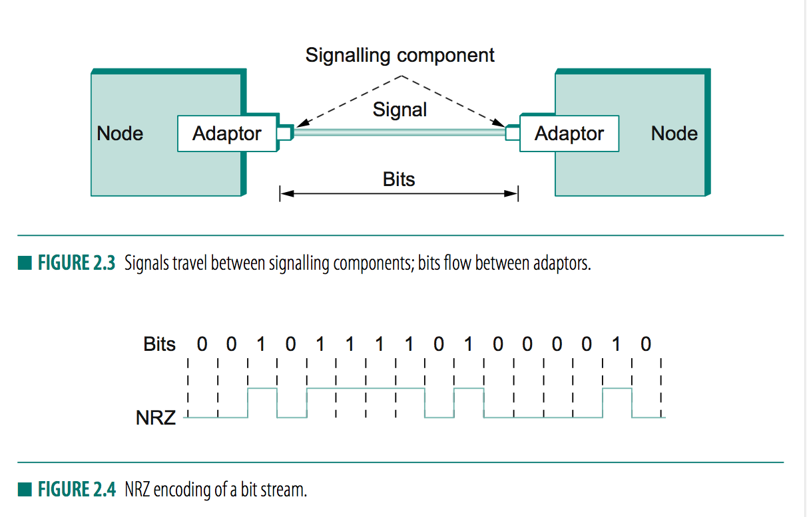
    + _idea_
        + map 1 to high signal and 0 to low signal
        + a sequence of consecutive 1s/0s means signal stay high/low on link for extended period of time
    + _problem_ 
        + _baseline wander_ 
            + receiver usually keeps an average of signal seen and use this average to distinguish between high/low
            + too many consecutive 1s/0s cause this average to change, making it more difficult to detect a significant change in the signal
        + _clock recovering problem_ 
            + both encoding/decoding are driven by a clock 
            + sender/receiver clock have to be synchronized in order to recover same bits transmitted
            + _sending clock signal with another wire_? 
                + too costly 
            + _clock recovery_ 
                + receiver derive clock from received sdignal
                + whenever signal changes, 1->0 or 0->1, the receiver knows it is at a clock cycle boundary
            + long period of time without such a transition leads to _clock drift_
+ _Non-return to zero inverted (NRZI)_
    + 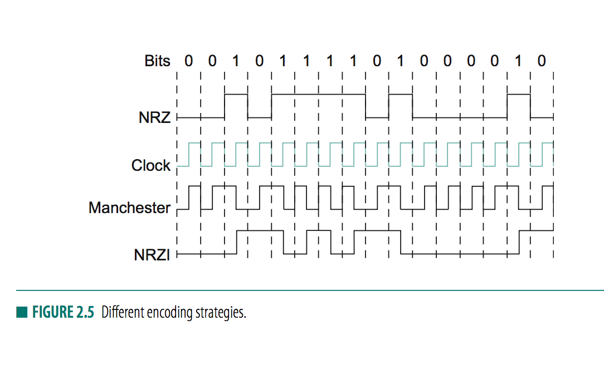
    + _idea_ 
        + sender make a transition from the current signal to encode a 1
        + stay at current signal to encode a 0
    + _discussion_ 
        + solves problem of consecutive 1s
        + but does nothing for consecutive 0s, still a problem
+ _Manchester encoding_ 
    + _idea_ 
        + merge clock with signal 
        + transmit XOR of NRZ-encoded data and the block
        + a high-low pair is one clock cycle 
    + _encoding_
        + 0: low-to-high transition
        + 1: high-to-low transition
        + since both 0/1 results in transition in signal, clocks can be recovered
    + _problem_ 
        + doubles the rate at which signal transitions are made on the link
        + implies 50% efficient only 
+ _4B/5B_
    + _idea_ 
        + insert extra bits of 0 or 1 in the bit stream to break up long sequences of 0s or 1s
        + every 4bit encoded in 5bit code with look up table
            + 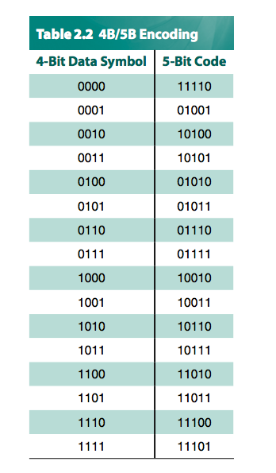
        + 5-bit codes 
            + <=1 leading 0
            + <=2 trailing 0
        + _implication_ 
            + no pair of 5-bit code results in >3 consecutive 0s
            + worst case: `011100,011100`
        + _how about the 1s?_
            + solved by NRZI already, 
    + _problem_ 
        + reduction in efficiency to 80%, better than Manchester 
        

#### 2.3 Framing 


+ _motivation_ 
    + 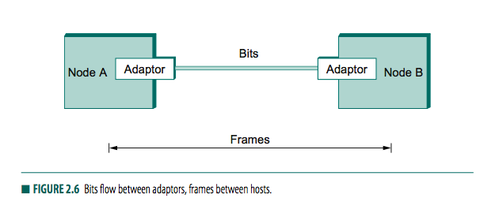
    + _frame_ is the unit of transfer between nodes, not _bit streams_
    + _network adaptor_ handles creating frames
+ _Byte-oriented Protocols (BISYNC, PPP, DDCMP)_ 
    + _basis_ 
        + view each frame as a collection of _bytes_ rather than a collection of _bits_
    + _Sentinel-based approaches_ 
        + _Binary Synachronous Communication (BISYNC)_
            + 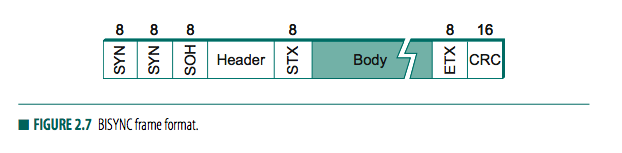
                + `SYN-SYN-SOH-header-STX-body-ETX-CRC` 
                    + `SYN` (synchronization)  
                    + `SOH` (start of header)
                    + `STX` (start of text)
                    + `ETX` (end of text)
                    + `CRC` (cyclic redundancy check)
                        + detect transmission errors
            + _problem_
                + `ETX` might appear in the data portion of frame
            + _solution: character stuffing_ 
                + escape `ETX` by preceding with a `DLE` (data-link-escape) whenever `ETX` appear in the body of frame
                + `DLE` also escaped by preceding with `DLE`
        + _Point-to-Point Protocol (PPP)_
            + 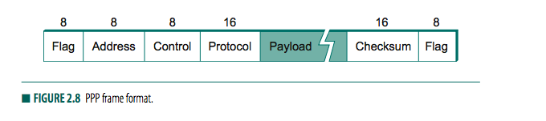
                + `flag-address-control-protocol-payload-checksum-flag`
                    + `Flag` is `01111110`
                    + `Address` `Control` - default value
                    + `Protocol` for demultiplexing
                        + identifies higher level protocols like IP/IPX
                        + sometimes payload size, defaults to 1500 bytes
                    + `Payload`
                    + `Checksum`
                        + 2 or 4 bytes long
                + _observation_
                    + several field size negotiated, not fixed
                + _Link Control Protocol (LCP)_          
                    + sends control messages encapsulated in PPP frames
                        + noted by LCP identifier in `Protocol` field
                    + PPP's frame format changes based on info contained in control messages
    + _Byte-counting approach_ 
        + _idea_ 
            + include number of bytes in a frame in a field in frame header
        + _Digital Data Communication Message Protocol (DDCMP)_
            + 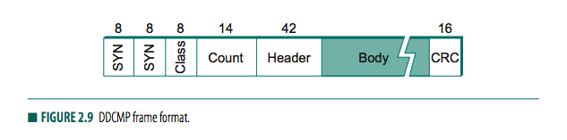
                + `Count` specifies how many bytes in a frame's body 
            + _problem_ 
                + transmission error could corrupt count field
            + _solution?_ 
                + receiver accumulate as many bytes as bad `COUNT` field indicates 
                + use error detection field to determine the frame is bad
                + wait until sees next `SYN`
                + cause _back-to-back_ frames be incorrectly received
+ _Bit-Oriented Protocols (HDLC)_
    + _idea_ 
        + does not care about byte boundaries,
    + _Synchronous Data Link Control (SDLC)_
    + _High-Level Data Link Control (HDLC) protocol_
        + 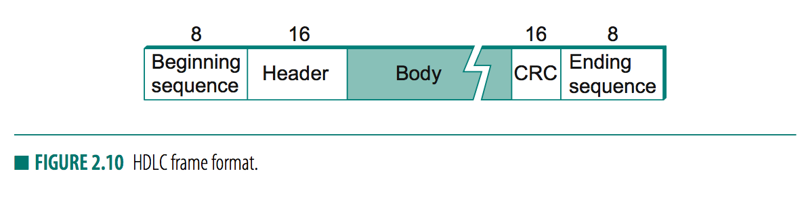
        + `beginning-header-body-CRC-encoding`
            + `beginning` is 01111110
                + _sentinel approach_
        + _bit stuffing_ 
            + _sender_ 
                + if 5 consecutive 1s `-11111-` transmitted fromm body of message
                + sender inserts a 0 before transmitting next bit `-111110-`
            + _receiver_ 
                + if 5 consecutive 1s arrive
                + if next bit is 1, then 
                    + seither end of frame marker 
                    + error introduced into bit stream
                + if next bit 
                    + is 0, we have `01111110` so is end of frame marker 
                    + is 1, we have `01111111` must be an error, so discard frame
+ _Clock based framing_ 
    + _Synchronous Optical Network (SONET)_


#### 2.4 Error Detection

+ _motivation_ 
    + _error detection_ 
        + bit error introduced into bframes
    + _actions_ 
        + _request for retransmission_ 
        + _error correction_ 
            + with erorr-correcting codes
+ _Cyclic Redundancy check (CRC)_
    + _usage_ 
        + in most link layer protocols
+ _Error detection_ 
    + _idea_ 
        + add redundant information to a frame that can be used to determine if errors have been introduced
        + usually able to send only `k` redundant bits for `n`-bit message
        + goal is to maximize probability of detecting errors using only a small number of redundant bits
    + _naive impl_ 
        + _idea_
            + transmit 2 complete copies of data 
            + if they differ at receiver, then error occurs
        + _problem_ 
            + sends `n` redundant-bits for `n`-bit message
            + errors can go undetected, i.e. same position on first/second copy
    + _general procedure_ 
        + sender applies algo to message to generate redundant bits, called _error-detecting codes_
        + transmit both message and redundant bits
        + receiver applies same algorithm to received message
        + compare result with one sent by sender
        + if match, then no error, otherwise errors were introduced
    + _checksum_ 
        + a specific type of error-detecting codes when the algorithm that generate them is based on addition
+ _Two-dimensional Parity_ 
    + _one dimensional parity_ 
        + involves adding extra bit toa 8-bit code to balance the number of 1s in the byte
        + _odd/even parity_ 
            + sets 8th bit to 1 if needed to give an odd/even number of 1s in the byte
    + _Two-dimensional parity_ 
        + 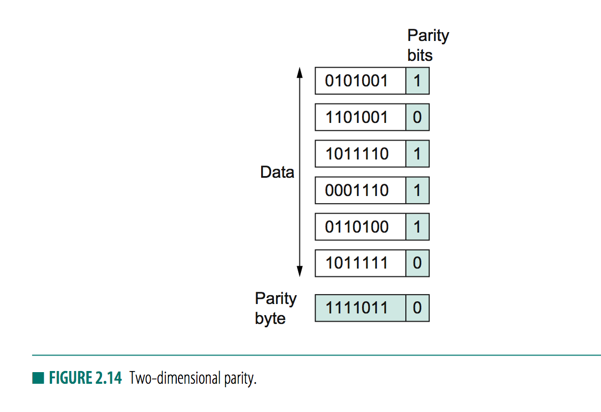
        + _idea_ 
            + adding extra bit to a 7-bit code to balance number of 1s in the byte
            + then does one-dimensional parity on bit positions over all bytes in the frame, resulting in an extra _parity byte_ for the entire frame
        + _capability_ 
            + able to catch all 1-, 2-, 3-bit erros, and most 4-bit errors. 
        + _tradeoff_ 
            + added `8 + n` bits of redundant information where `n` is the number of bytes in the frame
    + _Internet Checksum algorithm_ 
        + _note_ 
            + not used at link level
        + _idea_ 
            + add up all words transmitted and then transmit the result of that sum, the _checksum_
        + _algorithm (used by internet)_ 
            + a sequence of 16-bit integers 
            + add using 16-bit ones complement arithmetic 
            + take ones complement of the result, resulting in a 16-bit checksum
        + _ones complement_ 
            + 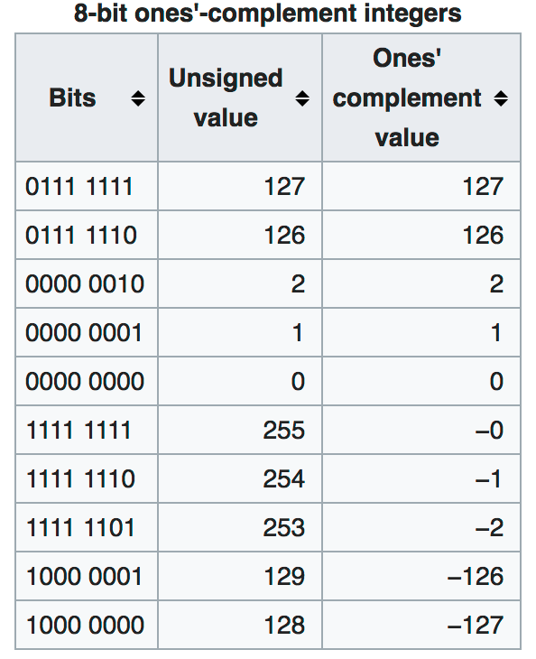
            + value obtained by inverting all bits in binary representation of a number
        + `5-3` 32-bit 
            + `5` is `0101` `3` is `0011`
            + `-5` is `1010` `-3` is `1100`
            + `8` is `1000` `-8` is `0111`
            + `1010 + 1100 = 0110` with carry of 1
            + carry of 1 from most significant bit causes us to increment result by ones complement arithmetic
            + so `0110 += 1 -> 0111` which is `-8`
        ```c
        u_short cksum(u_short *buf, int count)
        {
            register u_long sum = 0;
            while(count--)
            {
                sum += *buf++;

                // check if carry is into top 16bits of sum
                if(sum & 0xFFFF0000)
                {
                    // carry occorred
                    // so wrap around
                    sum &= 0xFFFF;
                    sum++;
                }
            }
            return ~(sum & 0xFFFF);
        }
        ```
        + _advantage_  
            + a constant 16-bit redundant iformation for message of any lenght
            + easy to implement
        + _disadvantage_ 
            + _does not have superb error detection_ 
                + one word increment by amount which another word decrement by will go undetected
+ _Cyclic Redundancy Check (CRC)_ 
    + _how it works_
        + `(n+1)`-bit message as being represented by `n` degree polynomial
        + message represented by a polynomial by using value of each bit in message as coefficient for each term in polynomial
        + i.e. `10011010`
            + `M(x) = 1 x 10^7 + 0 x 10^6 + ... = x^7 + x^4 + x^3 + x^1`
        + agree on a _divisor polynomial_ `C(x)` of degree `k`
        + `P(x)`
            + a message with `n+1` bit has `k` redundant bits
    + _idea_ 
        + make polynoial `P(x)` exactly divisible by `C(x)`
        + If no error 
            + receiver should be able to divide `P(x)` by `C(x)` exactly 
        + if error 
            + received `P(x)` no longer exactly divisible by `C(x)`
            + reminder -> error
    + _property of modulo 2_
        + Any polynomial `B(x)` with higher degree than `C(x)` can be divided by `C(x)`
        + Any polynomial `B(x)` with same degree as `C(x)` can be divided once by `C(x)`
        + Remainder obtained when `B(x)` is divided by `C(x)` is obtained by performing `^` (XOR) operation on each pair of matching coefficients
    + _Steps to make `M(x)` to `P(x)` such that its divisible by `C(x)`_
        + multiply `M(x)` by `x^k` (adds `k` zeros at end of message, where `k` is degree of `C(x)`), resulting in _zero extended message_ `T(x)`
        + divide `T(x)` by `C(x)` and find remainder
            + XOR for division
            + After XOR, bring down digits until we get another polynomial with same degree as `C(x)`, i.e. with `1` in most significant bit
            + continue to get remainder
        + subtract remainder from `T(x)`
            + XOR with lowest `k` bits
    + _error checking_ 
        + divide message `T(x)` with `C(x)` see if the result is 0
    + _choice of `C(x)`_ 
        + pick a divisor polynomial such that its unlikely to divide evenly into a message that has errors introduced into it
        + _for single-bit error_ 
            + pick `C(x)` where `x^k` and `x^0` are nonzero
            + able to detect all single-bit errors
        + _double-bit error_ 
            + as long as `C(x)` has a factor with at least 3 terms 
        + _odd number of erorrs_ 
            + as long as `C(x)` contains factor `(x+1)`
        + _burst error_ for which length of burst is less than `k`


#### 2.5 Reliable Transmission 

+ _goal_ 
    + corrupted frames (that are discarded) should be able to be recovered
+ _idea_ 
    + _acknowledgements_ (AWK)
        + a _control frame_ (frame without data) that a protocol sends back to its peer saying that it has received an earlier frame
        + if sender does not receive acknowledgement, the it retransmits the original frame
    + _timeouts_ 
        + action of waiting for a reasonable amount of time
    + _automatic repeat request_ 
        + using awk and timeout to implement reliable transmission
+ _Stop and wait_ 
    + _idea_ 
        + after transmitting one frame, sender waits for awk before transmitting another
        + if awk does not arrive after a certain period of time, sender times out and retransmit the original frame
        + 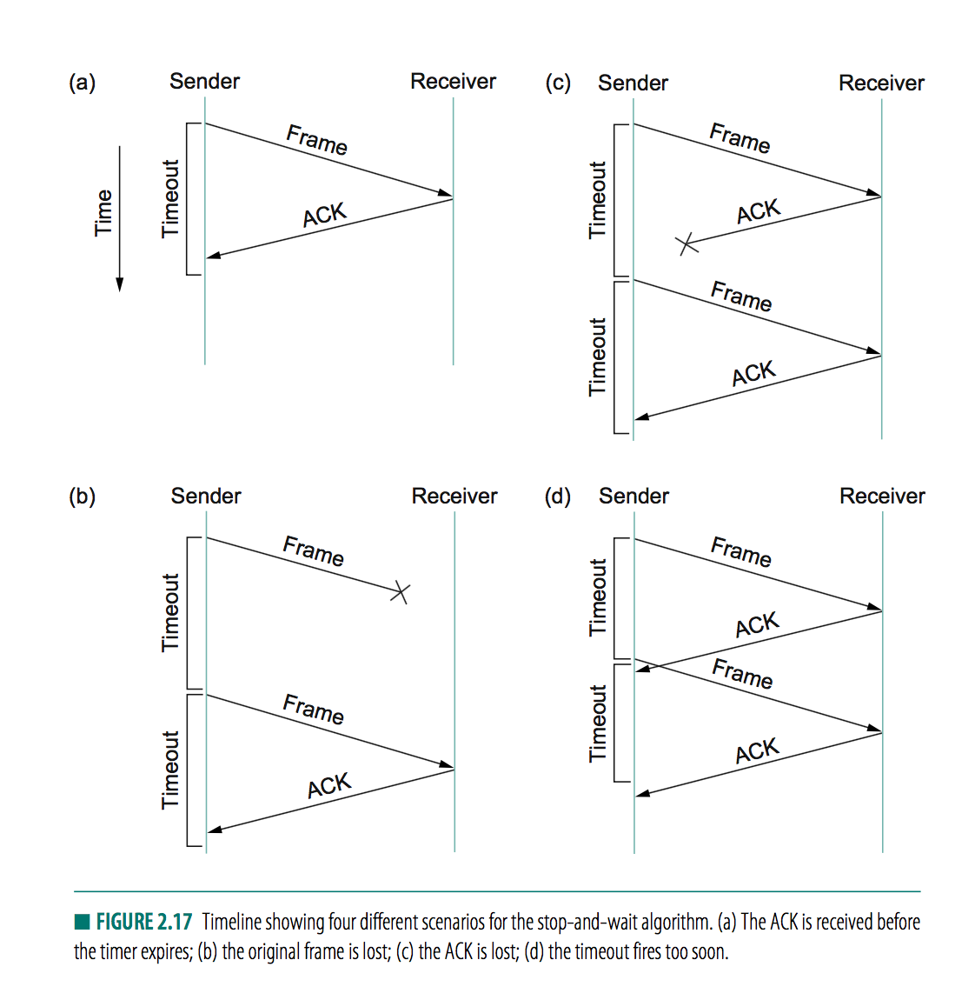
    + _duplicate transmission_  
        + if sender sends a frame and receiver awk, but awk is lost/delayed
        + the sender times out and retransmit original signal, but receiver will think its the next frame
    + _solution_ 
        + header of frames include 1-bit sequence number
        + takes 0 and 1 alternately between each frame
    + _other problems_ 
        + allow sender to have only one outstanding frame on the link;
        + Does not use full capacity of link, may have sender sending multiple frames before checking for awk
+ _slide window_ 
    + _idea_ 
        + 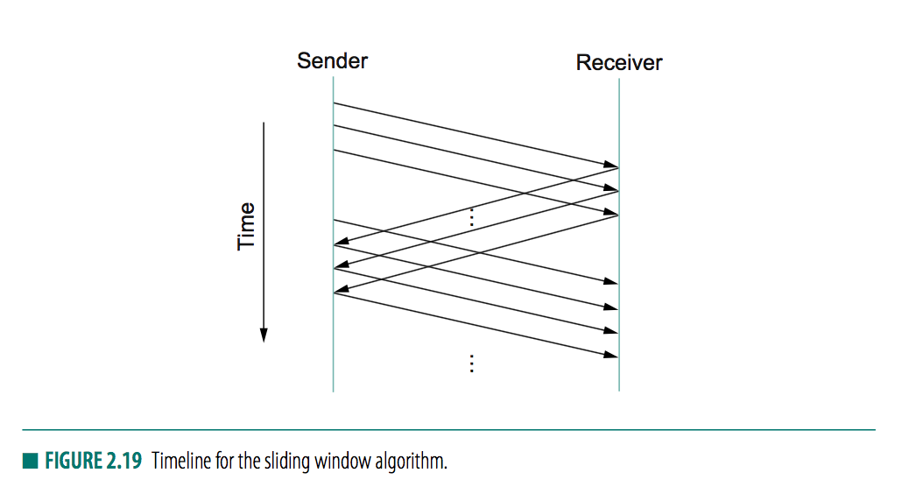
        + sender assings a _sequence number_ (`SeqNum`)
        + 

        

#### 2.6 Ethernet and multiple access networks (802.3)


+ _multiple access with collision detect (CSMA)_ (alt. name for _ethernet)
    + a set of nodes sneds and receives frames over a shared link
    + _carrier sense_ 
        + all nodes can distinguish between an idle and a busy link 
    + _collision detect_ 
        + node listens as it transmits and can therefore detect when a frame it is transmitting has interfered (collided) with a frame transmitted by another node
    + _goal_ 
        + algorithm that controls when each node can transmit
    + _nowadays_ 
        + mostly p2p, 
        + not multiple access any more
+ _physical properties_ 
    + 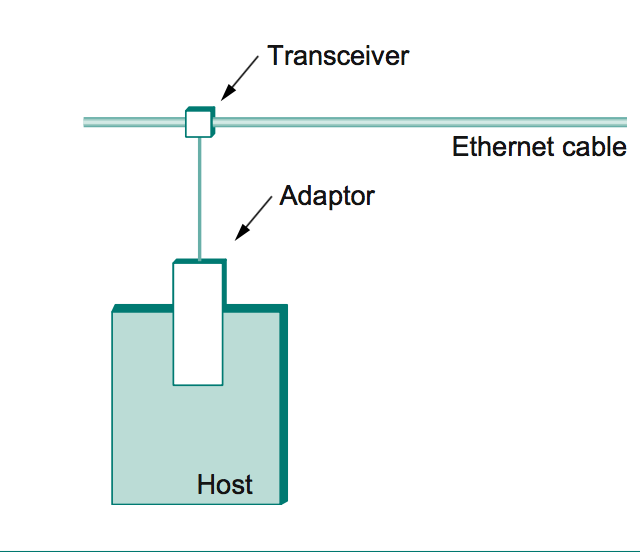
    + _cable_ 
        + coaxial up to 500m
        + copper/optcal fiber
    + _tranceiver_ 
        + detect when line was idle,
        + and drove signal when host is transmitting
    + _repeater_ 
        + 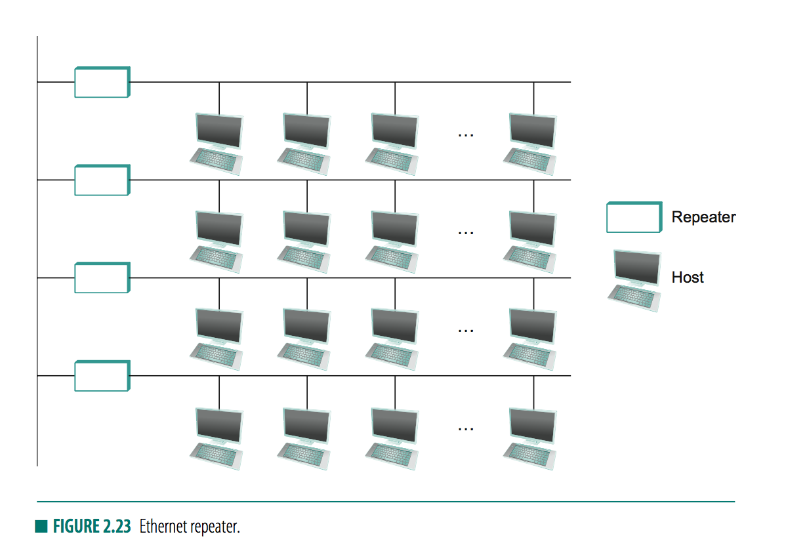
        + a device that forwards digital signals
        + <=4 repeater allowed between any pair of hosts (classical ethernet  reach only 2500m)
    + _hub_ 
        + 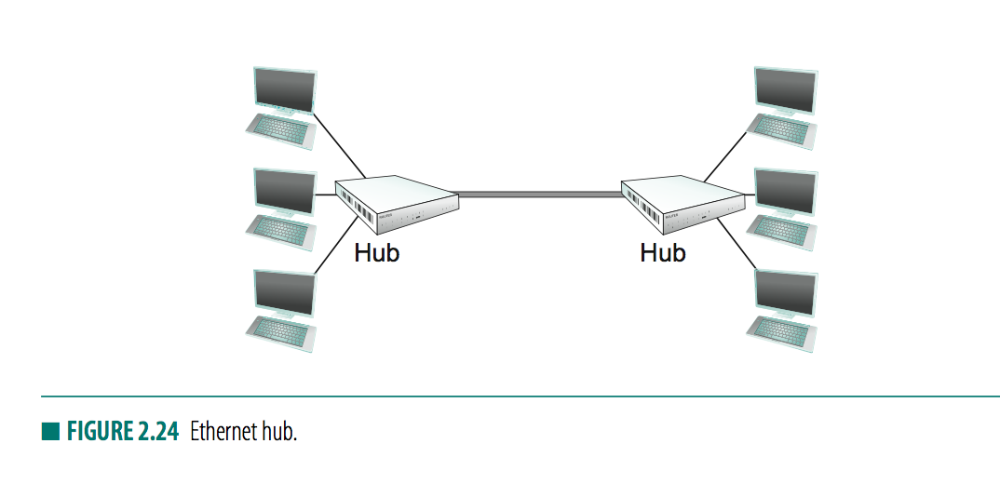
        + multiway repeater 
        + repeats whatever it hears on one port out all its other ports 
    + _terminator_ 
        + absorb signal and keep it from bouncing back
    + _collision domain_ 
        + any signal by one host is _broadcast_ over the entire network
        + hosts competing for access to the same link
    + _multiaccess_ 
        + deal with competition for links in a collision domain
+ _Access Protocol_ 
    + _Media access control (MAC)_ algorihm
        + 
        + _frame format_ 
            + `type`: indicate higher level protocol
            + `body`: >= 46bytes <= 1500bytes of data 
                + frame must be long enough to detect collision
            + `CRC`: 32bit
            + is bit-oriented framing protocol
    + _address_ 
        + every ethernet host has a unique ethernet address 
        + belong to adaptor
        + _a sequence of 6 numbers (6bytes)_ 
            + each number given by a pair of hex, one for each 4-bit nibbles in the byte, leading 0s dropped 
        + i.e.  
            + `00001000 00000000 00101011 11100100 10110001 00000010`
            + `8:0:2b:e4:b1:2`
    + _adaptor_
        + 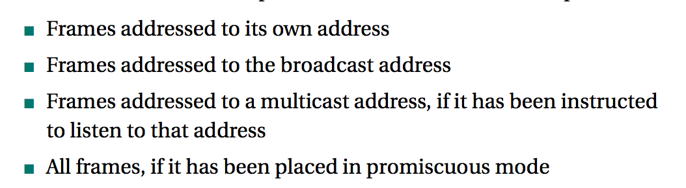
        + every adaptor receives every frame transmitted on ethernet
        + _unicast_ 
            + adaptor passes frames if frames has `dest` matching itself
        + _broadcast_   
            + address starting with all 1s
            + pass frames to broadcast address to host
        + _multicast_ 
            + address first bit set to 1, but not a broadcast address
            + host can be programmed to accept some set of multicast addresses
            + used to send message to some subset of hosts on ethenet (i.e. file server)
        + _promiscuous_
            + accept all frames
    + _transmitter algorithm_ 
        + if adaptor has frame to send and line is idle
            + transmit frames immediately 
            + no negotiation with other adaptors
        + if adaptor has frame to send but line is busy
            + waits for line to go idle and then transmit immediately 
            + A _1-persistent_ protocol, i.e. adaptor with frame to send transmit with probability 1 whenever a busy line goes idle 
            + vs _p-persistent_ protocol, i.e. adaptor transmit with probability `p` after a line becomes idle and defers with probability `q=1-p`
        + _collide_ 
            + 2 or more adaptor may begin to transmit at the same time, either 
                + both found line to be idle
                + both had been waiting for a busy line to become idle
            + adaptor able to determine that a collision is in progress
        + _if collision happens_
            + make sure to transmit 32-bit _jamming sequence_ and then stops transmission. 
            + transmitter will minimally send 96bits in case of a collision: 64-bit preamble plus 32-bit jamming sequence
            + _runt frame_
                + 96bits only if 2 hosts close to each other
                + if 2 hosts far apart, have to send more bits before detecting collision
                    + 512 bits = 64 bytes
                    + 14bytes of header + 46bytes of data plus 4bytes of CRC
        + _why 512bits_ 
            + ethernet length limits to 2500m   
                + longer than that collision becomes dominant
            + 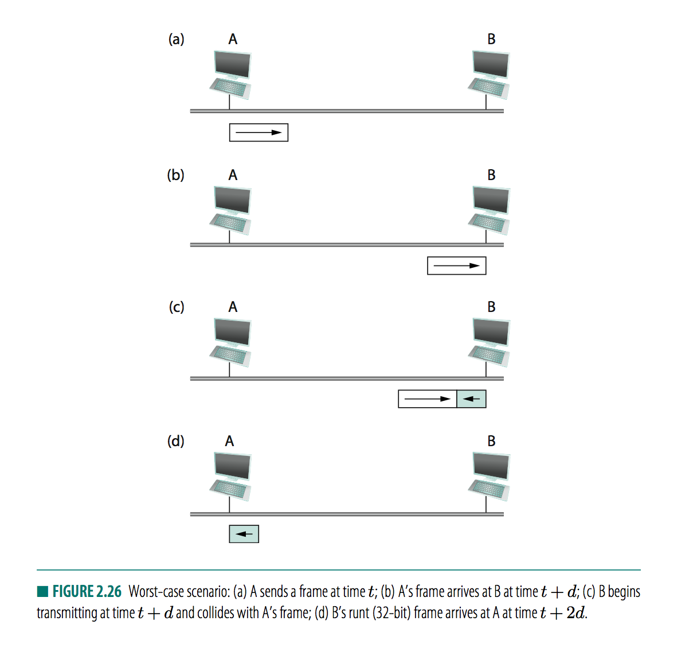
            + _worst case scenario_ 
                + `A` transmit at `t`
                + first bit reach `B` at `t+d`, where `d` is link delay 
                + `B` starts transmit right before `A`'s first bit arrives
                    + _collision happens_ 
                    + _detected by host `B`_
                + `B` send 32bit jamming sequence
                + `A` gets to know about this at `t+2d` time
                    + `A` continue to transmit until this time in order to detect collision 
                    + `A` must transmit for `2d` to detect all possible collisions
            + _2500m_
                + RTT 51.2 \mu s
                + 10Mbps
                + delay x bandwidth = 512bits = 64bytes
        + _exponential backoff_
            + once collision detected, and transmission stopped, adaptor waits for a certain amount of time and tries again
            + each time it tries to transmit but fails
                + double amount of time it waits before trying again, 
            + _idea_
                + select a `k` between `0 ~ 2^n-1` and waits `k x 51.2 \mu s`, where `n` is number of collisions experienced so far
            + _example_ 
                + first delay: 
                    + wait for 0 or 51.2 \mu s at random
                + second delay: 
                    + wait for 0, 51.2, 102.4, or 153.6 at random 
    + _Experience with ethernet_   
        + _observation_ 
            + works best under light loaded conditions
                + under heavy load, too much capacity is wasted by collision
        + _ethernet's success_ 
            + easy to administer and maintain
            + easy to add host to network
            + inexpensive
                + cable
                + network adaptor
        + _switch-based technology_  
            + replaced multi-access ethernet

#### 2.7 Wireless

+ _ 


    


            
