+ sequence number `ISN`
    + used to distinguish one TCP connection to another 
    + 32bit timer that ticks every 4microsecond
    + value of timer copied to ISN


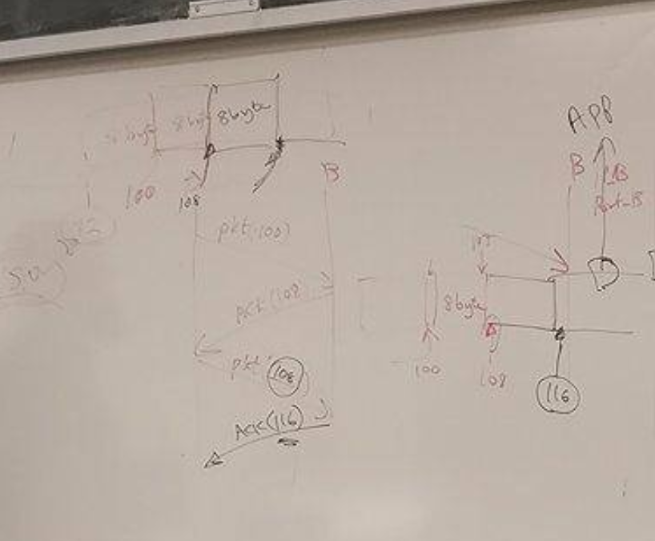
+ Initially get ISN from ISN clock
+ Then for each segment, recompute 
    + `ISN_{i+1} = ISN_{i} + segmentlength`
    + Sequence number inside TCP header, 
+ If 8 bytes segment, 
    + Host A sends `SYC(100)`
    + Host B 
        + placing segment in a buffer
        + send back `AWK(108)` 


```
A ISN 92                    B ISN 20
>>>>>>>>    SYN(92)         >>>>>>>>
<<<<<<<<    SYNAWK(20, 93)  <<<<<<<<
>>>>>>>>    AWK(93, 21)     >>>>>>>>
```


+ RTT estimation 
    + `estimatedRTT = a x oldestimatedRTT + b x CurrentRTT`

```
// sliding window
// A sends a bunch, and wait for awks 
A               B
| >>>>> 1 >>>>>>   |
| >>>>> 2 >>>>>>   |
| >>>>> 3 >>>>>>   |
| <<<<< 1 <<<<<<   |
| <<<<< 2 <<<<<<   |
| <<<<< 3 <<<<<<   |
```

+ if some syc lost 
    + `B` keeps sending `awk(ISN_missing)`
    + `A` will resend the segment


+ 2 sliding window algo 
    + selecive repeat 
        + timer for each packet sent 
        + just repeat sending the packet lost
    + go back n 
        + go back to nth packet that is lost and 
        + retransmit all packet afterwards


--- 


# 5 End-to-End Protocol


#### 5.1 Simple demultiplexer (UDP)


+ _overview_    
    + extend host-to-host to process-to-process communication service
    + a level of demultiplexing
        + allows multiple application processes to share the network
    + _address process_
        + indirect identify each other with an abstract locater, called port
    + _demux_ 
        + contains port for sender (source) and receiver (destination) of the message
        + `<port, host>`
+ _UDP header_ 
    + 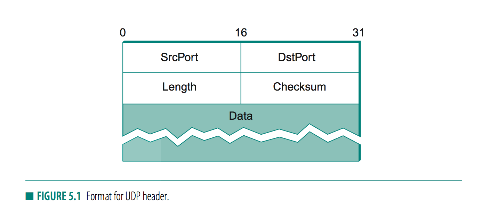
    + _steps_   
        + client contacts server on which port? 
            + _well-known ports_ 
                + DNS - port 53
                + mail- port 25
                + `talk`- port 517
            + _port mapper_ 
                + sevice returns appropriate port for requested service
        + server knows client's port `SrcPrt`
+ `port` 
    + 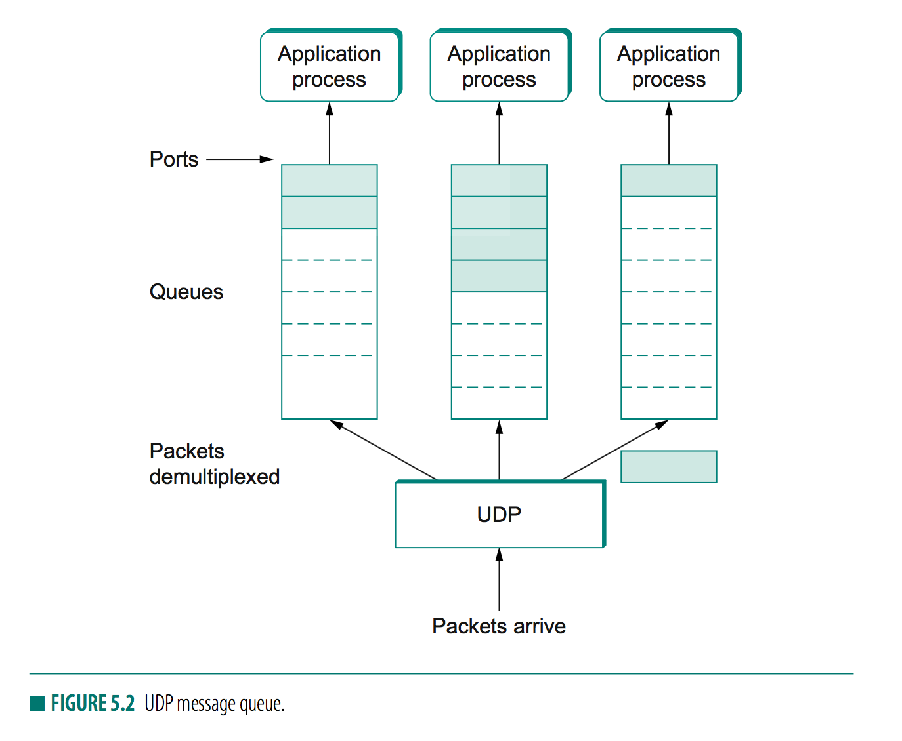
    + some impl by a message queue
        + on message arrival, protocol (UDP) appends message to end of queue
        + discard message if queue is full
        + process blocks when queue empty
+ _checksum_ 
    + UDP ensures correctness with IP checksum over 
        + UDP header 
        + message body
        + pseudoheader
            + 3 fields from IP header: protocol number, source IP, dest IP
            + UDP length field (included twice)


### 5.2 Reliable byte stream (TCP)


+ _features_  
    + reliable, in-order delivery of a stream of bytes
    + full-duplex   
        + 1 TCP connection supports a pair of byte stream
    + flow-control mechanism 
        + allows receiver to limit how much data sender can transmit in a given time
        + prevents sender from _over-running capacity of receivers_
        + end-to-end issue
    + demultiplexing mechanism  
        + allows multiple application on a host to simultaneously carry on a conversation with their peers
    + congestion-control mechanism 
        + throttle how fast TCP sends data, not for sake of keeping sender from over-running receiver, but for sake of keeping sender from _overloading the networks_
        + how hosts and networks interact
+ _Sliding window algorithm_ 
    + _points_  
        + _state sharing_
            + explicit connection setup 
            + explicit connection tear down
            + state sharing 
        + _varied RTT_
            + so timeout must be adaptive
        + _reordering packets_
            + receiver must know how long to treat a missing packet as missing or delayed
            + _maximum segment lifetime (MSL)_ 
            + 120s an estimate of how long a packet live in the Internet
        + _flow control_ 
            + _window size_
            + amount of resource (buffer) dediated to one TCP connection varies
            + so sender must know how much the other side is able to handle (buffer space) the connection
        + _congestion control_ 
            + TCP has no control over packet paths
            + a fast sender might overwhelm a small throughput link
+ _end-to-end argument_ 
    + a function (reliable, ordered) should not be provided in the lower leves of the system unless it can be completely correctly implemeneted at that level
+ _segment format_ 
    + _byte stream_ 
        + 
    + _segment_
        + packet exchanged between TCP peers
    + 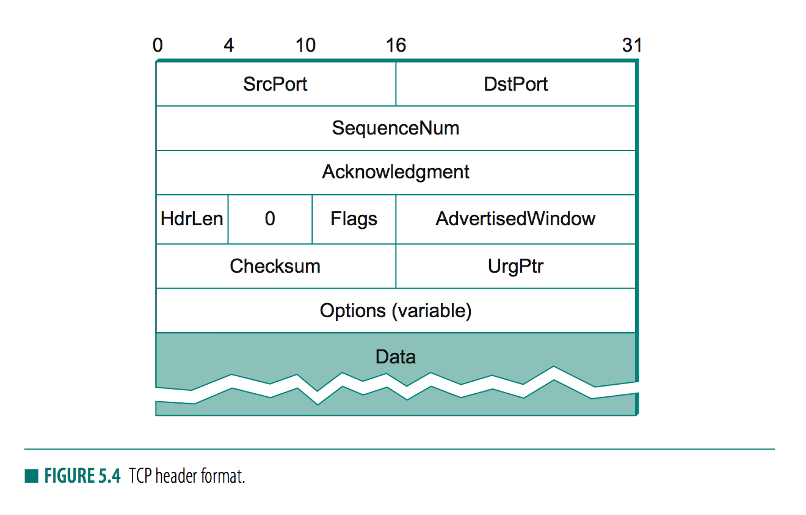
    + 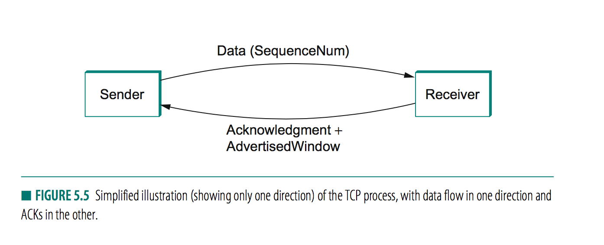
        + _demux key_ 
            + `<srcPort, srcPAddr, DstPort, DstIPAddr>` 
        + `SeqNum` 
            + contains sequence number for the first byte of data carried in that segment
        + `Ack` `AdvertisedWindow`
            + flow in opposite directions
        + `Flag`
            + `SYC` `FIN` 
                + for starting ending connection
            +  `RESET` `PUSH` 
            + `URG` 
                + contains urgent data
            + `ACK`
                + set anytime `Acknowledgement` field is valid 
        + `Checksum`
            + computed over TCP header, TCP data, and pseudoheader, 
                + `srcAddr`
                + `destAddr`
                + `length` from IP header
        + `Offset`
            + start of data
            + since TCP header variable sized
+ _connection establishment and termination_
    + _overview_s 
        + client (caller) open to server (callee)
        + begin sending data to each other
        + if one side done sending data, it closes one direction of connection, which causes TCP to initiate a round of connection termination messages
    + _observation_ 
        + connection is asymmetrical
        + termination is symmetrical, each side have to terminate independently
    + 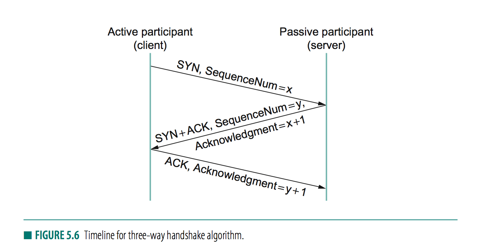
    + _three way handshake_
        + _goal_ 
            + agree on a set of parameters
                + i.e. starting sequence number
        + _steps_ 
            + client start connection
                + `(flag=SYN, SequenceNum=x)`
            + sever  
                + `(flag=ACK, Ack=x+1)`
                + `(flag=SYN, SequenceNum=y)`
                    + also state its own sequence number 
            + client awk server's sequence number with 
                + `(flag=ACK, Ack=y+1)`
                + note `awk` always one larger than one sent, since `Ack` identifies the next sequence number expected
        + _why not use a fixed starting seqNum_ ? 
            + protect against 2 incarnations of the same connections reusing the same sequence number too soon
            + so a segment from an earlier incarnation of a connection might interfere with a later incarnation of the connection
+ _Start-Transition Diagram_ 
    + 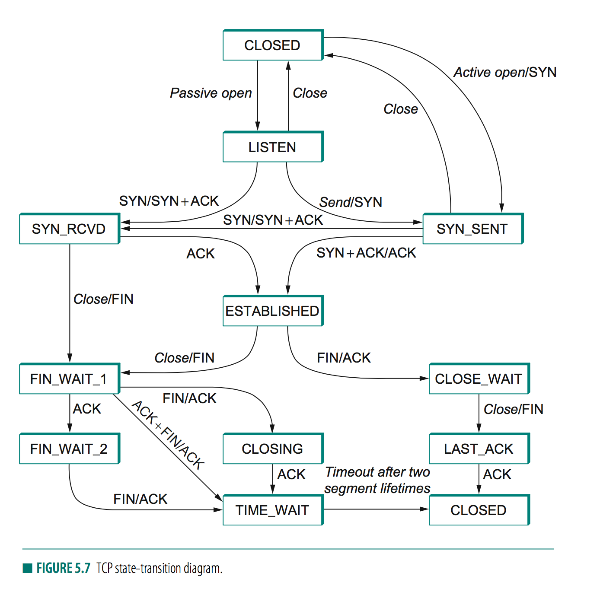
    + _connection_ 
        + start in `CLOSED`
        + server first invokes passive operation, causing TCP to move to `LISTEN` state
        + client does active open, causing it to send `SYN` to server and move to `SYN_SENT` state
        + when `SYN` arrives at server, it moves to `SYN_RCVD` state and responds with `SYN+AWK`
        + cause client to move to `ESTABLISHED` state and send back `AWK` to server
        + when `ACK` arrives at server, server moves to `ESTABLISHED` state
    + _termination_ 
        + _note_ 
            + both side has to close, if one side closes connection, it is still available to receive data from the other side 
        + _steps_ 
            + 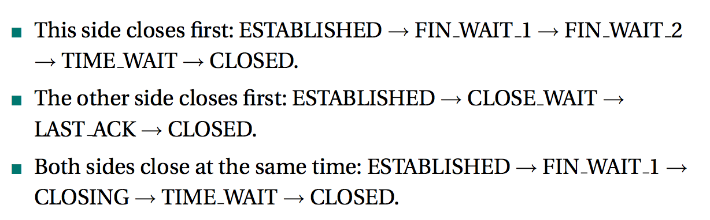
+ _Sliding window_ 
    + _goal_ 
        + guaranteed reliable delivery of data
        + ensures data is delivered in order
        + enforces flow control between sender and receiver
    + _idea_ 
        + receiver adertises its window size to the sender
            + _with `AdvertisedWindow` field in TCP header_
            + basically size of buffer wililng to allocate
        + sender is limited to having no more than a value of `AdvertisedWindow` bytes of unack data at any given time
+ _Relationship between TCP send buffer and receive buffer_
    + 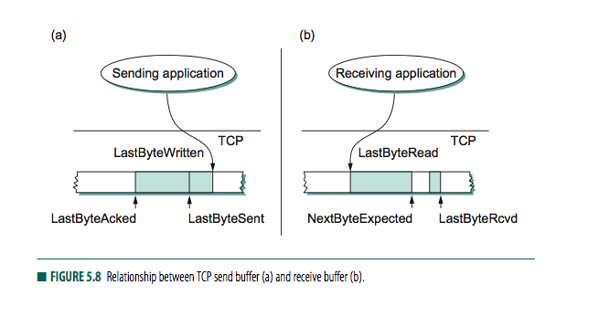
    + _send buffer_     
        + store data that has been sent but not yet acknowledged, and
        + data that has been written by the sending application but not transmitted
    + _receive buffer_ 
        + holds data that arrives out of order
        + and data that is in correct order but application process has yet to read
    + _sending side_     
        + `lastByteAcked <= lastByteSent`
        + `lastByteAcked <= lastByteWriten`
        + bytes before `lastByteAcked` does not to be saved in buffer 
        + bytes after `lastByteWritten` need not be buffered because they have not yet been generated 
    + _receiving side_ 
        + `lastByteRead < nextByteExpected`
            + since a byte cannot be read by application until it is received AND _all preceding bytes have also been received_
            + `lastByteExpected`
                + points to byte immediately after the latest byte such that all preceding bytes have been received
        + `nextByteExpected <= lastByteRcvd + 1`
            + if data in order, `nextByteExpected` points to byte after `lastByteRcvd`
            + if data out of order, `nextByteExpected` points to start of the first gap in the data
        + bytes left of `lastByteRead` need not be buffered since already read
        + bytes right of `lastByteRcvd` need not be buffered since they have not yet arrived
+ _Flow control_ 
    + _assumptions_ 
        + buffer has size `MaxSendBuffer` and `MaxRcvBuffer`
    + _window size_ 
        + amount of data that can be sent without waiting for acknowledgement from receiver
        + receiver advertise window size no longer than amount of data it can buffer
    + _observation_     
        + _receiver side_
            + `lastByteRcvd - lastByteRead <= maxRcvBuffer`
            + so to avoid overflowing buffer we have 
                + `AdvertisedWindow = MaxRcvBuffer - ((NextByteExpected-1) - LastByteRead)`
                + representing amount of free space left in buffer
        + _sender side_
            + makes sure `LastByteSent - LastByteAcked <= AdvertisedWindow`
            + _effective window_ 
                + `EffectiveWindow = AdvertisedWindow - (LastByteSent - LastByteAcked)`s
            + make sure sending application does not overflow the send buffer
                + `LastByteWritten - LastByteAcked <= MaxSendBuffer`
    + _scenario_ 
        + slow receiving process buffer fills up 
        + advertised window shrink to 0
        + sending side cannot transmit any data, even if its previously ack-ed
        + sending process blocked
        + when receive side start reading again, advertisedWindow opens up 
        + `LastByteAcked` is incremented when data acked, buffer space holding acked data becomes free, sending process is unblocked and allowed to proceed
    + _how does sending side know advertised window is no longer 0_
        + note receive side has window size of 0, the sender is not permitted to send any more data, so there is no way to discover that the advertised window is no longer 0. Also TCP on receive side does not spontaneously send nondata segments
        + _solution_ 
            + whenever other side advertise a window size of 0, _sending side_ persists in sending a segment with 1 byte of data every so often
            + mostly dropped. But eventualy 1 byte probe triggers a response that reports a nonzero advertised window
+ _protecting against wraparound_ 
    + `SequenceNum` 32 bits 
    + `AdvertisedWindow` 16 bits
    + _problem_ 
        + SEQUENCE number on a given connection might wrap around, a byte with sequence number `x` could be sent at one time and then later a second byte with the same sequence number `x` might be sent
        + since packets cannot survive Internet for MSL 120s, have to make sure sequence number does not wrap within 120s period
    + depends on how fast a 32bit sequence number space be consumed
        + 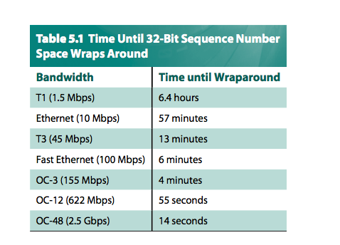
+ _Keeping the pipe full_ 
    + `AdvertisedWindow` must be big enough to allow the sender to keep the pipe full, assume receiver has large enough buffer and is boun by the _delay x bandwidth_ product
    + 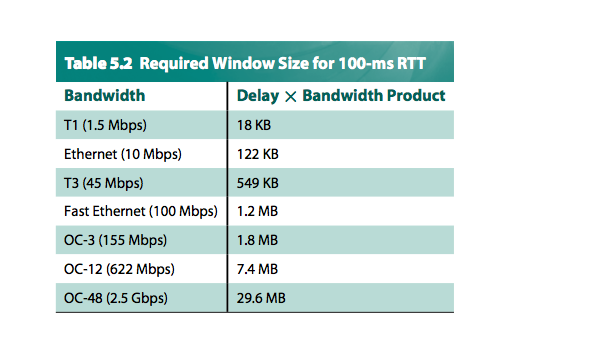
        + `16 bit = 64KB` not enough to handle T3 connection...
+ _Triggering transmission_
    + deals with conditions for which TCP decides to send a segment
    + _triggers_ 
        + _maximum segment size(MSS)_ 
            + send a segment when it collected MSS bytes from sending process
            + usually largest segment TCP can send without causing local IP to fragment
            + usually set to `MTU - IPhdr - TCPhdr`
        + _sending process requested_
            + `push` operation, triggers flushing of buffer of unsent bytes
        + _timer fires_
            + segment contains as man bytes are currently in buffer for transmission
+ _Silly Window Syndrome_ 
    + _problem_ 
        + sender has MSS bytes of data to send and window is open ast least that much, then send a segment right away
        + but if sender has MSS bytes of data with window closed, now ack arrive allowing for MSS/2 bytes to be send, the question is to transmit a half-full segment or wait for thw eindow to open to a full MSS
    + 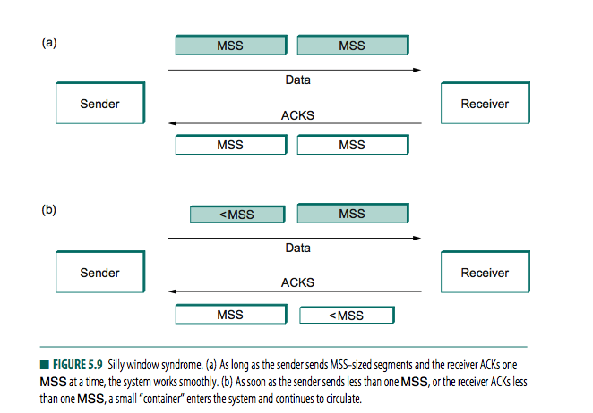
        + TCP stream
            + full containers (data segments) in one direction 
            + empty containers (ACKs) going in reverse direction
        + if receiver has to reduce the window, and sender _aggressively fills  smaller-than-MSS empty container_ as soon as it arrives, then receiver will ACK that smaller number of bytes. 
            + the smaller container introduced into the system remains in the system indefinitely 
            + i.e. immediately filled and emptied at each end and is never coalesced with adjacent containers to create larger containers
    + _solution_    
        + mechanism to coalesce small containers 
            + receiver can do this by delaying ACKs, sending one combined ACK rathe rthan multiple smaller ones
    + _Nagle's algorithm_ 
        + Returning to TCP sender, if there is data to send but window is open less than MESS
            + if wait too long, then interactive applications suffer
            + if wait too short, risk of sending buch of tiny pakcets and falling into silly window syndrome
        + _idea_ 
            + _self-clocking_   
                + as long as TCP has any data in flight, sender will eventually receive ACK, 
                + this ACK is is treated as timer firing, triggering transmission of more data
            + 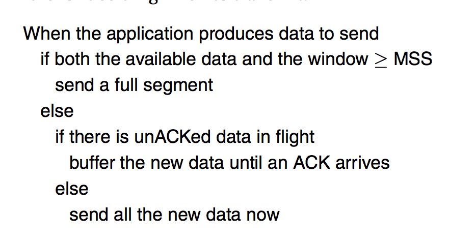
        + _consequence_ 
            + OK to send a full segment if the window allows.
            + all right to immedidately send a small amount of data if there are currently no segment in transit
            + but if there is anything in flight the sender must wait for an ACK before transmitting the next segment
        + _socket programming_ 
            +`TCP_NODELAY` turns off Nagel's algorithm
+ _Adaptive retransmission_ 
    + _problem_ 
        + TCP retransmits segment if an ACK is not received in a certain period of time. TCP sets this timeout as a function of RTT it expects between two ends of the connection
        + but RTT varies
    + _original algorithm_ 
        + _computing timeout_ 
            + keep a running average of RTT and then to compute the timeout as a function of this RTT
            + so everytime TCP sends a data segment, it records the time.
            + When ACK arrives, TCP reads time again, and take difference as `SampleRTT`
            + TCP computes `EstimatedRTT` a weighted average
                + `EstimatedRTT = a x EstimatedRTT + (1-a) x SampleRTT`
                + `a` is used to smooth the curve
                + larger `a` is more stable but does not adapt to real change quickly
                + usually 0.8~0.9
            + Computes timeout as 
                + `TimeOut = 2 x EstimatedRTT`
    + _problem with original algorithm_ 
        + `ACK` does not really acknowledge a transmission; it acknowledges receipt of data
        + sender retransmit a segment and then get an ACK, but no way to determine if this ACK is associated with first or second transmission of segment for purpose of measuring `SampleRTT`
    + 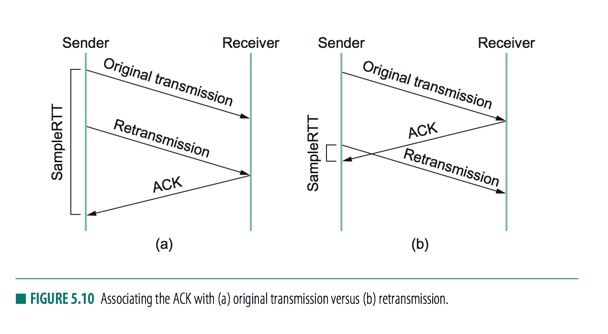
        + if assume `ACK` is for first transmission but it was really for the second, then `SampleRTT` is too large 
        + if assume `ACK` is for second transmission but it was for the first, then `SampleRTT` is too small
    + _solution: Karn/Partridge algorithm_ 
        + whenever TCP retransmits a segment, it stops taking samples of RTT
        + i.e. measures `SampleRTT` for segments that have been sent only once
    + _additional proposal_
        + each time TCP retransmits, it sets next timeout to be twice last timeout 
            + just like _exponential backoff_
        + _rationale_   
            + congestion likely cause of lost segments, so TCP source should not react too aggressively to a timeout
+ _overview of congestion control_ 
    + _goal_ 
        + deciding when to timeout and retransmit a segment
        + 