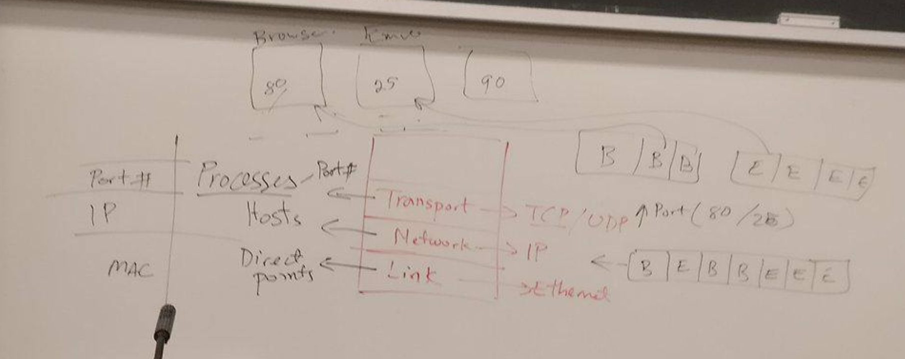
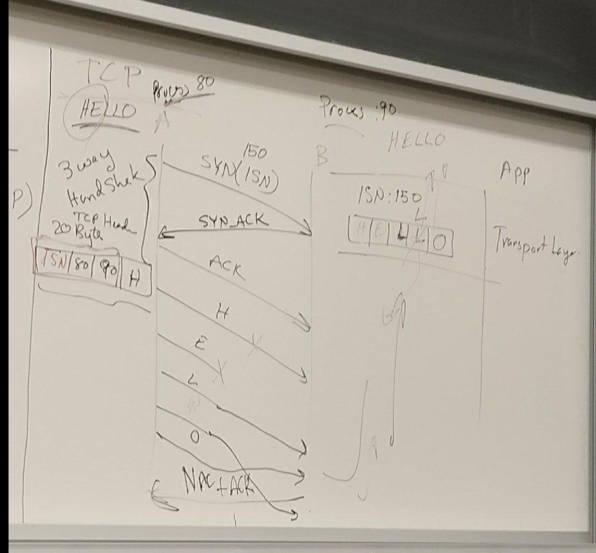

#### transport layer 

+ identifies each other with _port number_
+ demultiplexing based on port number
    + when decapsulate from network layer, 

+ UDP
    + basic
    + packet not ordered when sent to application layer
    + unreliable
+ TCP

+ _transport_ 
    + links processes 
