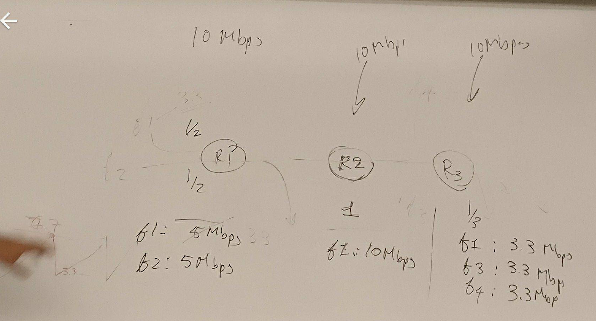
+ fairness
    + gives each packet the maximum it can achieve, then care about fairness
        + `f1` has 3.3Mbps instead of `5Mbps` since its limited by `R3`'s bandwidth 
        + `f2` hence can get `10-3.3=7.7`mbps for `R1`
+ TCP
    + constantly increasing bandwidth until packet drop, 
        + i.e. `f2` increase to 7.7, lost packet, then reduce by half to 3.35
    + this way, bandwidth of a packet not going to exceed the smallest bandwidth of links along the route


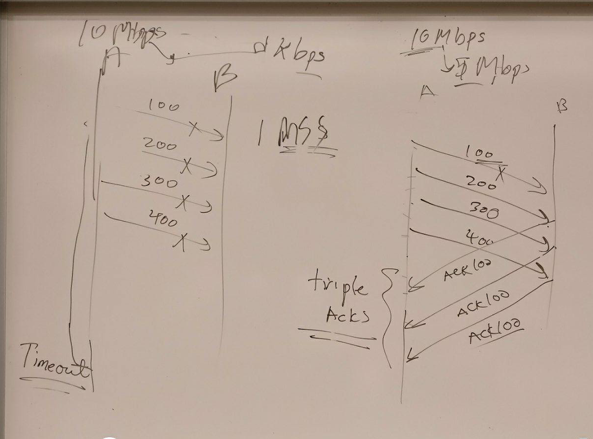
+ congection detection
    + triple awk
        + cut by half 
    + timeout 
        + to minimum (1MSS maximum segment size)


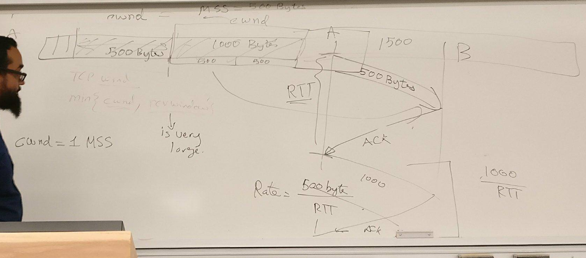
+ TCP mechanism


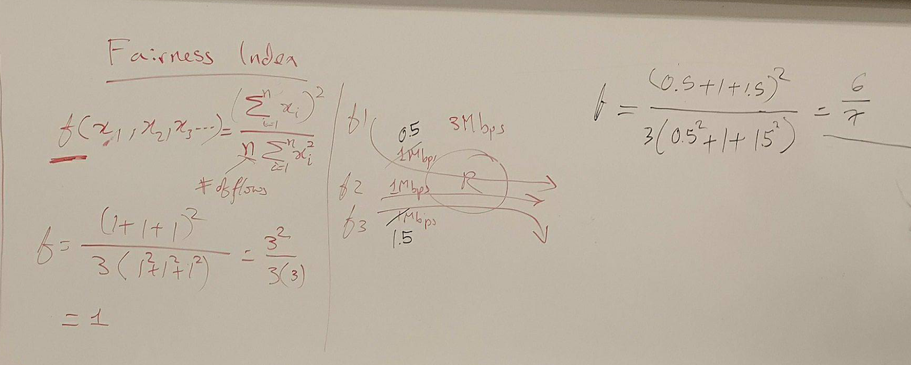
+ fairness index
    + only for a single router
    + (least fair) 0 - 1 (most fair)


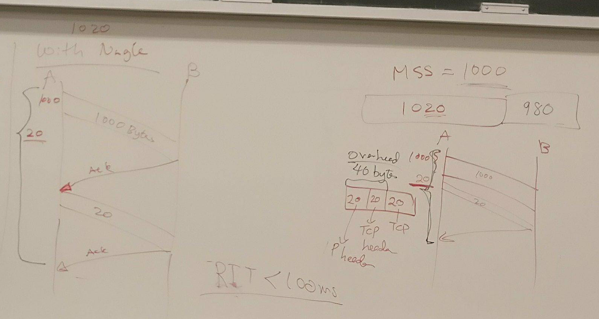
+ nagle's algorithm
    + if available data is greater than MSS, 
        + send the payload
    + else 
        + if unconfirm data (not awk data)
            + queue
        + else 
            + send


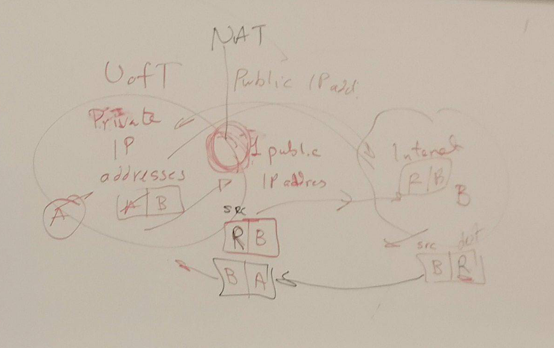
+ NAT
    + problem   
        + what if client wants to connect to server behind NAT ?
            + NAT router does not have the mappinng yet
            + but server can request port forwarding set up, a port # is reserved in NAT table for the server behind the NAT


---


# 6 Congestion control and resource allocation


+ _terminology_ 
    + _resource allocation_ 
        + process by which network elements try to meet competing demands that appliations have for network resources
            + link bandwith 
            + buffer space in router and switches
    + _congestion control_  
        + efforts made by network nodes to prevent or respond to overload conditions 
+ _network model_ 
    + 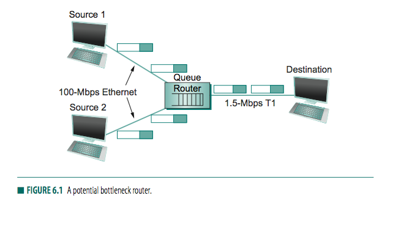
    + packet switched
    + connectionless
    + _flow_    
        + sequence of packets sent from source to destination and following same route in the network
+ _taxonomy_ 
    + _router-centric vs host-centric_ 
    + _reservation-based vs feedback-based_ 
        + reserve buffer bandwidth of links/router to meet the request
        + feedback: adjust rate according to feedback received
    + _window based vs. rate based_ 
        + window: advertise size of buffer left, that sender is allowed to transmit
+ _evaluation criteria_ 
    + _effecive resource allocation_    
        + _goal_ 
            + high throughput and low delay
            + tradeoff
                + increase number of packets increase length of queues at each router
        + measure effectiveness with 
            + `power = throughput/delay`
        + 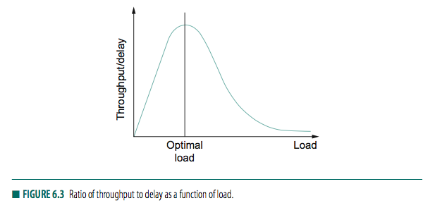
            + heavy load -> network experience _congestion collapse_
    + _fair resource allocation_    
        + 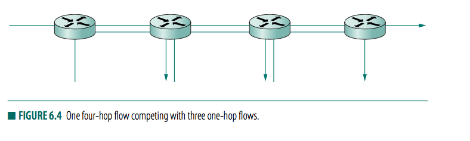
        + _fair_ 
            + equal share of bandwidth
        + _Jain's fairness index_ 
            + given set of flow throughput `(x_1, ..., x_n)`
            + assign fairness index to flows 
                + 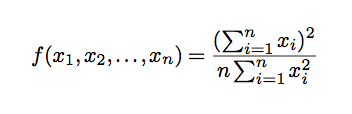
                + if all `n` has 1, then index=1

#### 6.2 Queuing disciplines

+ _queuing_ 
    + _goal_    
        + each router implement some queuing discipline that governs how packets are buffered while waiting to be transmitted
+ _FIFO with tail drop_ 
    + 
    + _idea_ 
        + first packet arrived is first packet to be transmitted
    + _tail drop_ 
        + a drop policy that determines which packets get dropped
    + _priority queuing_
        + mark packet with a priority
        + multiple FIFO for each priority class
+ _Fair queuing_    
    + _problem with FIFO_
        + does not separate packets according to the flow in which they belong
        + so some packets may overwhelm other users
    + _fair queuing algorithm_ 
        + separate queue for each flow 
        + service queues round-robin
    + _idea_ 
        + ill-behaved traffic does not interfere with those that are faithfully implementing the end-to-end algorithm

### 6.3 TCP Congestion Control 


+ _problem_ 
    + Age of _congestion collapse_
+ _idea_ 
    + congestion control allows host to determine how much capacity is available in the network 
    + _self-clocking_ 
        + once a given source has many packets in transit, 
        + it uses arrival of an ACK as a signal that one of its packet has left the network and that it is therefore safe to insert a new packet into the network without adding to the level of congestion
+ _additive increase / multiplicative decrease_ 
    + `CongestionWindow`
        + used by source to limit how much data it is allowed to have in transit at a given time
        + `MaxWindow = Min{CongestionWindow, AdvertisedWindow}`
        + `EffectiveWindow = MaxWindow - (LastByteSent - LastByteAcked)`\
    + _problem_ 
        + no one is sending `CongestionWindow` to hosts
    + _idea_
        + `congestionWindow` is how congested a node perceives the network to be
    + _multiplicative decrease_ 
        + Usually, packets dropped, then timeout results because of congestion
        + so interpret timeout as congestion and reduce transmission rate 
        + `CongestionWindow` half previous value when a timeout occurs
        + decrease until reach MSS (maximum segment size) 
    + _additive increase_ 
        + 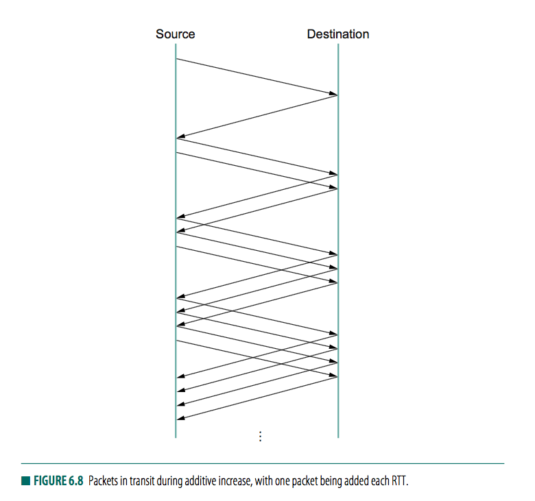
        + every time source successfully sends a `CongestionWindow` worth of packets 
            + i.e. each packet sent during last RTT has been ACKed 
        + add the equivalent of 1 packet to `CongestionWindow`
        + congestion window incremented each time an ACK arrives 
            + `Increment = MSS x (MSS / CongestionWindow)`
            + `CongetionWindow += Increment`
            + instead of increment `CongestionWindow` by an entire `MSS` bytes each RTT, we increment it by a fraction of MSS everytime an ACK is received
        + 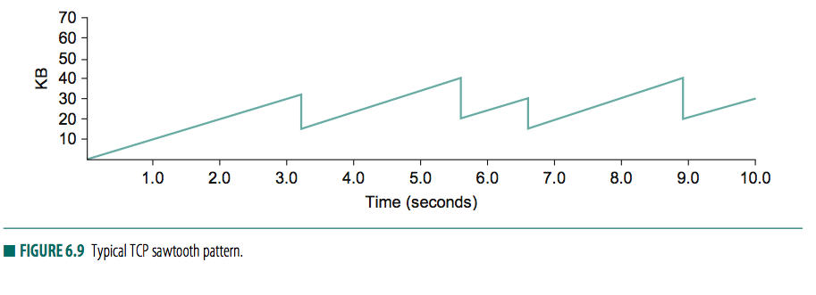
            + increment a fraction of MSS every time an ACK is received
    + _rationale_
        + decrase th window aggressively and increase conservatively is consequence of having too large a window are much worse than those of it being too small
+ _Slow start_ 
    + _problem_ 
        + additive increase too slow to ramp up a connection when it is starting from scratch 
    + _idea_ 
        + increase congestion window rapidly from a cold start, 
        + increase congestion window exponentially, rather than linearly 
    + 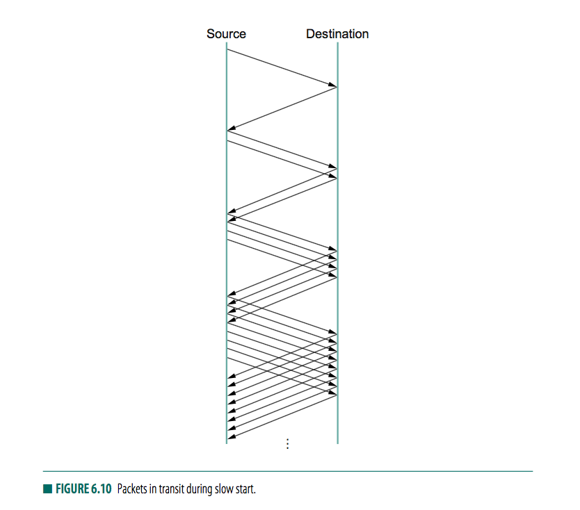
    + _steps_ 
        + source set `CongestionWindow` to 1 packet
        + ACK arrived, TCP adds 1 to `CongestionWindow` and send 2 packets
        + upon receiving 2 ACKs, TCP increments `CongestionWindow` by 2, one for each ACK and next sends 4 packets
        + so TCP doubles number of packets in transit every RTT
    + called slow start because slower than sending entire advertised window's worth of data all at once
    + _use case_ 
        + start of connection when source does not know how many packets it is going to be able to have in transit at a given time
        + or when connection goes dead while waiting for a timeout to occur
            + packet lost
            + source sent as much data as advertised window allows
            + blocks while waiting for an ACK that will not arrive
            + timeout
            + no packet in transit
            + source will receive new ACK to clock transmission of new packets
            + source will receive entire advertised window, with _slow start_
                + slow start increase sending rate to `CongestionWindow` prior to last packet loss
                    + called `CongestionThreshold`
                    + temporary variable for storing target window
                    + set to `CongestionWindow` resulting from multiplicative decrease, before `CongestionWindow` is then set to 1
                + then additive increase thereafter
    + 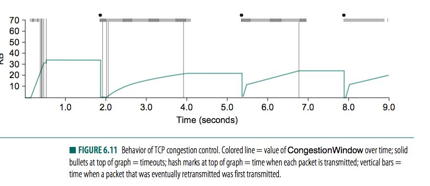
        + `CongestionWindow` grow exponentially due to slow start
        + `CongestionWindow` flattens out, since no ACKs arriving, since several packets lost
        + timeout happens at 2s, congestion window divide by 2
        + `CongestionThreshold` set to this value, slow start then causes `CongestionWindow` to be reset to one packet and to start ramping up from there
        + ...
        + At 5.5s, timeout, congestion window divided by 2
            + 22KB to 11KB
            + `CongestionThreshold` set to 11KB
        + `CongestionWindow` is reset to 1 packet, as sender enters slow start
        + slow start causes `CongestionWindow` to grow exponentially until it reaches `CongestionThreshold`
        + `CongestionWindow` then grows linearly
        + ...
        + repeated at 8s
    + _why so many packets lost during initial slow start phase ?_
        + idea is TCP wants to learn how much bandwidth available on the network 
        + so being regression does not take long to find this out 
        + but in risk of having half a window's worth of packet dropped by the network 
    + _solution: quick start_ 
        + TCP sender can ask for an initial sending rate greater than slow start would allow by putting a requested rate in its SYN packet as an IP option
        + router along the path can evaluate traffic, and update the field
        + by the time SYN reached receiver, it will contain a rate that was acceptable to all routers on the path
        + TCP sender uses this rate to begin transmission
+ _Fast retransmit and Fast recovery_ 
    + _problem_
        + TCP timeouts led to long periods of time during which connection went dead while waiting for timer to expire 
    + _fast retransmit_
        + introduce herustic that sometimes triggers retransmission of a dropped packet sonner than the regular timeout mechanism
        + enhances regular timeout
    + _idea_ 
        + every time a data packet arrives at receiving side, receiver respods with an ACK, even if this sequence number has already been ACKed
        + implies
            + if packet arrives out of order - TCP cannot yet ACK data packet contains because earlier data has not yet arrived - TCP resernds same ACK it sent last time. 
        + _duplicate ACK_
            + second transmission of the same acknowledgement
        + sender sees duplicate ACK, knows otherside have received packet out of order, suggest an earlier packet might have been lost 
        + sender waits until it sees some number of duplicate ACKs and then retransmit the missing packet 
            + to rule out possibility that packet is simply delayed rather than lost
        + _triple ACK_
            + TCP waits until it has seen 3 duplicate ACKs before re-transmitting the packet 
    + 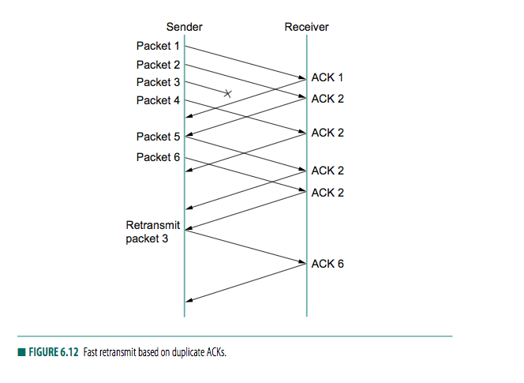
        + destination receives packet 1 and 2, but 3 is lost, so will send duplicate ACK for packet 2 when 4,5,6 arrives
        + when sender sees triple duplicate ACK 2, it retransmit packet 3, the one that is lost
    + 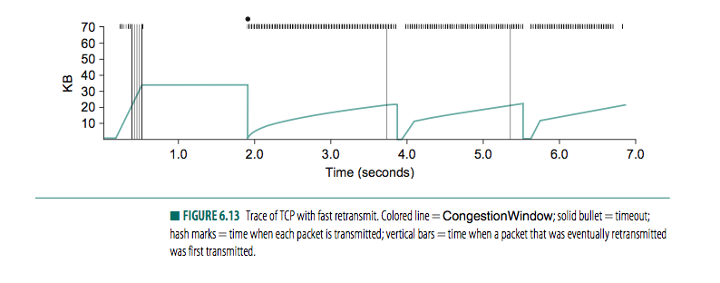
        + improvements
            + no more long periods of congestion window staying flat, where no packets are sent
            + eliminate half of timeouts on TCP connection
            + 20% in throughput 
    + _fast recovery_ 
        + when fast retransmit mechanism signals congestion, rather than drop congestion window all the way back to 1 packet, and run slow start
        + use ACKs that are still in the pipe to clock the sending of the packets
            + simply cut congestion window in half (22KB->11KB) and resumes additive increase
        + _effect_ 
            + eliminates slow start phase between fast retransmit detecting a lost packet and additive increase begins
        + _conclusion_ 
            + slow start only used at beginning of a connection and whenever a course-grained timeout occurs
            + other times, congestion window is following a pure additive incrase/multiplicative decrease pattern
            


#### 6.4 Congestion-Avoidance Mechanism 

+ motivation
    + _congestion control_
        + TCP control congestion once it happens, but does not avoid congestion in the first place
        + implies TCP needs to create losses to find available bandwidth of the connection 
    + _congestion avoidance_
        + predict when congestion about to happen, then reduce rate at which hosts send data just before packets start being discarded
+ _DECbit_ 
    + _idea_ 
        + split responsiblility of congestion control between routers and end nodes
        + _router_ 
            + monitor the load and notifies end node when congestion is about to occur
            + by setting _DECbit_, _binary congestion bit_ in the packet that go through the router
            + set if _average queue length_ greater than or equal to 1 at the time packet arrives
                + why pick 1? tradeoff between significant queuing (high throughput) vs. increased idle time (low delay)
        + _end node_
            + _target_
                + copies congestion bit into the ACK it sends back to source
            + _source_ 
                + maintains a congestion window, just as in TCP, and watches to see what fraction of last window's worth of packets resulted in the congestion bit set.
                + if less than 50% of packets had the bit set, then source increases its congestion window by 1 packet. 
                + otherwise, source decreases the congestion windfow to 0.875 times the previous value
                + overall, _additive increase (+1) / multiplicative decrease (*0.875)_
    + _average queue length_ 
        + 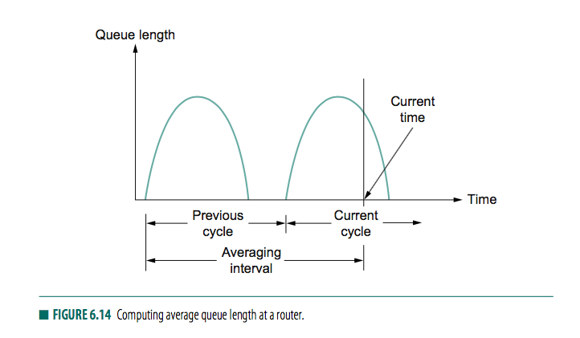
        + measured over a time interval that spans the last _busy+idle_ cycle, plus current _busy_ cycle. 
            + _busy_: when transmitting
            + _idle_: when not transmitting
        + basically calculate area under the curve and divides this value by time interval to compute average queue length
+ _Random Early Detection (RED)_
    + _idea_ 
        + router monitors its own queue length, detects when congestion is imminent, and notify source to adjust its congestion window
        + used in conjunction with TCP
        + _differences from DECbit_ 
            + _implicitly notifies_ the source of congestion by dropping one of its packets
                + source notified by timeout or duplicate ACK
                + drops the packet _earlier than it have to_ (before buffer space is filled)
                    + so source would decrease congestion window sooner than it would normally have.
                    + so that it would not have to drop lots of packets later on.
            + _when to drop a packet and which packet to be dropped_
                + _early random drop_
                    + drop each arriving packet with some _drop probability_ whenever the queue length exceeds some _drop level_
                + _algorithm_ 
                    + Computes average queue length with a weighted running average
                        + `avgLen = (1 - weight) x AvgLen + weight x sampleLen`
                        + re-computed every time a new packet arrives at the gateway
                        + averaged length more accurately capture notion of congestion
                            + internet is bursty
                            + detect long-lived congestion by filtering out short-term changes
                            + 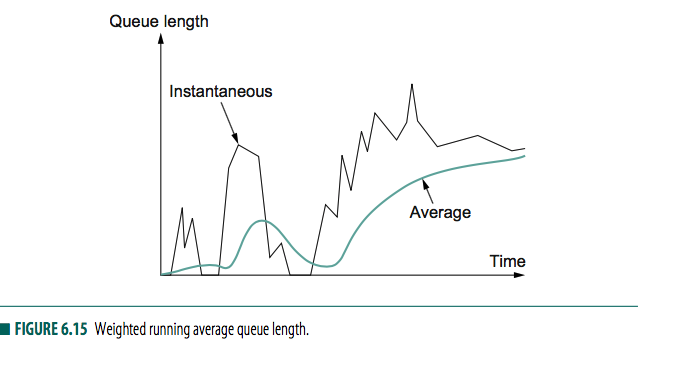
                    + 2 threshold
                        + `minThreshold`
                        + `maxThreshold`
                    + when packet arrived at router
                    ```
                    if avgLen <= minThreshold:
                        queue the packet
                    if minThreshold < avgLen < maxThreshold 
                        calculate probability P
                        drop arriving packet with probability p 
                    if maxthreshold <= avgLen 
                        drop arriving packet
                    ```
                    + drop probability `P` increases slowly when `avgLen` between 2 threshold
                        + `tempP = maxP x (avgLen - minThreshold) / (maxThreshold - minThreshold)`
                        + `p = tempP / (1 - count x tempP)`
                        + `tempP` is y axis in plot below
                        + `count` is number of newly arrived packets having been queued
                            + increasing count make drop more likely
                            + closely spaced drops less likely, i.e. clusters of drops in a single connection
                    + 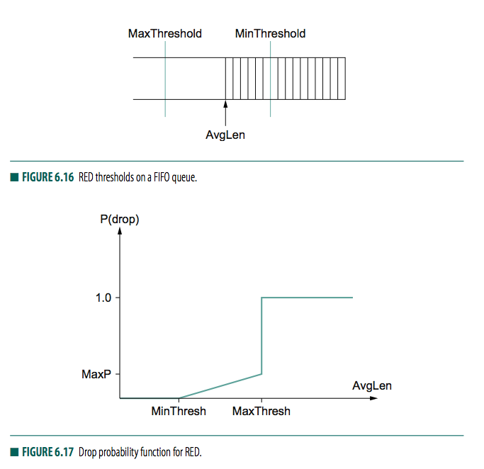
                    + _tail drop mode_
                        + possible for instantaneous queue length to be much longer than `avgLen`, 
                        + in this case, arriving packets are dropped
                + _properties of algorithm_ 
                    + ensures rough even distribution of drop over time
                    + probability that RED decides to drop a particular flow's packet is roughly proportional to the share of bandwidth that the flow is currently getting at that router
                    + because flow with alrger number of packets provides more candidates for dropping
                    + promote _fairness_
                + _settings of `minThreshold` and `maxThreshold`_ 
                    + `minThreshold` should be large enough to allow for link utilization to be maintained at high level 
                    + there should be free buffer space over `maxThreshold` to absorb the natural bursts that occur in internet traffic
                + _settings of `Weight`_
                    + `weight` used to compute running average low-pass filter 
                    + note at least 1 RTT must have elpased (~100ms) from time router drops packet until the tiem when the same router starts to see some relief from the affected connections
                    + so `weight` should be chosen such that changes in queue length over time scales much less than 100ms are filtered out
    + _explicit congestion notification (ECN)_
        + explicit notification probably better for interactive applications
        + _idea_ 
            + _active queue management_
            + IP type of service TOS bit 
                + 6: ECN enabled (able to react to congestion notification)
                + 7: set by router when congestion is encountered 
                    + echoed back to source by destination host 
                    + source responds to ECN bit set in exactly same way as it responds to a dropped packet
+ _source based congestion avoidance_ 
    + _idea_ 
        + watch for sign from network that some router's queue is building up and that congestion will happen soon if nothing is done about it
        + _hints_ 
            + increase in RTT for successive packets 
        + _algo1_ 
            + for every 2 RTT, algorithm checks to see if current RTT is greater than average of minimum and maximum RTTs seen so far, if it is, then decrease congestion window by 1/8
        + _algo2_ 
            + window adjusted every 2 RTT delay based on 
                + `(currentWindow - oldWindow) x (currentRTT - oldRtt)`
                + if positive, source decreases window size by 1/8
                + if negative or 0, source increases window by 1 maximum packet size
        + _algo4_ (TCP vegas)
            + computes throughput rate with an expected throughput rate
            + 
    
        
        