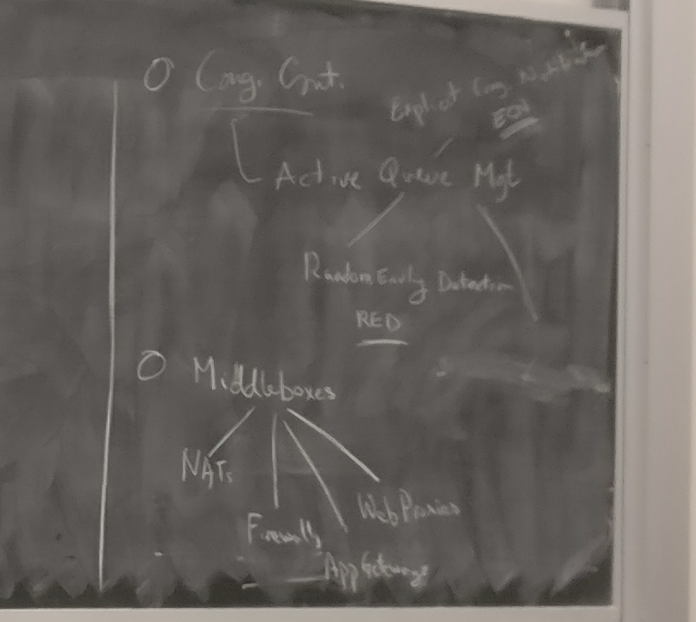
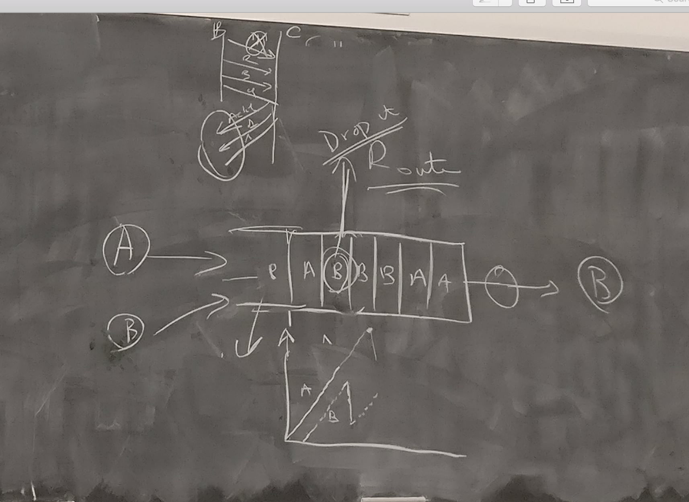
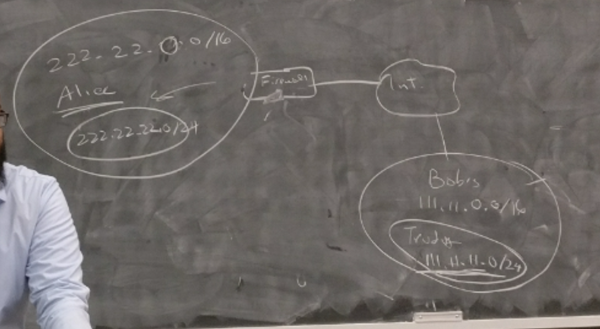

+ active queue management 
    + random early detection
+ middleboxes
    + NAT
    + firewalls
    + applicaion gateways 
    + web proxies


+ end-to-end
    + keep functionalities at end-hosts,
        + modify packets at end-hosts
+ middleboxes
    + contradictions end-to-end
    + but take away power of end-hosts from abusing the network 


+ contention window 
    + if timeout 
        + cnwd = 1MSS
        + slowstart restart to 1/2 prev_cnwd, 
        + then linear increase, called congestion avoidance
    + if triple duplicate ack 
        + cnwd = 1/2 prev_cnwd
        + then linear increase, 
+ TCP actually congests the network 

+ calculating rate = size of queue / time
    + time: 
        + 8RTTT + 1RTT (for setting up TCP connection 0 -> 1MSS)
    + size
        + size of queue
+ _problem_ 
    + bursty drops 
        + feedback only there when buffer is full, and so packets dropped 
        + might happen at same time
    + TCP does not use full bandwidth
        + best scenario (desynchronized sources), different sources send one after the other, 
        + worst scenario, (synchronized sources), different source sending all at same time


+ _solution_ 
    + random early detection (RED)
        + router notices queue getting backlogged
        + randomly drops packets to signal congestion
            + randomly making 1 source slower, desynchronize the source
        + drop probability increase as queue length increases
    + RED drop probability
        + `MinThreshold` and `MaxThreshold`
            + `len < MinThershold`:  0 probability of dropping packets
            + `Maxthreshold > len > MinThreshold`: a function of `len`s
            + `len > Maxthreshold`: drop all packets
    + result
         + `avgLen` stays relatively stable
    + `count`: number of packets dropped at index i, as count increase, P(drop packet) decrease
        + effects: desynchronize sources
    + `p_avglen` : idea is generate random number 0~1, if less than `p` then queue otherwise drop packet


+ _explicit congestion notification_ 
    + router dont drop packets
    + router marks packet with `ECN` bit, and send host interprets as sign of congestion
+ challenges
    + must be supported by both hosts and routers 
    + requires 2 bits in IP header
        + 1 for ECN
        + 1 to indicate ECN capability 
    + solution: borrow 2 bits of type-of-service bits in IPv4 packet header

+ _detour OpenTCP in software-defined network_ 
    + Oracle collects statistics,
    + communicate to end hosts


#### Middlebox

+ _middlebox_ 
    + NAT
    + firewall
    + application gateway
    + proxies


+ _firewall_ 
    + process any packets passing in and out
    + allowing some packets to pass, blocking others
    + i.e. 
        + copy right enfringement detection
    + _denial of service attack_ 
        + outsider overwhelms host with unsolicited traffic
    + _break-Ins_ 
        + for example, buffer-overflow  
            + i.e. sending HTTP with long url 
            + take over username password...
    + _packet filtering_ 
        + inspect srcIP, destIP, TCP/UDP port, ICMP, SYN, ACK stuff,
        + decide if throw away or pass it
        + i.e. 
            + block inbound TCP packet with SYN but no ACK
                + prevents external clients from making TCP connections with interval clients
                + but clients can reach Internet
    + _configuration_ 
        + 
        ```
        alice: 222.22.0.0/16
            subnet: 222.22.22.0/24
        bob:   111.11.0.0.16            allowed
            Trudy in bob 111.11.11.0.24 not allowed
        other internet                  not allowed

        // alice's firewall config, order matter (rules at beginning more restrictive)
        deny(src=111.11.11.0/24, dst=222.22.0.0/16)     // dont let Trudy in
        permit(src=111.11.0.0/16, dst=222.22.22.0/24)   // let other users in bob in 
        deny(src=0.0.0.0/0, dst=0.0.0.0/0)              // deny packet from any source from any destination
                                                        // 0.0.0.0/0 means any IP addresss
        ```
    + _challenges_ 
        + must inspect packet, need to be fast
        + complex filtering rules problematic
        + location
            + complex firewall near the edgge, at low speed
            + simpler firewall in the core, at high speed
    + _subvert firewall_ 
        + i.e. filter P2P based on port #s, 
            + just hcange port number

+ _application gateway_ 
    + server installed on the path to server
    + another middlelayer between server to firewall
    + _advantage_
        + easier and faster firewall configuration
        + easy to monitor and logging

+ _web proxies_ 
    + a server that intercept any traffic from internal to outside
    + send request to outside from proxy, reply (i.e. image, data) is cached
    + for future same request, return cached data.                                                                          qq


