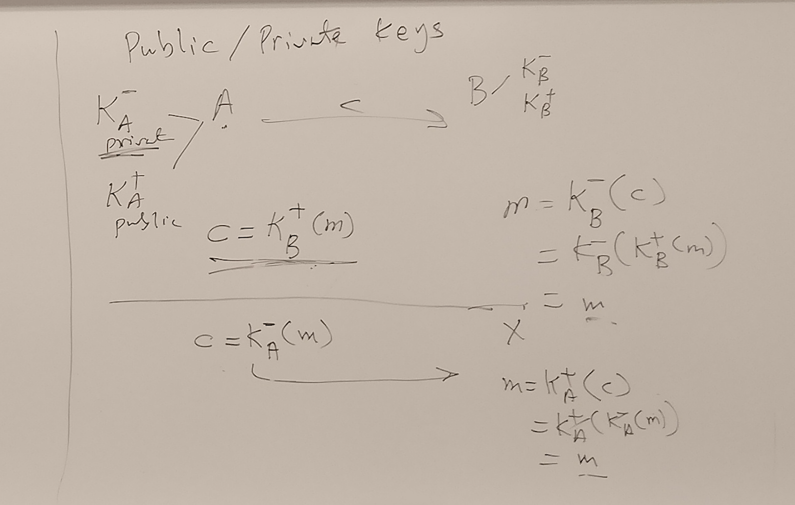
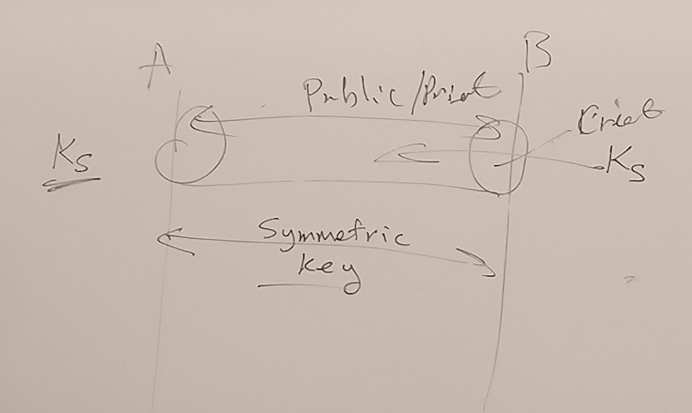
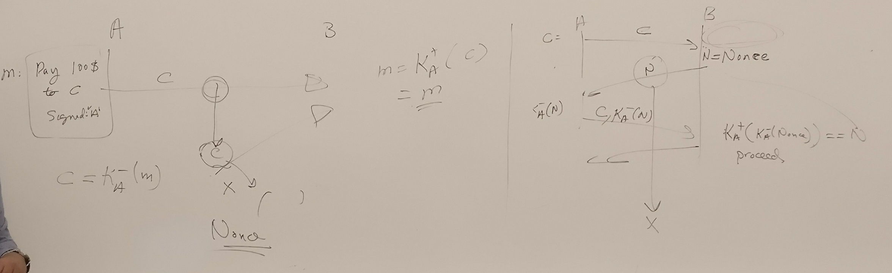
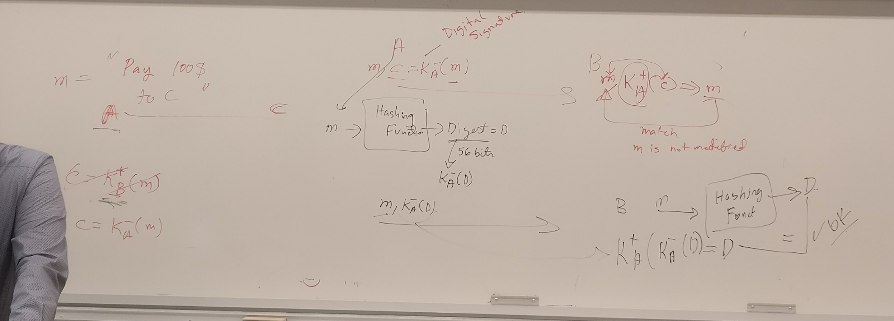
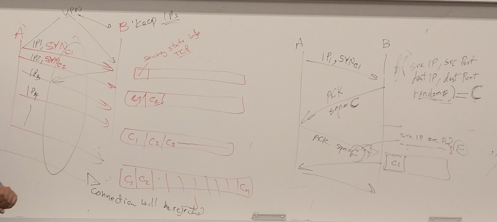
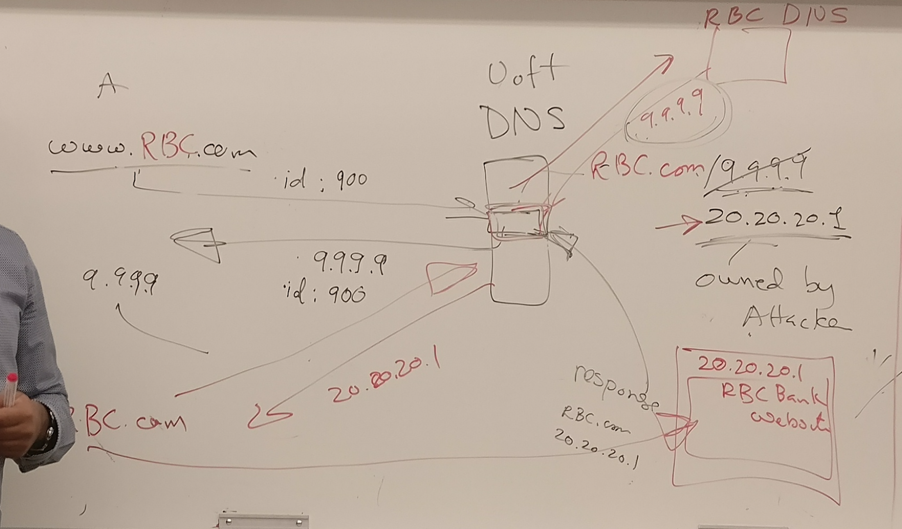
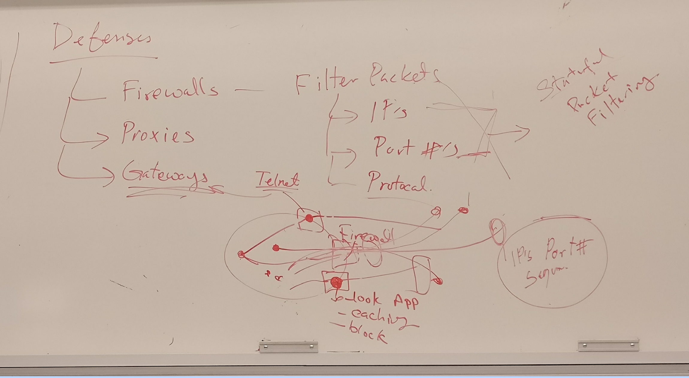

#### security 

+ confidentiality 
    + symmetric key 
    + public/private key 
+ 

##### Confidentiality

+ _symmetric key_   
    + same key to encode and decode
    + problem is key has to be agreed upon before sending, have to exchange the key in person
+ `Ks` shared key 
    + `c = Ks(m)` 
        + `c` is cipher
        + `m` is message
        + `Ks` is shared key 
    + `m = Ks(Ks(m))`
+ problem
    + `Ks` should be private, difficult to share keys 

+ _public/private keys_ 
    + `A` 
        + `KA-` private
        + `KA+` public 
    + `B` 
        + `KB-` private
        + `KB+` public 
    + `c = KA-(m)`
+ `A` send message to `B`
    + with destination's public key (send confidential confidential to a target `B`)
        + `c = KB+(m)` send to `B`, 
        + `m = KB-(c) = KB-(KB+(m))` decrypt by `B` who owns the private key
    + with its own private key (authenticate `A`, anyone having `A`'s key is able to decipher the message)
        + `c = KA-(m)` send to `B`
        + `m = KA+(c) = KA+(KA-(m))`
+ problems
    + needs computing power 
+ solution
    + use public/private key to establish channel
    + use channel to exchange shared key, 
    + use symmetric key cryptography with shared key

#### _Authentication_ 
+ interested in knowing if something is sent from a certain sources

+ `A` send to `B` for authentication
    + using public/private key 
    + send `c = KA-(m)` to `B`
    + decipher `m = KA+(c) = KA+(KA-(m)) = m`

+ _playback attack_
    + `X` intercept `c`, made a copy, resend after some time
+ solution: _Nonce_
    + with public/private key 
        + `A` send `B` the cipher `c` as usually
        + `B` send `A` a Nonce `N`, (once in a lifetime, unique) to see if its really `A` thats sending `c`
        + `A` send `KA-(N)`, encrypt Nonce with private key
        + `B` will proceed will process message in `c` only if `N == KA+(KA-(Nonce))`
    + with symmetric key 
        + still OK

+ _man in middle attack_ (problem for private/public key)
    + `X` intercept `c=KA-(m)`, gets message `m` with `KA+`
    + `X` then send `c=KX-(m)` to `B`, 
    + `B` sends Nonce, 
    + `X` 
        + replies back with `KX-(Nonce)`
        + also forwrds `Nonce` to `A`, which sends `KA-(Nounce)`
    + `B` checks `KX+(KX-(Nonce))` 
    + so secure channel between `X` and `B`, 
+ _solution_ 
    + problem lies in `B` trusts public key `X` send to it and believe its from `A`
    + use 3rd party, registers all public keys 
    + consult 3rd party server
    

#### Integrity

+ _problem_
    + `A` sends to `B`, but go through `X`, which modify the message
    + want to make sure message is unmodified, and if so can detect modification
+ _solution_ 
    + `A` send a digital signature `m, c = KA-(m)` (so message and encrypted message)
    + `X` 
        + can decrypt the message, but cannot modify the message since has no private key `KA-`
    + `B` decrypt 
        + `m, KA+(c) = m'` and see if `m==m'`
+ _problem_ 
    + too computational extensive 
+ _solution_ with digest `sha1` `md5`
    + `h(m)` apply hashing function `h` to create digest `D`, 
    + then encrypt `D` with `KA-(D)`
    + `A` send `m, KA-(D)`
    + `B` 
        + compute digest `D' = h(m)`
        + check if `KA+(KA-(D)) = D'`

+ confidentiality vs authentication
    + confidentiality does not imply authenticate
        + playback attack
+ confidentiality vs integrity
    + 

+ SSL 
    + top of TCP 

+ network confidentiality 
    + VPN, 
        + needs VPN router cross networks
        + create tunnels
        + encrypt IP payload

+ DOS Attacks
    + bandwidth or CPU or memory
+ 1
    + `A` send lots of SYN via VPN 
    + `B` checks for IP, if all same, ignore
    + `A` can send lots of SYN with randomized IP 
    + `B` can uses ISP as middle man, ISP will drop packet not in its network 
+ _another solution_
    + `f(srcIP, srcPort, dstIP, dstPort, random#) = C` for cookie
    + `A` sends `SYN`
    + `B` sends `ACK` `SQN = C`, `B` does not allocate memory 
    + only when `A` send `ACK` `SQN = C`, `B` recomputes `C'` and see if matches, allocate buffer only when match 
    + this way, since client side does not reply to `ACK` during DOS attacks, server does not save state either
+ _Distributed DOS_ 
    + botnet sending real requests...

+ _Guessing TCP sequence number_ 
    + usually if connection set up for a long time, 
        + i.e. BGP

+ _download DDos_ 
    + exhaust bandwidth
    + repeated download/upload requests
    + for download, use ads with ip address, such that people will initiate requests
+ solution
    + use recapture, ensure there is a human behind the request

+ _indirection attacks_
    + _DNS_
        + domain name server, name->ip lookup
    + _DNS Poisoning_ 
        + modify mapping to a hacker owned ip, 
            + i.e. made mock website
        + _how_ 
            + hacker sending response when UofT DNS is requesting for mapping from RBC DNS
            + problem is that DNS requests reply are not authenticated and encrypted
    + _DNS rebinding_ 
        + normally firewall protects the server
        + user inside the network hacked from outside, and the user computer attacks the server
        + _steps_ 
            + attacker create webpage, with javascript script that connects to server inside the network and see some information
            + browsers (CORS) can detect and block access to domain names thats different from the domain page of webpage
            + attack can change DNS mapping for his own website (with TTL), 
            + js script then asks for DNS mapping such that DNS server replies with the server IP, when accessing the attacker's webpage
            + now domain name matches, but the request is able to circumvent the same origin policy as underlying server IP

+ _Defenses_ 
    + _firewall_ 
        + filter packets
            + IPs   (by spoofing)
            + ports (by spoofing, just change to port 80)
        + stateful packet filtering
            + for any flow going through the firewall, firewall will record state (IP, port, seqnum)
            + firewall match packets and throw away packets if malicious
                + malicious, on reply on connection
            + problem: 
                + have to save state, need memory
                + all state info lost if firewall down
    + _proxy_ 
        + proxy intercept connection and will instead be talking to outside world
        + can look into application data, do caching, block some requests
    + _gateways_ 
        + telnet gateway
        + if want to telnet, have to send request to telnet gateway, is blocked by firewall