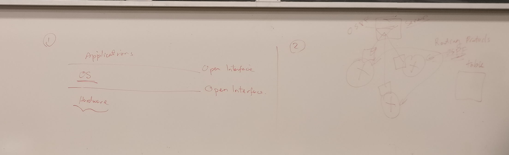
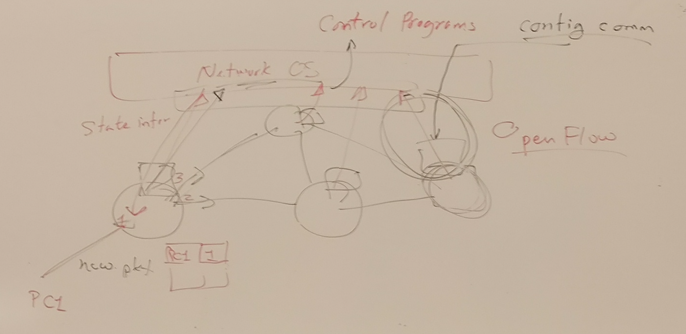
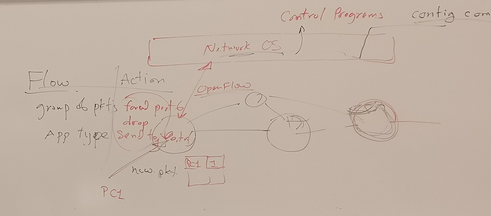
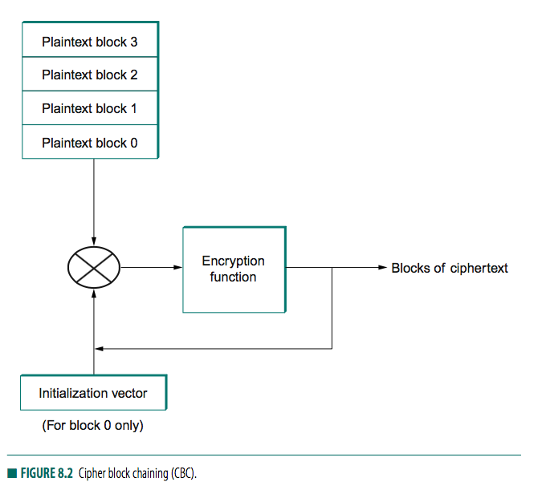
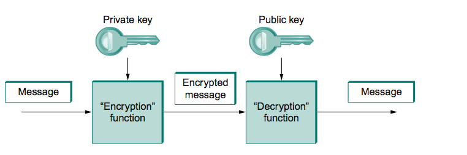
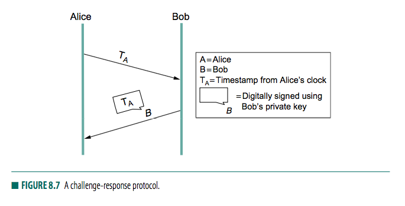
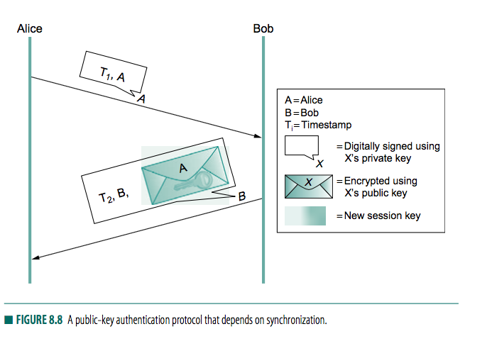
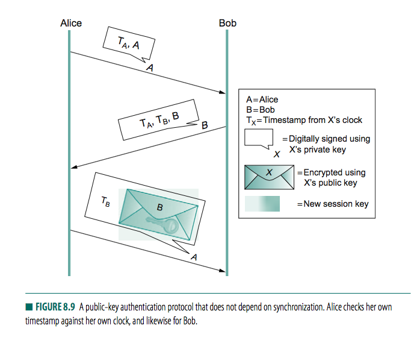
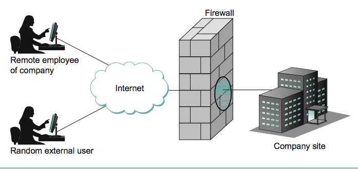

#### security 

+ confidentiality 
    + symmetric key 
    + public/private key 
+ 

##### Confidentiality

+ _symmetric key_   
    + same key to encode and decode
    + problem is key has to be agreed upon before sending, have to exchange the key in person
+ `Ks` shared key 
    + `c = Ks(m)` 
        + `c` is cipher
        + `m` is message
        + `Ks` is shared key 
    + `m = Ks(Ks(m))`
+ problem
    + `Ks` should be private, difficult to share keys 

+ _public/private keys_ 
    + `A` 
        + `KA-` private
        + `KA+` public 
    + `B` 
        + `KB-` private
        + `KB+` public 
    + `c = KA-(m)`
+ `A` send message to `B`
    + with destination's public key (send confidential confidential to a target `B`)
        + `c = KB+(m)` send to `B`, 
        + `m = KB-(c) = KB-(KB+(m))` decrypt by `B` who owns the private key
    + with its own private key (authenticate `A`, anyone having `A`'s key is able to decipher the message)
        + `c = KA-(m)` send to `B`
        + `m = KA+(c) = KA+(KA-(m))`
+ problems
    + needs computing power 
+ solution
    + use public/private key to establish channel
    + use channel to exchange shared key, 
    + use symmetric key cryptography with shared key

#### _Authentication_ 
+ interested in knowing if something is sent from a certain sources

+ `A` send to `B` for authentication
    + using public/private key 
    + send `c = KA-(m)` to `B`
    + decipher `m = KA+(c) = KA+(KA-(m)) = m`

+ _playback attack_
    + `X` intercept `c`, made a copy, resend after some time
+ solution: _Nonce_
    + with public/private key 
        + `A` send `B` the cipher `c` as usually
        + `B` send `A` a Nonce `N`, (once in a lifetime, unique) to see if its really `A` thats sending `c`
        + `A` send `KA-(N)`, encrypt Nonce with private key
        + `B` will proceed will process message in `c` only if `N == KA+(KA-(Nonce))`
    + with symmetric key 
        + still OK

+ _man in middle attack_ (problem for private/public key)
    + `X` intercept `c=KA-(m)`, gets message `m` with `KA+`
    + `X` then send `c=KX-(m)` to `B`, 
    + `B` sends Nonce, 
    + `X` 
        + replies back with `KX-(Nonce)`
        + also forwrds `Nonce` to `A`, which sends `KA-(Nounce)`
    + `B` checks `KX+(KX-(Nonce))` 
    + so secure channel between `X` and `B`, 
+ _solution_ 
    + problem lies in `B` trusts public key `X` send to it and believe its from `A`
    + use 3rd party, registers all public keys 
    + consult 3rd party server
    

#### Integrity

+ _problem_
    + `A` sends to `B`, but go through `X`, which modify the message
    + want to make sure message is unmodified, and if so can detect modification
+ _solution_ 
    + `A` send a digital signature `m, c = KA-(m)` (so message and encrypted message)
    + `X` 
        + can decrypt the message, but cannot modify the message since has no private key `KA-`
    + `B` decrypt 
        + `m, KA+(c) = m'` and see if `m==m'`
+ _problem_ 
    + too computational extensive 
+ _solution_ with digest `sha1` `md5`
    + `h(m)` apply hashing function `h` to create digest `D`, 
    + then encrypt `D` with `KA-(D)`
    + `A` send `m, KA-(D)`
    + `B` 
        + compute digest `D' = h(m)`
        + check if `KA+(KA-(D)) = D'`

+ confidentiality vs authentication
    + confidentiality does not imply authenticate
        + playback attack
+ confidentiality vs integrity
    + 

+ SSL 
    + top of TCP 

+ network confidentiality 
    + VPN, 
        + needs VPN router cross networks
        + create tunnels
        + encrypt IP payload

+ DOS Attacks
    + bandwidth or CPU or memory
+ 1
    + `A` send lots of SYN via VPN 
    + `B` checks for IP, if all same, ignore
    + `A` can send lots of SYN with randomized IP 
    + `B` can uses ISP as middle man, ISP will drop packet not in its network 
+ _another solution_
    + `f(srcIP, srcPort, dstIP, dstPort, random#) = C` for cookie
    + `A` sends `SYN`
    + `B` sends `ACK` `SQN = C`, `B` does not allocate memory 
    + only when `A` send `ACK` `SQN = C`, `B` recomputes `C'` and see if matches, allocate buffer only when match 
    + this way, since client side does not reply to `ACK` during DOS attacks, server does not save state either
+ _Distributed DOS_ 
    + botnet sending real requests...

+ _Guessing TCP sequence number_ 
    + usually if connection set up for a long time, 
        + i.e. BGP

+ _download DDos_ 
    + exhaust bandwidth
    + repeated download/upload requests
    + for download, use ads with ip address, such that people will initiate requests
+ solution
    + use recapture, ensure there is a human behind the request

+ _indirection attacks_
    + _DNS_
        + domain name server, name->ip lookup
    + _DNS Poisoning_ 
        + modify mapping to a hacker owned ip, 
            + i.e. made mock website
        + _how_ 
            + hacker sending response when UofT DNS is requesting for mapping from RBC DNS
            + problem is that DNS requests reply are not authenticated and encrypted
    + _DNS rebinding_ 
        + normally firewall protects the server
        + user inside the network hacked from outside, and the user computer attacks the server
        + _steps_ 
            + attacker create webpage, with javascript script that connects to server inside the network and see some information
            + browsers (CORS) can detect and block access to domain names thats different from the domain page of webpage
            + attack can change DNS mapping for his own website (with TTL), 
            + js script then asks for DNS mapping such that DNS server replies with the server IP, when accessing the attacker's webpage
            + now domain name matches, but the request is able to circumvent the same origin policy as underlying server IP

+ _Defenses_ 
    + _firewall_ 
        + filter packets
            + IPs   (by spoofing)
            + ports (by spoofing, just change to port 80)
        + stateful packet filtering
            + for any flow going through the firewall, firewall will record state (IP, port, seqnum)
            + firewall match packets and throw away packets if malicious
                + malicious, on reply on connection
            + problem: 
                + have to save state, need memory
                + all state info lost if firewall down
    + _proxy_ 
        + proxy intercept connection and will instead be talking to outside world
        + can look into application data, do caching, block some requests
    + _gateways_ 
        + telnet gateway
        + if want to telnet, have to send request to telnet gateway, is blocked by firewall

#### Software defined networks 

+ motivation
    + open interfaces
        + allows mix and match ... 
        + might reduce cost 
    + _separate intelligence from datapath_ 
        + allows a single server sending routing tables to every other nodes 
        + instead of having each router computing its routing table
        + remove common functionalities to a centralized server
        + keep most hardwares (switches) simple, less power consumption

+ _Software defined network components_ (SDN)
    + _Network OS_
        + collects state information from the network, passed to network OS
        + _state info_ 
            + switch gets new packet, knows source MAC if pkt, this info is considered state info
            + if no rule in routing table, then pass pkt to network OS, will pass back a config communication
    + _Control programs_
        + process state info and pass back _config communication_
+ _openflow rules_
    + _flow_ 
        + a group of packets identified by _application type (80:HTTP)_ 
        + identified by a _rule_ (Use bit masks)
        + _action_ operate on a flow 
        + _Open Flow_
            + a shared communication protocol
    + _action_ 
        + allow/deny, route/re-route, isolate, private, remove packets ... 
+ _openflow protocol_ 
    + given a rule, use an action, update stats
    + _empowers a switch with functionalities_ 
        + swtiching
        + routing
        + firewall, 
        + VLAN

--- 

#### 8 Network Security

+ _motivation_
    + _confidentiality_ 
        + encryption as a mean to prevent adversary from understanding message contents
        + _traffic confidentiality_ 
            + concealing quantity or destination of communication
    + _integrity_
        + _data integrity_ 
            + detects message tampering, i.e. adversary change a few bits in it
        + _originality_
            + detects replays, i.e. adversary transmit extra copy of message
        + _timeliness_ 
            + detects delays, i.e. adversary from intercepting message, wait for a while, and then transmitting it
    + _authentication_ 
        + ensures you really are talking whom you think you are talking 
        + _DNS attacks_ 
            + false info entered in DNS sever leads to incorrect translation of url to IP 
    + _Availability_ 
        + ensures degree of access
        + _access control_ 
            + enforcing rules regarding who is allowed to do what 
        + _DoS attack_ 
            + clients unable to access hosts since its overwhelmed by bogus requests

#### 8.1 Cryptographic building blocks 

+ _principles of ciphers_ 
    + _encryption_ 
        + transform a message such that it becomes unintelligible to any party who do not have the secrete of reversing the transformation
    + _cipher_ 
        + encryption and decryption functions that are parameterized by a key
            + functions are public
            + keys are private
        + _sender_  
            + appy _encryption_ function to the original _plaintext_ message, resulting in _ciphertext_ message 
        + _receiver_ 
            + applies a secret _decryption function_ to recover the original _plaintext_
    + _cryptographic algorithm_ 
        + _goal_ 
            + prevent attacker from deducing the key even when the individual knows both the plaintext and the ciphertext
        + _block ciphers_ 
            + take input a plaintext block of a certain fixed size, i.e. 64, 128 bits, 
            + _electronic codebook mode_ encryption: 
                + use block cipher to encrypt each block independently
                + but a given input block always result in the same ciphertext block
            + _cipher block chaining (CBC)_ 
                + each plaintext block is XORed with previous block's cipher text before being encrypted
                + first block XORed is called _initialization vector_
                + 
    + _symmetric-key (secret-key) ciphers_
        + _idea_ 
            + encryption and decryption keys are identical, and be known only to participants
    + _asymmetric (public-key) ciphers_ 
        + _idea_ 
            + a pair of keys
                + _public key_: for encryption, owned by anyone
                + _private key_: for decryption, owned by owner only
        + _property_ 
            + one can use _private key_ to encrypt message so that it can be decrypted using _public key_ only
            + useful for _authentication_, since it tells receiver of such a message that it could only have been created by owner of the keys.
            + 
        + _usage_ 
            + authentication
            + confidentially distribute symmetric keys
        + _examples_ 
            + RSA
                + relies on computation cost of factoring large numbers
    + _analogy_     
        + symmetric key
            + a two-way one-to-one channel 
        + asymmetric key 
            + a one-way many-to-one channel
    + _authenticators_ 
        + _motivation_
            + encryption alone does not provide 
                + _data integrity_ 
                    + randomly modifying ciphertext message goes undetected
                + _authentication_ 
                    + not much to say that a message ahve been modified after that participant created it
        + _idea_ 
            + _authenticator_ 
                + a value, included in the transmitted message, that is used to verify _authenticity_ and _data integrity_ of the message 
                + depends on redundant information and form of proof of secret knowledge
            + _example of authenticator_
                + combination of _encryption_ and _cryptographic hash function_ 
                + _cryptographic hash function_     
                    + a function that outputs sufficient redundant information about a message to expose tampering, similar to how checksum/CRC exposes bit errors by noisy links
                    + outputs a _message digest_
                    + _requirement_ 
                        + output fairly randomly distributed
                            + 128 bit digests require 2^127 messages, on average, before finding a second message whose digest matches that of a given message 
                        + if outputs not randomly distributed
                            + find collision, need to compute digests of only 2^64 messages on average (birthday attack)
                    + _algorithm_
                        + md5
                        + sha1
                + _authenticator_ 
                    + created by _encrypting_ a _message digest_
                        + encryption with 
                            + _private key cipher_ 
                                + used the secret key
                            + _public key cipher_ 
                                + digest encrypted using sender's private key (normally used for decryption)
                    + receiver computes digest of plaintext of message and compare to the decrypted message digest
                        + if equal, then conclude message from alleged sender (since message has to be encrypted with the right key) aand has not been tampered with.
                    + no adversary could get away with sending bogus message with a matching bogus digest because he would not have the key to _encrypt the bogus digest_ correctly
                + _digital signature_ 
                    + a digest encrypted with a public key algorithm, but using a private key
                    + ensures authenticity 
                        + receiver of a message with a digital signature can prove to any third party that sender really sent the message, because 3rd party can use the sender's public key to check for herself
                        + symmetric key encryption does not have this property 
            + _another example of authenticator_ 
                + _idea_ 
                    + function computes an authenticator called _message authentication code (MAC)_
                    + sender appends the MAC to plaintext message
                    + receiver recomputes MAC using plaintext and the secret value and compares the recomputed MAC to the received MAC
            + _confidentiality_ 
                + just encrypt the concatenation of 
                    + entire message
                    + authenticator, 
                        + MAC, HMAC, or encrypted digest

#### 8.2 Key distribution

+ _problem_ 
    + _symmetric key cipher_
        + how does a pair of participants obtain the secret key they share
    + _asymmetric key cipher_ 
        + how does participants know what public key belongs to a certain participant
+ _session key_ 
    + key used to secure a single, relatively short episode of communication
        + each distinct session uses a new session key
        + always symmetric key for speed
    + _division of labor between session key and predistributed keys_
        + participants determine the _session key_ by means of a session key establishment protocol, which is based on _predistributed keys_
        + _motivations_
            + limit amount of time a key is used 
            + predistributino of key problematic 
            + public key siphers are generally superior for authentication and session key establishment but too slow for use for encrypting entire messages for confidentiality
+ _predistribution of public keys_ 
    + _problem_ 
        + we have public algorithm for generating public/private key pairs 
        + but distribution of public key in a way that other participants can be sure it really belongs to owner of the key
    + _public key infrastructure (PKI)_
        + starts with ability to verify identities and bind them to keys _out of band_
            + i.e. alice and bob meet in person 
        + later bob's knowledge of alice's key is `x` can be widely, scalably disseminated using a combination of _digital signature_ and a _concept of trust_
            + bob trust alice, you trust bob, so you _trust_ alice
            + in reality, bob just publish a digitally signed statement that alice's key is `x`
        + _public key certificate (certificate)_
            + digitally signe dstatement of a public key binding
            + issued for email addresses and DNS domains
        + _certificate authorities_ 
            + bob's role in this case, just post alice's certificate on a website, 
            + _trust is binary_ 
                + either trust someone completely or not at all
                + allows for chains of trust, 
+ _predistribution of symmetric keys_
    + _problem_ 
        + if alice awnt to use a secret-key cipher to communicate with bob, she cant just pick a key and send it to him, because, without already having a key, they cant encrypt this keyto keep it confidential and they cant communiate with each other
        + _harder than public keys_ 
            + 1 public / entity is OK, but symmetric key for each pair, there are N(N-1)/2 keys for N entities
            + secret keys must be kept secret
    + _solution_ 
        + _key distribution center (KDC)_
        + trusted entity that shares a secret key with each other entity.

#### Authentication protocols

+ _naive protocol_ 
    + append an authenticator to messagee, and if want confidentiality, encrypt the message
+ _problems_ 
    + _replay attack_
        + adversary retransmitting a copy of a message that was previously sent
        + in this case, the authenticator is still valid, since message not modified in any way
    + _suppress-replay attack_
        + adversary simply delays the message
    + _distribution of session key_
        + symmetric key generated on the fly and used just for that session.
    + _conclusion_ 
        + involves nontrivial protocol
+ _originality and timeliness techniques_ 
    + _timestamp_ 
        + be covered by the authenticator
        + require clock synchronization, 
    + _nonce_ 
        + a random number used only once, in the message
        + participant then detect replay attacks by checking whether a nonce has been used previously 
    + _use nonce/timestamp in challenge-reseponse protocol_   
        + 
        + _timestamp idea_ 
            + alice send bob a timestamp, challenge bob to 
                + encrypt it in the response if they share symmetric key
                + digitally sign it if bob has public key
            + the encrypted timestamp is like an authenticator that additionally proves timeliness, since alice can check timestamp response from bob, since that timestamp comes from alice's own clock.
        + _nonce idea_
            + alice keep track of those nonces for which responses are currently outstanding and haven't been outstanding too long
            + any purported response with an unrecognized nonce must be bogus
        + _advantage_
            + combines timliness with authentication
+ _public key authentication protocols_ 
    + _idea_ 
        + alice and both each have each other's public key, via distribution 
    + _public-key algo that depends on synchronization_ 
        + 
        + alice sends bob a message with timestamp and her identity in plaintext + digital signature
        + bob uses 
            + digital signature to authenticate the message
            + timestamp to verify its freshness
        + bod sends back a message with a timestamp and his identity in plaintext , as well as a new session key encrypted (for confidentiality) using alice's public key
        + alice verify authenticity and freshness of message
            + then trust the new session key
    + _public-key algo that does not rely on clock synchronization_ 
        + 
        + alice sends bob message with timestamp and identity
        + bob 
            + cannot be sure message is fresh, 
            + send back a digitally signed message with alice's original timestamp, his own new timestamp and his identity
        + alice
            + verifies freshness of bob's reply by comparing current time against timestamp that originated with her.
            + then sends bob a digitally signed message, with bob's original timestamp andf a new session key encrypted using bob's public key.
        + bob
            + can verify freshness of message because timestamp came from this own clock, 
    + _general idea_ 
        + use receiver's public key to encrypt session keys (symmetric key)
        + wrap timestamp and encrypted session key inside a digital signature (encrypted using sender's private key)
+ _symmetric-key authentication protocols_ 
    + _RARE_
        + since fairly small systems practical to predistribute symmetric keys 

#### 8.4 Example systems 

+ ssh 
    + remove login service, intended to replace less secure telnet
+ _IP security_ (IPsec)
    + optional in IPv4, mandatory in IPv6
    + _idea_ 
        + a framework for providing security services 

#### 8.5 firewalls

+ _firewall_ 
    + 
    + _definition_
        + a system that sits at some point of connectivity between a site it protects and the rest of the network
    + _assumption_: firewall is the only connectivity to the site from outside 
    + _zone of trust_
        + internal network
        + rest of Internet
        + DMZ (demilitarized zone)  
            + accessible by both interval and external network
            + but hosts in DMZ cannot access internal netwrok (prevent compromised host inside DMZ from accessing internal network)
            + reboot periodically 
    + _filtering_ 
        + based on IP, TCP, UDP information
        + will or wil not forward
            + i.e discard `<192.12.13.14. 1234, 128.7.6.5, 80>` means discard all packets from port 1234 on host `192.12.13.14` to port 80 on host `128.7.6.5`
            + i.e. wildcards `<*, *, 128.7.6.5, 80>` 
            + i.e. keep only `<*, *, 128.7.6.5, 25>` instruct to allow access to port 25 (SMTP mail port) on a mail server only
    + _stateless vs stateful firewall_ 
        + stateful firewall allows to be configured to allow an arbitrary server's response packet but disallow a similar parcket for which there is no client request
    + _limitation_  
        + firewall does not restrict internal net communication, an adversary which manage to compromize an internal host gets access to all local hosts.
        + any parties granted access through the firewall become a security vulnerability
            
        

    