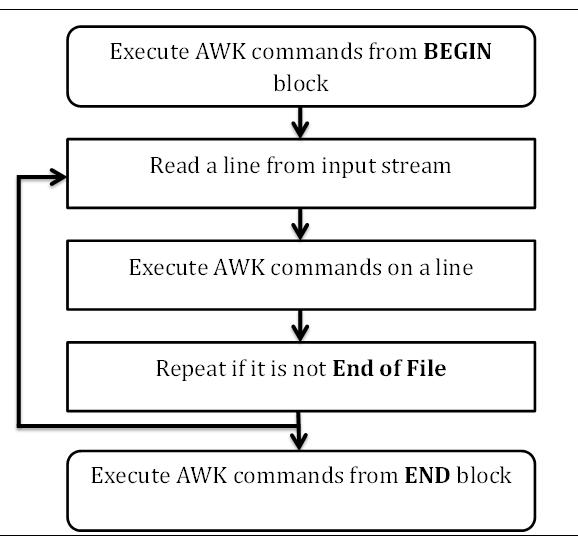

```
awk 'BEGIN { action; }
/search/ { action; }
END { action; }' input_file
```




Workflow
1. reads from input stream (file, pipe, stdin) and stores it in memory
2. awk command applied sequentially on the input
3. repeat until file reaches its end


_Begin Block_
```bash
BEGIN {awk-commands}
```
_Body block_
```bash
/pattern/ {awk-commands}
```
_End Block_
```bash
END {awk-commands}
```


__-f__

```bash
awk -f command.awk marks.txt
```


__-v__
assigns value to a variable before program execution

```bash
awk -v name=mark 'BEGIN{printf "Name is %s\n", name}'
```


__Select certain columns with `$`__

```bash
awk '{print $3 "\t" $4}' marks.txt
```


__Print lines with matching PATTERN__

with format `PATTERN {AWK commands}`

```bash
# The following are equivalent
awk '/a/ {print $0}' marks.txt
awk '/a/' marks.txt

# prints 3rd and 4th column if patten matching succeeded
awk '/a/ {print $3 "\t" $4}' marks.txt

# counting number of lines with matching pattern
awk '/a/{++cnt} END {print "Count = ", cnt}' marks.txt

# printing lines containing more than 18 characters
awk 'length($0) > 18' marks.txt
```

`length()` is a built-in function that returns the length of the string
`$0` stores the entire line
In the absence of default action, `print` action is taken


__Built-in Variables__


`ARGC`
the number of arguments provided at CLI

```bash
awk 'BEGIN {print "Arguments =", ARGC}' One Two Three Four
# prints 5
```

`ARGV`
array that stores the command-line arguments, from `0` to `ARGC-1`

```bash
awk 'BEGIN {
   for (i = 0; i < ARGC - 1; ++i) {
      printf "ARGV[%d] = %s\n", i, ARGV[i]
   }
}' one two three four

# outputs
# ARGV[0] = awk
# ARGV[1] = one
# ARGV[2] = two
# ARGV[3] = three
```


`ENVIRON`
An associative array of environment variables
```bash
awk 'BEGIN { print ENVIRON["USER"] }'
```

`FILENAME`
represents the current file name
```bash
awk 'END {print FILENAME}' marks.txt
# FILENAME undefined in BEGIN block
```

...


__AWK operators__


###### Arithmetic

```bash
# plus
awk 'BEGIN { a = 50; b = 20; print "(a + b) = ", (a + b) }'
# subtraction
awk 'BEGIN { a = 50; b = 20; print "(a - b) = ", (a - b) }'
# multiplication
awk 'BEGIN { a = 50; b = 20; print "(a * b) = ", (a * b) }'
# division
awk 'BEGIN { a = 50; b = 20; print "(a / b) = ", (a / b) }'
# module
awk 'BEGIN { a = 50; b = 20; print "(a % b) = ", (a % b) }'
```

##### Increment and Decrement

##### Assignment

```bash
# simple assignment
awk 'BEGIN { name = "Jerry"; print "My name is", name }'
```


##### Relational

```bash
# == represents equal to and != represents not equal to
awk 'BEGIN { a = 10; b = 10; if (a == b) print "a == b" }'
# less than <; less than or equal to <=
awk 'BEGIN { a = 10; b = 20; if (a < b) print "a  < b" }'
```

##### Logical

```bash
# logical AND
expr1 && expr2
# logical OR
expr1 ||  expr2
```

##### String concatenation

```bash
# just use space to denote concatenation
awk 'BEGIN { str1 = "Hello, "; str2 = "World"; str3 = str1 str2; print str3 }'
```

##### Array memebership

```bash
# Use in operator to access array elment
awk 'BEGIN {
   arr[0] = 1; arr[1] = 2; arr[2] = 3; for (i in arr) printf "arr[%d] = %d\n", i, arr[i]
}'
```

##### Regular expression

```bash
# ~ looks for a field that contains the matching string
# prints lines that contain pattern 9
awk '$0 ~ 9' marks.txt

# !~ looks for a field that does not contain the match string
awk '$0 !~ 9' marks.txt

```


__Regular Expression__

```bash
# dot match any character
echo -e "cat\nbat\nfun\nfin\nfan" | awk '/f.n/'

# start of line ^
echo -e "This\nThat\nThere\nTheir\nthese" | awk '/^The/'

# end of line $
echo -e "knife\nknow\nfun\nfin\nfan\nnine" | awk '/n$/'

# match character set
echo -e "Call\nTall\nBall" | awk '/[CT]all/'

# exclusive set
 echo -e "Call\nTall\nBall" | awk '/[^CT]all/'

# alteration
echo -e "Call\nTall\nBall\nSmall\nShall" | awk '/Call|Ball/'

# zero or one occurrence
echo -e "Colour\nColor" | awk '/Colou?r/'

# zero or more occurrence
echo -e "ca\ncat\ncatt" | awk '/cat*/'

# grouping
echo -e "Apple Juice\nApple Pie\nApple Tart\nApple Cake" | awk
   '/Apple (Juice|Cake)/'
```


__Control Flow__

##### If else statement

```
if (condition)
   action-1
else
   action-2
```

```bash
awk 'BEGIN {
   num = 11; if (num % 2 == 0) printf "%d is even number.\n", num;
      else printf "%d is odd number.\n", num
}'
```


__Built-in Functions__

```awk
# Returns minimum number
function find_min(num1, num2){
   if (num1 < num2)
   return num1
   return num2
}
# Returns maximum number
function find_max(num1, num2){
   if (num1 > num2)
   return num1
   return num2
}
# Main function
function main(num1, num2){
   # Find minimum number
   result = find_min(10, 20)
   print "Minimum =", result

   # Find maximum number
   result = find_max(10, 20)
   print "Maximum =", result
}
# Script execution starts here
BEGIN {
   main(10, 20)
}
```

```bash
awk -f functions.awk
```

__Output Redirection__
A redirection happens after print or printf statement

```bash
# writes (appends) to output-file, creates new if does not exist
print DATA > output-file

# appends
print DATA >> output-file

# pipe to another program
print items | command
```
