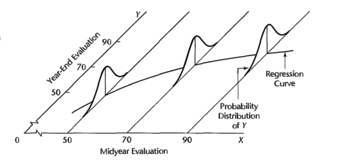

#### 1.2

+ _functional relationship_ 
    + `Y = f(X)`
+ _statistical relationship_ 
    + do not fall directly on curve of relationship
+ _regression model_
    + a formal means of expressing components of a statistical relation
        + 
        + _there is a probability distribution of `Y` for each level of `X`_
            + describes _empirical scattering_ of points around the regression curve
        + _means of probability distribution vary systematically to level of `X`_
            + _regression function_ as this systematic relationship
            + _regression curve_ as the graph of the regression function
                + describes the _tendency_ of `Y` to vary with `X` systematically 
+ _constructing regression model_ 
    + selecting predictor variable
    + choice of functional form of regression model
+ _causality_ 
    + statistical relation does not imply causality  

#### 1.4 data for regression

+ _reality_ 
    + have to estimate _regression coefficients_ 
        + since `beta_0` and `beta_1` not known
    + does not know _functional form_ of regression relation (linear vs curvilinear)
+ _types of data_ 
    + _observational data_ 
        + no control on predictor variables 
        + usually do not provide adequate information about cause-and-effect relationship
    + _experimental data_
        + has control over predictor variable
        + gives stronger information about cause-and-effect relatinoships than do observational data
            + _randomization_ can balance out effects of other variables
    + _completely randomized design_    

#### 1.5 Overview of steps in regression analysis

+ _steps_ 
    + exploratory
    + develop some regression models
    + find the most suitable one
    + make inferences on basis of 